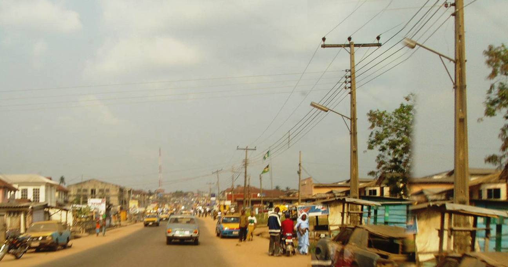
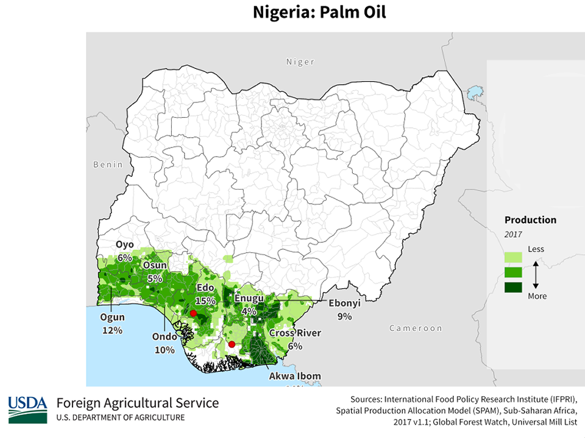
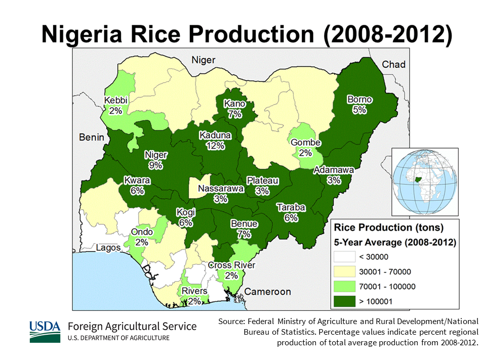
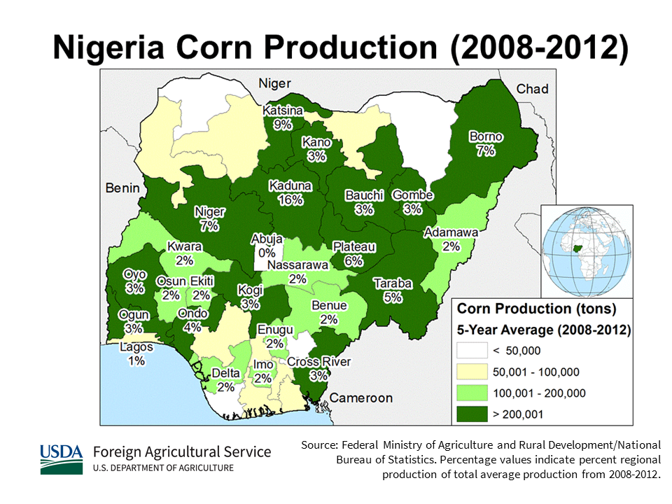

    <h2 class="section-title">{}</h2>
    <ul class="rule-list">
        <li>Language is English</li>
        <li>Cars drive on the right</li>
        <li>The domain is .ng</li>
        <li>Small yellow taxis are common in towns</li>
        <li>Police cars often follow along{}</li>
        <li>The Google car is often visible{}</li>
        <li>About 50% of the population is Muslim</li>
    </ul>
    {}

{}
{}

{}
Segmented utility poles appear{}. Note that {} also has segmented poles.
{}

{}
Nigeria drives on the right. License plates vary; they can look faintly green or blue{}{}.
{}

{}

By <a href="//commons.wikimedia.org/w/index.php?title=User:Phedmose&amp;amp;action=edit&amp;amp;redlink=1" class="new" title="User:Phedmose (page does not exist)">Pharm Ede Moses</a> - Own work, <a href="https://creativecommons.org/licenses/by-sa/4.0" title="Creative Commons Attribution-Share Alike 4.0">CC BY-SA 4.0</a>, <a href="https://commons.wikimedia.org/w/index.php?curid=47463054">Link</a>
{}

{}
Small taxis called Keke-napep run in towns{}. Signs are written in English{}. Many Keke-napep are yellow, but some towns use other colors{}.
{}

{}
Single-story houses with metal roofs like this are common{}.
{}

{}
Perhaps due to security concerns, a police car often follows{}. In more recent captures, the police car may be missing, so be careful{}.
{}

<iframe src="https://www.google.com/maps/embed?pb=!4v1694923075149!6m8!1m7!1sMFHpePbjTWB7Jd6bVMV7HA!2m2!1d12.042902428128!2d8.553263047472695!3f25.310524109619454!4f-6.629539560981968!5f2.0179041743374317" width="600" height="295" style="border:0;" allowfullscreen="" loading="lazy" referrerpolicy="no-referrer-when-downgrade"></iframe>

{}
{}

{}
Seven Up seems to be popular{}
{}

<iframe src="https://www.google.com/maps/embed?pb=!4v1679887010318!6m8!1m7!1sE_F2ShVxPyhM75vdTArfRg!2m2!1d6.59987404201229!2d3.375620061922172!3f338.51068283511484!4f1.650537544582619!5f1.5380782434409297" width="295" height="295" style="border:0;" allowfullscreen="" loading="lazy" referrerpolicy="no-referrer-when-downgrade"></iframe>

{}
{}

 

    <h2 class="section-title">{}</h2>
    <h4 class="section-title">Vegetation and elevation</h2>
    <ul class="rule-list">
        <li>Vegetation varies by location
            <ul>
                <li>Coast: in swamp forests along the coast, there are few roads outside city areas</li>
                <li>Southeast: you may see oil palm plantations
                    <ul>
                        <li>If it is hilly and looks like a rainforest, it may be near the Cameroon border in the east{}</li>
                    </ul>
                </li>
                <li>Southwest
                    <ul>
                        <li>Taller trees are dense and the view can be blocked</li>
                        <li>Between Oyo and Okene there are small hills and rocky outcrops{}</li>
                    </ul>
                </li>
                <li>Central: more grass and low shrubs
                     <ul>
                        <li>Central-east: rounded hills appear (east of Jalingo{} has more hills)</li>
                        <li>Central area: around Abuja~Jos is higher altitude with rugged rocks and small hills{}</li>
                        <li>Central-west: note that Oyo in western Nigeria also has similar rocky hills{}</li>
                    </ul>
                </li>
                <li>Far north: outside the cities, there is almost no grass</li>
            </ul>
        </li>
    </ul>

{}
{}

{}
In general it gets drier and has fewer trees toward the north. Plateaus are distributed northeast of Abuja and around Jos{}.
{}

{}
{}

<iframe src="https://www.google.com/maps/embed?pb=!4v1694922659581!6m8!1m7!1s8Ow3R10tby2art2YesIBlw!2m2!1d6.757971852293207!2d4.072611256527883!3f287.1758311113074!4f2.552881295514595!5f0.4000000000000002" width="295" height="295" style="border:0;" allowfullscreen="" loading="lazy" referrerpolicy="no-referrer-when-downgrade"></iframe>
<iframe src="https://www.google.com/maps/embed?pb=!4v1694922815201!6m8!1m7!1sALfyi8fAIXmXQDaY8JO52w!2m2!1d7.326160575887643!2d5.117616271521185!3f116.83449045305156!4f8.98622789867845!5f0.4000000000000002" width="295" height="295" style="border:0;" allowfullscreen="" loading="lazy" referrerpolicy="no-referrer-when-downgrade"></iframe>

{}
Compared to the north, there are more trees and you often cannot see far.
{}

{}
{}

<iframe src="https://www.google.com/maps/embed?pb=!4v1695252147503!6m8!1m7!1s36X-W0ChJInHCYvwoN2D0A!2m2!1d4.958050878271112!2d7.795387802213218!3f55.895625547781535!4f9.452990883534213!5f0.4000000000000002" width="295" height="295" style="border:0;" allowfullscreen="" loading="lazy" referrerpolicy="no-referrer-when-downgrade"></iframe>
<iframe src="https://www.google.com/maps/embed?pb=!4v1694922582144!6m8!1m7!1sJVoWS-1saoouj4S6wi9R6g!2m2!1d5.754522304901496!2d6.833269569646347!3f214.18065068166888!4f5.041693218708318!5f0.7820865974627469" width="295" height="295" style="border:0;" allowfullscreen="" loading="lazy" referrerpolicy="no-referrer-when-downgrade"></iframe>

{}
Oil palms are widespread. The light green area in the figure (between Uyo and Onitsha) also appears to have plantations in rural areas.
{}

{}
{}

<iframe src="https://www.google.com/maps/embed?pb=!4v1694920652400!6m8!1m7!1spbNZsSW1jZvF2rvZfxg3Sw!2m2!1d9.220760012148732!2d6.987817592291801!3f40.40875856146784!4f7.827803101586696!5f0.4000000000000002" width="295" height="295" style="border:0;" allowfullscreen="" loading="lazy" referrerpolicy="no-referrer-when-downgrade"></iframe>
<iframe src="https://www.google.com/maps/embed?pb=!4v1694920742384!6m8!1m7!1sKZjp7uFbRYC523mCwseRTQ!2m2!1d8.605920472044955!2d4.545701002316861!3f326.5511355370544!4f4.811703667130132!5f0.4000000000000002" width="295" height="295" style="border:0;" allowfullscreen="" loading="lazy" referrerpolicy="no-referrer-when-downgrade"></iframe>

{}
The Southern Guinea Zone (orange) is covered with grass.
{}

{}
{}

<iframe src="https://www.google.com/maps/embed?pb=!4v1694921507309!6m8!1m7!1sEg2c4qjuRldmMje3p1CzNw!2m2!1d9.898031716232492!2d8.775364589305285!3f235.2207725069892!4f7.114521570548945!5f0.7820865974627469" width="295" height="295" style="border:0;" allowfullscreen="" loading="lazy" referrerpolicy="no-referrer-when-downgrade"></iframe>
<iframe src="https://www.google.com/maps/embed?pb=!4v1694921639932!6m8!1m7!1s5ST0megklOZKmw6mmN5yng!2m2!1d9.708268146594355!2d8.837216293574693!3f34.59653391858231!4f10.336302358820376!5f0.4000000000000002" width="295" height="295" style="border:0;" allowfullscreen="" loading="lazy" referrerpolicy="no-referrer-when-downgrade"></iframe>

{}
At higher elevations, tree density is lower and rocky hills can be seen in the distance. Note that Oyo in western Nigeria can also have similar rocky hills{}.
{}

{}
{}

<iframe src="https://www.google.com/maps/embed?pb=!4v1694920671133!6m8!1m7!1sco-q4U7hnVHuNzqsDfl1bw!2m2!1d12.87564040084701!2d5.330013076013167!3f308.12011447783345!4f-0.5166071281412172!5f0.7820865974627469" width="295" height="295" style="border:0;" allowfullscreen="" loading="lazy" referrerpolicy="no-referrer-when-downgrade"></iframe>
<iframe src="https://www.google.com/maps/embed?pb=!4v1694920692373!6m8!1m7!1sm7MRdea3pUl08MtwHLxh8Q!2m2!1d12.30165511873427!2d9.44727254592812!3f62.21921406649807!4f2.5967336208821763!5f0.4000000000000002" width="295" height="295" style="border:0;" allowfullscreen="" loading="lazy" referrerpolicy="no-referrer-when-downgrade"></iframe>

{}
The Sudan Zone (gray) has almost no grass.
{}

{}
{}

    <h4 class="section-title">State names</h2>
    <ul class="rule-list">
        <li>Addresses often appear on shop signs
            <ul>
                <li>Abuja{}</li>
                <li>Yobe{}</li>
                <li>Sokoto{}</li>
            </ul>
        </li>
    </ul>

{}
{}

{}
{}

    <h4 class="section-title">Agricultural distribution</h2>
    <ul class="rule-list">
        <li>Agriculture varies by location
            <ul>
                <li>Oil palms are common along the coast, especially in the southeast</li>
                <li>In the north, millet fields are common, especially around Kaduna{}</li>
                <li>Data source: <a href="https://ipad.fas.usda.gov/countrysummary/default.aspx?id=NI">U.S. Department of Agriculture (USDA)</a>. Map images were edited to align sizes.</li>
            </ul>
        </li>
        <li class="no-evidence">It is said the color of the police car lights can help narrow the region{}, but it may not be reliable. The surrounding landscape is probably more trustworthy.</li>
    </ul>

{}
{}

{}
Oil palms are only found in coastal areas
{}
{}
{}

{}
Millet is easier to identify at higher image quality{}. Since Sokoto and Borno have almost no roads, Kaduna (central north) is more likely. In regions with heavy millet production, you may also see dry millet fodder (see image below).
{}

{}
{}

{}
Rice is common in the central area
{}
{}
{}

{}
It is common from central to northern areas, but could appear anywhere away from the coast
{}
{}
{}

    <h2 class="section-title">{}</h2>
    <ul class="rule-list">
        <li>Zuma Rock is in Abuja{}</li>
    </ul>

{}
{}

By <a href="//commons.wikimedia.org/w/index.php?title=User:3.29Fatima&amp;amp;action=edit&amp;amp;redlink=1" class="new" title="User:3.29Fatima (page does not exist)">Fatima </a> - Own work, <a href="https://creativecommons.org/licenses/by-sa/4.0" title="Creative Commons Attribution-Share Alike 4.0">CC BY-SA 4.0</a>, <a href="https://commons.wikimedia.org/w/index.php?curid=86993524">Link</a>

{}
{}
