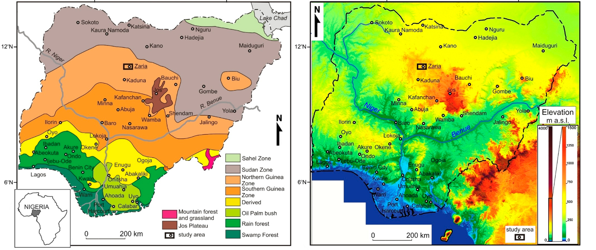

    <h2 class="section-title">{}</h2>
    <ul class="rule-list">
        <li>Bahasa utama adalah Inggris</li>
        <li>Mobil berjalan di jalur kanan</li>
        <li>Domain adalah .ng</li>
        <li>Banyak taksi kecil berwarna kuning di jalanan</li>
        <li>Sering terlihat mobil polisi yang mengikuti{}</li>
        <li>Sering terlihat Google Car{}</li>
        <li>50% populasi adalah Muslim</li>
    </ul>
    {}

{}
{}

{}
Ada tiang listrik dengan pembatas{}. Perhatikan bahwa di {} juga ada tiang listrik dengan pembatas.
{}

{}
Nigeria menggunakan jalur kanan. Plat nomor memiliki berbagai warna, termasuk nuansa hijau atau biru samar{}{}.
{}

{}

By <a href="//commons.wikimedia.org/w/index.php?title=User:Phedmose&amp;amp;action=edit&amp;amp;redlink=1" class="new" title="User:Phedmose (page does not exist)">Pharm Ede Moses</a> - Own work, <a href="https://creativecommons.org/licenses/by-sa/4.0" title="Creative Commons Attribution-Share Alike 4.0">CC BY-SA 4.0</a>, <a href="https://commons.wikimedia.org/w/index.php?curid=47463054">Link</a>
{}

{}
Keke-napep (taksi kecil) sering terlihat di jalan-jalan Nigeria{}. Tanda dan rambu jalan tertulis dalam bahasa Inggris{}. Keke-napep biasanya berwarna kuning, meski ada juga warna lain di beberapa kota{}.
{}

{}
Banyak rumah datar dengan atap logam terlihat di berbagai area{}.
{}

{}
Mobil polisi sering terlihat{}, namun tidak selalu ada{}.
{}

<iframe src="https://www.google.com/maps/embed?pb=!4v1694923075149!6m8!1m7!1sMFHpePbjTWB7Jd6bVMV7HA!2m2!1d12.042902428128!2d8.553263047472695!3f25.310524109619454!4f-6.629539560981968!5f2.0179041743374317" width="600" height="295" style="border:0;" allowfullscreen="" loading="lazy" referrerpolicy="no-referrer-when-downgrade"></iframe>

{}
{}

{}
Minuman 7-Up sangat populer di Nigeria{}.
{}

<iframe src="https://www.google.com/maps/embed?pb=!4v1679887010318!6m8!1m7!1sE_F2ShVxPyhM75vdTArfRg!2m2!1d6.59987404201229!2d3.375620061922172!3f338.51068283511484!4f1.650537544582619!5f1.5380782434409297" width="295" height="295" style="border:0;" allowfullscreen="" loading="lazy" referrerpolicy="no-referrer-when-downgrade"></iframe>

{}
{}

    <h2 class="section-title">{}</h2>
    <h4 class="section-title">Vegetasi dan Ketinggian</h4>
    <ul class="rule-list">
        <li>Vegetasi berbeda berdasarkan lokasi:
            <ul>
                <li>Pesisir: Hutan rawa (Swamp Forest) di sepanjang pesisir biasanya tidak memiliki banyak jalan kecuali di sekitar kota.</li>
                <li>Bagian Tenggara: Kemungkinan terdapat perkebunan kelapa sawit.
                    <ul>
                        <li>Jika area berbukit dengan hutan hujan yang lebat, kemungkinan berada dekat perbatasan dengan Kamerun{}.</li>
                    </ul>
                </li>
                <li>Bagian Barat Daya:
                    <ul>
                        <li>Memiliki pohon-pohon yang relatif tinggi dan rapat sehingga jarang dapat melihat jauh ke depan.</li>
                        <li>Di antara Oyo dan Okene, terdapat bukit kecil atau formasi batuan{}.</li>
                    </ul>
                </li>
                <li>Bagian Tengah: Didominasi oleh rumput dan semak rendah.
                    <ul>
                        <li>Bagian Timur Tengah: Terdapat bukit-bukit bulat (contohnya di sekitar Jalingo{}).</li>
                        <li>Bagian Tengah: Di sekitar Abuja dan Jos terdapat dataran tinggi dengan banyak formasi batuan atau bukit kecil{}.</li>
                        <li>Bagian Barat Tengah: Di Oyo (bagian barat Nigeria) terdapat bukit batuan yang mirip dengan wilayah Jos{}.</li>
                    </ul>
                </li>
                <li>Bagian Utara: Area pinggiran kota biasanya hampir tidak memiliki rumput.</li>
            </ul>
        </li>
    </ul>

{}
{}

{}
Semakin ke utara, semakin kering, dan jumlah pohon semakin berkurang. Dataran tinggi terdapat di timur laut Abuja dan sekitar Jos{}.
{}

{}
{}

<iframe src="https://www.google.com/maps/embed?pb=!4v1694922659581!6m8!1m7!1s8Ow3R10tby2art2YesIBlw!2m2!1d6.757971852293207!2d4.072611256527883!3f287.1758311113074!4f2.552881295514595!5f0.4000000000000002" width="295" height="295" style="border:0;" allowfullscreen="" loading="lazy" referrerpolicy="no-referrer-when-downgrade"></iframe>
<iframe src="https://www.google.com/maps/embed?pb=!4v1694922815201!6m8!1m7!1sALfyi8fAIXmXQDaY8JO52w!2m2!1d7.326160575887643!2d5.117616271521185!3f116.83449045305156!4f8.98622789867845!5f0.4000000000000002" width="295" height="295" style="border:0;" allowfullscreen="" loading="lazy" referrerpolicy="no-referrer-when-downgrade"></iframe>

{}
Dibandingkan dengan wilayah utara, jumlah pohon lebih banyak sehingga jarang dapat melihat jauh.
{}

{}
{}

<iframe src="https://www.google.com/maps/embed?pb=!4v1695252147503!6m8!1m7!1s36X-W0ChJInHCYvwoN2D0A!2m2!1d4.958050878271112!2d7.795387802213218!3f55.895625547781535!4f9.452990883534213!5f0.4000000000000002" width="295" height="295" style="border:0;" allowfullscreen="" loading="lazy" referrerpolicy="no-referrer-when-downgrade"></iframe>
<iframe src="https://www.google.com/maps/embed?pb=!4v1694922582144!6m8!1m7!1sJVoWS-1saoouj4S6wi9R6g!2m2!1d5.754522304901496!2d6.833269569646347!3f214.18065068166888!4f5.041693218708318!5f0.7820865974627469" width="295" height="295" style="border:0;" allowfullscreen="" loading="lazy" referrerpolicy="no-referrer-when-downgrade"></iframe>

{}
Kelapa sawit banyak ditemukan. Di daerah pedesaan, kemungkinan terdapat perkebunan kelapa sawit di area Uyo hingga Onitsha.
{}

{}
{}

<iframe src="https://www.google.com/maps/embed?pb=!4v1694920652400!6m8!1m7!1spbNZsSW1jZvF2rvZfxg3Sw!2m2!1d9.220760012148732!2d6.987817592291801!3f40.40875856146784!4f7.827803101586696!5f0.4000000000000002" width="295" height="295" style="border:0;" allowfullscreen="" loading="lazy" referrerpolicy="no-referrer-when-downgrade"></iframe>
<iframe src="https://www.google.com/maps/embed?pb=!4v1694920742384!6m8!1m7!1sKZjp7uFbRYC523mCwseRTQ!2m2!1d8.605920472044955!2d4.545701002316861!3f326.5511355370544!4f4.811703667130132!5f0.4000000000000002" width="295" height="295" style="border:0;" allowfullscreen="" loading="lazy" referrerpolicy="no-referrer-when-downgrade"></iframe>

{}
Bagian Southern Guinea Zone (zona berwarna oranye) ditutupi oleh rerumputan.
{}

{}
{}

<iframe src="https://www.google.com/maps/embed?pb=!4v1694921507309!6m8!1m7!1sEg2c4qjuRldmMje3p1CzNw!2m2!1d9.898031716232492!2d8.775364589305285!3f235.2207725069892!4f7.114521570548945!5f0.7820865974627469" width="295" height="295" style="border:0;" allowfullscreen="" loading="lazy" referrerpolicy="no-referrer-when-downgrade"></iframe>
<iframe src="https://www.google.com/maps/embed?pb=!4v1694921639932!6m8!1m7!1s5ST0megklOZKmw6mmN5yng!2m2!1d9.708268146594355!2d8.837216293574693!3f34.59653391858231!4f10.336302358820376!5f0.4000000000000002" width="295" height="295" style="border:0;" allowfullscreen="" loading="lazy" referrerpolicy="no-referrer-when-downgrade"></iframe>

{}
Daerah ini berada di dataran tinggi, memiliki vegetasi jarang, dengan batuan atau bukit kecil yang terlihat di kejauhan. Namun, formasi serupa juga ditemukan di Oyo (Nigeria Barat){}.
{}

{}
{}

<iframe src="https://www.google.com/maps/embed?pb=!4v1694920671133!6m8!1m7!1sco-q4U7hnVHuNzqsDfl1bw!2m2!1d12.87564040084701!2d5.330013076013167!3f308.12011447783345!4f-0.5166071281412172!5f0.7820865974627469" width="295" height="295" style="border:0;" allowfullscreen="" loading="lazy" referrerpolicy="no-referrer-when-downgrade"></iframe>
<iframe src="https://www.google.com/maps/embed?pb=!4v1694920692373!6m8!1m7!1sm7MRdea3pUl08MtwHLxh8Q!2m2!1d12.30165511873427!2d9.44727254592812!3f62.21921406649807!4f2.5967336208821763!5f0.4000000000000002" width="295" height="295" style="border:0;" allowfullscreen="" loading="lazy" referrerpolicy="no-referrer-when-downgrade"></iframe>

{}
Wilayah Sudan Zone (berwarna abu-abu) hampir tidak memiliki rumput.
{}

{}
{}

    <h4 class="section-title">Nama Negara Bagian</h4>
    <ul class="rule-list">
        <li>Papan tanda toko sering kali mencantumkan alamat
            <ul>
                <li>Abuja{}</li>
                <li>Yobe{}</li>
                <li>Sokoto{}</li>
            </ul>
        </li>
    </ul>

{}
{}

{}
{}

    <h4 class="section-title">Persebaran Pertanian</h4>
    <ul class="rule-list">
        <li>Pertanian bervariasi berdasarkan lokasi:
            <ul>
                <li>Kelapa sawit banyak ditemukan di pesisir, terutama di bagian tenggara.</li>
                <li>Di wilayah utara, millet banyak ditemukan, khususnya di sekitar Kaduna{}.</li>
                <li>Sumber data: <a href="https://ipad.fas.usda.gov/countrysummary/default.aspx?id=NI">U.S. Department of Agriculture (USDA)</a>. Beberapa gambar telah disesuaikan untuk ukuran peta yang seragam.</li>
            </ul>
        </li>
        <li class="no-evidence">Konon warna lampu sirene mobil polisi dapat membantu mengidentifikasi wilayah, namun keakuratannya diragukan. Lebih baik mengandalkan lanskap sekitar.</li>
    </ul>

{}
{}

{}
Kelapa sawit hanya ditemukan di wilayah pesisir.
{}
{}
{}

{}
Millet terlihat jelas pada citra dengan resolusi tinggi{}. Wilayah seperti Sokoto dan Borno hampir tidak memiliki jalan, sehingga Kaduna (bagian tengah utara) lebih mungkin. Di wilayah penghasil millet, sering terlihat **Dry millet fodder** (gambar di bawah ini adalah contoh).
{}

{}
{}

{}
Padi terutama ditemukan di wilayah tengah.
{}
{}
{}

{}
Jagung banyak ditemukan di wilayah tengah hingga utara, tetapi juga dapat ditemukan di hampir semua wilayah kecuali di pesisir.
{}
{}
{}

    <h2 class="section-title">{}</h2>
    <ul class="rule-list">
        <li>Zuma Rock berada di Abuja{}</li>
    </ul>

{}
{}

By <a href="//commons.wikimedia.org/w/index.php?title=User:3.29Fatima&amp;amp;action=edit&amp;amp;redlink=1" class="new" title="User:3.29Fatima (page does not exist)">Fatima </a> - Own work, <a href="https://creativecommons.org/licenses/by-sa/4.0" title="Creative Commons Attribution-Share Alike 4.0">CC BY-SA 4.0</a>, <a href="https://commons.wikimedia.org/w/index.php?curid=86993524">Link</a>

{}
{}
