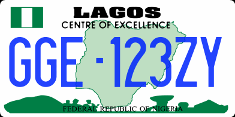

    <h2 class="section-title">{}</h2>
    <ul class="rule-list">
        <li>言語は英語</li>
        <li>車は右側通行</li>
        <li>ドメインは.ng</li>
        <li>黄色の小型タクシーが町を走っている</li>
        <li>パトカーが付いてくることが多い{}</li>
        <li>GoogleCarが見えることが多い{}</li>
        <li>人口の 50％がイスラム教徒</li>
    </ul>
    {}

{}
{}

{}
仕切りのある電柱がある{}。そしてナイジェリアは右側通行。ナンバープレートは複数存在し、ぼんやりと緑・青・赤色に見えることがある{}{}。
{}

{}

By <a href="//commons.wikimedia.org/w/index.php?title=User:Phedmose&amp;amp;action=edit&amp;amp;redlink=1" class="new" title="User:Phedmose (page does not exist)">Pharm Ede Moses</a> - Own work, <a href="https://creativecommons.org/licenses/by-sa/4.0" title="Creative Commons Attribution-Share Alike 4.0">CC BY-SA 4.0</a>, <a href="https://commons.wikimedia.org/w/index.php?curid=47463054">Link</a>
{}

{}
小型タクシーが町を走っている{}。看板は英語で書かれている。黄色が多いがそうでない町も存在する{}。
{}

{}
こんな感じの金属の屋根がついた平屋の家が多い{}。
{}

{}
パトカーが付いてくることが多い{}がパトカーでない車が付いてくる{}こともある。また、パトカーがいないことも多い{}。Google Carも見えることが多い{}。
{}

<iframe src="https://www.google.com/maps/embed?pb=!4v1694923075149!6m8!1m7!1sMFHpePbjTWB7Jd6bVMV7HA!2m2!1d12.042902428128!2d8.553263047472695!3f25.310524109619454!4f-6.629539560981968!5f2.0179041743374317" width="600" height="295" style="border:0;" allowfullscreen="" loading="lazy" referrerpolicy="no-referrer-when-downgrade"></iframe>

{}
{}

<iframe src="https://www.google.com/maps/embed?pb=!4v1679854349351!6m8!1m7!1sVEmCuj_hJ169SRu1sEqsuA!2m2!1d6.460371642532762!2d7.493418113273444!3f23.871891209378983!4f-10.141513841761409!5f3.3246080442816175" width="295" height="295" style="border:0;" allowfullscreen="" loading="lazy" referrerpolicy="no-referrer-when-downgrade"></iframe>

{}
{}

<iframe src="https://www.google.com/maps/embed?pb=!4v1679854562480!6m8!1m7!1syiEjGBhayoOdpLrXFIOsag!2m2!1d6.67266544030606!2d3.312221930570927!3f188.50999469130915!4f-8.341239190692107!5f1.6021556725762478" width="295" height="295" style="border:0;" allowfullscreen="" loading="lazy" referrerpolicy="no-referrer-when-downgrade"></iframe>
<iframe src="https://www.google.com/maps/embed?pb=!4v1686927253225!6m8!1m7!1s1M70fWp0fJw_8P-adNJrpA!2m2!1d6.474586597493951!2d3.562058211014273!3f282.62577029999335!4f3.2687283677445436!5f1.3205476195043677" width="295" height="295" style="border:0;" allowfullscreen="" loading="lazy" referrerpolicy="no-referrer-when-downgrade"></iframe>

{}
{}

{}
セブンアップが人気らしい{}
{}

<iframe src="https://www.google.com/maps/embed?pb=!4v1679887010318!6m8!1m7!1sE_F2ShVxPyhM75vdTArfRg!2m2!1d6.59987404201229!2d3.375620061922172!3f338.51068283511484!4f1.650537544582619!5f1.5380782434409297" width="295" height="295" style="border:0;" allowfullscreen="" loading="lazy" referrerpolicy="no-referrer-when-downgrade"></iframe>

{}
{}

<iframe src="https://www.google.com/maps/embed?pb=!4v1679854300975!6m8!1m7!1sCYZAITnbOsjhWpqv6oCQHw!2m2!1d6.460632962556097!2d7.494037638197613!3f62.47937376131735!4f-55.67352482695545!5f0.4224407218370322" width="295" height="295" style="border:0;" allowfullscreen="" loading="lazy" referrerpolicy="no-referrer-when-downgrade"></iframe>
<iframe src="https://www.google.com/maps/embed?pb=!4v1679854467975!6m8!1m7!1sTDDOWCZ_zO9HpMhL3Unjaw!2m2!1d6.674669558817172!2d3.310991907104836!3f147.01826933090518!4f-89!5f0.7820865974627469" width="295" height="295" style="border:0;" allowfullscreen="" loading="lazy" referrerpolicy="no-referrer-when-downgrade"></iframe>
<iframe src="https://www.google.com/maps/embed?pb=!4v1679887228862!6m8!1m7!1sUfpxtTNF_4S8exKiYR8Avg!2m2!1d6.60009298151657!2d3.377843834579361!3f131.48897303132352!4f-41.12882916360397!5f0.6823642230179563" width="295" height="295" style="border:0;" allowfullscreen="" loading="lazy" referrerpolicy="no-referrer-when-downgrade"></iframe>

{}
{}

    <h2 class="section-title">{}</h2>
    <h4 class="section-title">植生と標高</h2>
    <ul class="rule-list">
        <li>植生が場所によって異なる
            <ul>
                <li>海沿い：海沿いの浸水林（Swamp Forest）のエリアは都市周辺以外は道がほとんど存在しない</li>
                <li>南東部：アブラヤシのプランテーションがあるかも
                    <ul>
                        <li>山がちかつ多雨林っぽいなら東部のカメルーン国境近くかも{}</li>
                    </ul>
                </li>
                <li>南西部：背の高い木が多く生えていて遠くを見渡すのは難しい</li>
                <li>中央部：草や低木が多い
                     <ul>
                        <li>中央東部：少し丸っぽい山がある（Jalingo{}より東側の方が山が多め）</li>
                        <li>中央周辺：標高が高くごつごつした岩や小さな山のようなものが見える{}</li>
                        <li>中央西部：ナイジェリア西部のオヨでもJos周辺に似たような岩山があるので注意{}</li>
                    </ul>
                </li>
                <li>最北部：郊外は草がほとんど生えていない</li>
            </ul>
        </li>
    </ul>

{}
{}

{}
基本的に北に行くほど乾燥して木が少なくなる。Abujaの北東とJos周辺には高原が分布していている{}。
{}

{}
{}

<iframe src="https://www.google.com/maps/embed?pb=!4v1694922659581!6m8!1m7!1s8Ow3R10tby2art2YesIBlw!2m2!1d6.757971852293207!2d4.072611256527883!3f287.1758311113074!4f2.552881295514595!5f0.4000000000000002" width="295" height="295" style="border:0;" allowfullscreen="" loading="lazy" referrerpolicy="no-referrer-when-downgrade"></iframe>
<iframe src="https://www.google.com/maps/embed?pb=!4v1694922815201!6m8!1m7!1sALfyi8fAIXmXQDaY8JO52w!2m2!1d7.326160575887643!2d5.117616271521185!3f116.83449045305156!4f8.98622789867845!5f0.4000000000000002" width="295" height="295" style="border:0;" allowfullscreen="" loading="lazy" referrerpolicy="no-referrer-when-downgrade"></iframe>

{}
北と比較すると木が多く生え、遠くを見渡すことはほとんどできない。
{}

{}
{}

<iframe src="https://www.google.com/maps/embed?pb=!4v1695252147503!6m8!1m7!1s36X-W0ChJInHCYvwoN2D0A!2m2!1d4.958050878271112!2d7.795387802213218!3f55.895625547781535!4f9.452990883534213!5f0.4000000000000002" width="295" height="295" style="border:0;" allowfullscreen="" loading="lazy" referrerpolicy="no-referrer-when-downgrade"></iframe>
<iframe src="https://www.google.com/maps/embed?pb=!4v1694922582144!6m8!1m7!1sJVoWS-1saoouj4S6wi9R6g!2m2!1d5.754522304901496!2d6.833269569646347!3f214.18065068166888!4f5.041693218708318!5f0.7820865974627469" width="295" height="295" style="border:0;" allowfullscreen="" loading="lazy" referrerpolicy="no-referrer-when-downgrade"></iframe>

{}
アブラヤシが多く分布する。図の黄緑色のエリア（Uyo～Onitsha）の間は郊外ならばプランテーションも見られるっぽい。
{}

{}
{}

<iframe src="https://www.google.com/maps/embed?pb=!4v1694920652400!6m8!1m7!1spbNZsSW1jZvF2rvZfxg3Sw!2m2!1d9.220760012148732!2d6.987817592291801!3f40.40875856146784!4f7.827803101586696!5f0.4000000000000002" width="295" height="295" style="border:0;" allowfullscreen="" loading="lazy" referrerpolicy="no-referrer-when-downgrade"></iframe>
<iframe src="https://www.google.com/maps/embed?pb=!4v1694920742384!6m8!1m7!1sKZjp7uFbRYC523mCwseRTQ!2m2!1d8.605920472044955!2d4.545701002316861!3f326.5511355370544!4f4.811703667130132!5f0.4000000000000002" width="295" height="295" style="border:0;" allowfullscreen="" loading="lazy" referrerpolicy="no-referrer-when-downgrade"></iframe>

{}
Southern Guinea Zone（オレンジ色）の部分は草で地面が覆われている。
{}

{}
{}

<iframe src="https://www.google.com/maps/embed?pb=!4v1694921507309!6m8!1m7!1sEg2c4qjuRldmMje3p1CzNw!2m2!1d9.898031716232492!2d8.775364589305285!3f235.2207725069892!4f7.114521570548945!5f0.7820865974627469" width="295" height="295" style="border:0;" allowfullscreen="" loading="lazy" referrerpolicy="no-referrer-when-downgrade"></iframe>
<iframe src="https://www.google.com/maps/embed?pb=!4v1694921639932!6m8!1m7!1s5ST0megklOZKmw6mmN5yng!2m2!1d9.708268146594355!2d8.837216293574693!3f34.59653391858231!4f10.336302358820376!5f0.4000000000000002" width="295" height="295" style="border:0;" allowfullscreen="" loading="lazy" referrerpolicy="no-referrer-when-downgrade"></iframe>

{}
標高が高く木の密度は高くなく、岩や小さな山が遠くに見えることがある。しかしナイジェリア西部のオヨでも似たような岩山があるので注意{}。
{}

{}
{}

<iframe src="https://www.google.com/maps/embed?pb=!4v1694920671133!6m8!1m7!1sco-q4U7hnVHuNzqsDfl1bw!2m2!1d12.87564040084701!2d5.330013076013167!3f308.12011447783345!4f-0.5166071281412172!5f0.7820865974627469" width="295" height="295" style="border:0;" allowfullscreen="" loading="lazy" referrerpolicy="no-referrer-when-downgrade"></iframe>
<iframe src="https://www.google.com/maps/embed?pb=!4v1694920692373!6m8!1m7!1sm7MRdea3pUl08MtwHLxh8Q!2m2!1d12.30165511873427!2d9.44727254592812!3f62.21921406649807!4f2.5967336208821763!5f0.4000000000000002" width="295" height="295" style="border:0;" allowfullscreen="" loading="lazy" referrerpolicy="no-referrer-when-downgrade"></iframe>

{}
Sudan Zone（灰色の部分）は草がほとんど生えていない。
{}

{}
{}

    <h4 class="section-title">州名</h2>
    <ul class="rule-list">
        <li>店の看板などに住所が書いてあることが多い
            <ul>
                <li>Abja{}</li>
                <li>Yobe{}</li>
                <li>Sokoto{}</li>
            </ul>
        </li>
    </ul>

{}
{}

{}
{}

    <h4 class="section-title">農業の分布</h2>
    <ul class="rule-list">
        <li>農業が場所によって異なる
            <ul>
                <li>アブラヤシは海沿いの領域に多い</li>
                <li>データ提供元：<a href="https://ipad.fas.usda.gov/countrysummary/default.aspx?id=NI">U.S. Department of Agriculture(USDA)</a>・マップのサイズが一致するように一部画像加工あり</li>
            </ul>
        </li>
        <li class="no-evidence">パトカーのランプの色で地域を絞り込める{}らしいが確度は高くないように思う。周りの景色を信用した方がいいかも。</li>
        <li class="no-evidence">北東にパトカー大名行列エリアがある？</li>
    </ul>

{}
{}

{}
アブラヤシは海沿いのエリアだけにある
{}
{}
{}

{}
コメは中央エリアに多い
{}
{}
{}

{}
何種類かあるらしいけれど画質のせいで違いがわからなかった。乾燥した熱帯のエリアで育てられる？
{}
{}
{}

{}
中央から北部にかけて多いが海沿い以外はどこでも存在する可能性あり
{}
{}
{}

<iframe src="https://www.google.com/maps/embed?pb=!4v1691359795933!6m8!1m7!1sFBcB-g-4s1prm6_hAwDR_w!2m2!1d11.60834041871638!2d11.12985903867848!3f121.80223521874404!4f1.5224488571058856!5f3.325193203789971"width="295" height="295" style="border:0;" allowfullscreen="" loading="lazy" referrerpolicy="no-referrer-when-downgrade"></iframe>
<iframe src="https://www.google.com/maps/embed?pb=!4v1691359890645!6m8!1m7!1sXHL-Fy1sG7rpeQ0VEFsbHw!2m2!1d11.43123830596603!2d11.26341542505516!3f169.39863020596815!4f-2.248012237078896!5f3.325193203789971"width="295" height="295" style="border:0;" allowfullscreen="" loading="lazy" referrerpolicy="no-referrer-when-downgrade"></iframe>

{}
{}

    <h2 class="section-title">{}</h2>
    <ul class="rule-list">
        <li>Zuma Rockがあるのはアブジャ{}</li>
    </ul>

{}
{}

By <a href="//commons.wikimedia.org/w/index.php?title=User:3.29Fatima&amp;amp;action=edit&amp;amp;redlink=1" class="new" title="User:3.29Fatima (page does not exist)">Fatima </a> - Own work, <a href="https://creativecommons.org/licenses/by-sa/4.0" title="Creative Commons Attribution-Share Alike 4.0">CC BY-SA 4.0</a>, <a href="https://commons.wikimedia.org/w/index.php?curid=86993524">Link</a>

{}
{}