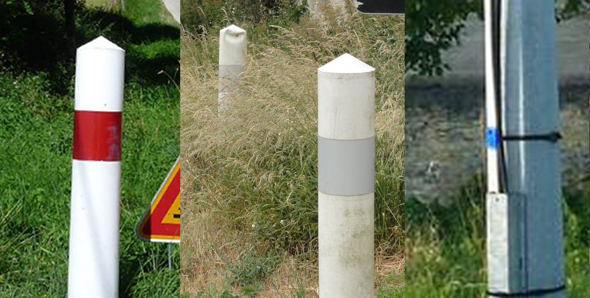
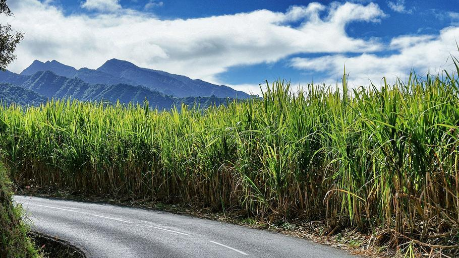
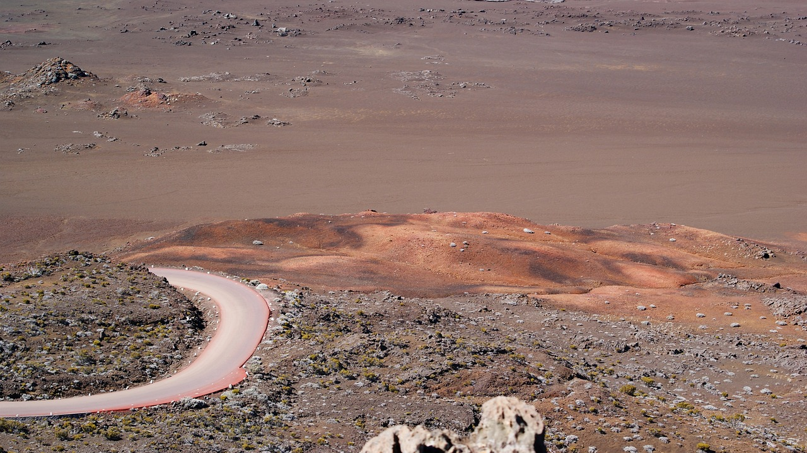

    <h2 class="section-title">{}</h2>
    <ul class="rule-list">
        <li>Country domain: .re</li>
        <li>Sugarcane is widely cultivated</li>
        <li>French-style bollards and utility poles appear</li>
        <li>The Google car is distinctive: a black tape wrap on the right rear</li>
    </ul>

{}
{}
{}
French-style bollards and poles are present{}. Utility poles often have a blue plate{}.
{}

{}
It is a volcanic island, and reddish-brown or black rocks and soil can be seen along the roadside{}.
{}

{}
Sugarcane production is common on flatter ground{}{}.
{}

{}
The Google car is distinctive, with black tape wrapped around the right rear{}.
{}

<iframe src="https://www.google.com/maps/embed?pb=!4v1686044630522!6m8!1m7!1sAXol-Yi0wMSrQCLjDYZ5kg!2m2!1d-21.21776473792954!2d55.56099119881759!3f7.073825579935257!4f-89!5f0.41939995202028907" width="500" height="350" style="border:0;" allowfullscreen="" loading="lazy" referrerpolicy="no-referrer-when-downgrade"></iframe>

{}
{}

    <h2 class="section-title">{}</h2>
    <ul class="rule-list">
        <li>There is a reddish-brown road that circles the volcano called Route du volcan{}</li>
        <li>The town of Cilaos lies inside the caldera{}</li>
    </ul>

{}
{}
{}
There is a reddish-brown road that circles the volcano called Route du volcan{}.
{}

{}
{}
{}
Because it lies inside a caldera, you cannot see the sea and the town is surrounded by mountains{}.
{}

{}
{}
