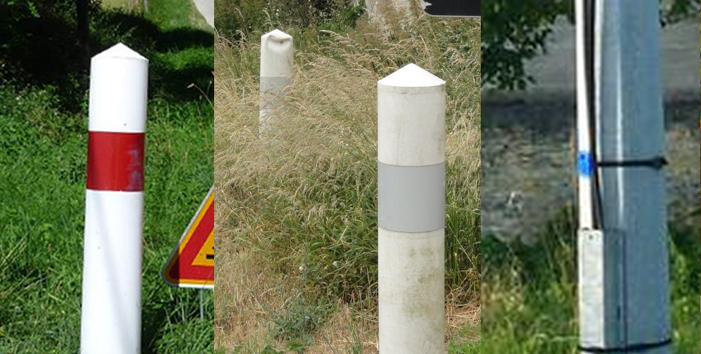
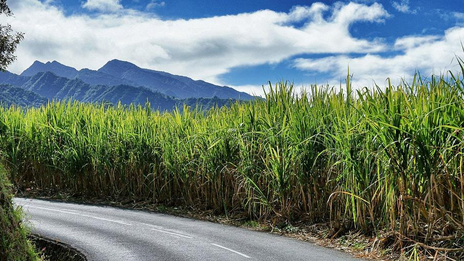
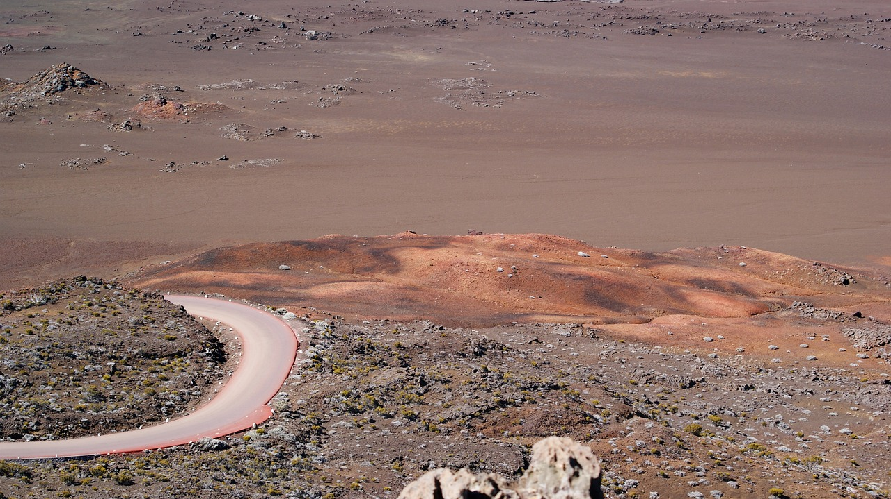
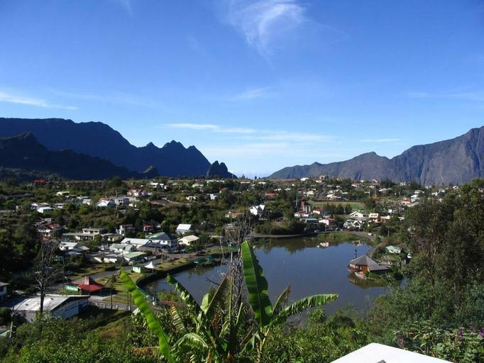

    <h2 class="section-title">{}</h2>
    <ul class="rule-list">
        <li>ドメインは.re</li>
        <li>サトウキビが育てられている</li>
        <li>フランスと同じボラードや電柱がある</li>
        <li>Google Carが特徴的で右後ろに黒いテープが巻いてある</li>
    </ul>

{}
{}

{}
Google Carが特徴的で右後ろに黒いテープが巻いてある{}。
{}

<iframe src="https://www.google.com/maps/embed?pb=!4v1686044630522!6m8!1m7!1sAXol-Yi0wMSrQCLjDYZ5kg!2m2!1d-21.21776473792954!2d55.56099119881759!3f7.073825579935257!4f-89!5f0.41939995202028907" width="500" height="350" style="border:0;" allowfullscreen="" loading="lazy" referrerpolicy="no-referrer-when-downgrade"></iframe>

{}
フランスと同じボラードや電柱がある{}。電柱も青いプレートが付いている{}。
{}

{}
平地ではサトウキビの生産が多い{}。
{}

{}
{}

    <h2 class="section-title">{}</h2>
    <ul class="rule-list">
        <li>Route du volcanという火山の周りを走る赤茶色の道路がある{}</li>
        <li>カルデラの内部にCilaosという町がある{}</li>
    </ul>

{}
{}
{}
Route du volcanという火山の周りを走る赤茶色の道路がある{}。
{}

{}
{}
{}
カルデラ内部にあるため海は見えず、周りは山で囲まれている{}。
{}

{}
{}