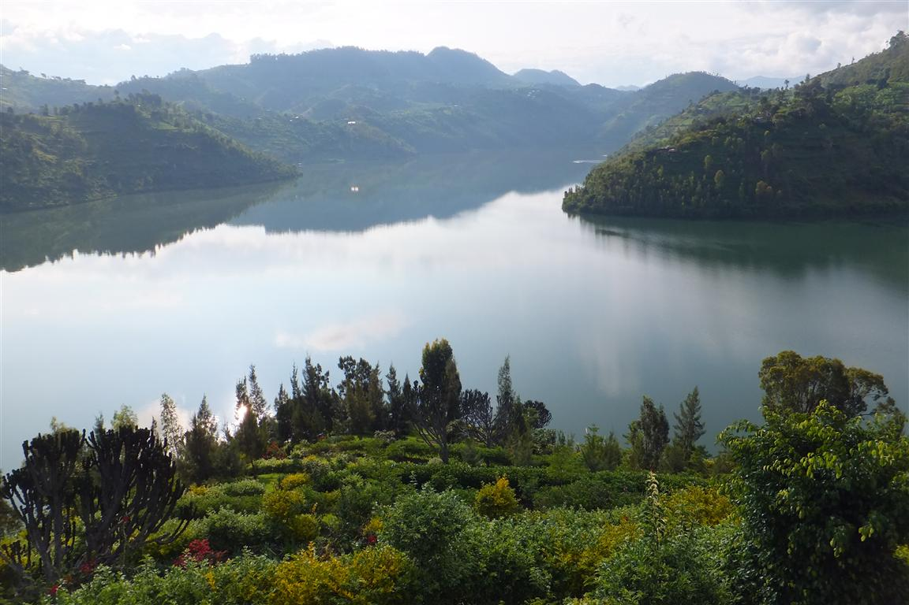

    <h2 class="section-title">{}</h2>
    <ul class="rule-list">
        <li>Kendaraan menggunakan jalur kanan</li>
        <li>Domain internet menggunakan .rw</li>
        <li>Jalan bersih dengan rumput yang terawat</li>
        <li>Plat nomor kendaraan berbentuk ramping: bagian depan berwarna putih, dan bagian belakang berwarna kuning</li>
        <li>Mobile payment sudah umum, dengan kantor sementara penyedia seperti MTN dapat ditemukan di seluruh kota</li>
        <li>Terdapat tiang listrik berbentuk persegi</li>
        <li>Google Car memiliki ciri khas</li>
    </ul>

{}
{}

{}
Di Rwanda, terdapat kewajiban kegiatan sosial bernama **Umuganda**, yang mencakup pembersihan jalan, pemotongan rumput, dan pemangkasan pohon secara rutin setiap minggu {}. Karena itu, jalan-jalan di Rwanda terlihat lebih bersih dibandingkan banyak negara Afrika lainnya. Jalanan bersih tanpa sampah {}, dan bahkan jalanan tidak beraspal sering kali terawat dengan rumput yang dipangkas {}.
{}

<a href="http://creativecommons.org/publicdomain/zero/1.0/deed.en" title="Creative Commons Zero, Public Domain Dedication">CC0</a>, <a href="https://commons.wikimedia.org/w/index.php?curid=147619914">Link</a>

{}
Di jalan besar di Kigali, sepeda motor sering terlihat {}. Selain itu, kendaraan menggunakan jalur kanan, yang membedakannya dari Uganda. Plat nomor kendaraan ramping dan berwarna kuning atau putih.
{}

By <a href="//commons.wikimedia.org/wiki/User:GATETE_Pacifique" title="User:GATETE Pacifique">GATETE Pacifique</a> - Own work, <a href="https://creativecommons.org/licenses/by-sa/4.0" title="Creative Commons Attribution-Share Alike 4.0">CC BY-SA 4.0</a>, <a href="https://commons.wikimedia.org/w/index.php?curid=88630204">Link</a>

{}
Penyedia seluler Rwanda seperti MTN atau Airtel sering mendirikan kantor sementara dengan payung di berbagai lokasi {}. Logo mereka juga dapat dilihat di seluruh kota {}. Lokasi ini berfungsi seperti ATM untuk transaksi uang elektronik {}. Airtel dan MTN juga beroperasi di {} dan {}.
{}

{}
{}

{}
Google Car di Rwanda memiliki ciri khas {}, meskipun ada beberapa area di mana mobil Google tidak terlihat {}.
{}

<iframe src="https://www.google.com/maps/embed?pb=!4v1683478674761!6m8!1m7!1sB8a53z_-9mYxUzV0Q52jcA!2m2!1d-1.941815097077175!2d30.13047435388365!3f323.03495285680117!4f-12.788419732450919!5f0.7820865974627469" width="495" height="295" style="border:0;" allowfullscreen="" loading="lazy" referrerpolicy="no-referrer-when-downgrade"></iframe>

{}
{}

    <h2 class="section-title">{}</h2>
    <ul class="rule-list">
        <li>Di dekat perbatasan utara terdapat gunung berapi, dan tanah di sekitarnya terlihat berwarna hitam</li>
    </ul>

{}
{}

{}
Di daerah perkotaan, tanahnya berwarna hitam {}, dan dari pinggiran kota dapat terlihat pemandangan gunung berapi.
{}

<a rel="nofollow" class="external text" href="https://www.flickr.com/people/84985982@N00">Andrew Moore</a> from Johannesburg, South Africa - <a rel="nofollow" class="external text" href="https://www.flickr.com/photos/andryn2006/46355800961/">Musanze's Volcano</a>, <a href="https://creativecommons.org/licenses/by-sa/2.0" title="Creative Commons Attribution-Share Alike 2.0">CC BY-SA 2.0</a>, <a href="https://commons.wikimedia.org/w/index.php?curid=77767022">Link</a>

{}
{}

    <h2 class="section-title">{}</h2>
    <ul class="rule-list">
        <li>Di sepanjang Danau Kivu, di sisi barat dekat Republik Demokratik Kongo, terdapat jalan dan kota {} {}</li>
        <li>Butare memiliki banyak universitas dan jalan setapaknya sering kali menggunakan batu paving {}</li>
    </ul>

{}
{}

{}
Salah satu dari lima danau besar Afrika {}.
{}

{}
{}

{}
Nama jalan di sini sering kali dimulai dengan "SH" {}.
{}

By <a rel="nofollow" class="external text" href="https://www.flickr.com/people/23442653@N00">Dave Proffer</a> - <a rel="nofollow" class="external text" href="https://www.flickr.com/photos/deepphoto/463798066/">National Museum of Rwanda - Butare</a>, <a href="https://creativecommons.org/licenses/by/2.0" title="Creative Commons Attribution 2.0">CC BY 2.0</a>, <a href="https://commons.wikimedia.org/w/index.php?curid=18113056">Link</a>

{}
{}
