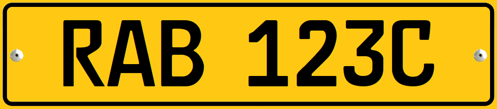
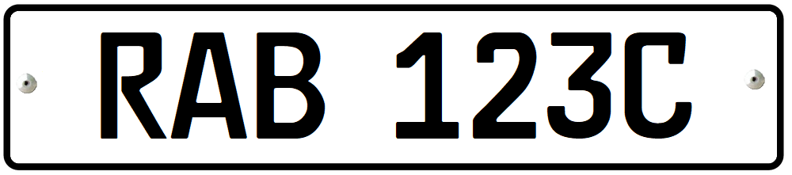

    <h2 class="section-title">{}</h2>
    <ul class="rule-list">
        <li>車は右側通行</li>
        <li>ドメインは.rw</li>
        <li>ナンバープレートは細目で前が白色で後ろが黄色</li>
        <li>モバイルペイメントが普及しておりMTNのような事業者の出張所が街中に見られる</li>
        <li>四角い電柱がある</li>
        <li>Google Carが特徴的</li>
    </ul>

{}
{}
{}キガリの大き目の道路はバイクがよく走っている{}。そして車が右側通行である点がウガンダと異なる。車のナンバープレートは細目の黄色か白色のナンバープレートが見つかる。
{}

By <a href="//commons.wikimedia.org/wiki/User:GATETE_Pacifique" title="User:GATETE Pacifique">GATETE Pacifique</a> - Own work, <a href="https://creativecommons.org/licenses/by-sa/4.0" title="Creative Commons Attribution-Share Alike 4.0">CC BY-SA 4.0</a>, <a href="https://commons.wikimedia.org/w/index.php?curid=88630204">Link</a>

{}

{}
{}

{}

{}ルワンダの携帯キャリアであるMTNやairtelはいろんな場所でパラソルを使って出張所を設けている{}。またMTNやairtelのロゴも町中で見かける{}。この場所はATMのような役割を果たしており電子マネーのやり取りができるらしい{}。{}や{}でも事業をしている。
{}

{}Google Carが特徴的{}。ただし見えないときもある{}。
{}

<iframe src="https://www.google.com/maps/embed?pb=!4v1683478674761!6m8!1m7!1sB8a53z_-9mYxUzV0Q52jcA!2m2!1d-1.941815097077175!2d30.13047435388365!3f323.03495285680117!4f-12.788419732450919!5f0.7820865974627469" width="495" height="295" style="border:0;" allowfullscreen="" loading="lazy" referrerpolicy="no-referrer-when-downgrade"></iframe>

{}
{}

    <h2 class="section-title">{}</h2>
    <ul class="rule-list">
        <li>西のコンゴ民主共和国側のキブ湖沿いに街と道路がある{}{}</li>
        <li>Butareは大学が多く石畳の道が多い{}</li>
    </ul>

{}
{}

{}アフリカ五大湖のひとつ{}。
{}

{}
{}

{}通り名はSHが多い{}？
{}

By <a rel="nofollow" class="external text" href="https://www.flickr.com/people/23442653@N00">Dave Proffer</a> - <a rel="nofollow" class="external text" href="https://www.flickr.com/photos/deepphoto/463798066/">National Museum of Rwanda - Butare</a>, <a href="https://creativecommons.org/licenses/by/2.0" title="Creative Commons Attribution 2.0">CC BY 2.0</a>, <a href="https://commons.wikimedia.org/w/index.php?curid=18113056">Link</a>

{}
{}