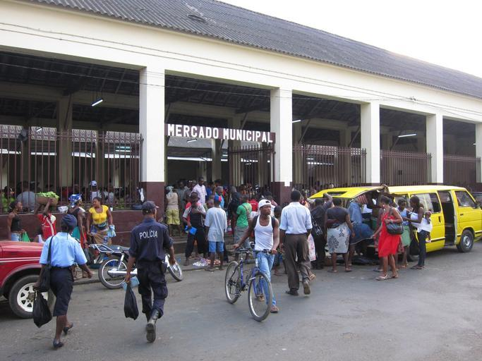

    <h2 class="section-title">{}</h2>
    <ul class="rule-list">
        <li>Utility poles resemble those in {} and {}</li>
        <li>Image quality is poor and the Google car blur is large</li>
        <li>Portuguese is used, and signage is almost the same as {}</li>
        <li>Country domain: .st</li>
    </ul>
    {}

{}
{}

{}
Utility poles similar to those in {} and {} can be found{}. The islands were a Portuguese colony until independence in 1975.
{}

<iframe src="https://www.google.com/maps/embed?pb=!4v1711718297832!6m8!1m7!1sfdzybltfd_HDfH6vd_RgBA!2m2!1d0.378048829450689!2d6.637410366221187!3f250.27566053471884!4f13.696350133282749!5f1.2263304592217037" width="600" height="350" style="border:0;" allowfullscreen="" loading="lazy" referrerpolicy="no-referrer-when-downgrade"></iframe>

{}
Thin black license plates are used{}
{}

{}

Public Domain
{}

{}
{}

    <h2 class="section-title">{}</h2>
    <ul class="rule-list">
        <li>São Tomé Island{}</li>
        <li>Príncipe Island{}</li>
    </ul>

{}
{}

{}If you can see a black Google car, yellow taxis, tall mountains, or a divided road even in the countryside, it is more likely São Tomé Island. Cocoa, coffee, and sugarcane plantations are also more common on São Tomé. The population is larger and the highest peak exceeds 2,000m.
{}

{}
{}

{}The highest peak is about 950m, and the mountainous southern half is a nature reserve with few residents.
{}

By <a href="//commons.wikimedia.org/w/index.php?title=User:Antoniodabreu&amp;amp;action=edit&amp;amp;redlink=1" class="new" title="User:Antoniodabreu (page does not exist)">Antoniodabreu</a> - Own work, <a href="https://creativecommons.org/licenses/by-sa/4.0" title="Creative Commons Attribution-Share Alike 4.0">CC BY-SA 4.0</a>, <a href="https://commons.wikimedia.org/w/index.php?curid=49478613">Link</a>

{}
{}
