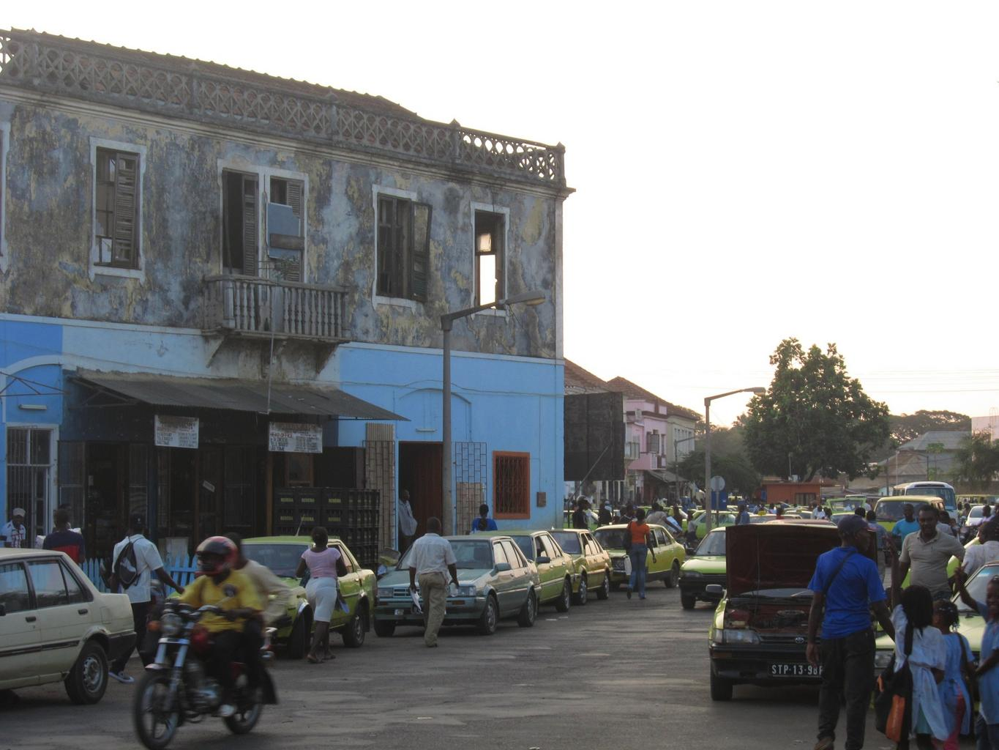
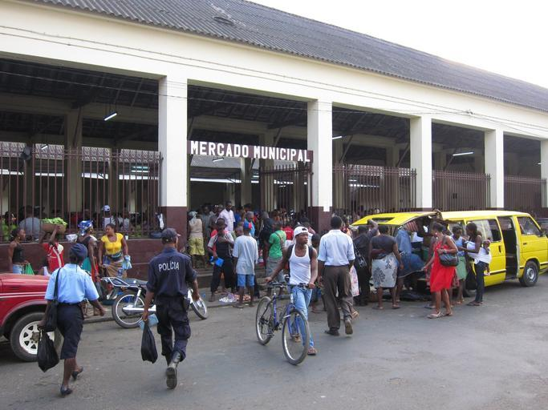

    <h2 class="section-title">{}</h2>
    <ul class="rule-list">
        <li>{}に似た電柱がある
        <li>画質が悪くGoogle Carの大きなぼかしが見える</li>
        <li>ドメインは.st</li>
    </ul>

{}
{}

{}
{}や{}に似た電柱がある{}
{}

<iframe src="https://www.google.com/maps/embed?pb=!4v1711718297832!6m8!1m7!1sfdzybltfd_HDfH6vd_RgBA!2m2!1d0.378048829450689!2d6.637410366221187!3f250.27566053471884!4f13.696350133282749!5f1.2263304592217037" width="600" height="350" style="border:0;" allowfullscreen="" loading="lazy" referrerpolicy="no-referrer-when-downgrade"></iframe>

{}
黒く細いナンバープレートを付けている{}
{}

{}

Public Domain
{}

{}
{}

    <h2 class="section-title">{}</h2>
    <ul class="rule-list">
        <li>サントメ島{}</li>
        <li>プリンシペ島{}</li>
    </ul>

{}
{}

{}おそらく、黒いGoogle Carが見える・高い山が見える・郊外なのに舗装された中央分離帯がある道路があるとサントメ島率が高い。カカオ・コーヒー・サトウキビのプランテーションもサントメ島の方が多い。人口が多く最高峰も2000m以上ある。
{}

{}
{}

{}最高峰は約950mであり、山がちな南半分は自然保護区であり人があまり住んでいない。
{}

By <a href="//commons.wikimedia.org/w/index.php?title=User:Antoniodabreu&amp;amp;action=edit&amp;amp;redlink=1" class="new" title="User:Antoniodabreu (page does not exist)">Antoniodabreu</a> - Own work, <a href="https://creativecommons.org/licenses/by-sa/4.0" title="Creative Commons Attribution-Share Alike 4.0">CC BY-SA 4.0</a>, <a href="https://commons.wikimedia.org/w/index.php?curid=49478613">Link</a>

{}
{}