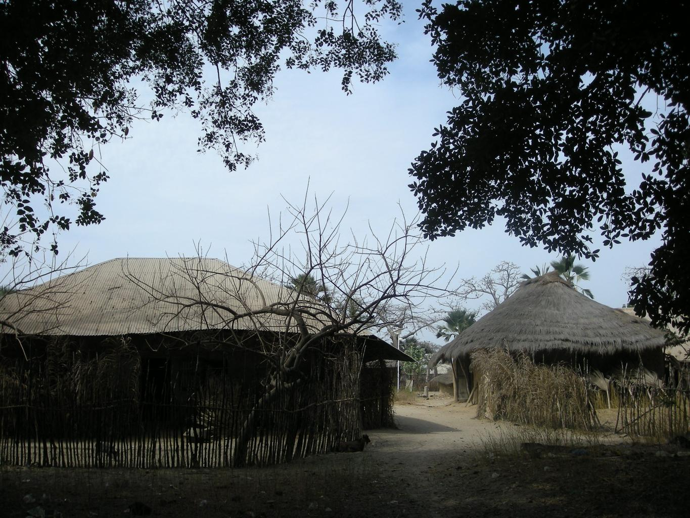

    <h2 class="section-title">{}</h2>
    <ul class="rule-list">
        <li>The domain is .sn</li>
        <li>Languages are French and Wolof</li>
        <li>Street names often include "RUE" like in {}</li>
        <li>Right-hand traffic, like France</li>
        <li>French-style bollards and utility poles can be found</li>
        <li>License plates are often fully blue or have a blue left band</li>
        <li>Truck roofs often appear; their types can even identify the region{}</li>
        <li class="no-evidence">2015 coverage often shows crack-like lines in the sky{}</li>
    </ul>
    {}

{}
{}
{}
License plates are often fully blue or only the left side is blue{}. Blue plates are uncommon but can also appear in {}{}.
{}

{}

By BasilLeaf - Own work, CC0, <a href="https://commons.wikimedia.org/w/index.php?curid=112447343">Wikimedia Commons(Link)</a>
{}

{}
There are utility poles{} and bollards{} in the same style as {}. Street names may include "RUE". Senegal was a French colony until independence in 1960{{% ref "https://ja.wikipedia.org/wiki/%E3%82%A2%E3%83%95%E3%83%AA%E3%82%AB%E5%88%86%E5%89%B2" "Scramble for Africa (JP)" %}}.
{}

By <a href="//commons.wikimedia.org/w/index.php?title=User:Princesssenegal&amp;amp;action=edit&amp;amp;redlink=1" class="new" title="User:Princesssenegal (page does not exist)">Princesssenegal</a> - Own work, <a href="https://creativecommons.org/licenses/by-sa/4.0" title="Creative Commons Attribution-Share Alike 4.0">CC BY-SA 4.0</a>, <a href="https://commons.wikimedia.org/w/index.php?curid=130830873">Link</a>

{}
Thatched-roof houses can be found in rural areas{}.
{}

{}
In savanna zones like Senegal, {}, and {}, baobab trees can appear{}.
{}

{}
You may see the Google car roof{}, and the mosaic used to hide the car can be very large{}. Roof rails can also be visible{}.
{}

<iframe src="https://www.google.com/maps/embed?pb=!4v1686446534206!6m8!1m7!1selo9Ar26uD_-wLGcOHucEg!2m2!1d14.08048083376086!2d-12.97505287100254!3f250.06515007223288!4f-17.27047137495677!5f0.7820865974627469" width="600" height="295" style="border:0;" allowfullscreen="" loading="lazy" referrerpolicy="no-referrer-when-downgrade"></iframe>

{}
{}
{}
2015 coverage often shows crack-like artifacts. Some locations have no cracks and no car visible, so be careful.
{}

<iframe src="https://www.google.com/maps/embed?pb=!4v1692012662707!6m8!1m7!1scu1qjyHoaY1F6k8s6UfefA!2m2!1d13.26051391427934!2d-13.20068697708838!3f183.4930880493612!4f22.76138321538771!5f0.4000000000000002" width="295" height="295" style="border:0;" allowfullscreen="" loading="lazy" referrerpolicy="no-referrer-when-downgrade"></iframe>
<iframe src="https://www.google.com/maps/embed?pb=!4v1692012726491!6m8!1m7!1sF_AiYoLouIWUwSG0skgK5w!2m2!1d13.7808603746642!2d-16.46893062524738!3f143.80734407158656!4f30.16737601839891!5f0.4000000000000002" width="295" height="295" style="border:0;" allowfullscreen="" loading="lazy" referrerpolicy="no-referrer-when-downgrade"></iframe>

{}
{}
{}
Poles with the same shape as in {} appear. Left is Senegal, right is France.
{}

<iframe src="https://www.google.com/maps/embed?pb=!4v1681095856290!6m8!1m7!1s5EwrHrgPBzAoWGoF_284SQ!2m2!1d14.76226054372536!2d-17.03057564757381!3f300.5303852228069!4f5.375461255524556!5f3.325193203789971" width="295" height="295" style="border:0;" allowfullscreen="" loading="lazy" referrerpolicy="no-referrer-when-downgrade"></iframe>
<iframe src="https://www.google.com/maps/embed?pb=!4v1681096121324!6m8!1m7!1sJ0vL9O5ch_zFlNaoCM8Lhw!2m2!1d46.51190863710065!2d5.788828265824604!3f1.0802291546326614!4f45.009282349948364!5f2.692631286102514" width="295" height="295" style="border:0;" allowfullscreen="" loading="lazy" referrerpolicy="no-referrer-when-downgrade"></iframe>

{}
{}
{}
There are many types, but they look similar to {} bollards.
{}

<iframe src="https://www.google.com/maps/embed?pb=!4v1692012478025!6m8!1m7!1sK1BBH07meJRr_mWI5_VAlw!2m2!1d13.26041584753564!2d-13.20021350290872!3f138.63360919790412!4f-4.1284630349873765!5f3.3221390690389803" width="295" height="295" style="border:0;" allowfullscreen="" loading="lazy" referrerpolicy="no-referrer-when-downgrade"></iframe>
<iframe src="https://www.google.com/maps/embed?pb=!4v1681835207993!6m8!1m7!1swjn3arrydfiaJrtinnHDiA!2m2!1d13.84399691620429!2d-15.85368460957238!3f94.70206149159301!4f-21.360856404783192!5f3.325193203789971" width="295" height="295" style="border:0;" allowfullscreen="" loading="lazy" referrerpolicy="no-referrer-when-downgrade"></iframe>

{}
{}
{}
Thatched-roof houses or tin-roof houses are sometimes found in rural areas{}.
{}

{}
{}
{}
Burn marks along the roadside are common; it seems peanuts are often roasted and eaten. It is unclear whether all burn marks are from peanuts{}
{}

<iframe src="https://www.google.com/maps/embed?pb=!4v1681836200769!6m8!1m7!1sD0MfjqO7sm5io_tMpD92BA!2m2!1d12.96465110710002!2d-15.97212009296858!3f199.2464980025189!4f-14.882283681460038!5f3.325193203789971" width="295" height="295" style="border:0;" allowfullscreen="" loading="lazy" referrerpolicy="no-referrer-when-downgrade"></iframe>
<iframe src="https://www.google.com/maps/embed?pb=!4v1681836364649!6m8!1m7!1sVPdIlpc5bPBnpKOARF0pZQ!2m2!1d12.8174602836322!2d-16.1837038709026!3f356.43420490619286!4f-12.300638436577586!5f3.325193203789971" width="295" height="295" style="border:0;" allowfullscreen="" loading="lazy" referrerpolicy="no-referrer-when-downgrade"></iframe>

{}
{}

    <h2 class="section-title">{}</h2>
    <ul class="rule-list">
        <li>Climate differs between south and north: tropical in the south, dry in the north</li>
        <li>If the area code is 33-8XX, it is Dakar</li>
        <li>Truck roofs are often visible; their types can identify the region{}</li>
        <li class="no-evidence">In the far north, many utility poles are new and cables may be missing</li>
    </ul>

{}
{}

{}
Palm oil production seems concentrated in the south. The trees themselves also appear occasionally around places like Dakar.
{}

{}
{}

<iframe src="https://www.google.com/maps/embed?pb=!4v1683958577593!6m8!1m7!1sXTwQJE5sURXgiPj8iSxEOA!2m2!1d14.72305671153571!2d-17.44921992681162!3f184.68361384051596!4f20.05433262695442!5f3.325193203789971" width="295" height="295" style="border:0;" allowfullscreen="" loading="lazy" referrerpolicy="no-referrer-when-downgrade"></iframe>

{}
{}
