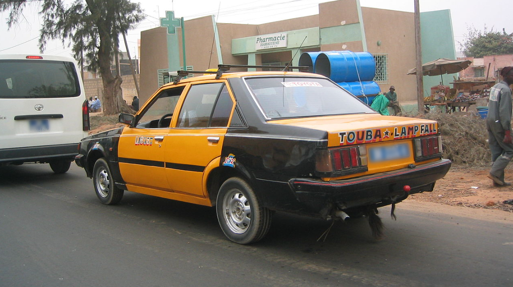
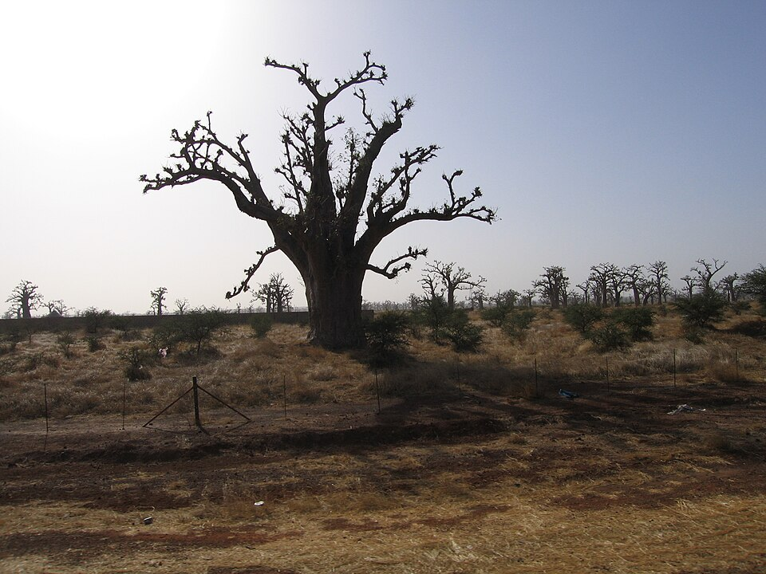
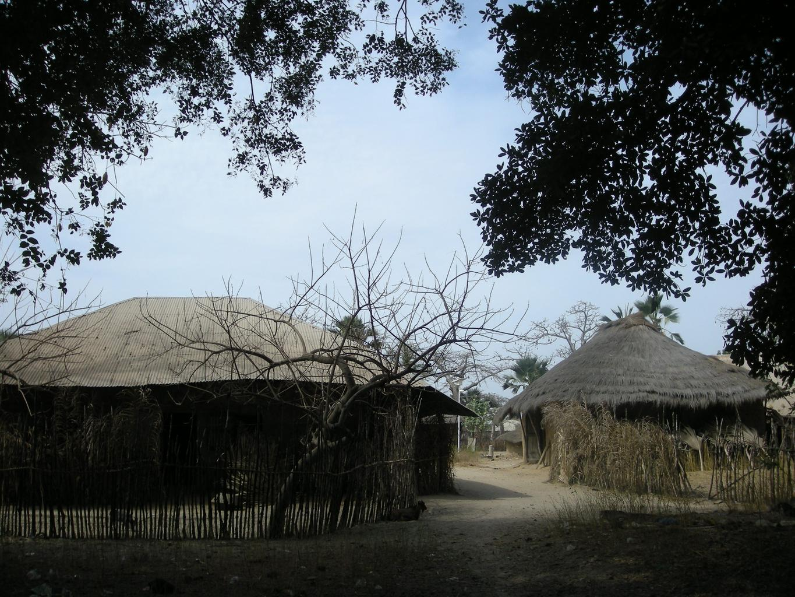
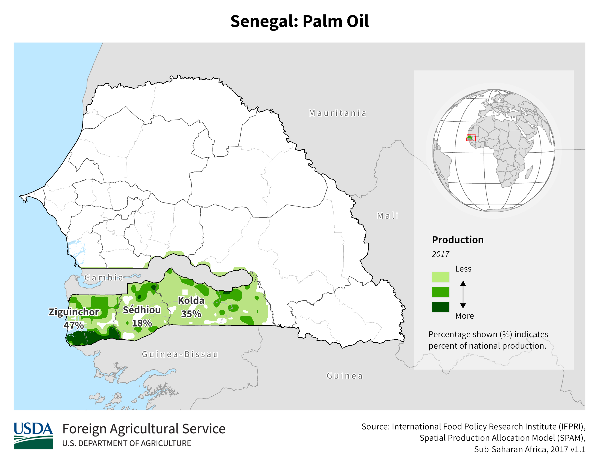

    <h2 class="section-title">{}</h2>
    <ul class="rule-list">
        <li>ドメインは.sn</li>
        <li>言語はフランス語とウォロフ語が使われる</li>
        <li>{}と同じく通り名に「RUE」と書かれている</li>
        <li>フランスと同じく右側通行</li>
        <li>フランスで使用されるボラードや電柱が見つかる</li>
        <li>ナンバープレートは全体が青色か左端だけ青色が多い</li>
        <li>トラックの屋根が映っている場所が多くその種類で地域まで分かる{}</li>
        <li class="no-evidence">2015年に撮影されたものは空にひびのような線が入っていることが多い{}</li>
    </ul>
    {}

{}
{}
{}
ナンバープレートは全体が青色か左端だけ青色{}。白色に見えるプレートもある。青色ナンバーは{}にもある点に注意。
{}

{}

By BasilLeaf - Own work, CC0, <a href="https://commons.wikimedia.org/w/index.php?curid=112447343">Wikimedia Commons(Link)</a>
{}

{}
{}とおなじ形の電柱{}やボラード{}がある。また通り名に「RUE」と書かれていることも。1960年にフランスから独立するまではフランス植民地だった{{% ref "https://ja.wikipedia.org/wiki/%E3%82%A2%E3%83%95%E3%83%AA%E3%82%AB%E5%88%86%E5%89%B2" "アフリカ分割" %}}。
{}

By <a href="//commons.wikimedia.org/w/index.php?title=User:Princesssenegal&amp;amp;action=edit&amp;amp;redlink=1" class="new" title="User:Princesssenegal (page does not exist)">Princesssenegal</a> - Own work, <a href="https://creativecommons.org/licenses/by-sa/4.0" title="Creative Commons Attribution-Share Alike 4.0">CC BY-SA 4.0</a>, <a href="https://commons.wikimedia.org/w/index.php?curid=130830873">Link</a>

{}
郊外に藁ぶき屋根の家が見つかることも{}。
{}

{}
セネガルや{}・{}のようなサバンナ地帯ではバオバブの木が見つかる{}。
{}

{}
Google Carの屋根が見えたり{}Google Carを隠すためのモザイクがかなり大きいときがある{}。ルーフレールが見えることもある{}。
{}

<iframe src="https://www.google.com/maps/embed?pb=!4v1686446534206!6m8!1m7!1selo9Ar26uD_-wLGcOHucEg!2m2!1d14.08048083376086!2d-12.97505287100254!3f250.06515007223288!4f-17.27047137495677!5f0.7820865974627469" width="600" height="295" style="border:0;" allowfullscreen="" loading="lazy" referrerpolicy="no-referrer-when-downgrade"></iframe>

{}
{}
{}
2015年に撮影されたものに亀裂が入っていることが多い。亀裂や車が映っていない場所も多いので注意。
{}

<iframe src="https://www.google.com/maps/embed?pb=!4v1692012662707!6m8!1m7!1scu1qjyHoaY1F6k8s6UfefA!2m2!1d13.26051391427934!2d-13.20068697708838!3f183.4930880493612!4f22.76138321538771!5f0.4000000000000002" width="295" height="295" style="border:0;" allowfullscreen="" loading="lazy" referrerpolicy="no-referrer-when-downgrade"></iframe>
<iframe src="https://www.google.com/maps/embed?pb=!4v1692012726491!6m8!1m7!1sF_AiYoLouIWUwSG0skgK5w!2m2!1d13.7808603746642!2d-16.46893062524738!3f143.80734407158656!4f30.16737601839891!5f0.4000000000000002" width="295" height="295" style="border:0;" allowfullscreen="" loading="lazy" referrerpolicy="no-referrer-when-downgrade"></iframe>

{}
{}
{}
{}にある電柱とおなじ形の電柱がある。左がセネガル・右がフランス。
{}

<iframe src="https://www.google.com/maps/embed?pb=!4v1681095856290!6m8!1m7!1s5EwrHrgPBzAoWGoF_284SQ!2m2!1d14.76226054372536!2d-17.03057564757381!3f300.5303852228069!4f5.375461255524556!5f3.325193203789971" width="295" height="295" style="border:0;" allowfullscreen="" loading="lazy" referrerpolicy="no-referrer-when-downgrade"></iframe>
<iframe src="https://www.google.com/maps/embed?pb=!4v1681096121324!6m8!1m7!1sJ0vL9O5ch_zFlNaoCM8Lhw!2m2!1d46.51190863710065!2d5.788828265824604!3f1.0802291546326614!4f45.009282349948364!5f2.692631286102514" width="295" height="295" style="border:0;" allowfullscreen="" loading="lazy" referrerpolicy="no-referrer-when-downgrade"></iframe>

{}
{}
{}
これら以外にも色々な種類があるが、見た目は{}のボラードに似ている。
{}

<iframe src="https://www.google.com/maps/embed?pb=!4v1692012478025!6m8!1m7!1sK1BBH07meJRr_mWI5_VAlw!2m2!1d13.26041584753564!2d-13.20021350290872!3f138.63360919790412!4f-4.1284630349873765!5f3.3221390690389803" width="295" height="295" style="border:0;" allowfullscreen="" loading="lazy" referrerpolicy="no-referrer-when-downgrade"></iframe>
<iframe src="https://www.google.com/maps/embed?pb=!4v1681835207993!6m8!1m7!1swjn3arrydfiaJrtinnHDiA!2m2!1d13.84399691620429!2d-15.85368460957238!3f94.70206149159301!4f-21.360856404783192!5f3.325193203789971" width="295" height="295" style="border:0;" allowfullscreen="" loading="lazy" referrerpolicy="no-referrer-when-downgrade"></iframe>

{}
{}
{}
藁ぶき屋根の家やトタンの家が郊外でたまに見つかる{}。
{}

{}
{}
{}
道端に火を燃やしたあとが多いので調べてみたところ、ピーナッツを焼いて食べることが多いらしい。ただし道端にある燃やした跡がピーナッツによるものかは不明{}
{}

<iframe src="https://www.google.com/maps/embed?pb=!4v1681836200769!6m8!1m7!1sD0MfjqO7sm5io_tMpD92BA!2m2!1d12.96465110710002!2d-15.97212009296858!3f199.2464980025189!4f-14.882283681460038!5f3.325193203789971" width="295" height="295" style="border:0;" allowfullscreen="" loading="lazy" referrerpolicy="no-referrer-when-downgrade"></iframe>
<iframe src="https://www.google.com/maps/embed?pb=!4v1681836364649!6m8!1m7!1sVPdIlpc5bPBnpKOARF0pZQ!2m2!1d12.8174602836322!2d-16.1837038709026!3f356.43420490619286!4f-12.300638436577586!5f3.325193203789971" width="295" height="295" style="border:0;" allowfullscreen="" loading="lazy" referrerpolicy="no-referrer-when-downgrade"></iframe>

{}
{}

    <h2 class="section-title">{}</h2>
    <ul class="rule-list">
        <li>気候が南部と北部で異なり南部は熱帯・北部は乾燥した気候</li>
        <li>市外局番が33-8XXとなっているならばダカール</li>
        <li>トラックの屋根が映っている場所が多くその種類で地域まで分かる{}</li>
        <li class="no-evidence">一番北の方は新品の電柱が多くコードが張られてないときもある</li>
    </ul>

{}
{}

{}
南側でだけパームオイルの生産が多いらしい。ただし木自体はダカールのような場所にもたまに生えているっぽい。
{}

{}
{}

<iframe src="https://www.google.com/maps/embed?pb=!4v1683958577593!6m8!1m7!1sXTwQJE5sURXgiPj8iSxEOA!2m2!1d14.72305671153571!2d-17.44921992681162!3f184.68361384051596!4f20.05433262695442!5f3.325193203789971" width="295" height="295"style="border:0;" allowfullscreen="" loading="lazy" referrerpolicy="no-referrer-when-downgrade"></iframe>

{}
{}
