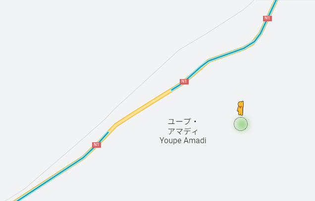

    <h2 class="section-title">{}</h2>
    <ul class="rule-list">
        <li>空にひびのような線が入っていることが多い</li>
        <li>ナンバープレートは青色</li>
        <li>言語はフランス語、ウォロフ語</li>
        <li>ドメインは.sn</li>
        <li>トラックの屋根が映っている場所が多く、その種類で道まで分かる{}</li>
    </ul>

{}
{}
{}
フランスにある電柱とおなじ形の電柱がある（右はフランスのもの）。1960年にフランスから独立するまではフランス植民地だった。
{}

<iframe src="https://www.google.com/maps/embed?pb=!4v1681095856290!6m8!1m7!1s5EwrHrgPBzAoWGoF_284SQ!2m2!1d14.76226054372536!2d-17.03057564757381!3f300.5303852228069!4f5.375461255524556!5f3.325193203789971" width="295" height="295" style="border:0;" allowfullscreen="" loading="lazy" referrerpolicy="no-referrer-when-downgrade"></iframe>
<iframe src="https://www.google.com/maps/embed?pb=!4v1681096121324!6m8!1m7!1sJ0vL9O5ch_zFlNaoCM8Lhw!2m2!1d46.51190863710065!2d5.788828265824604!3f1.0802291546326614!4f45.009282349948364!5f2.692631286102514" width="295" height="295" style="border:0;" allowfullscreen="" loading="lazy" referrerpolicy="no-referrer-when-downgrade"></iframe>

{}
空に亀裂がある時がある。Google Carの屋根が見えることが多い。
{}

<iframe src="https://www.google.com/maps/embed?pb=!4v1680287551038!6m8!1m7!1skGcWOAsKt0pB9VcZR0eTrg!2m2!1d14.66781645908807!2d-17.44326453931863!3f338.0874196945483!4f41.58305633619085!5f0.7820865974627469" width="295" height="295" style="border:0;" allowfullscreen="" loading="lazy" referrerpolicy="no-referrer-when-downgrade"></iframe>
<iframe src="https://www.google.com/maps/embed?pb=!4v1680287431312!6m8!1m7!1s0VMJLt0-4tIFwFVvixfCWw!2m2!1d14.75093555778545!2d-17.35376756308375!3f80.50105210742223!4f-31.91313279331974!5f0.7820865974627469" width="295" height="295" style="border:0;" allowfullscreen="" loading="lazy" referrerpolicy="no-referrer-when-downgrade"></iframe>

{}
{}

<iframe src="https://www.google.com/maps/embed?pb=!4v1681835207993!6m8!1m7!1swjn3arrydfiaJrtinnHDiA!2m2!1d13.84399691620429!2d-15.85368460957238!3f94.70206149159301!4f-21.360856404783192!5f3.325193203789971" width="295" height="295" style="border:0;" allowfullscreen="" loading="lazy" referrerpolicy="no-referrer-when-downgrade"></iframe>

{}
{}

<iframe src="https://www.google.com/maps/embed?pb=!4v1680287264544!6m8!1m7!1sqqxy9vJe3ComN0Qgb9obkQ!2m2!1d14.81934582270155!2d-16.64311183872417!3f100.63270209953455!4f5.15872783914854!5f0.7820865974627469" width="295" height="295" style="border:0;" allowfullscreen="" loading="lazy" referrerpolicy="no-referrer-when-downgrade"></iframe>
<iframe src="https://www.google.com/maps/embed?pb=!4v1681835368881!6m8!1m7!1sKQ4UR0CUhsU_Sy1QMafC2A!2m2!1d13.26043255146473!2d-13.20029131486454!3f168.77370843611993!4f-9.016344683879453!5f3.325193203789971" width="295" height="295" style="border:0;" allowfullscreen="" loading="lazy" referrerpolicy="no-referrer-when-downgrade"></iframe>

{}
ある区画でGoogle Carとバイクの衝突事故があったらしく、その地点のみストリートビューが切り取られている。
{}

{}

{}
{}

<iframe src="https://www.google.com/maps/embed?pb=!4v1681836200769!6m8!1m7!1sD0MfjqO7sm5io_tMpD92BA!2m2!1d12.96465110710002!2d-15.97212009296858!3f199.2464980025189!4f-14.882283681460038!5f3.325193203789971" width="295" height="295" style="border:0;" allowfullscreen="" loading="lazy" referrerpolicy="no-referrer-when-downgrade"></iframe>
<iframe src="https://www.google.com/maps/embed?pb=!4v1681836364649!6m8!1m7!1sVPdIlpc5bPBnpKOARF0pZQ!2m2!1d12.8174602836322!2d-16.1837038709026!3f356.43420490619286!4f-12.300638436577586!5f3.325193203789971" width="295" height="295" style="border:0;" allowfullscreen="" loading="lazy" referrerpolicy="no-referrer-when-downgrade"></iframe>

道端に火を燃やしたあとが多いので調べてみたところ、ピーナッツを焼いて食べることが多いらしい。ただし道端にある燃やした跡がピーナッツによるものかは不明（参考：<a href="https://iihanashik.exblog.jp/28377472/">
落花生の脱穀 in Senegal</a>）

{}
{}

<iframe src="https://www.google.com/maps/embed?pb=!4v1681836121342!6m8!1m7!1sGFxCgVcMIQN3bwAxnMpVew!2m2!1d12.96459254549707!2d-15.97241092792654!3f327.94485701355205!4f-16.120704366809676!5f3.325193203789971" width="295" height="295" style="border:0;" allowfullscreen="" loading="lazy" referrerpolicy="no-referrer-when-downgrade"></iframe>

{}
{}