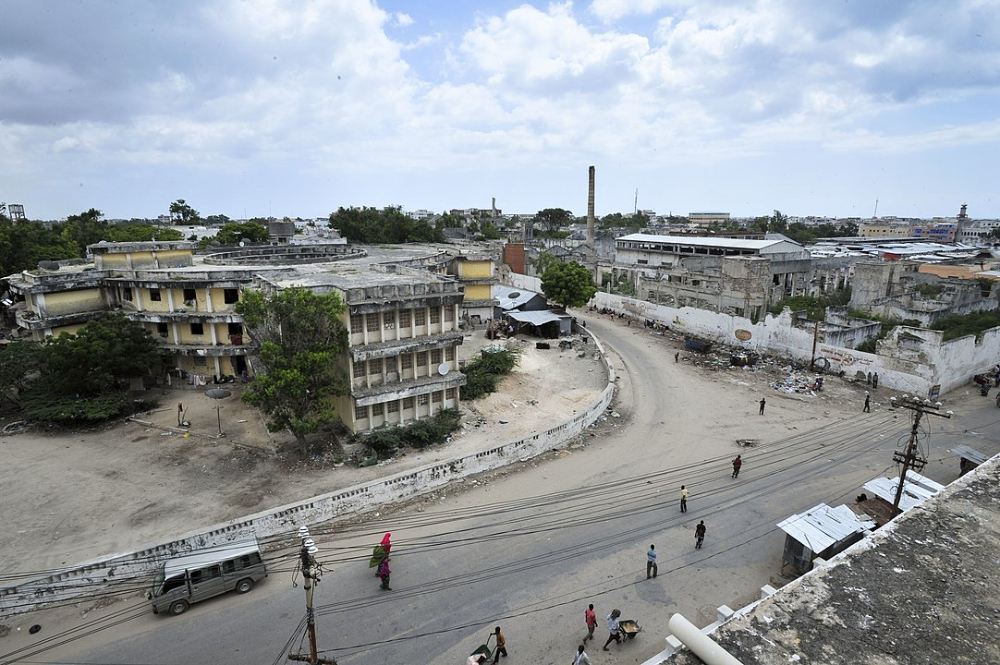

    <h2 class="section-title">{}</h2>
    <ul class="rule-list">
        <li>ドメインは.so</li>
    </ul>

{}
{}
{}
ソマリア内戦が1980年以降続いている{{% ref "https://ja.wikipedia.org/wiki/%E3%82%BD%E3%83%9E%E3%83%AA%E3%82%A2%E5%86%85%E6%88%A6" "ソマリア内戦" %}}。実際の写真などは<a href="https://kojimateacher-goestoafrica.com/visa-somalilandshilling-egalinternationalairport">『コジマ先生 アフリカへ行く - ソマリランド(ソマリア)を旅する』</a>などが詳しいかも。
{}

{}
内戦中で行政の区分などは確定していない部分がある。
{}

パブリック・ドメイン, <a href="https://commons.wikimedia.org/w/index.php?curid=18673571">リンク</a>による

{}
{}
