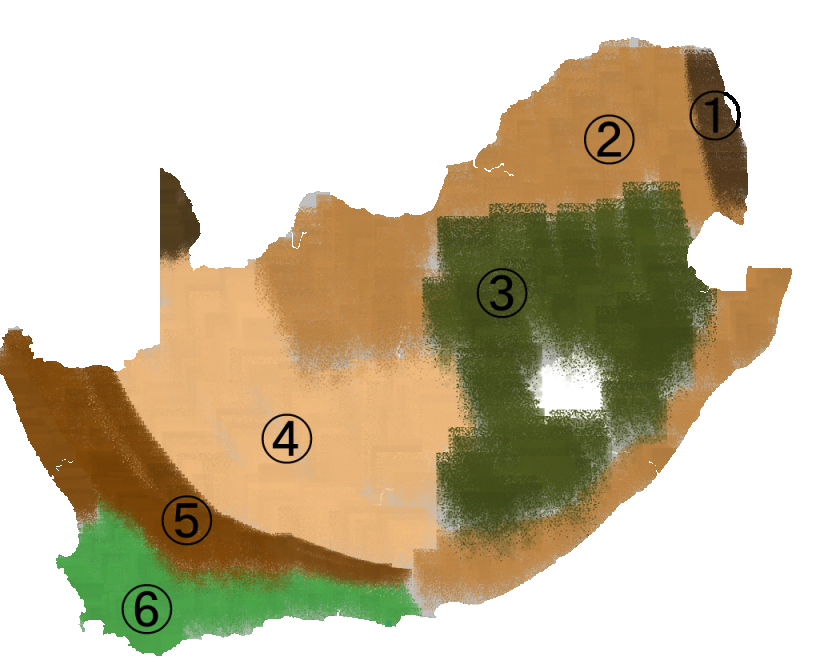

    <h2 class="section-title">{}</h2>
    <ul class="rule-list">
        <li>車は左側通行</li>
        <li>ドメインは.za</li>
        <li>家にバーグラーバー（Burglar Bars、鉄格子）が付いていることが多い</li>
        <li>道路について外側の線がある場合はオレンジ色で中央分離帯が白の線の場合が多い</li>
        <li>Sasolは南アフリカのエネルギー・化学事業の企業、ガソリンスタンドがある。</li>
    </ul>

{}
{}
{}
防犯対策としてバーグラーバー（Burglar Bars、鉄格子）が付いていることが多い。また、柵をよく見るとエレクトリックワイヤーが張られていることも多い。
{}

<iframe src="https://www.google.com/maps/embed?pb=!4v1682283657883!6m8!1m7!1sPV4BSoKJSpk2SBwFfdJxtA!2m2!1d-34.04342394372563!2d18.51732175162858!3f13.819907395205497!4f-3.8715017447142372!5f3.325193203789971" width="295" height="295" style="border:0;" allowfullscreen="" loading="lazy" referrerpolicy="no-referrer-when-downgrade"></iframe>
<iframe src="https://www.google.com/maps/embed?pb=!4v1682284165694!6m8!1m7!1seXuNZyme4Cy2mWT7ORBV1Q!2m2!1d-29.83016438817616!2d31.01121558441056!3f170.21138774432524!4f6.853126215654527!5f1.8029387404032464" width="295" height="295" style="border:0;" allowfullscreen="" loading="lazy" referrerpolicy="no-referrer-when-downgrade"></iframe>

{}
左側通行かつ外側の線がある場合はオレンジ色で中央分離帯が白の線（ただしこれだけで確定するわけではないと思う）。
{}

<iframe src="https://www.google.com/maps/embed?pb=!4v1681497389688!6m8!1m7!1s-dCjCDxqAyo0T4HQfiMcsQ!2m2!1d-28.8351143653617!2d22.07029168738174!3f274.42116691885025!4f-1.504176664867643!5f3.325193203789971" width="590" height="180" style="border:0;" allowfullscreen="" loading="lazy" referrerpolicy="no-referrer-when-downgrade"></iframe>
<iframe src="https://www.google.com/maps/embed?pb=!4v1681497502939!6m8!1m7!1sohuHnrUkThIaOfY4ee-AyQ!2m2!1d-31.42812277158556!2d28.86063351376403!3f13.063523379820015!4f-7.908401570996617!5f1.6032970719897364" width="590" height="180" style="border:0;" allowfullscreen="" loading="lazy" referrerpolicy="no-referrer-when-downgrade"></iframe>

{}
Sasolは南アフリカのエネルギー・化学事業の企業。
{}

<iframe src="https://www.google.com/maps/embed?pb=!4v1679677105343!6m8!1m7!1sHzQ8bmbPPm9pnYOkg83_iw!2m2!1d-33.94114997232529!2d18.60874629092492!3f8.347004415763166!4f2.5505209374776427!5f3.0833772611191104" width="295" height="295" style="border:0;" allowfullscreen="" loading="lazy" referrerpolicy="no-referrer-when-downgrade"></iframe>

{}
{}

<iframe src="https://www.google.com/maps/embed?pb=!4v1681497450657!6m8!1m7!1sQBI_D7IFkeExseljZ0r6Dw!2m2!1d-34.20021087965176!2d20.02773280801162!3f263.9512532520086!4f-3.9066333107253115!5f0.8134659912944922" width="295" height="295" style="border:0;" allowfullscreen="" loading="lazy" referrerpolicy="no-referrer-when-downgrade"></iframe>
<iframe src="https://www.google.com/maps/embed?pb=!4v1679676855735!6m8!1m7!1s-dCjCDxqAyo0T4HQfiMcsQ!2m2!1d-28.8351143653617!2d22.07029168738174!3f88.3609792735573!4f-10.041765813189983!5f3.305926596708757" width="295" height="295" style="border:0;" allowfullscreen="" loading="lazy" referrerpolicy="no-referrer-when-downgrade"></iframe>

{}
{}

<iframe src="https://www.google.com/maps/embed?pb=!4v1679676830010!6m8!1m7!1sXcIGunHbTgZn-HxRfrO_jA!2m2!1d-25.96186494385497!2d27.20759987944646!3f292.80799325093903!4f-34.067985552451546!5f2.2618638942268636" width="295" height="295" style="border:0;" allowfullscreen="" loading="lazy" referrerpolicy="no-referrer-when-downgrade"></iframe>

{}
{}

    <h2 class="section-title">州・地域の絞り込み</h2>
    <ul class="rule-list">
        <li>植生が地域ごとに異なる
            <ul>
                <li>①南アフリカ共和国の国立公園</li>
                <li>②サバンナ</li>
                <li>③Grassland Biome、草がメイン（参考文献：<a href="http://pza.sanbi.org/vegetation/grassland-biome">SANBI</a>）</li>
                <li>④Nama Karoo、干ばつが頻繁に発生する低木が生えるエリア</li>
                <li>⑤Succulent Karoo、多肉植物が多い（参考文献：<a href="https://pza.sanbi.org/vegetation/succulent-karoo-biome">SANBI</a>）</li>
                <li>⑥Fynbos、地中海性気候がメインで植生の多くが細い針状の葉を持っている（参考文献：<a href="https://ja.wikipedia.org/wiki/%E3%83%95%E3%82%A3%E3%83%B3%E3%83%9C%E3%82%B9">Wikipedia『フィンボス』</a>）</li>
            </ul>
        </li>
    </ul>

{}
{}
{}
図は自分が雰囲気で着色しただけなので参考程度にお願いします
{}

{}
{}
{}
サバンナは北のエリアと海沿いのエリアに存在している
{}

<iframe src="https://www.google.com/maps/embed?pb=!4v1682324776916!6m8!1m7!1sZOmFN4soZaHUaG9CGKN5_g!2m2!1d-22.62638273245806!2d29.92255684576945!3f7.59092070189236!4f3.5608005488869026!5f0.7820865974627469" width="295" height="295" style="border:0;" allowfullscreen="" loading="lazy" referrerpolicy="no-referrer-when-downgrade"></iframe>
<iframe src="https://www.google.com/maps/embed?pb=!4v1682324871185!6m8!1m7!1smu_TmRjBfhaPbaksGiEvlg!2m2!1d-33.55789802046195!2d26.55261180328686!3f314.7805053861716!4f0.6774984441135388!5f0.7820865974627469" width="295" height="295" style="border:0;" allowfullscreen="" loading="lazy" referrerpolicy="no-referrer-when-downgrade"></iframe>

{}
Grassland Biomeはレソトを取り囲むように分布している。遠くに上が平らな山（ドラケンスバーグ山脈）が見えるかもしれない。
{}

<iframe src="https://www.google.com/maps/embed?pb=!4v1682390322048!6m8!1m7!1sCEMHuo-1PnslsmnNs7wpSQ!2m2!1d-28.25428746773927!2d29.11673346402855!3f83.6423064924647!4f-1.9136722496799763!5f1.1566133358301816" width="295" height="295" style="border:0;" allowfullscreen="" loading="lazy" referrerpolicy="no-referrer-when-downgrade"></iframe>
<iframe src="https://www.google.com/maps/embed?pb=!4v1682324849001!6m8!1m7!1sRVxuo_RaNJrtu16jhh29lg!2m2!1d-30.44671003955965!2d28.6304976449013!3f128.006031910333!4f5.093105066904158!5f0.7820865974627469" width="295" height="295" style="border:0;" allowfullscreen="" loading="lazy" referrerpolicy="no-referrer-when-downgrade"></iframe>

{}
Nama Karooは厳しい環境で場所によっては草も生えていない
{}

<iframe src="https://www.google.com/maps/embed?pb=!4v1682324991744!6m8!1m7!1sif9NHw31bUnJlPUCKzycjA!2m2!1d-29.85956215669374!2d20.73597370752784!3f115.76188729259206!4f4.829442606227545!5f0.4000000000000002" width="295" height="295" style="border:0;" allowfullscreen="" loading="lazy" referrerpolicy="no-referrer-when-downgrade"></iframe>
<iframe src="https://www.google.com/maps/embed?pb=!4v1682325086107!6m8!1m7!1sQdpNKOtc8WiQ2kpj0hSEUQ!2m2!1d-28.8076136017554!2d20.44497834268564!3f120.99758362124906!4f-1.4992175063994466!5f0.8742806863926469" width="295" height="295" style="border:0;" allowfullscreen="" loading="lazy" referrerpolicy="no-referrer-when-downgrade"></iframe>

{}
{}

{}

{}
{}
