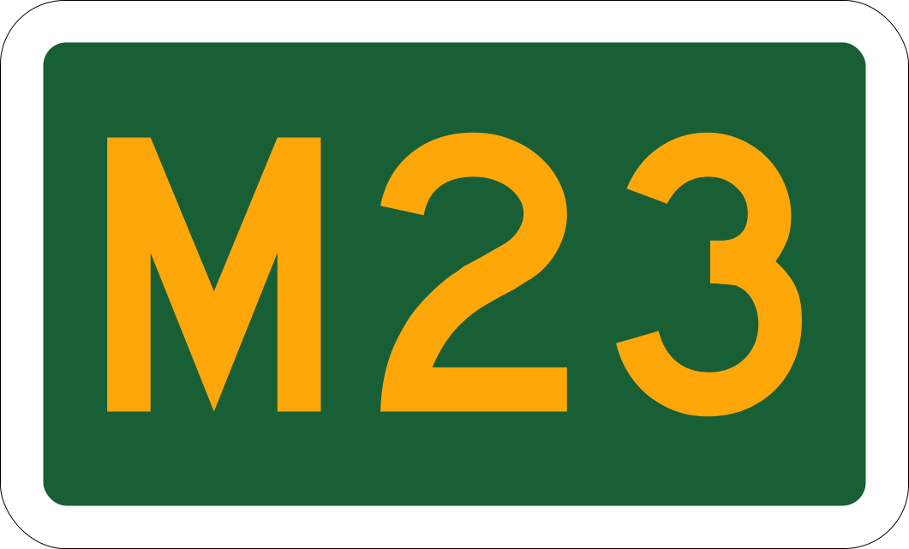

    <h2 class="section-title">{}</h2>
    <ul class="rule-list">
        <li>車は左側通行</li>
        <li>ドメインは.za</li>
        <li>家にバーグラーバー（Burglar Bars、鉄格子）が付いていることが多い</li>
        <li>道路について外側の線がある場合はオレンジ色で中央分離帯が白の線の場合が多い</li>
        <li>Sasolは南アフリカのエネルギー・化学事業の企業、ガソリンスタンドがある</li>
        <li>「M1」のような道路番号はオーストラリアにもあるけれどフォントが異なる</li>
        <li>地域名に二重母音（「oo」「ee」といった綴り）が見られる</li>
    </ul>
    {}

{}
{}
{}
防犯対策として窓の内側にバーグラーバー（Burglar Bars、鉄格子）があったり、柵に有刺鉄線が付いていることが多い。また、柵にエレクトリックワイヤーが張られていることも多い。また玄関に「ADT」や「BLUE」と書かれたセキュリティ会社のシールが貼ってあることが多い{}。
{}

<iframe src="https://www.google.com/maps/embed?pb=!4v1688805820460!6m8!1m7!1ssmZgrjGt7TWWCYoCbRESTA!2m2!1d-34.04274032697883!2d18.51497407381557!3f247.6366493219555!4f-2.532564184131985!5f3.325193203789971" width="295" height="295" style="border:0;" allowfullscreen="" loading="lazy" referrerpolicy="no-referrer-when-downgrade"></iframe>
<iframe src="https://www.google.com/maps/embed?pb=!4v1692589305891!6m8!1m7!1s7__QvM3p0BexflDHhBUVGw!2m2!1d-29.83013406863737!2d31.01124104828757!3f304.8106288063212!4f-1.2051125449800253!5f1.559993401296524" width="295" height="295" style="border:0;" allowfullscreen="" loading="lazy" referrerpolicy="no-referrer-when-downgrade"></iframe>

{}
左側通行かつ外側の線がある場合はオレンジ色で中央分離帯が白の線{}。両サイドのラインは描かれていない場合もある{}。稀に赤い線もある{}。
{}

{}
Sasolは南アフリカのエネルギー・化学事業の企業{}{}。世界で7番目に大きい石炭採掘会社であり、関連する化学物質や石油製品も販売する。
{}

{}
道路番号が書かれた緑の看板があり{}、フォントがオーストラリアと異なる。左が南アフリカ・右がオーストラリア。また地名に「oo」「ee」といった二重母音が見られる点も珍しいと思う。
{}

By <a href="//commons.wikimedia.org/wiki/User:NJR_ZA" title="User:NJR ZA">NJR ZA</a> - Own work, <a href="https://creativecommons.org/licenses/by-sa/3.0" title="Creative Commons Attribution-Share Alike 3.0">CC BY-SA 3.0</a>, <a href="https://commons.wikimedia.org/w/index.php?curid=68484920">Link</a>

{}
タクシーが特徴的でバン(van)型の車をよく見かける。
{}

By <a href="//commons.wikimedia.org/wiki/User:MB-one" title="User:MB-one">Matti Blume</a> - Own work, <a href="https://creativecommons.org/licenses/by-sa/4.0" title="Creative Commons Attribution-Share Alike 4.0">CC BY-SA 4.0</a>, <a href="https://commons.wikimedia.org/w/index.php?curid=70971749">Link</a>

{}
{}
{}
P522と書かれているのは道路番号なので見逃さないように。
{}

<iframe src="https://www.google.com/maps/embed?pb=!4v1691333114238!6m8!1m7!1sqbUYq9H933ZeNE74Ilm42A!2m2!1d-27.07231948524053!2d32.19892102941815!3f317.05305350744254!4f-20.371161840810743!5f1.6580457275036493"width="295" height="295" style="border:0;" allowfullscreen="" loading="lazy" referrerpolicy="no-referrer-when-downgrade"></iframe>

{}
{}
{}
たまに{}にありそうな電柱が見つかる。
{}

<iframe src="https://www.google.com/maps/embed?pb=!4v1691925054654!6m8!1m7!1so1U2Ncm265NuXQ-KsiV-fQ!2m2!1d-33.85840379099375!2d25.59696089827398!3f176.98485009684794!4f2.039602716233631!5f1.135691616221461"width="295" height="295" style="border:0;" allowfullscreen="" loading="lazy" referrerpolicy="no-referrer-when-downgrade"></iframe>
<iframe src="https://www.google.com/maps/embed?pb=!4v1691925156805!6m8!1m7!1s7WgsGzxMK0L7jjSog1m0Vw!2m2!1d-27.09846567738325!2d32.16040662690096!3f90.0132052925046!4f1.2467609132495312!5f1.7435841889690247"width="295" height="295" style="border:0;" allowfullscreen="" loading="lazy" referrerpolicy="no-referrer-when-downgrade"></iframe>

{}
{}

    <ul class="rule-list-none">
        <li>{}</li>
    </ul>

{}
{}

    <h2 class="section-title">{}</h2>
    <ul class="rule-list">
        <li>植生が地域ごとに異なる
            <ul>
                <li>①国立公園</li>
                <li>②サバンナ</li>
                <li>③Grassland Biome、草がメイン{}</li>
                <li>④Nama Karoo、干ばつが頻繁に発生する低木が生えるエリア</li>
                <li>⑤Succulent Karoo、多肉植物が多い{}</li>
                <li>⑥Fynbos、地中海性気候がメインで植生の多くが細い針状の葉を持っている{{% ref "https://ja.wikipedia.org/wiki/%E3%83%95%E3%82%A3%E3%83%B3%E3%83%9C%E3%82%B9" "Wikipedia『フィンボス』" %}}</li>
            </ul>
        </li>
    </ul>

{}
{}
{}
図は自分が雰囲気で着色しただけなので参考程度にお願いします{}
{}

{}
{}
{}
道路の交差点に独特な石があり自然も豊かだ
{}

<iframe src="https://www.google.com/maps/embed?pb=!4v1682582507768!6m8!1m7!1sCHLT7b5SxaAn9_Wyw6v5pA!2m2!1d-25.04609924371003!2d31.58888671371989!3f243.67947433702824!4f-5.025104495001926!5f2.8766442269134047" width="295" height="295" style="border:0;" allowfullscreen="" loading="lazy" referrerpolicy="no-referrer-when-downgrade"></iframe>
<iframe src="https://www.google.com/maps/embed?pb=!4v1682582479625!6m8!1m7!1sCAoSLEFGMVFpcFA5OWtpRkxxUUc0c3ZOQ0dLRzhIX3NqcUpNeVZWS3NPcnI1dU1G!2m2!1d-23.92176338810719!2d31.23214666603916!3f11.841535471823875!4f-19.014792492702526!5f2.833727043364251" width="295" height="295" style="border:0;" allowfullscreen="" loading="lazy" referrerpolicy="no-referrer-when-downgrade"></iframe>

{}
{}
{}
サバンナは北のエリアと海沿いのエリアに存在している
{}

<iframe src="https://www.google.com/maps/embed?pb=!4v1682324776916!6m8!1m7!1sZOmFN4soZaHUaG9CGKN5_g!2m2!1d-22.62638273245806!2d29.92255684576945!3f7.59092070189236!4f3.5608005488869026!5f0.7820865974627469" width="295" height="295" style="border:0;" allowfullscreen="" loading="lazy" referrerpolicy="no-referrer-when-downgrade"></iframe>
<iframe src="https://www.google.com/maps/embed?pb=!4v1682324871185!6m8!1m7!1smu_TmRjBfhaPbaksGiEvlg!2m2!1d-33.55789802046195!2d26.55261180328686!3f314.7805053861716!4f0.6774984441135388!5f0.7820865974627469" width="295" height="295" style="border:0;" allowfullscreen="" loading="lazy" referrerpolicy="no-referrer-when-downgrade"></iframe>

{}
{}
{}
Grassland Biomeはレソトを取り囲むように分布している。遠くに上が平らな山（ドラケンスバーグ山脈）が見えるかもしれない。
{}

<iframe src="https://www.google.com/maps/embed?pb=!4v1682390322048!6m8!1m7!1sCEMHuo-1PnslsmnNs7wpSQ!2m2!1d-28.25428746773927!2d29.11673346402855!3f83.6423064924647!4f-1.9136722496799763!5f1.1566133358301816" width="295" height="295" style="border:0;" allowfullscreen="" loading="lazy" referrerpolicy="no-referrer-when-downgrade"></iframe>
<iframe src="https://www.google.com/maps/embed?pb=!4v1682324849001!6m8!1m7!1sRVxuo_RaNJrtu16jhh29lg!2m2!1d-30.44671003955965!2d28.6304976449013!3f128.006031910333!4f5.093105066904158!5f0.7820865974627469" width="295" height="295" style="border:0;" allowfullscreen="" loading="lazy" referrerpolicy="no-referrer-when-downgrade"></iframe>

{}
{}
{}
Nama Karooは干ばつも発生することがある厳しい環境で場所によっては草も生えていない
{}

<iframe src="https://www.google.com/maps/embed?pb=!4v1682324991744!6m8!1m7!1sif9NHw31bUnJlPUCKzycjA!2m2!1d-29.85956215669374!2d20.73597370752784!3f115.76188729259206!4f4.829442606227545!5f0.4000000000000002" width="295" height="295" style="border:0;" allowfullscreen="" loading="lazy" referrerpolicy="no-referrer-when-downgrade"></iframe>
<iframe src="https://www.google.com/maps/embed?pb=!4v1682325086107!6m8!1m7!1sQdpNKOtc8WiQ2kpj0hSEUQ!2m2!1d-28.8076136017554!2d20.44497834268564!3f120.99758362124906!4f-1.4992175063994466!5f0.8742806863926469" width="295" height="295" style="border:0;" allowfullscreen="" loading="lazy" referrerpolicy="no-referrer-when-downgrade"></iframe>

{}
{}

    <ul class="rule-list">
        <li>農業の種類で地域がわかることがある
            <ul>
                <li>ぶどう：南西のケープタウン周辺</li>
                <li>さとうきび：東海岸沿い</li>
            </ul>
        </li>
        <li>市外局番のエリアコードで地域が分かる</li>
        <li>レソト周辺はナンバープレートが緑色っぽい{}</li>
    </ul>

{}
{}

Waldner, François, et al. "National-scale cropland mapping based on spectral-temporal features and outdated land cover information." PloS one 12.8 (2017): e0181911.

{}
Fruit（紫色）の箇所でぶどうが、東のSuger（黄緑色）のエリアでさとうきびが見られる。
{}

{}
{}

<blockquote class="twitter-tweet">
Petite map des téléphones fixes d&#39;Afrique du Sud que j&#39;ai faite pour devenir meilleure à <a href="https://twitter.com/geoguessr?ref_src=twsrc%5Etfw">@geoguessr</a> 😍 <a href="https://t.co/A4DJEFwLMv">pic.twitter.com/A4DJEFwLMv</a>
&mdash; Armire 🌸 (@Armire) <a href="https://twitter.com/Armire/status/1640831519643127808?ref_src=twsrc%5Etfw">March 28, 2023</a></blockquote> 

{}
{}

{}
North West Province・Free State Province・Eastern Cape Provinceは草原が描かれていて緑色。
{}

{}

Public Domain, <a href="https://commons.wikimedia.org/w/index.php?curid=1013373">Link</a>
{}

{}
{}