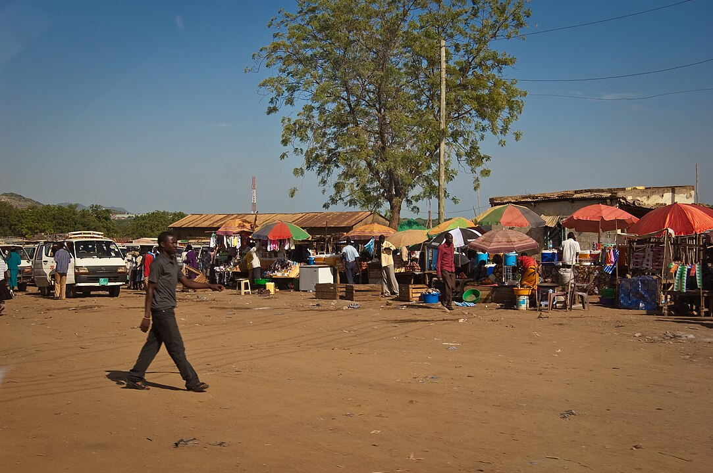

    <h2 class="section-title">{}</h2>
    <ul class="rule-list">
        <li>ドメインは.ss</li>
        <li>ナンバープレートが緑色</li>
    </ul>

{}
{}
{}
南スーダンの国民1人あたりGDPは2024年現在では世界で最も低い部類であり、インフラもまだ整備されていない。首都のJubaでも道路舗装などはほとんど進んでいない{}。
{}

{}
独特な形の茅葺屋根の家が見つかる{}。
{}

<a href="//commons.wikimedia.org/wiki/User:Mr_leroy_playpus" title="User:Mr leroy playpus">Mr leroy playpus</a> - 投稿者自身による著作物, <a href="https://creativecommons.org/licenses/by/4.0" title="Creative Commons Attribution 4.0">CC 表示 4.0</a>, <a href="https://commons.wikimedia.org/w/index.php?curid=148848116">リンク</a>による

{}
{}
