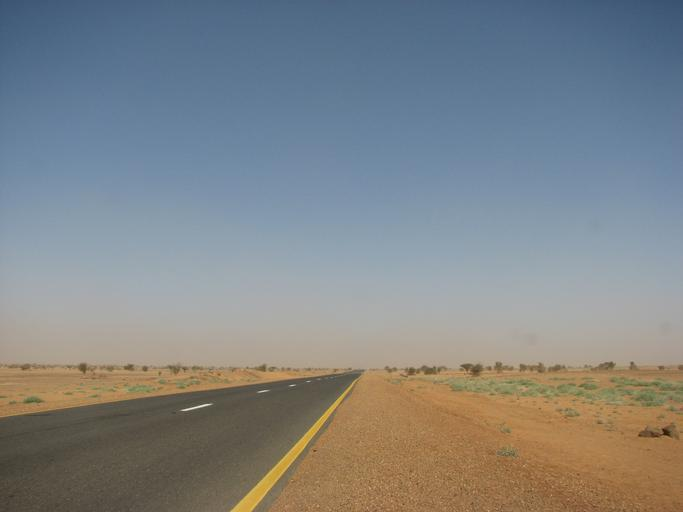
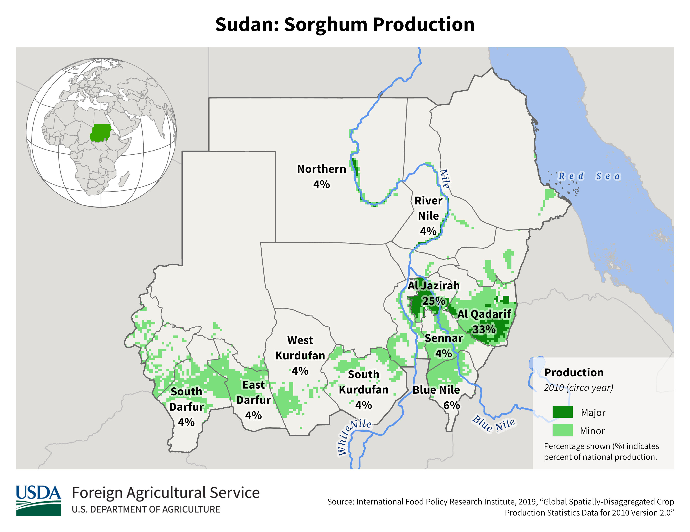

    <h2 class="section-title">{}</h2>
    <ul class="rule-list">
        <li>ドメインは.sd</li>
    </ul>

{}
{}
{}
ほとんどのエリアが標高500ｍ以下の平坦なエリアで構成される{}。
{}

{}
肥沃なナイル川沿いは小麦などの農業が盛ん{}。北側は乾燥しており農業はほとんど行われていない{}。
{}

{}
{}
