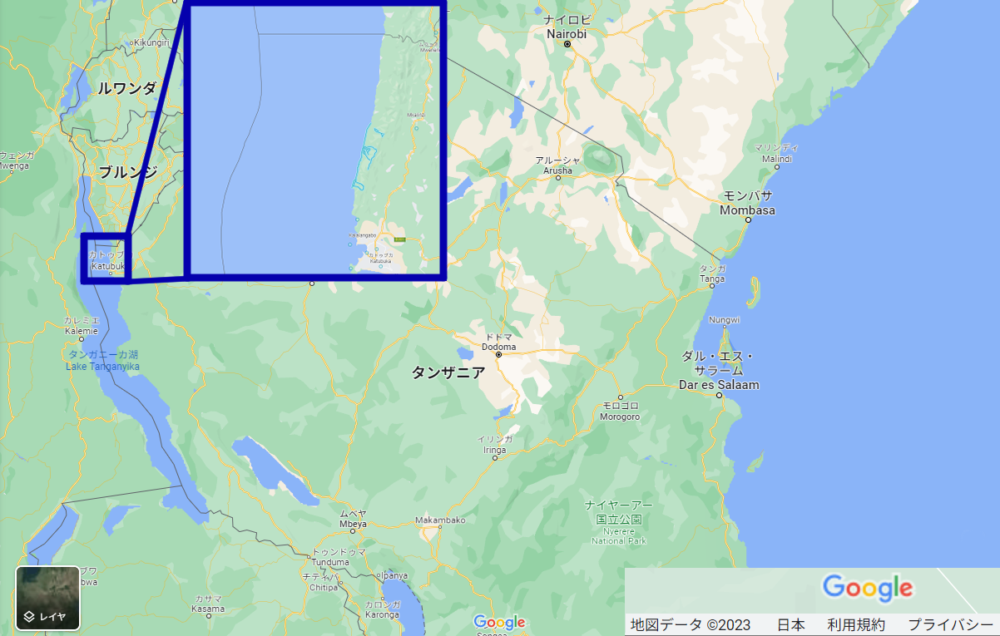

    <h2 class="section-title">{}</h2>
    <ul class="rule-list">
        <li>ドメインは.tz</li>
        <li>ナンバープレートは赤色</li>
        <li>ゴンベ渓流国立公園付近とそれ以外にところどころストリートビューがある</li>
        <li>タンザニア・{}・{}以外では猿は非常に稀と思われる</li>
    </ul>

{}
{}
{}
共通点が少ない上に場所がとびとびなので当てるためには覚える必要がありそう。とりあえず動物がいたら北西の国立公園が可能性高い？
{}

<iframe src="https://www.google.com/maps/embed?pb=!4v1687222166237!6m8!1m7!1sHpICDVPg0AxGBxOAqNx9dA!2m2!1d-4.669323783113501!2d29.62333506254922!3f244.8795270430562!4f-26.238762274455702!5f2.3535105869069004" width="295" height="295" style="border:0;" allowfullscreen="" loading="lazy" referrerpolicy="no-referrer-when-downgrade"></iframe>
<iframe src="https://www.google.com/maps/embed?pb=!4v1683886160271!6m8!1m7!1sn4XUB4cG5nRiVfJuftu5dA!2m2!1d-3.041027899419915!2d37.30021134006131!3f306.8801139271176!4f8.90126208088364!5f0.4000000000000002" width="295" height="295"style="border:0;" allowfullscreen="" loading="lazy" referrerpolicy="no-referrer-when-downgrade"></iframe>

{}
{}
