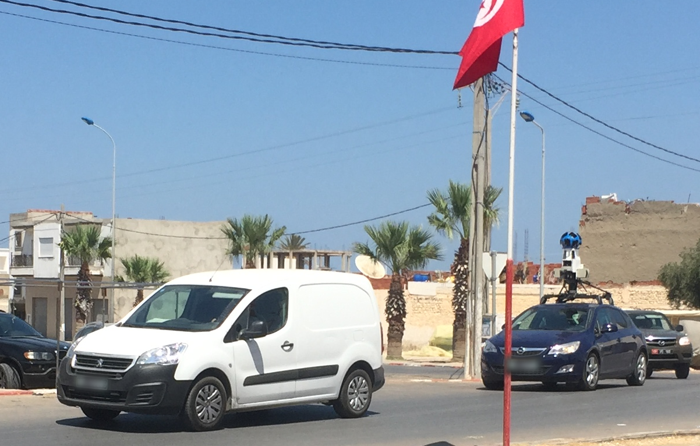

    <h2 class="section-title">{}</h2>
    <ul class="rule-list">
        <li>The domain is .tn.</li>
        <li>Arabic is the official language, but French is also widely used</li>
        <li>Many buildings are painted in bright sky blue and white.</li>
        <li>Black colored license plates.</li>
        <li>There's a follow car.</li>
        <li class="no-evidence">Light blue garbage bags may be dumped on the side of the road.</li>
    </ul>

{}
{}

{}
There are black colored license plates, but there are also a certain number of other colors. And often a black-colored car follows behind a Google Car {}{}.
{}

{}

CC0
{}

{}
Many buildings are light blue and white{}. The curbs and chevrons are also painted white and light blue.{}.
{}

{}
There are poles with distinctive shapes{}.
{}

<iframe src="https://www.google.com/maps/embed?pb=!4v1691034582806!6m8!1m7!1s6pfFY0fxPp7DQ4DCObWJPw!2m2!1d34.41795011414693!2d8.784803930790263!3f73.89126476951427!4f18.394098215577486!5f0.7820865974627469"width="295" height="295" style="border:0;" allowfullscreen="" loading="lazy" referrerpolicy="no-referrer-when-downgrade"></iframe>
<iframe src="https://www.google.com/maps/embed?pb=!4v1691034460708!6m8!1m7!1sxFwEKIkh1gbhDaGgEqvLmA!2m2!1d34.38272769386393!2d7.933106456537871!3f316.0875552465727!4f27.500450130729263!5f3.2491148336711095"width="295" height="295" style="border:0;" allowfullscreen="" loading="lazy" referrerpolicy="no-referrer-when-downgrade"></iframe>

{}
{}

<iframe src="https://www.google.com/maps/embed?pb=!4v1681953774694!6m8!1m7!1s4XMildXpoGm170OX2S-DZw!2m2!1d33.69521001451136!2d10.92834435507702!3f151.11795912549627!4f-29.953854913242736!5f2.6006577211932025" width="295" height="295" style="border:0;" allowfullscreen="" loading="lazy" referrerpolicy="no-referrer-when-downgrade"></iframe>
<iframe src="https://www.google.com/maps/embed?pb=!4v1681955716287!6m8!1m7!1sPEGqq1AsrBhy0D_9ZufIfQ!2m2!1d36.50897427774278!2d10.56847932526787!3f82.34708398462853!4f-13.113885457952321!5f3.325193203789971" width="295" height="295" style="border:0;" allowfullscreen="" loading="lazy" referrerpolicy="no-referrer-when-downgrade"></iframe>

{}
{}
{}
Light blue plastic bags or plastic tape (?) on the side of the road are often discarded.
{}

<iframe src="https://www.google.com/maps/embed?pb=!4v1681955649216!6m8!1m7!1snS76sg90peo5e0VgN0M4ZQ!2m2!1d36.50387532440455!2d10.57159934591823!3f264.17253394104546!4f-2.1982196308240702!5f3.325193203789971" width="295" height="295" style="border:0;" allowfullscreen="" loading="lazy" referrerpolicy="no-referrer-when-downgrade"></iframe>
<iframe src="https://www.google.com/maps/embed?pb=!4v1681953222870!6m8!1m7!1sZHrLI3I2CF6emHZZ4313_w!2m2!1d36.34243648455823!2d10.49046912670282!3f290.25052615167476!4f-13.093862722232046!5f3.325193203789971" width="295" height="295" style="border:0;" allowfullscreen="" loading="lazy" referrerpolicy="no-referrer-when-downgrade"></iframe>
<iframe src="https://www.google.com/maps/embed?pb=!4v1681955855463!6m8!1m7!1s37S59uH-cJ4C_2b5uU_6eQ!2m2!1d33.3701693357303!2d10.67603774597471!3f307.0685628372635!4f-11.875769225353139!5f3.325193203789971" width="295" height="295" style="border:0;" allowfullscreen="" loading="lazy" referrerpolicy="no-referrer-when-downgrade"></iframe>
<iframe src="https://www.google.com/maps/embed?pb=!4v1681955345744!6m8!1m7!1sF6wq2wxe2AVEe_LRlWbyRw!2m2!1d36.94637486571099!2d10.24230059617127!3f225.9276165196549!4f-33.35471988819903!5f3.320468993971933" width="295" height="295" style="border:0;" allowfullscreen="" loading="lazy" referrerpolicy="no-referrer-when-downgrade"></iframe>

{}
{}

{}
<li>By Wicem Kerkeni - Own work, <a href="https://creativecommons.org/licenses/by-sa/4.0" title="Creative Commons Attribution-Share Alike 4.0">CC BY-SA 4.0</a>, <a href="https://commons.wikimedia.org/w/index.php?curid=50338695">Link</a></li>
{}