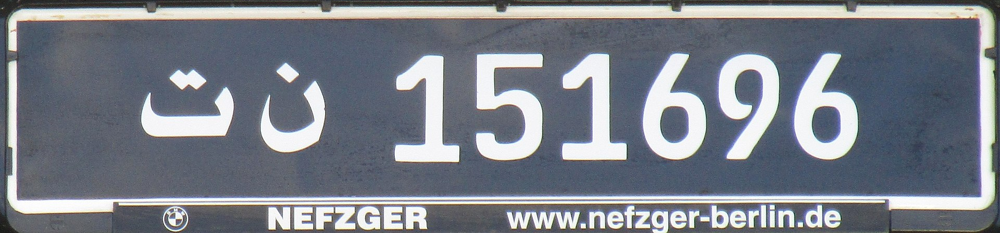

    <h2 class="section-title">{}</h2>
    <ul class="rule-list">
        <li>ドメインは.tn</li>
        <li>鮮やかな水色と白が基調の建物が多い</li>
        <li>黒色のナンバープレートがある</li>
        <li>後ろに車がついてくる</li>
        <li class="no-evidence">道端に水色の袋が棄てられていることが多い？</li>
    </ul>

{}
{}
{}
水色と白が基調の建物が多い
{}

<iframe src="https://www.google.com/maps/embed?pb=!4v1681952455065!6m8!1m7!1so4kSWTxnKva8rIjEjtaAQw!2m2!1d36.81898453666751!2d10.17841320812088!3f136.14983967697648!4f12.291043087516428!5f1.673141042236761" width="295" height="295" style="border:0;" allowfullscreen="" loading="lazy" referrerpolicy="no-referrer-when-downgrade"></iframe>
<iframe src="https://www.google.com/maps/embed?pb=!4v1681952554454!6m8!1m7!1s9B993r6Wu66BpAKhsLnsFA!2m2!1d33.73194343164884!2d10.86552639695403!3f328.94639747780155!4f-6.93048257637227!5f3.325193203789971" width="295" height="295" style="border:0;" allowfullscreen="" loading="lazy" referrerpolicy="no-referrer-when-downgrade"></iframe>
<iframe src="https://www.google.com/maps/embed?pb=!4v1681952644120!6m8!1m7!1sjbW2GNADpmWgQaXTohSADg!2m2!1d33.79207476536821!2d10.92917167393205!3f151.494872864849!4f-5.7632847952252035!5f1.603712625060913" width="295" height="295" style="border:0;" allowfullscreen="" loading="lazy" referrerpolicy="no-referrer-when-downgrade"></iframe>
<iframe src="https://www.google.com/maps/embed?pb=!4v1681955756400!6m8!1m7!1socughxy28q_lu5624j4Zhg!2m2!1d33.39373736558044!2d10.7492652958513!3f251.62461596347816!4f-4.165839557067343!5f3.325193203789971" width="295" height="295" style="border:0;" allowfullscreen="" loading="lazy" referrerpolicy="no-referrer-when-downgrade"></iframe>

{}
黒色のナンバープレートがあるが他の色も一定数いる。そして後ろに車が付いてくることが多い。
{}

<iframe src="https://www.google.com/maps/embed?pb=!4v1685283054269!6m8!1m7!1sgH2xB2SWvbAuWt5JYrRvBw!2m2!1d36.74354439221794!2d10.22877848313951!3f147.74397571933963!4f-5.01514964376284!5f3.325193203789971" width="295" height="295" style="border:0;" allowfullscreen="" loading="lazy" referrerpolicy="no-referrer-when-downgrade"></iframe>

{}

CCC0
{}

{}
{}

<iframe src="https://www.google.com/maps/embed?pb=!4v1681953774694!6m8!1m7!1s4XMildXpoGm170OX2S-DZw!2m2!1d33.69521001451136!2d10.92834435507702!3f151.11795912549627!4f-29.953854913242736!5f2.6006577211932025" width="295" height="295" style="border:0;" allowfullscreen="" loading="lazy" referrerpolicy="no-referrer-when-downgrade"></iframe>
<iframe src="https://www.google.com/maps/embed?pb=!4v1681955716287!6m8!1m7!1sPEGqq1AsrBhy0D_9ZufIfQ!2m2!1d36.50897427774278!2d10.56847932526787!3f82.34708398462853!4f-13.113885457952321!5f3.325193203789971" width="295" height="295" style="border:0;" allowfullscreen="" loading="lazy" referrerpolicy="no-referrer-when-downgrade"></iframe>

{}
{}
{}
後ろから車が付いてくることがある
{}

<iframe src="https://www.google.com/maps/embed?pb=!4v1681953144950!6m8!1m7!1sISZGTSH7TgrxciWKcrUvWA!2m2!1d33.39320568258737!2d10.75218447008934!3f98.0390695491718!4f1.5038326870629959!5f3.325193203789971" width="295" height="295" style="border:0;" allowfullscreen="" loading="lazy" referrerpolicy="no-referrer-when-downgrade"></iframe>

{}
{}
{}
道端に水色の袋かビニールテープ（？）が棄てられていることが多い？
{}

<iframe src="https://www.google.com/maps/embed?pb=!4v1681955649216!6m8!1m7!1snS76sg90peo5e0VgN0M4ZQ!2m2!1d36.50387532440455!2d10.57159934591823!3f264.17253394104546!4f-2.1982196308240702!5f3.325193203789971" width="295" height="295" style="border:0;" allowfullscreen="" loading="lazy" referrerpolicy="no-referrer-when-downgrade"></iframe>
<iframe src="https://www.google.com/maps/embed?pb=!4v1681953222870!6m8!1m7!1sZHrLI3I2CF6emHZZ4313_w!2m2!1d36.34243648455823!2d10.49046912670282!3f290.25052615167476!4f-13.093862722232046!5f3.325193203789971" width="295" height="295" style="border:0;" allowfullscreen="" loading="lazy" referrerpolicy="no-referrer-when-downgrade"></iframe>
<iframe src="https://www.google.com/maps/embed?pb=!4v1681955855463!6m8!1m7!1s37S59uH-cJ4C_2b5uU_6eQ!2m2!1d33.3701693357303!2d10.67603774597471!3f307.0685628372635!4f-11.875769225353139!5f3.325193203789971" width="295" height="295" style="border:0;" allowfullscreen="" loading="lazy" referrerpolicy="no-referrer-when-downgrade"></iframe>
<iframe src="https://www.google.com/maps/embed?pb=!4v1681955345744!6m8!1m7!1sF6wq2wxe2AVEe_LRlWbyRw!2m2!1d36.94637486571099!2d10.24230059617127!3f225.9276165196549!4f-33.35471988819903!5f3.320468993971933" width="295" height="295" style="border:0;" allowfullscreen="" loading="lazy" referrerpolicy="no-referrer-when-downgrade"></iframe>

{}
{}