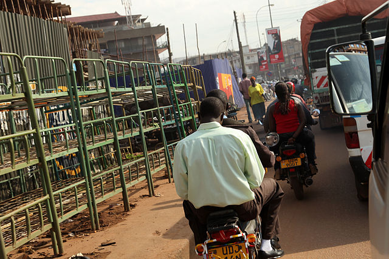
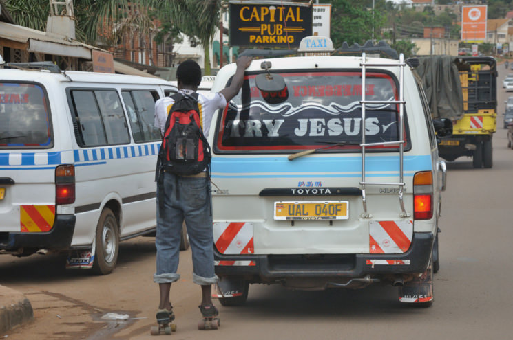
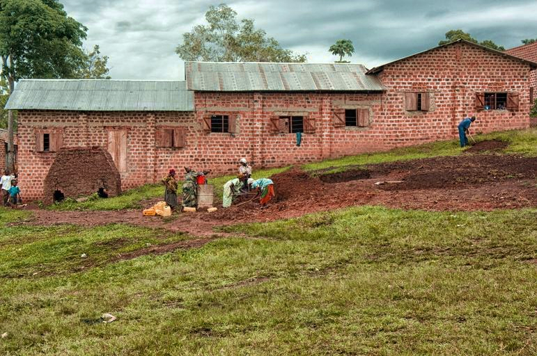
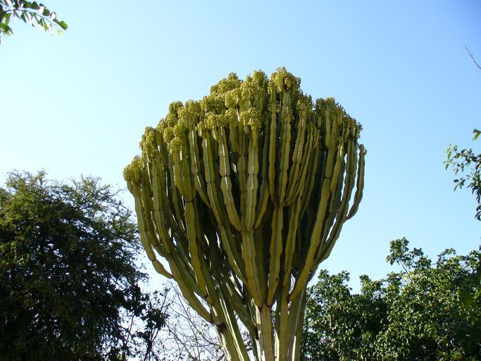

    <h2 class="section-title">{}</h2>
    <ul class="rule-list">
        <li>車は左側通行</li>
        <li>ドメインは.ug</li>
        <li>車の後ろに大きめの黄色いナンバープレートがある</li>
        <li class="no-evidence">家は基本木とレンガでできており玄関にカーテンがかかっていることが多い</li>
        <li class="no-evidence">電柱に☠のマークがある</li>
        <li>Google Carが特徴的</li>
    </ul>

{}
{}

{}
旧{}植民地だった影響が残っており、左側通行かつ車の後ろに黄色ナンバープレートが見つかる{}。白いナンバープレートも多い。
{}

{}
水色の縞模様があるバンはタクシー（もしくは乗り合いバス）でこれも道路でよく見かける{}{}。
{}

{}
家は木やレンガでできており{}、町中にも赤茶色の土が広がっている{}{}。
{}

{}
白い車{}か金属製のバーが見えることが多い。バーが見える場合は首都以外の郊外（国立公園内部）。
{}

<iframe src="https://www.google.com/maps/embed?pb=!4v1680370837232!6m8!1m7!1sniqw2yIcTBIRbvWGbFw6Kw!2m2!1d0.3644098926388094!2d32.71017363529652!3f276.54098798599324!4f-46.77109442191421!5f1.3383447699970703" width="295" height="295" style="border:0;" allowfullscreen="" loading="lazy" referrerpolicy="no-referrer-when-downgrade"></iframe>
<iframe src="https://www.google.com/maps/embed?pb=!4v1688884915957!6m8!1m7!1sJ0aANAxcmOhkPb969Ioaew!2m2!1d3.736418720814267!2d33.72957892182205!3f10.991069524961084!4f-28.11935280492407!5f2.7220566599232603" width="295" height="295" style="border:0;" allowfullscreen="" loading="lazy" referrerpolicy="no-referrer-when-downgrade"></iframe>

{}
{}

{}
電柱に☠のマークがある
{}

<iframe src="https://www.google.com/maps/embed?pb=!4v1681487465264!6m8!1m7!1sERB4GwItoUiPxb5_GhJpYA!2m2!1d0.2597360773807452!2d32.62400203457052!3f345.6188386334501!4f-5.6955029058065065!5f3.325193203789971" width="295" height="295" style="border:0;" allowfullscreen="" loading="lazy" referrerpolicy="no-referrer-when-downgrade"></iframe>
<iframe src="https://www.google.com/maps/embed?pb=!4v1681487552885!6m8!1m7!1sTd2kGulIAr9q98L0Xp8lcg!2m2!1d0.2614485148265462!2d32.62049893724982!3f352.97527258587843!4f-4.419233665414339!5f3.3050553876225863" width="295" height="295" style="border:0;" allowfullscreen="" loading="lazy" referrerpolicy="no-referrer-when-downgrade"></iframe>

{}
{}
{}
国立公園でたまに見る木{}。チュウテンカクと呼ぶらしい。
{}

{}
{}