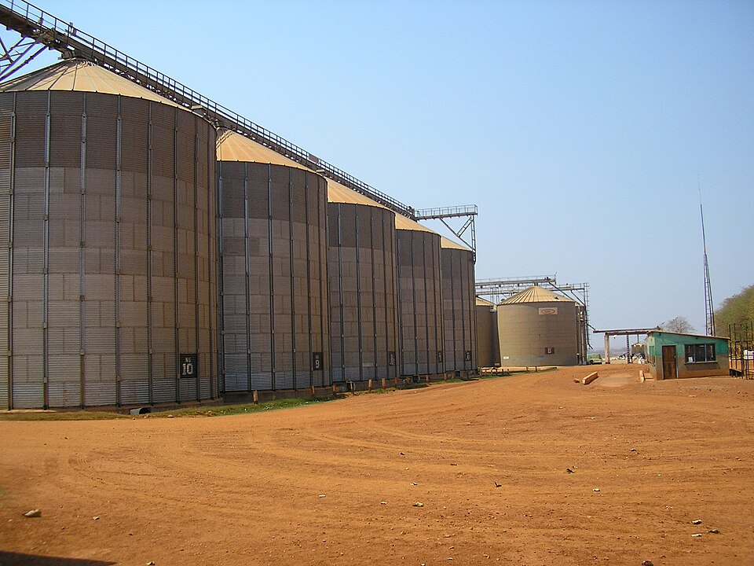

    <h2 class="section-title">{}</h2>
    <ul class="rule-list">
        <li class="no-evidence">公式ストリートビューは無い</li>
    </ul>

{}
{}
{}
2000年代後半から農業が盛んになっており食糧自給率は140%を超える。農園やセンターピボットが見つかる{}。
{}

{}
郊外には茅葺屋根の家が多く見つかる。
{}

{}
{}
