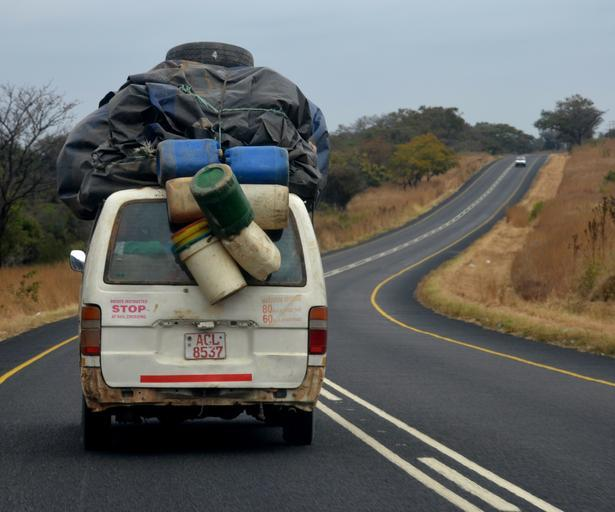
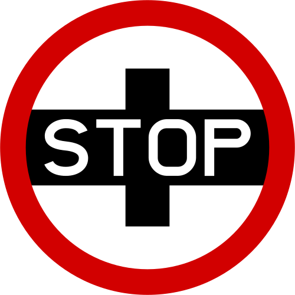

    <h2 class="section-title">{}</h2>
    <ul class="rule-list">
        <li class="no-evidence">公式ストリートビューは無い</li>
    </ul>
    {}

{}
{}
{}
黄色か赤色のナンバープレート。
{}

{}
STOPの標識が独特？古いデザインらしくあまり一般的ではないらしい。
{}

{}
{}
