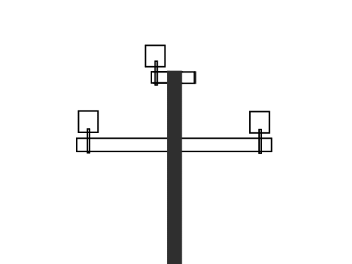

    <h2 class="section-title">{}</h2>
    <ul class="rule-list">
        <li>Street View is available on North, South, and Little Andaman Islands, which are part of the Union Territory of Andaman and Nicobar Islands in India.</li>
    </ul>

{}
{}
{}In areas with low hills and coconut trees growing by the roadside.{}. The highest point, Saddle Peak, is around 700 meters high but has no nearby roads.{}.
{}

{}
Although no recent data is available, per capita GDP is relatively high within India. Like Goa and Kerala, many two- or three-story houses are found.{}{}.
{}

{}
Utility poles have black labels.{}.
{}

<a href="//commons.wikimedia.org/wiki/User:Vinayaraj" title="User:Vinayaraj">Vinayaraj</a> - Own work, <a href="https://creativecommons.org/licenses/by-sa/4.0" title="Creative Commons Attribution-Share Alike 4.0">CC BY-SA 4.0</a>, <a href="https://commons.wikimedia.org/w/index.php?curid=148712667">Link</a>

{}
The upper parts look like this.{}
{}

{}
The region has a tropical monsoon climate, with tall coconut trees found in suburban areas.{}. These also grow in mainland regions with heavy rainfall (e.g., Assam, Kerala, Goa).
{}

{}
{}

{}
Flag image: By Flag Creator - Own work, CC BY-SA 4.0, https://commons.wikimedia.org/w/index.php?curid=129290377
{}
