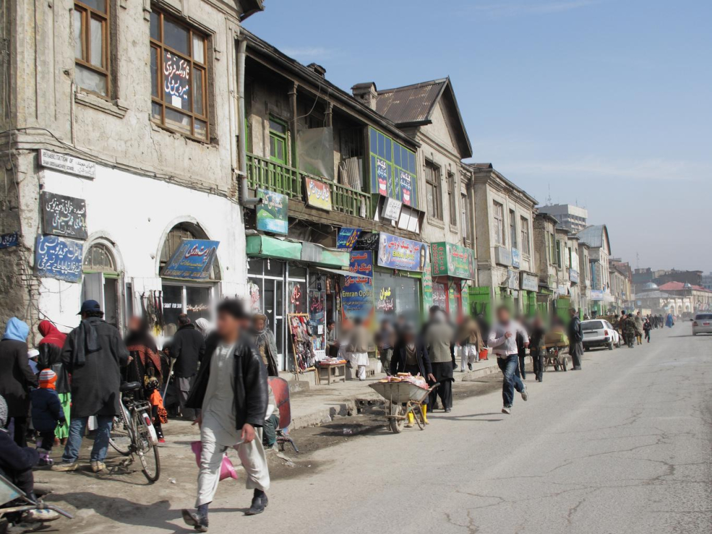
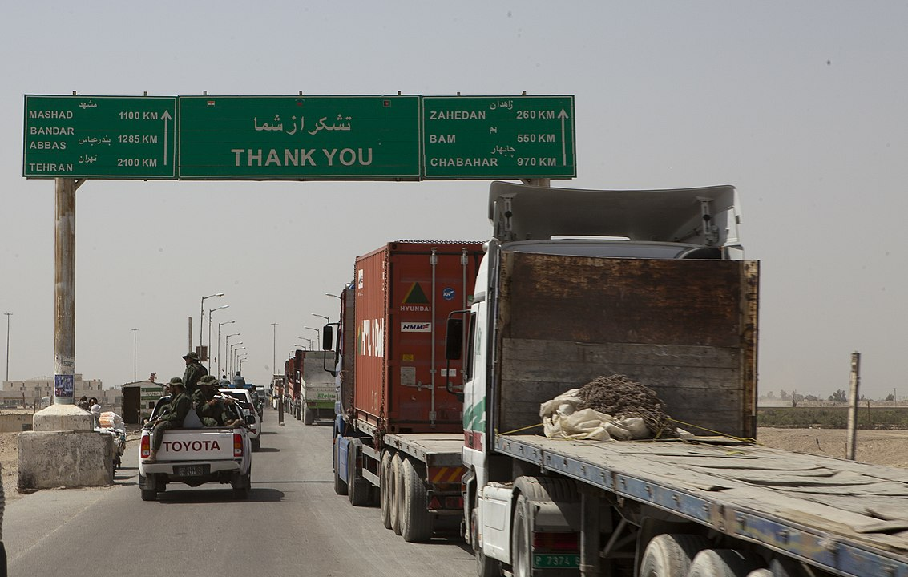
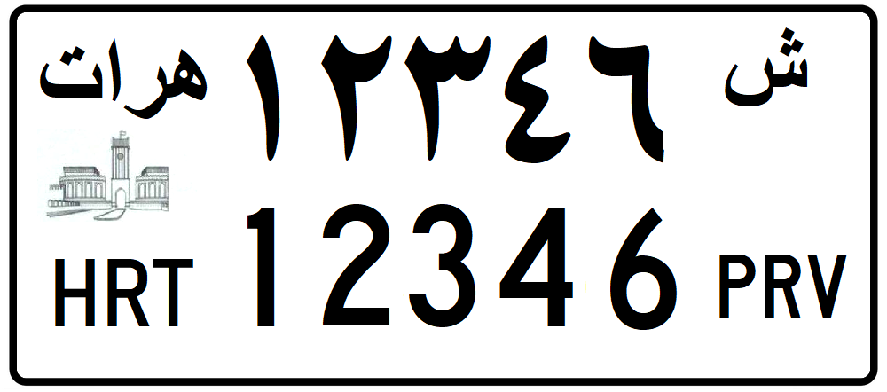
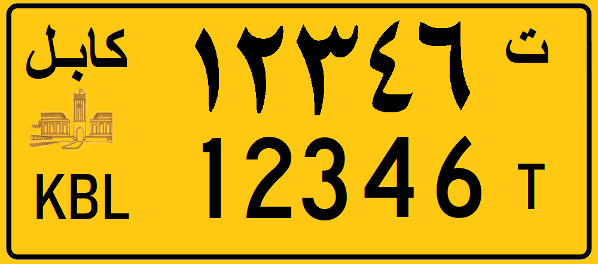

    <h2 class="section-title">{}</h2>
    <ul class="rule-list">
        <li class="no-evidence">Kemungkinan besar tidak muncul sebagai soal</li>
        <li>Bahasa resmi adalah Bahasa Dari (دری) dan Pashto (پښتو)</li>
        <li>Foto diambil menggunakan kamera tripod{}</li>
    </ul>

{}
{}

{}
Terdapat beberapa cakupan resmi yang tidak ditampilkan di peta{}。
{}

{}
Plat nomor kendaraan berwarna putih. Bus dan taksi menggunakan plat nomor berwarna kuning.
{}

{}

{}

{}

{}

{}
{}
