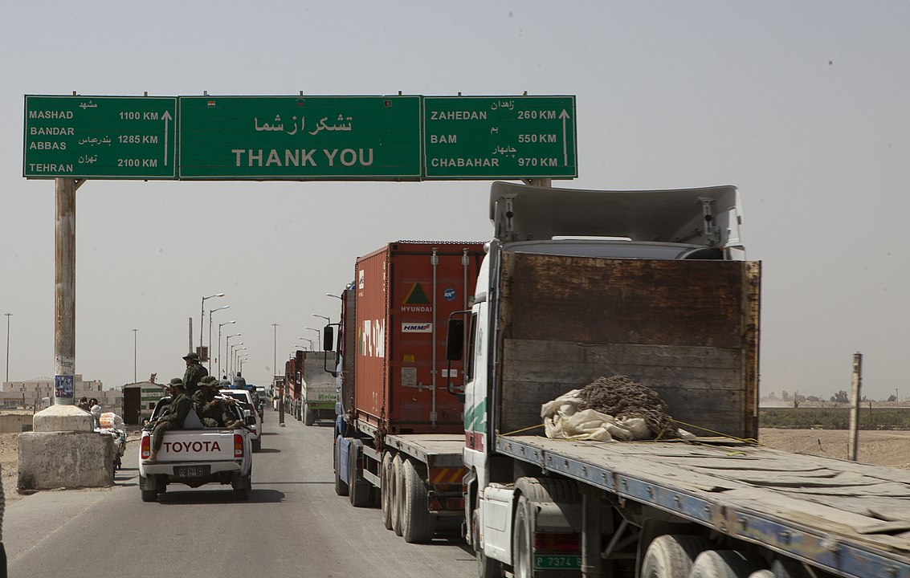
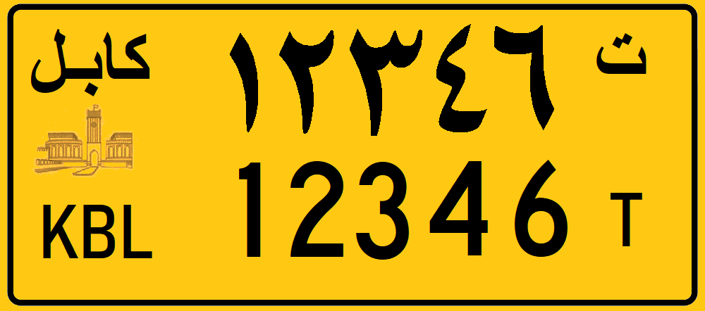

    <h2 class="section-title">{}</h2>
    <ul class="rule-list">
        <li class="no-evidence">出題されないと思われる</li>
        <li>公用語はダリー語（دری）やパシュトー語（پښتو）</li>
        <li>三脚カメラで撮影されている{}</li>
    </ul>

{}
{}

{}
マップ上に表示されていない公式カバレッジが複数ある{}。
{}

{}
車は白色のナンバープレート。バスやタクシーは黄色のナンバープレート。
{}

{}

{}

{}

{}

{}
{}