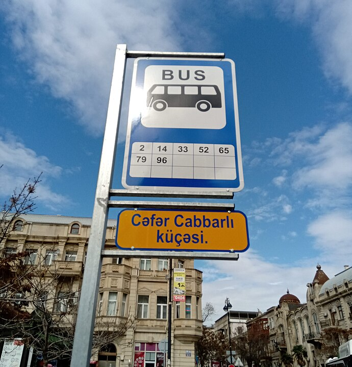
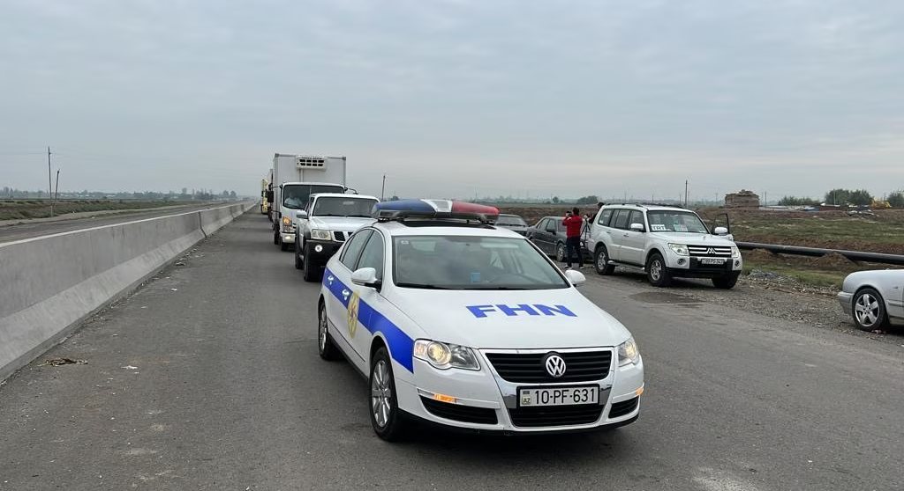
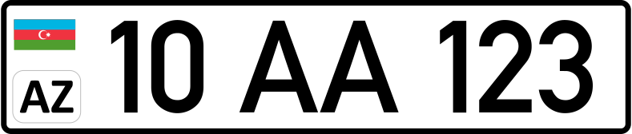

    <h2 class="section-title">{}</h2>
    <ul class="rule-list">
        <li>現在公式のストリートビューが無くGeoguessrでは出題されない</li>
        <li>トルコ語に似たアゼルバイジャン語が公用語となっている</li>
    </ul>
    {}

{}
{}
{}
アゼルバイジャン語が使用されている。
{}

{}
バクー油田があり、ガスや原油のパイプラインがある。2019年の時点では輸出の90%以上は資源関係だった（下図）。
{}

{}
左上に国旗が小さく描かれているナンバープレート。
{}

{}

CC0
{}

{}
平べったいシェブロン。ボラードは{}・{}・{}などにありそうなものが写っておりどれが一番多いのかは不明{}。
{}

By <a rel="nofollow" class="external text" href="https://president.az/">President.az</a>, <a href="https://creativecommons.org/licenses/by/4.0" title="Creative Commons Attribution 4.0">CC BY 4.0</a>, <a href="https://commons.wikimedia.org/w/index.php?curid=112360299">Link</a>

{}
{}