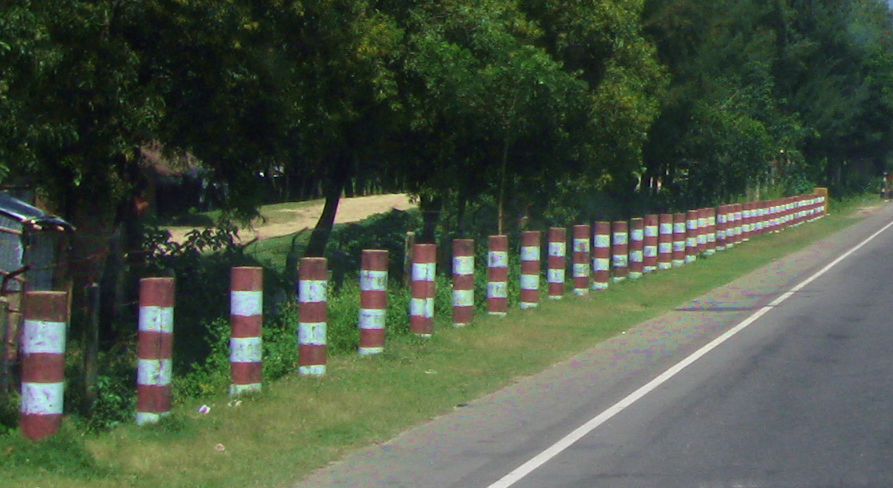
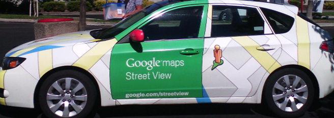
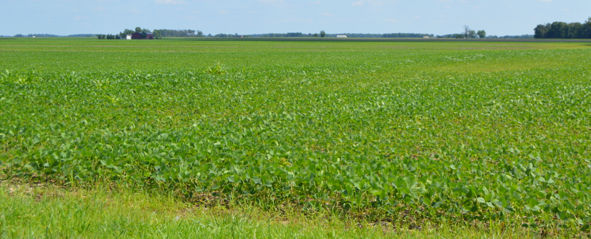

    <h2 class="section-title">{}</h2>
    <ul class="rule-list">
        <li>Cars drive on the left side of the road.</li>
        <li>Bengali script (বাংলা লিপি) is visible, characterized by the ◁ shape.</li>
        <li>Commercial vehicles have green license plates.</li>
        <li>There are signs with black and white stripes, similar to those in Bhutan nearby.</li>
        <li>There are many bollards with red and white stripes, often found near bridges.</li>
        <li>Baby taxis and CNG rickshaws are running{}.</li>
        <li>Google Car is distinctive.</li>
    </ul>
    {}

{}
{}

{}
Red and white striped bollards {}{}.
{}

{}
Commercial vehicles have green colored license plates and ordinary passenger cars are white. The CNG rickshaws shaped like tuk-tuks are also distinctive, and they too have green-colored license plates.{}.
{}

{}

{}

{}
GoogleCar in Bangladesh can be red outside and green in the mirror.
{}

<iframe src="https://www.google.com/maps/embed?pb=!4v1679241217157!6m8!1m7!1sl3OsNKZrdERhKWo0dDIGGA!2m2!1d22.71288525097118!2d90.35422200087513!3f280.85811143171856!4f-39.81621495433588!5f1.5966149083906154" width="400px" height="295" style="border:0;" allowfullscreen="" loading="lazy" referrerpolicy="no-referrer-when-downgrade"></iframe>

{}
{}
{}
There is a black and white striped pole sign.
{}

<iframe src="https://www.google.com/maps/embed?pb=!4v1680636944258!6m8!1m7!1smJsoGdfYYvgB3ENtAEcrDA!2m2!1d24.95523765493552!2d90.06311100033894!3f104.90316314976357!4f-6.4727045617172365!5f3.325193203789971" width="295" height="295" style="border:0;" allowfullscreen="" loading="lazy" referrerpolicy="no-referrer-when-downgrade"></iframe>

{}
{}

<iframe src="https://www.google.com/maps/embed?pb=!4v1679241582191!6m8!1m7!1s6iXV90VDdr7OJA-SkG_2Vw!2m2!1d22.71565999752092!2d90.34815033393228!3f122.80913832733765!4f-5.318716883276579!5f2.895806465883662" width="595" height="295" style="border:0;" allowfullscreen="" loading="lazy" referrerpolicy="no-referrer-when-downgrade"></iframe>

{}
{}

<iframe src="https://www.google.com/maps/embed?pb=!4v1680636883546!6m8!1m7!1sPg9qU6trE5lkww7uEB-1nA!2m2!1d24.95523837209997!2d90.06248002367622!3f109.9835643660783!4f-16.711091103752253!5f2.776743398340463" width="295" height="295" style="border:0;" allowfullscreen="" loading="lazy" referrerpolicy="no-referrer-when-downgrade"></iframe>
<iframe src="https://www.google.com/maps/embed?pb=!4v1679316439962!6m8!1m7!1sdmYvG2XkifNSiDi7PAQ0Mw!2m2!1d23.38225915977607!2d90.21923277387768!3f1.1454390496104359!4f-7.479103567159129!5f0.7588358809536506" width="295" height="295" style="border:0;" allowfullscreen="" loading="lazy" referrerpolicy="no-referrer-when-downgrade"></iframe>

{}
{}
{}
Bengali is the main language used in Bangladesh
{}

<table class="word-list">
<tr>
    <th>language-name</th> <th>writing</th>
</tr>
<tr><td>English</td><td>Japanese Restaurant</td></tr>
<tr><td>Japanese</td><td>日本料理レストラン</td></tr>
<tr><td>Sinhalese</td><td>ජපන් අවන්හල</td></tr>
<tr><td>Assamese</td><td>জাপানীজ ৰেষ্টুৰেণ্ট</td></tr>
<tr><td>Kannada</td><td>ಜಪಾನೀಸ್ ರೆಸ್ಟೋರೆಂಟ್</td></tr>
<tr><td>Gujarati</td><td>જાપાનીઝ રેસ્ટોરન્ટ</td></tr>
<tr><td>Tamil</td><td>ஜப்பானிய உணவகம்</td></tr>
<tr><td>Bengali</td><td>জাপানি রেস্তোরা</td></tr>
<tr><td>Hindi</td><td>जापानी रेस्टोरेंट</td></tr>
<tr><td>Khmer</td><td>ភោជនីយដ្ឋានជប៉ុន</td></tr>
<tr><td>Lao</td><td>ຮ້ານອາຫານຍີ່ປຸ່ນ</td></tr>
<tr><td>Thai</td><td>ร้านอาหารญี่ปุ่น</td></tr>
</table>

{}
{}

    <h2 class="section-title">{}</h2>
    <ul class="rule-list">
        <li>I don't know, they all look the same.</li>
        <li class="no-evidence">If you see a soybean-like field, you might be in the middle of Dhaka and Chittagong (road number Z14~ area).</li>
    </ul>

{}
{}

{}
(I am not sure this is soybeans.) Over 90% of soybeans are grown between Dhaka and Chittagong. Below is an image of a soybean field in the U.S. for reference.
{}

<iframe src="https://www.google.com/maps/embed?pb=!4v1686997224332!6m8!1m7!1smbgUH_ld56nAP0CX86OYyQ!2m2!1d22.89854130233651!2d91.01574225907122!3f168.52047113755174!4f-12.702088935898928!5f3.325193203789971" width="295" height="295" style="border:0;" allowfullscreen="" loading="lazy" referrerpolicy="no-referrer-when-downgrade"></iframe>
<iframe src="https://www.google.com/maps/embed?pb=!4v1686997450660!6m8!1m7!1szWGSG8Pbh2oqBVPY_RdgQg!2m2!1d23.03944280277026!2d91.06665364307712!3f190.57993983921108!4f-24.817397852552673!5f2.597246253790518" width="295" height="295" style="border:0;" allowfullscreen="" loading="lazy" referrerpolicy="no-referrer-when-downgrade"></iframe>

{}
{}

    <h2 class="section-title">{}</h2>
    <ul class="rule-list">
        <li>The name of the town is often written on the corner of the Dhaka Bank or Dutch-Bangla Bank sign. If you know the approximate area, this will give you a clue.</li>
        <li>St. Maarten is covered by a guard band and rickshaws and concrete roads are visible.</li>
    </ul>

{}
{}

{}
When you see signs for Dhaka Bank or Dutch-Bangla Bank, one side should have the town name written in <b>English</b>, so you should be able to read it. The other side is in Bengali, which can be difficult to read.
{}

<iframe src="https://www.google.com/maps/embed?pb=!4v1686994393766!6m8!1m7!1sAKCMZ849l84xlLXb9UkmLA!2m2!1d22.34095927213221!2d91.78218672196242!3f61.96411249464136!4f9.877375231188637!5f3.2406016393794856" width="400" height="250" style="border:0;" allowfullscreen="" loading="lazy" referrerpolicy="no-referrer-when-downgrade"></iframe>

{}
{}

{}
As Wikipedia states, there is no other form of transportation to be found on the island except for rickshaws{{% ref "https://en.wikipedia.org/wiki/St._Martin%27s_Island" "St. Martin's Island" %}}. If there is only a concrete road with a rickshaw, even if the guard is not visible, there is an excellent possibility of this island.
{}

<iframe src="https://www.google.com/maps/embed?pb=!4v1692119000479!6m8!1m7!1spNqROJ_V9GROmW5qH7_vkQ!2m2!1d20.62803158382999!2d92.32095957462462!3f226.65849236850536!4f-8.690996371538347!5f1.0879153149066227" width="295" height="295" style="border:0;" allowfullscreen="" loading="lazy" referrerpolicy="no-referrer-when-downgrade"></iframe>
<iframe src="https://www.google.com/maps/embed?pb=!4v1692119206688!6m8!1m7!1so5SpRVfebhPluF1xb_clbQ!2m2!1d20.63363305789751!2d92.32847888487527!3f327.4734011505491!4f1.0684169611689498!5f0.7820865974627469" width="295" height="295" style="border:0;" allowfullscreen="" loading="lazy" referrerpolicy="no-referrer-when-downgrade"></iframe>

{}
{}

{}
<li>By <a href="https://en.wikipedia.org/wiki/User:TawsifSalam" class="extiw" title="wikipedia:User:TawsifSalam">Mohammed Tawsif Salam</a> - Own work, <a href="https://creativecommons.org/licenses/by-sa/3.0" title="Creative Commons Attribution-Share Alike 3.0">CC BY-SA 3.0</a>, <a href="https://commons.wikimedia.org/w/index.php?curid=7990579">Link</a>, edited</li>
{}
