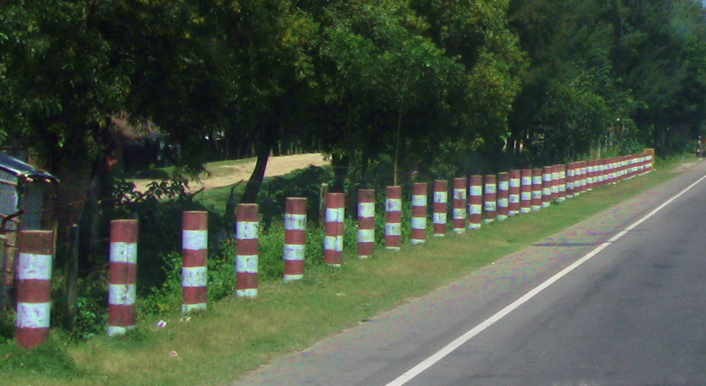

    <h2 class="section-title">{}</h2>
    <ul class="rule-list">
        <li>Lalu lintas di sisi kiri</li>
        <li>Bahasa Bengali (বাংলা লিপি) terlihat, dengan bentuk khas seperti ◁</li>
        <li>Kendaraan komersial menggunakan plat nomor berwarna hijau</li>
        <li>Rambu tiang bergaris hitam dan putih, juga terlihat di Bhutan</li>
        <li>Banyak bollard dengan pola garis merah dan putih, sering ditemukan di dekat jembatan</li>
        <li>Bayi taksi atau CNG rickshaw sering terlihat{}{}</li>
        <li>GoogleCar di Bangladesh kadang memiliki eksterior merah dengan cermin hijau</li>
        <li>Logo Dhaka Bank mungkin terlihat</li>
    </ul>
    {}

{}
{}

{}
Bahasa Bengali digunakan{}. Bentuk seperti ◁, misalnya pada ‘বাং’, adalah ciri khasnya.
{}

{}
Bollard dengan pola garis merah dan putih{}. Sering ditemukan berjejer di kedua sisi jalan dekat jembatan{}.
{}

{}
Kendaraan komersial menggunakan plat nomor berwarna hijau{}, sedangkan kendaraan pribadi berwarna putih.
{}

{}

{}

{}
CNG rickshaw berbentuk seperti tuk-tuk adalah ciri khas lain{}. Kendaraan ini juga menggunakan plat nomor hijau{}.
{}

By <a href="//commons.wikimedia.org/wiki/User:Ibrahim_Husain_Meraj" title="User:Ibrahim Husain Meraj">Ibrahim Husain Meraj</a> - Karya sendiri, <a href="https://creativecommons.org/licenses/by-sa/4.0" title="Creative Commons Attribution-Share Alike 4.0">CC BY-SA 4.0</a>, <a href="https://commons.wikimedia.org/w/index.php?curid=65612598">Link</a>

{}
GoogleCar di Bangladesh terkadang memperlihatkan cermin merah{} (lihat contoh).
{}

{}
{}
{}
Tiang dengan pola garis hitam dan putih adalah salah satu ciri khasnya.
{}

<iframe src="https://www.google.com/maps/embed?pb=!4v1680636944258!6m8!1m7!1smJsoGdfYYvgB3ENtAEcrDA!2m2!1d24.95523765493552!2d90.06311100033894!3f104.90316314976357!4f-6.4727045617172365!5f3.325193203789971" width="295" height="295" style="border:0;" allowfullscreen="" loading="lazy" referrerpolicy="no-referrer-when-downgrade"></iframe>

{}
{}

<iframe src="https://www.google.com/maps/embed?pb=!4v1679241582191!6m8!1m7!1s6iXV90VDdr7OJA-SkG_2Vw!2m2!1d22.71565999752092!2d90.34815033393228!3f122.80913832733765!4f-5.318716883276579!5f2.895806465883662" width="595" height="295" style="border:0;" allowfullscreen="" loading="lazy" referrerpolicy="no-referrer-when-downgrade"></iframe>

{}
{}

<iframe src="https://www.google.com/maps/embed?pb=!4v1680636883546!6m8!1m7!1sPg9qU6trE5lkww7uEB-1nA!2m2!1d24.95523837209997!2d90.06248002367622!3f109.9835643660783!4f-16.711091103752253!5f2.776743398340463" width="295" height="295" style="border:0;" allowfullscreen="" loading="lazy" referrerpolicy="no-referrer-when-downgrade"></iframe>
<iframe src="https://www.google.com/maps/embed?pb=!4v1679316439962!6m8!1m7!1sdmYvG2XkifNSiDi7PAQ0Mw!2m2!1d23.38225915977607!2d90.21923277387768!3f1.1454390496104359!4f-7.479103567159129!5f0.7588358809536506" width="295" height="295" style="border:0;" allowfullscreen="" loading="lazy" referrerpolicy="no-referrer-when-downgrade"></iframe>

{}
{}
{}
Bahasa Bengali adalah bahasa utama yang digunakan di Bangladesh.
{}

<table class="word-list">
<tr>
    <th>Nama Bahasa</th> <th>Tulisan</th>
</tr>
<tr><td>Jepang</td><td>日本料理レストラン</td></tr>
<tr><td>Sinhala</td><td>ජපන් අවන්හල</td></tr>
<tr><td>Assam</td><td>জাপানীজ ৰেষ্টুৰেণ্ট</td></tr>
<tr><td>Kannada</td><td>ಜಪಾನೀಸ್ ರೆಸ್ಟೋರೆಂಟ್</td></tr>
<tr><td>Gujarati</td><td>જાપાનીઝ રેસ્ટોરન્ટ</td></tr>
<tr><td>Tamil</td><td>ஜப்பானிய உணவகம்</td></tr>
<tr><td>Telugu</td><td>జపనీస్ రెస్టారెంట్</td></tr>
<tr><td>Bengali</td><td>জাপানি রেস্তোরা</td></tr>
<tr><td>Hindi</td><td>जापानी रेस्टोरेंट</td></tr>
<tr><td>Khmer</td><td>ភោជនីយដ្ឋានជប៉ុន</td></tr>
<tr><td>Lao</td><td>ຮ້ານອາຫານຍີ່ປຸ່ນ</td></tr>
<tr><td>Thai</td><td>ร้านอาหารญี่ปุ่น</td></tr>
</table>

{}
{}

    <h2 class="section-title">{}</h2>
    <ul class="rule-list">
        <li><s>Tidak tahu, semuanya terlihat sama</s></li>
        <li class="no-evidence">Jika menemukan ladang yang terlihat seperti kedelai, coba cari di wilayah antara Dhaka dan Chittagong (di sekitar jalan dengan nomor Z14～).</li>
    </ul>

{}
{}

{}
Lebih dari 90% kedelai diproduksi di wilayah antara Dhaka dan Chittagong {}.
{}

{}
{}

    <h2 class="section-title">{}</h2>
    <ul class="rule-list">
        <li>Papan nama Dhaka Bank atau Dutch-Bangla Bank sering mencantumkan nama kota di sudutnya. Jika Anda mengetahui perkiraan wilayahnya, ini bisa menjadi petunjuk.</li>
        <li>Di Pulau St. Martin, Anda dapat melihat pengawal keamanan, becak manusia, dan jalan beton.</li>
    </ul>

{}
{}

{}
Ketika Anda melihat papan nama Dhaka Bank atau Dutch-Bangla Bank, salah satu sisinya biasanya mencantumkan nama kota dalam <b>bahasa Inggris</b>, sehingga dapat dibaca. Sisi lainnya mungkin dalam bahasa Bengali, yang mungkin sulit dibaca.
{}

<iframe src="https://www.google.com/maps/embed?pb=!4v1686994393766!6m8!1m7!1sAKCMZ849l84xlLXb9UkmLA!2m2!1d22.34095927213221!2d91.78218672196242!3f61.96411249464136!4f9.877375231188637!5f3.2406016393794856" width="400" height="250" style="border:0;" allowfullscreen="" loading="lazy" referrerpolicy="no-referrer-when-downgrade"></iframe>

{}
{}

{}
Seperti yang disebutkan di Wikipedia, tidak ada kendaraan lain selain becak manusia di pulau ini {{% ref "https://en.wikipedia.org/wiki/St._Martin%27s_Island" "St. Martin's Island" %}}. Bahkan di lokasi tanpa pengawal keamanan, jika Anda melihat becak manusia dan jalan beton, kemungkinan besar itu adalah pulau ini.
{}

<iframe src="https://www.google.com/maps/embed?pb=!4v1692119000479!6m8!1m7!1spNqROJ_V9GROmW5qH7_vkQ!2m2!1d20.62803158382999!2d92.32095957462462!3f226.65849236850536!4f-8.690996371538347!5f1.0879153149066227" width="295" height="295" style="border:0;" allowfullscreen="" loading="lazy" referrerpolicy="no-referrer-when-downgrade"></iframe>
<iframe src="https://www.google.com/maps/embed?pb=!4v1692119206688!6m8!1m7!1so5SpRVfebhPluF1xb_clbQ!2m2!1d20.63363305789751!2d92.32847888487527!3f327.4734011505491!4f1.0684169611689498!5f0.7820865974627469" width="295" height="295" style="border:0;" allowfullscreen="" loading="lazy" referrerpolicy="no-referrer-when-downgrade"></iframe>

{}
{}

{}
<li>By <a href="https://en.wikipedia.org/wiki/User:TawsifSalam" class="extiw" title="wikipedia:User:TawsifSalam">Mohammed Tawsif Salam</a> - Karya pribadi, <a href="https://creativecommons.org/licenses/by-sa/3.0" title="Creative Commons Attribution-Share Alike 3.0">CC BY-SA 3.0</a>, <a href="https://commons.wikimedia.org/w/index.php?curid=7990579">Link</a>, gambar telah diedit untuk ditampilkan</li>
{}
