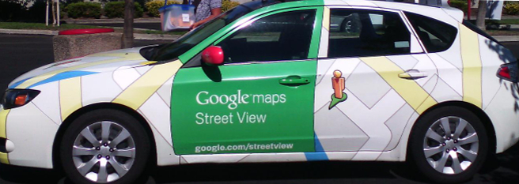

    <h2 class="section-title">{}</h2>
    <ul class="rule-list">
        <li>車は左側通行</li>
        <li>ベンガル語（বাংলা লিপি）が見られる。◁の形が特徴的。</li>
        <li>商用車に緑色のナンバープレートがある</li>
        <li>黒と白の縞模様のポールの標識がある、すぐ近くのブータンも同じ。</li>
        <li>赤と白の縞模様のボラードが多い。橋の近くに並んでいることが多い。</li>
        <li>ベイビータクシーやCNGリキシャが走っている{}{}</li>
        <li>バングラディシュのGoogleCarは外が赤色で鏡に緑色が映っていることがある</li>
        <li>Dhaka bankのロゴがあるかも</li>
    </ul>
    {}

{}
{}

{}
ベンガル文字が使用されている{}。
{}

{}
赤と白の縞模様のボラード{}。橋の近くの道の両サイドにたくさん並んでいることが多い{}。
{}

{}
商用車は緑色のナンバープレート{}で一般乗用車は白色。トゥクトゥクのような形をしたCNGリキシャも特徴的で、これも緑色のナンバープレートを付けている{}。
{}

{}

{}

{}
バングラディシュのGoogleCarは赤色のミラーが映っていることがある{}（例を参照してください）
{}

{}
{}
{}
黒と白の縞模様のポールの標識がある。
{}

<iframe src="https://www.google.com/maps/embed?pb=!4v1680636944258!6m8!1m7!1smJsoGdfYYvgB3ENtAEcrDA!2m2!1d24.95523765493552!2d90.06311100033894!3f104.90316314976357!4f-6.4727045617172365!5f3.325193203789971" width="295" height="295" style="border:0;" allowfullscreen="" loading="lazy" referrerpolicy="no-referrer-when-downgrade"></iframe>

{}
{}

<iframe src="https://www.google.com/maps/embed?pb=!4v1679241582191!6m8!1m7!1s6iXV90VDdr7OJA-SkG_2Vw!2m2!1d22.71565999752092!2d90.34815033393228!3f122.80913832733765!4f-5.318716883276579!5f2.895806465883662" width="595" height="295" style="border:0;" allowfullscreen="" loading="lazy" referrerpolicy="no-referrer-when-downgrade"></iframe>

{}
{}

<iframe src="https://www.google.com/maps/embed?pb=!4v1680636883546!6m8!1m7!1sPg9qU6trE5lkww7uEB-1nA!2m2!1d24.95523837209997!2d90.06248002367622!3f109.9835643660783!4f-16.711091103752253!5f2.776743398340463" width="295" height="295" style="border:0;" allowfullscreen="" loading="lazy" referrerpolicy="no-referrer-when-downgrade"></iframe>
<iframe src="https://www.google.com/maps/embed?pb=!4v1679316439962!6m8!1m7!1sdmYvG2XkifNSiDi7PAQ0Mw!2m2!1d23.38225915977607!2d90.21923277387768!3f1.1454390496104359!4f-7.479103567159129!5f0.7588358809536506" width="295" height="295" style="border:0;" allowfullscreen="" loading="lazy" referrerpolicy="no-referrer-when-downgrade"></iframe>

{}
{}
{}
バングラディシュでは主にベンガル語が使用されている
{}

<table class="word-list">
<tr>
    <th>言語名</th> <th>表記</th>
</tr>
<tr><td>日本</td><td>日本料理レストラン</td></tr>
<tr><td>シンハラ</td><td>ජපන් අවන්හල</td></tr>
<tr><td>アッサム</td><td>জাপানীজ ৰেষ্টুৰেণ্ট</td></tr>
<tr><td>カンナダ</td><td>ಜಪಾನೀಸ್ ರೆಸ್ಟೋರೆಂಟ್</td></tr>
<tr><td>グジャラート</td><td>જાપાનીઝ રેસ્ટોરન્ટ</td></tr>
<tr><td>タミル</td><td>ஜப்பானிய உணவகம்</td></tr>
<tr><td>テルグ</td><td>జపనీస్ రెస్టారెంట్</td></tr>
<tr><td>ベンガル</td><td>জাপানি রেস্তোরা</td></tr>
<tr><td>ヒンディー</td><td>जापानी रेस्टोरेंट</td></tr>
<tr><td>クメール</td><td>ភោជនីយដ្ឋានជប៉ុន</td></tr>
<tr><td>ラオ</td><td>ຮ້ານອາຫານຍີ່ປຸ່ນ</td></tr>
<tr><td>タイ</td><td>ร้านอาหารญี่ปุ่น</td></tr>
</table>

{}
{}

    <h2 class="section-title">{}</h2>
    <ul class="rule-list">
        <li>わからない、全部同じに見える</li>
        <li class="no-evidence">大豆っぽい畑をみたらダッカとチッタゴンのちょうど真ん中あたり（道路番号Z14～の地域）に行ってみる？</li>
    </ul>

{}
{}

{}
（これが大豆である確証はないけれど）大豆の90%以上はダッカとチッタゴンの間の地域で作られている。下は参考のアメリカの大豆畑の画像。
{}

<iframe src="https://www.google.com/maps/embed?pb=!4v1686997224332!6m8!1m7!1smbgUH_ld56nAP0CX86OYyQ!2m2!1d22.89854130233651!2d91.01574225907122!3f168.52047113755174!4f-12.702088935898928!5f3.325193203789971" width="295" height="295" style="border:0;" allowfullscreen="" loading="lazy" referrerpolicy="no-referrer-when-downgrade"></iframe>
<iframe src="https://www.google.com/maps/embed?pb=!4v1686997450660!6m8!1m7!1szWGSG8Pbh2oqBVPY_RdgQg!2m2!1d23.03944280277026!2d91.06665364307712!3f190.57993983921108!4f-24.817397852552673!5f2.597246253790518" width="295" height="295" style="border:0;" allowfullscreen="" loading="lazy" referrerpolicy="no-referrer-when-downgrade"></iframe>

{}
{}

    <h2 class="section-title">{}</h2>
    <ul class="rule-list">
        <li>Dhaka BankやDutch-Bangla Bankの看板の角に町名が書いてあることが多い。およその地域が分かっているならばヒントになる。</li>
        <li>St. Martin's Islandは警備員が帯同していて、人力車とコンクリート道路が見られる</li>
    </ul>

{}
{}

{}
Dhaka BankやDutch-Bangla Bankの看板があるとき、表裏のどちらかに町名が<b>英語</b>で書いてあるので読むことができるはず。もう片面はベンガル語なので読むのは難しい。
{}

<iframe src="https://www.google.com/maps/embed?pb=!4v1686994393766!6m8!1m7!1sAKCMZ849l84xlLXb9UkmLA!2m2!1d22.34095927213221!2d91.78218672196242!3f61.96411249464136!4f9.877375231188637!5f3.2406016393794856" width="400" height="250" style="border:0;" allowfullscreen="" loading="lazy" referrerpolicy="no-referrer-when-downgrade"></iframe>

{}
{}

{}
Wikipediaにあるように、島内は人力車以外の交通手段が見られない{{% ref "https://en.wikipedia.org/wiki/St._Martin%27s_Island" "St. Martin's Island" %}}。警備員が見えない場所でも人力車でコンクリート道路しかないならばこの島の可能性大。
{}

<iframe src="https://www.google.com/maps/embed?pb=!4v1692119000479!6m8!1m7!1spNqROJ_V9GROmW5qH7_vkQ!2m2!1d20.62803158382999!2d92.32095957462462!3f226.65849236850536!4f-8.690996371538347!5f1.0879153149066227" width="295" height="295" style="border:0;" allowfullscreen="" loading="lazy" referrerpolicy="no-referrer-when-downgrade"></iframe>
<iframe src="https://www.google.com/maps/embed?pb=!4v1692119206688!6m8!1m7!1so5SpRVfebhPluF1xb_clbQ!2m2!1d20.63363305789751!2d92.32847888487527!3f327.4734011505491!4f1.0684169611689498!5f0.7820865974627469" width="295" height="295" style="border:0;" allowfullscreen="" loading="lazy" referrerpolicy="no-referrer-when-downgrade"></iframe>

{}
{}

{}
<li>By <a href="https://en.wikipedia.org/wiki/User:TawsifSalam" class="extiw" title="wikipedia:User:TawsifSalam">Mohammed Tawsif Salam</a> - Own work, <a href="https://creativecommons.org/licenses/by-sa/3.0" title="Creative Commons Attribution-Share Alike 3.0">CC BY-SA 3.0</a>, <a href="https://commons.wikimedia.org/w/index.php?curid=7990579">Link</a>, 画像を加工して掲載</li>
{}
