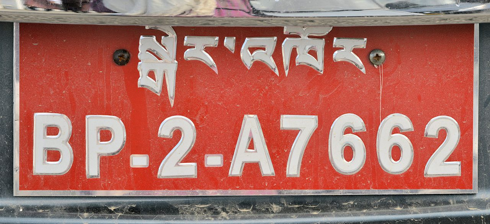
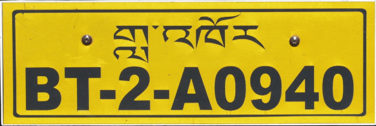

    <h2 class="section-title">{}</h2>
    <ul class="rule-list">
        <li>Los coches circulan por el lado izquierdo</li>
        <li>Se utiliza el idioma dzongkha (རྫོང་ཁ)</li>
        <li>El dominio de internet es .bt</li>
        <li>Las matrículas son mayoritariamente de color rojo, aunque también se ven matrículas amarillas y blancas</li>
        <li>Se puede observar la bandera característica{}</li>
        <li>Si el Google Car es de color gris y circula por el lado izquierdo, se puede confirmar que es Bután{}</li>
        <li>Los edificios tienen ventanas distribuidas de forma regular</li>
    </ul>
    {}

{}
{}

{}Se pueden ver banderas de oración coloridas llamadas "Lungta" con escrituras{} y banderas blancas largas "Darchen" utilizadas para conmemorar a los muertos{}{}.
{}

{}La mayoría de las matrículas de los coches son de color rojo{}. Los coches amarillos suelen ser taxis{}.
{}

{}

Por Cfynn - Obra propia, <a href="https://creativecommons.org/licenses/by-sa/4.0/deed.ja">CC BY-SA 4.0</a>, <a href="https://commons.wikimedia.org/w/index.php?curid=35901900">Wikimedia Commons(Link)</a>

Por <a href="//commons.wikimedia.org/wiki/User:Cfynn" class="mw-redirect" title="User:Cfynn">Christopher J. Fynn</a> - Obra propia, <a href="https://creativecommons.org/licenses/by-sa/4.0" title="Creative Commons Attribution-Share Alike 4.0">CC BY-SA 4.0</a>, <a href="https://commons.wikimedia.org/w/index.php?curid=36512152">Enlace</a>
{}

{}Los edificios tienen ventanas distribuidas de forma regular
{}

{}El Google Car es de color gris{}. Si los bordes del coche son grises, la zona es montañosa y hay bloques blancos al borde de la carretera{}, es probable que sea Bután{}.
{}

<iframe src="https://www.google.com/maps/embed?pb=!4v1727913976993!6m8!1m7!1scKuNgNpBkxJnXPLD4nmbOA!2m2!1d27.0247731903446!2d91.40444665544481!3f51.95566599963286!4f-27.89598761341493!5f1.075098820269612" width="600" height="400" style="border:0;" allowfullscreen="" loading="lazy" referrerpolicy="no-referrer-when-downgrade"></iframe>

{}
{}

<iframe src="https://www.google.com/maps/embed?pb=!4v1681069277166!6m8!1m7!1sbs7Os9vHZrMwMSyen7Nipg!2m2!1d27.310067392373!2d89.54804884521509!3f267.0384741855812!4f-16.584560328335442!5f3.325193203789971" width="295" height="295" style="border:0;" allowfullscreen="" loading="lazy" referrerpolicy="no-referrer-when-downgrade"></iframe>

{}
{}

<iframe src="https://www.google.com/maps/embed?pb=!4v1681069224989!6m8!1m7!1slMlmyuPeZjzgtK7amorKnQ!2m2!1d27.30958155983734!2d89.54814911356874!3f272.085583004676!4f-17.14370404396564!5f3.325193203789971" width="295" height="295" style="border:0;" allowfullscreen="" loading="lazy" referrerpolicy="no-referrer-when-downgrade"></iframe>

{}
{}

    <h2 class="section-title">{}</h2>
    <ul class="rule-list">
        <li>En la zona de Gelephu, las llanuras tienen algo similar a palmeras y es común ver coches sin matrículas rojas. Mirar hacia el norte para confirmar la presencia de montañas altas.</li>
    </ul>

{}
{}

{}Incluso en llanuras, las banderas "Lungta" pueden estar presentes frente a las casas. Los coches suelen ser grises.
{}

<iframe src="https://www.google.com/maps/embed?pb=!4v1687564782563!6m8!1m7!1shxtXKaZSATPojV7ZH2ZitA!2m2!1d26.86095144430334!2d90.49206282206114!3f238.62874781178584!4f-3.009535385728938!5f0.7820865974627469" width="550" height="300" style="border:0;" allowfullscreen="" loading="lazy" referrerpolicy="no-referrer-when-downgrade"></iframe>

{}
{}
