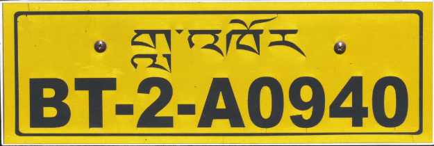

    <h2 class="section-title">{}</h2>
    <ul class="rule-list">
        <li>車は左側通行</li>
        <li>ゾンカ語（རྫོང་ཁ）が使用されている</li>
        <li>ドメインは.bt</li>
        <li>ナンバープレートはほとんどが赤色であり黄色・白色も見かける</li>
        <li>特徴的な旗が見られる{}</li>
        <li>Google Carが灰色かつ左側通行ならばブータンと確定する{}</li>
        <li>窓がたくさん規則的に並んだ建物がある</li>
    </ul>
    {}

{}
{}

{}ルンタと呼ばれる経文が書かれたカラフルな祈祷旗{}やダルシン（死者を弔うための白い長い旗）{}が見られる{}。
{}

{}ほとんどの車はナンバープレートは赤色{}。タクシーと思われる車は黄色であることもある{}。
{}

{}

By Cfynn - Own work, <a href="https://creativecommons.org/licenses/by-sa/4.0/deed.ja">CC BY-SA 4.0</a>, <a href="https://commons.wikimedia.org/w/index.php?curid=35901900">Wikimedia Commons(Link)</a>

By <a href="//commons.wikimedia.org/wiki/User:Cfynn" class="mw-redirect" title="User:Cfynn">Christopher J. Fynn</a> - Own work, <a href="https://creativecommons.org/licenses/by-sa/4.0" title="Creative Commons Attribution-Share Alike 4.0">CC BY-SA 4.0</a>, <a href="https://commons.wikimedia.org/w/index.php?curid=36512152">Link</a>
{}

{}窓がたくさん規則的に並んだ建物がある
{}

{}Google Carが灰色{}。Google Carの縁が灰色っぽい・周りが山がち・道路際に白色のブロックがある{}とブータンっぽさがある{}。
{}

<iframe src="https://www.google.com/maps/embed?pb=!4v1690000575305!6m8!1m7!1sU14SHQl8JbREV-vGtQcc2A!2m2!1d27.53941853330359!2d90.17930204298476!3f316.1298778808055!4f-28.874410185283708!5f1.3356361664500493" width="600" height="400" style="border:0;" allowfullscreen="" loading="lazy" referrerpolicy="no-referrer-when-downgrade"></iframe>

{}
{}

<iframe src="https://www.google.com/maps/embed?pb=!4v1681069277166!6m8!1m7!1sbs7Os9vHZrMwMSyen7Nipg!2m2!1d27.310067392373!2d89.54804884521509!3f267.0384741855812!4f-16.584560328335442!5f3.325193203789971" width="295" height="295" style="border:0;" allowfullscreen="" loading="lazy" referrerpolicy="no-referrer-when-downgrade"></iframe>

{}
{}

<iframe src="https://www.google.com/maps/embed?pb=!4v1681069224989!6m8!1m7!1slMlmyuPeZjzgtK7amorKnQ!2m2!1d27.30958155983734!2d89.54814911356874!3f272.085583004676!4f-17.14370404396564!5f3.325193203789971" width="295" height="295" style="border:0;" allowfullscreen="" loading="lazy" referrerpolicy="no-referrer-when-downgrade"></iframe>

{}
{}

    <h2 class="section-title">{}</h2>
    <ul class="rule-list">
        <li>ゲレフーの町周辺は平地でヤシの木っぽいものも多く赤色ナンバーではない車も多い。北側を見て高い山があることを確認する。</li>
    </ul>

{}
{}

{}平地であっても家の前にルンタの旗はある。車も灰色。
{}

<iframe src="https://www.google.com/maps/embed?pb=!4v1687564782563!6m8!1m7!1shxtXKaZSATPojV7ZH2ZitA!2m2!1d26.86095144430334!2d90.49206282206114!3f238.62874781178584!4f-3.009535385728938!5f0.7820865974627469" width="550" height="300" style="border:0;" allowfullscreen="" loading="lazy" referrerpolicy="no-referrer-when-downgrade"></iframe>

{}
{}