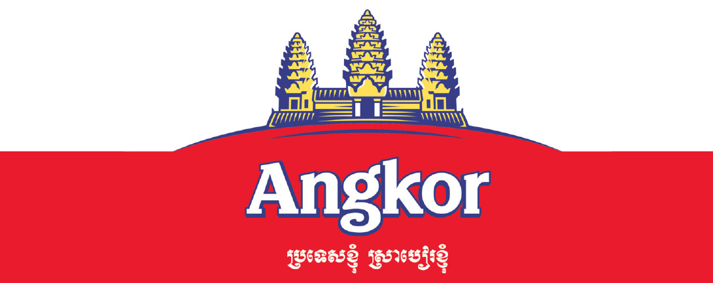
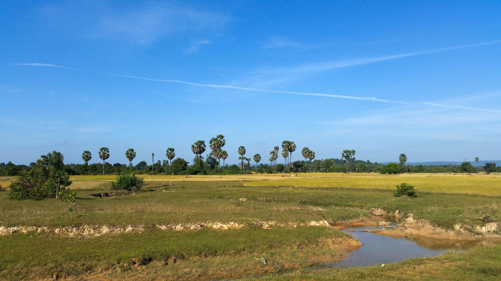
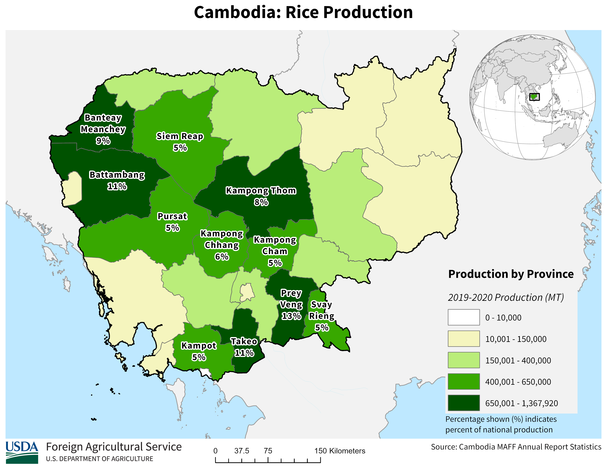

    <h2 class="section-title">{}</h2>
    <ul class="rule-list">
        <li>Right-side driving</li>
        <li>Domain is .kh</li>
        <li>Khmer (ភាសាខ្មែរ) is widely used; English is also spoken in urban areas.</li>
        <li>Rural Cambodia has many stilt houses.</li>
        <li>There are logos of the beer brands LEO, Kingdom, and Angkor on the parasols, etc. The logo of Angkor, the largest company, is of course Angkor Wat.</li>
        <li class="no-evidence">Bottled drinks are often found for sale under parasols.</li>
    </ul>
    {}

{}
{}
{}
Khmer (ភាសាខ្មែរ) is widely spoken, but English is also used in urban areas, and place names are written on bollards in these languages. Some bollards are painted white and red.
{}

By <a href="//commons.wikimedia.org/wiki/User:Knopik-som" title="User:Knopik-som">Dmitry Makeev</a> - Own work, <a href="https://creativecommons.org/licenses/by-sa/4.0" title="Creative Commons Attribution-Share Alike 4.0">CC BY-SA 4.0</a>, <a href="https://commons.wikimedia.org/w/index.php?curid=78619081">Link</a>

{}
Many rural areas in Cambodia have houses built on stilts. Cambodia has a tropical monsoon climate with high temperatures and humidity throughout the year. Stilts protect from the heat during the day and provide a resting space for cows and buffaloes at night. They are also said to protect against flooding from heavy rains during the rainy season{}.
{}

{}
Companies that are well-known in Cambodia are depicted on the parasols and billboards. Beeline for telecommunications, Coca-Cola for soft drinks, LEO, Kingdom, Angkor for beer, etc. Angkor's logo also depicts Angkor Wat{}. In the suburbs, bottled drinks are often sold under parasols{}.
{}

<iframe src="https://www.google.com/maps/embed?pb=!4v1682153829785!6m8!1m7!1sMXUayOIgo-joKPMzqh8-qw!2m2!1d11.56882486571123!2d104.9274814282329!3f225.3026506991802!4f-7.242914490031097!5f2.4971380703714856" width="590" height="300" style="border:0;" allowfullscreen="" loading="lazy" referrerpolicy="no-referrer-when-downgrade"></iframe>

{}
I ordered Angkor beer from Cambodia. It was so delicious.
{}

<blockquote class="twitter-tweet">
あとで飲みます <a href="https://twitter.com/hashtag/GeoGuessr?src=hash&amp;ref_src=twsrc%5Etfw">#GeoGuessr</a> <a href="https://t.co/e0vByRVm5y">pic.twitter.com/e0vByRVm5y</a>
&mdash; nanja (@nanjakorewa) <a href="https://twitter.com/nanjakorewa/status/1675089909256970241?ref_src=twsrc%5Etfw">July 1, 2023</a></blockquote> 

{}
There are many Buddhists and many buildings related to Buddhism. There are also shrines dedicated to land deities and ancestor deities, and they are often placed toward the house{}. The small golden shrine in the photo is this.
{}

{}
There are trees that look like this. 
There are similar-looking trees throughout warmer regions such as {}, but in Asia, Cambodia is ubiquitous. The color of the soil is also distinctive{}.
{}

{}
{}

<iframe src="https://www.google.com/maps/embed?pb=!4v1684254045514!6m8!1m7!1sErF7a24_8RyWGg6U3ijWKw!2m2!1d13.65262687825233!2d103.4924319634894!3f271.81491037276805!4f-16.097221250085084!5f3.325193203789971" width="295" height="295" style="border:0;" allowfullscreen="" loading="lazy" referrerpolicy="no-referrer-when-downgrade"></iframe>
<iframe src="https://www.google.com/maps/embed?pb=!4v1691944135005!6m8!1m7!1s9hoObewX_doWZ9po1Ckb5A!2m2!1d11.3991074139315!2d105.3399754115344!3f225.58918200222195!4f-11.519781482054654!5f0.6782675877063269" width="295" height="295" style="border:0;" allowfullscreen="" loading="lazy" referrerpolicy="no-referrer-when-downgrade"></iframe>

{}
{}

<iframe src="https://www.google.com/maps/embed?pb=!4v1685044814257!6m8!1m7!1si-78QwO_iKOMXyiMLwNzew!2m2!1d13.76922262904847!2d107.1069109919508!3f103.00534981500141!4f28.146258250937777!5f3.278551436969423" width="295" height="295" style="border:0;" allowfullscreen="" loading="lazy" referrerpolicy="no-referrer-when-downgrade"></iframe>
<iframe src="https://www.google.com/maps/embed?pb=!4v1685044835167!6m8!1m7!1suH6OG4Ha9xwaFAPfBThrJQ!2m2!1d12.41728366552385!2d107.2859087365276!3f20.129394367842494!4f15.107400733079174!5f1.8063258670895346" width="295" height="295" style="border:0;" allowfullscreen="" loading="lazy" referrerpolicy="no-referrer-when-downgrade"></iframe>

{}
{}
{}
Khmer is the official language.
{}

<table class="word-list">
<tr>
    <th>language-name</th> <th>writing</th>
</tr>
<tr><td>English</td><td>Japanese Restaurant</td></tr>
<tr><td>Japanese</td><td>日本料理レストラン</td></tr>
<tr><td>Sinhalese</td><td>ජපන් අවන්හල</td></tr>
<tr><td>Assamese</td><td>জাপানীজ ৰেষ্টুৰেণ্ট</td></tr>
<tr><td>Kannada</td><td>ಜಪಾನೀಸ್ ರೆಸ್ಟೋರೆಂಟ್</td></tr>
<tr><td>Gujarati</td><td>જાપાનીઝ રેસ્ટોરન્ટ</td></tr>
<tr><td>Tamil</td><td>ஜப்பானிய உணவகம்</td></tr>
<tr><td>Bengali</td><td>জাপানি রেস্তোরা</td></tr>
<tr><td>Hindi</td><td>जापानी रेस्टोरेंट</td></tr>
<tr><td>Khmer</td><td>ភោជនីយដ្ឋានជប៉ុន</td></tr>
<tr><td>Lao</td><td>ຮ້ານອາຫານຍີ່ປຸ່ນ</td></tr>
<tr><td>Thai</td><td>ร้านอาหารญี่ปุ่น</td></tr>
</table>

{}
{}

    <h2 class="section-title">{}</h2>
    <ul class="rule-list">
        <li>Cornfields and rice paddies are almost non-existent on the east and coasts{}.
            <ul>
                <li>North and east regions{}</li>
                <li>Central region{}</li>
                <li>Coastal areas{}</li>
            </ul>
        </li>
        <li>After finding the bollards and looking for the street number, look for the town's name written on both sides. Then, look at the distance ratio to narrow down the approximate area.</li>
    </ul>

{}
{}
{}
Cornfields and rice fields are almost non-existent on the east side (east of road #7) and along the ocean{}.
{}

{}
{}
{}
The road number is written on the side of the bollard, and the distance to the town is on both sides.
{}

<iframe src="https://www.google.com/maps/embed?pb=!4v1686995164145!6m8!1m7!1sgxiJZFUJ1xWlNagYzwPu7w!2m2!1d13.69204686393151!2d106.9415696528579!3f2.7114850261543806!4f-10.653833189576332!5f3.325193203789971" width="295" height="295" style="border:0;" allowfullscreen="" loading="lazy" referrerpolicy="no-referrer-when-downgrade"></iframe>

{}
{}

    <h2 class="section-title">{}</h2>
    <ul class="rule-list">
        <li>There is a place to cross Tonlé Sap Lake by boat.</li>
    </ul>

{}
{}

<iframe src="https://www.google.com/maps/embed?pb=!4v1686665924475!6m8!1m7!1seCLxYxO1olREocoS2zgIDA!2m2!1d12.51447248869762!2d104.447153870721!3f82.30284137401792!4f-27.012955072008616!5f0.5542794894395264" width="495" height="295" style="border:0;" allowfullscreen="" loading="lazy" referrerpolicy="no-referrer-when-downgrade"></iframe>

{}
{}