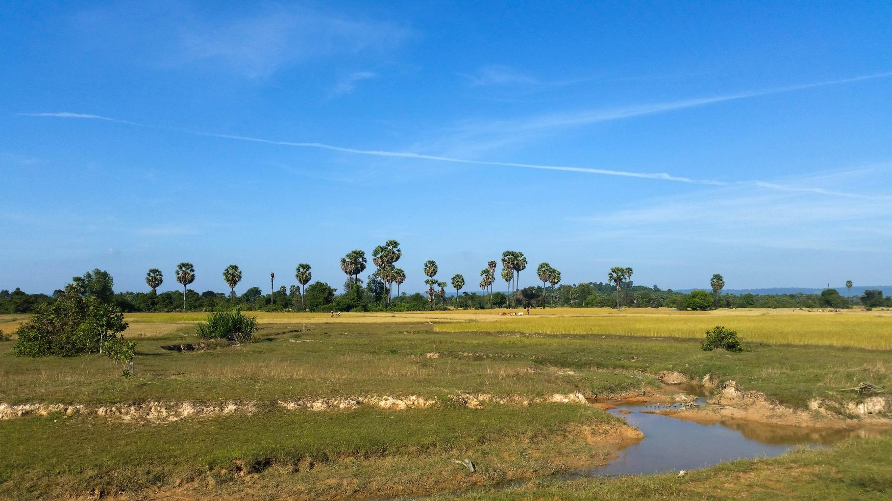
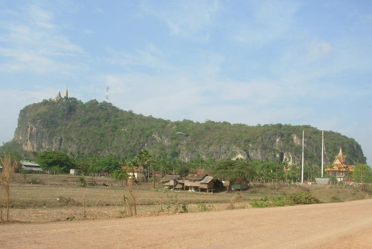
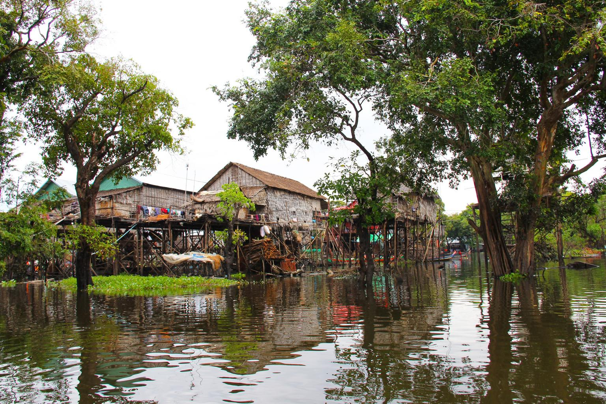
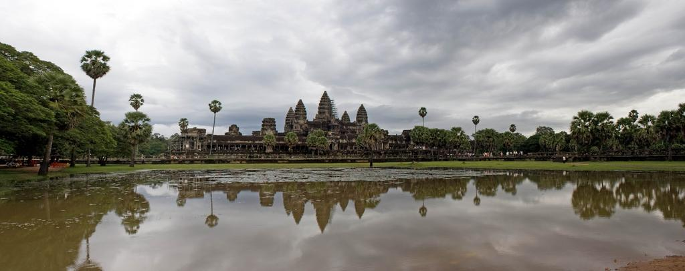
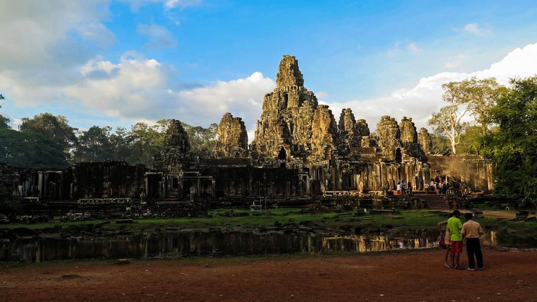

    <h2 class="section-title">{}</h2>
    <ul class="rule-list">
        <li>車は右側通行</li>
        <li>ドメインは.kh</li>
        <li>白と赤に塗られたボラードがある</li>
        <li>仏教に関係する建築物が多い</li>
        <li>クメール語（ភាសាខ្មែរ）が広く用いられている</li>
        <li>カンボジアの農村部は高床式住居が多い</li>
        <li>パラソルなどにビールブランドのLEO・Kingdom・Angkorのロゴがある</li>
        <li class="no-evidence">ちいさな祠のようなものがあって家のある方角に向かって置かれていることが多い</li>
        <li class="no-evidence">パラソルの下でビン入りの飲み物がよく売られている</li>
    </ul>
    {}

{}
{}
{}
クメール語（ភាសាខ្មែរ）が公用語{}。白と赤に塗られたボラードがある{}。
{}

By <a href="//commons.wikimedia.org/wiki/User:Knopik-som" title="User:Knopik-som">Dmitry Makeev</a> - Own work, <a href="https://creativecommons.org/licenses/by-sa/4.0" title="Creative Commons Attribution-Share Alike 4.0">CC BY-SA 4.0</a>, <a href="https://commons.wikimedia.org/w/index.php?curid=78619081">Link</a>

{}
カンボジアの農村部は高床式住居が多い{}。カンボジアは熱帯モンスーン気候であり年間を通して高温多湿。高床にすることで昼は暑さ対策、夜は牛や水牛が休むスペースになる。雨季の大雨からの浸水対策にもなるらしい{}。
{}

{}
カンボジアで知名度の高い企業が書かれたパラソルや看板が多い{}。通信はBeeline、清涼飲料水はコカ・コーラ、ビールはLEO・Kingdom・Angkorなど、Angkorのロゴにもアンコールワットが描かれている{}。郊外ではこのようなパラソルの下で瓶入りの飲み物が売られていることが多い{}。
{}

<iframe src="https://www.google.com/maps/embed?pb=!4v1682153829785!6m8!1m7!1sMXUayOIgo-joKPMzqh8-qw!2m2!1d11.56882486571123!2d104.9274814282329!3f225.3026506991802!4f-7.242914490031097!5f2.4971380703714856" width="590" height="300" style="border:0;" allowfullscreen="" loading="lazy" referrerpolicy="no-referrer-when-downgrade"></iframe>

{}
取り寄せました。めちゃおいしかったです。
{}

<blockquote class="twitter-tweet">
あとで飲みます <a href="https://twitter.com/hashtag/GeoGuessr?src=hash&amp;ref_src=twsrc%5Etfw">#GeoGuessr</a> <a href="https://t.co/e0vByRVm5y">pic.twitter.com/e0vByRVm5y</a>
&mdash; nanja (@nanjakorewa) <a href="https://twitter.com/nanjakorewa/status/1675089909256970241?ref_src=twsrc%5Etfw">July 1, 2023</a></blockquote> 

{}
仏教徒が多く仏教に関係する建築物が多い。また土地神や先祖神を祀っている祠があって家の方に向かって置かれていることが多い{}{}。写真の金色の小さい祠がそれ。
{}

{}
こういう感じの木がある{}{{% ref "https://ja.wikipedia.org/wiki/%E3%82%AA%E3%82%A6%E3%82%AE%E3%83%A4%E3%82%B7" "オウギヤシ" %}}。{}などの暖かい地域全域似に似た見た目の木があるがアジアではカンボジアが特に多い。土の色も特徴的{}。
{}

{}
{}

<iframe src="https://www.google.com/maps/embed?pb=!4v1684254045514!6m8!1m7!1sErF7a24_8RyWGg6U3ijWKw!2m2!1d13.65262687825233!2d103.4924319634894!3f271.81491037276805!4f-16.097221250085084!5f3.325193203789971" width="295" height="295" style="border:0;" allowfullscreen="" loading="lazy" referrerpolicy="no-referrer-when-downgrade"></iframe>
<iframe src="https://www.google.com/maps/embed?pb=!4v1691944135005!6m8!1m7!1s9hoObewX_doWZ9po1Ckb5A!2m2!1d11.3991074139315!2d105.3399754115344!3f225.58918200222195!4f-11.519781482054654!5f0.6782675877063269" width="295" height="295" style="border:0;" allowfullscreen="" loading="lazy" referrerpolicy="no-referrer-when-downgrade"></iframe>

{}
{}

<iframe src="https://www.google.com/maps/embed?pb=!4v1685044814257!6m8!1m7!1si-78QwO_iKOMXyiMLwNzew!2m2!1d13.76922262904847!2d107.1069109919508!3f103.00534981500141!4f28.146258250937777!5f3.278551436969423" width="295" height="295" style="border:0;" allowfullscreen="" loading="lazy" referrerpolicy="no-referrer-when-downgrade"></iframe>
<iframe src="https://www.google.com/maps/embed?pb=!4v1685044835167!6m8!1m7!1suH6OG4Ha9xwaFAPfBThrJQ!2m2!1d12.41728366552385!2d107.2859087365276!3f20.129394367842494!4f15.107400733079174!5f1.8063258670895346" width="295" height="295" style="border:0;" allowfullscreen="" loading="lazy" referrerpolicy="no-referrer-when-downgrade"></iframe>

{}
{}
{}
クメール語が公用語となっている
{}

<table class="word-list">
<tr>
    <th>言語名</th> <th>表記</th>
</tr>
<tr><td>日本</td><td>日本料理レストラン</td></tr>
<tr><td>シンハラ</td><td>ජපන් අවන්හල</td></tr>
<tr><td>アッサム</td><td>জাপানীজ ৰেষ্টুৰেণ্ট</td></tr>
<tr><td>カンナダ</td><td>ಜಪಾನೀಸ್ ರೆಸ್ಟೋರೆಂಟ್</td></tr>
<tr><td>グジャラート</td><td>જાપાનીઝ રેસ્ટોરન્ટ</td></tr>
<tr><td>タミル</td><td>ஜப்பானிய உணவகம்</td></tr>
<tr><td>テルグ</td><td>జపనీస్ రెస్టారెంట్</td></tr>
<tr><td>ベンガル</td><td>জাপানি রেস্তোরা</td></tr>
<tr><td>ヒンディー</td><td>जापानी रेस्टोरेंट</td></tr>
<tr><td>クメール</td><td>ភោជនីយដ្ឋានជប៉ុន</td></tr>
<tr><td>ラオ</td><td>ຮ້ານອາຫານຍີ່ປຸ່ນ</td></tr>
<tr><td>タイ</td><td>ร้านอาหารญี่ปุ่น</td></tr>
</table>

{}
{}

    <h2 class="section-title">{}</h2>
    <ul class="rule-list">
        <li>コーン畑や田んぼは東側と海沿いにはほとんど存在しない{}
            <ul>
                <li>畑が少ない北や東の地域{}</li>
                <li>畑のある中央地域{}</li>
                <li>畑が少ない海沿いの地域{}</li>
            </ul>
        </li>
        <li>ボラードを見つけて道路番号を探したあとで両面に書いてある町名を探す{}。そのあと距離の比率をみておよその地域を絞り込む。</li>
    </ul>

{}
{}
{}
コーン畑や田んぼは東側（7番の道路の東側）と海沿いにはほとんど存在しない{}。
{}

{}
{}
{}
ボラードの側面に道路番号が、両面に町までの距離が書いてある。運よく見つけられたらかなり距離を詰めることができる。
{}

<iframe src="https://www.google.com/maps/embed?pb=!4v1686995164145!6m8!1m7!1sgxiJZFUJ1xWlNagYzwPu7w!2m2!1d13.69204686393151!2d106.9415696528579!3f2.7114850261543806!4f-10.653833189576332!5f3.325193203789971" width="295" height="295" style="border:0;" allowfullscreen="" loading="lazy" referrerpolicy="no-referrer-when-downgrade"></iframe>

{}
{}

    <h2 class="section-title">{}</h2>
    <ul class="rule-list">
        <li>Battambang西の{}国境付近の道では険しい岩山が見えることがある{}</li>
        <li>Tonlé Sap湖ではボートハウスの村がある{}{{% ref "https://ja.wikipedia.org/wiki/%E3%83%88%E3%83%B3%E3%83%AC%E3%82%B5%E3%83%83%E3%83%97" "បឹងទន្លេសាប" %}}</li>
        <li>Kampot旧市街には{}植民地時代の建築が多く残っている{}{}</li>
        <li>Siem Reapにはアンコールワットやバイヨン寺院がある{}</li>
        <li>Preăh Seihânŭは輸出入の拠点であり中国からの投資により発展している{}。高い建物も存在する{}。</li>
    </ul>

{}
{}
{}
西の国境付近の道では険しい岩山が見えることがある{}。上の農業分布でBattambangの西の空白になっている部分は岩山が多い。
{}

{}
{}
{}
トンレ・サップ湖の上も出ることがある。ボートハウスの村が湖面にあり独特な建築が見られる{}。
{}

{}
{}
{}
カンボジアの都市部ではフランス植民地時代の建築が多くみられる。Kampotは重要な港町で特に多く洋風の建築が残っている。
{}

By <a href="//commons.wikimedia.org/wiki/User:Haros" title="User:Haros">Hans A. Rosbach</a> - Own work, <a href="https://creativecommons.org/licenses/by-sa/3.0" title="Creative Commons Attribution-Share Alike 3.0">CC BY-SA 3.0</a>, <a href="https://commons.wikimedia.org/w/index.php?curid=15165246">Link</a>

{}
{}
{}
Siem Reapにはアンコールワットやバイヨン寺院がある{}。
{}

{}
{}
{}
アンコールワットのあるシェムリアップでは条例により高い建物は作れない{}一方でPreăh Seihânŭは４階建て以上の建物が存在する{}。石油ターミナルもあり物流拠点になっている。
{}

By <a href="//commons.wikimedia.org/wiki/User:Knopik-som" title="User:Knopik-som">Dmitry Makeev</a> - Own work, <a href="https://creativecommons.org/licenses/by-sa/4.0" title="Creative Commons Attribution-Share Alike 4.0">CC BY-SA 4.0</a>, <a href="https://commons.wikimedia.org/w/index.php?curid=78794523">Link</a>

{}
{}