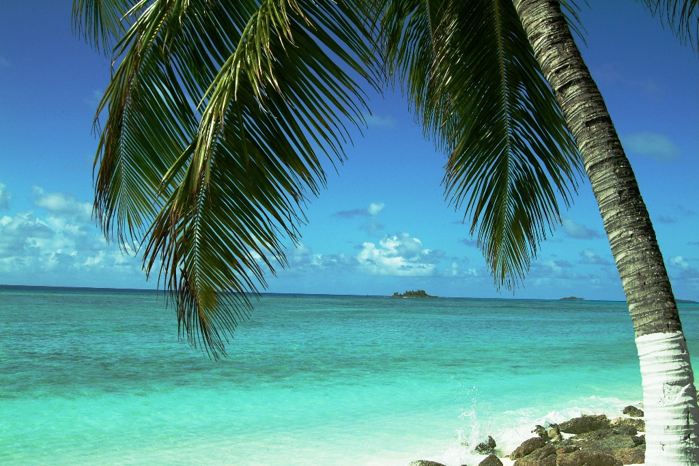

    <h2 class="section-title">{}</h2>
    <ul class="rule-list">
        <li>ドメインである.ioはこの地域に関係なく一般的に使用される</li>
        <li>60以上の島が存在しており遠くに複数の島が複数見える{{% ref "https://ja.wikipedia.org/wiki/%E3%83%81%E3%83%A3%E3%82%B4%E3%82%B9%E8%AB%B8%E5%B3%B6" "チャゴス諸島" %}}</li>
        <li>チャゴス諸島のPeros Banhosと呼ばれる環礁の周辺にストリートビューが多い{}</li>
        <li class="no-evidence">黄緑色の端が丸く反り返った葉っぱの低木が多くの島で生えている</li>
        <li>チャゴス諸島の主権がモーリシャスに譲渡されることが発表された{}</li>
    </ul>

{}
{}

{}
島によって景色が異なるが海岸に出れば遠くに島が見えることが多い{}。ほとんどの島は砂浜が綺麗な白色をしている{}。
{}

{}
黄緑色の端が丸く反り返った葉っぱの低木が多くの島で生えている気がする{}。
{}

<iframe src="https://www.google.com/maps/embed?pb=!4v1694403009389!6m8!1m7!1sy8RlAYyXvsBm8tV4qN_dmQ!2m2!1d-5.423322242950213!2d71.82924608825161!3f158.63653094146412!4f-2.1765587574211764!5f0.4000000000000002" width="580" height="300" style="border:0;" allowfullscreen="" loading="lazy" referrerpolicy="no-referrer-when-downgrade"></iframe>

{}
太陽に照らされる人と、それを見つめる鳥がいる
{}

<iframe src="https://www.google.com/maps/embed?pb=!4v1684828100537!6m8!1m7!1s_mAFTYEEyFSxw0vWGwA0rg!2m2!1d-5.427784761980635!2d71.88081937822534!3f80.48614014107085!4f20.034012209677343!5f1.0624369115918713" width="550" height="400" style="border:0;" allowfullscreen="" loading="lazy" referrerpolicy="no-referrer-when-downgrade"></iframe>

{}
{}
