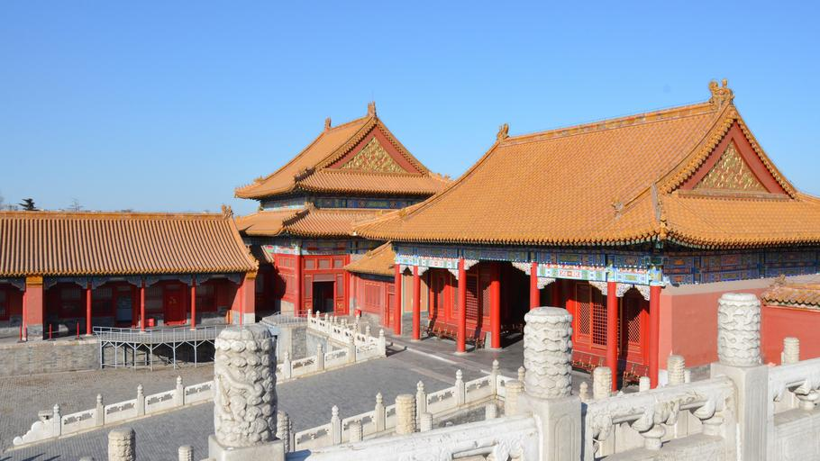

    <h2 class="section-title">{}</h2>
    <ul class="rule-list">
        <li>Language is Chinese</li>
        <li>The domain is .cn</li>
        <li>Indoor locations and tourist spots appear</li>
    </ul>

{}
{}
{}
Indoor locations and tourist spots appear{}
{}

{}
{}

{}
Huangpu District, Shanghai
{}

<iframe width="560" height="315" src="https://www.youtube.com/embed/-LZxk09LNaM?start=11" title="YouTube video player" frameborder="0" allow="accelerometer; autoplay; clipboard-write; encrypted-media; gyroscope; picture-in-picture; web-share" allowfullscreen></iframe>

<iframe width="560" height="315" src="https://www.youtube.com/embed/zy8vTMJtJOQ" title="YouTube video player" frameborder="0" allow="accelerometer; autoplay; clipboard-write; encrypted-media; gyroscope; picture-in-picture; web-share" allowfullscreen></iframe>

{}
{}
