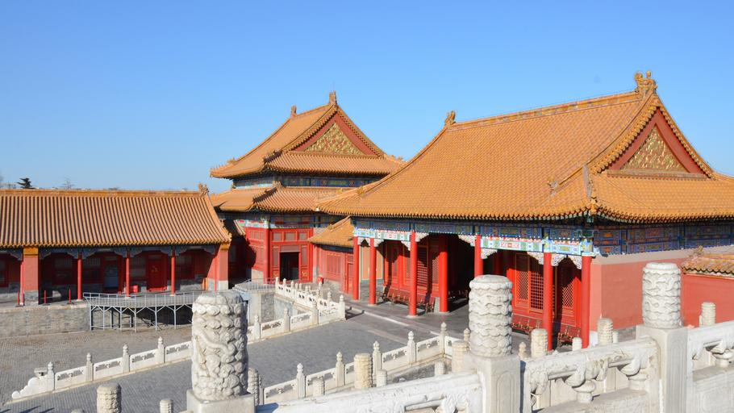

    <h2 class="section-title">{}</h2>
    <ul class="rule-list">
        <li>言語は中国語</li>
        <li>ドメインは.cn</li>
        <li>施設の内部や観光スポットが出題される</li>
    </ul>

{}
{}
{}
施設の内部や観光スポットが出題される{}
{}

{}
{}

{}
上海市黄浦区
{}

<iframe width="560" height="315" src="https://www.youtube.com/embed/-LZxk09LNaM?start=11" title="YouTube video player" frameborder="0" allow="accelerometer; autoplay; clipboard-write; encrypted-media; gyroscope; picture-in-picture; web-share" allowfullscreen></iframe>

<iframe width="560" height="315" src="https://www.youtube.com/embed/zy8vTMJtJOQ" title="YouTube video player" frameborder="0" allow="accelerometer; autoplay; clipboard-write; encrypted-media; gyroscope; picture-in-picture; web-share" allowfullscreen></iframe>

{}
{}
