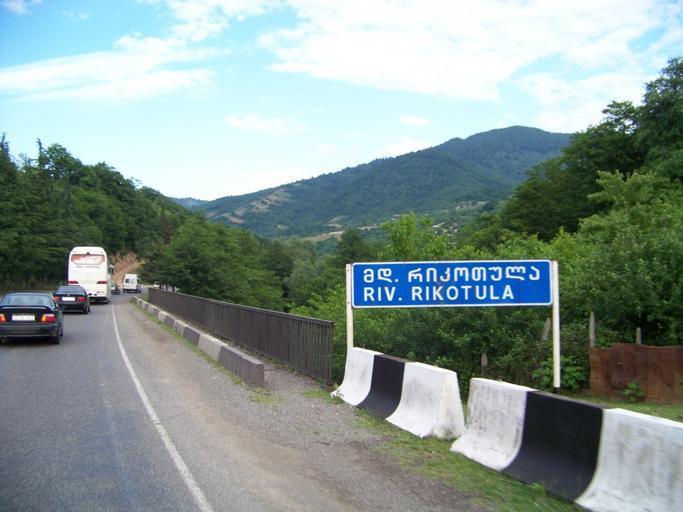
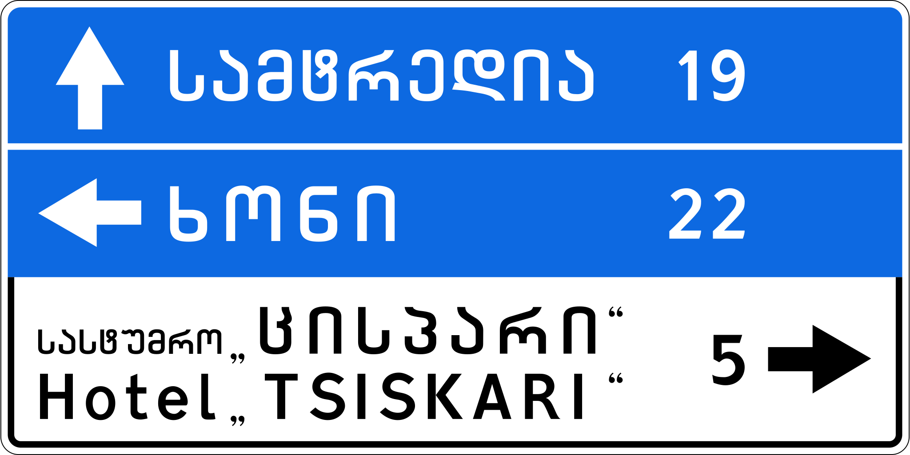
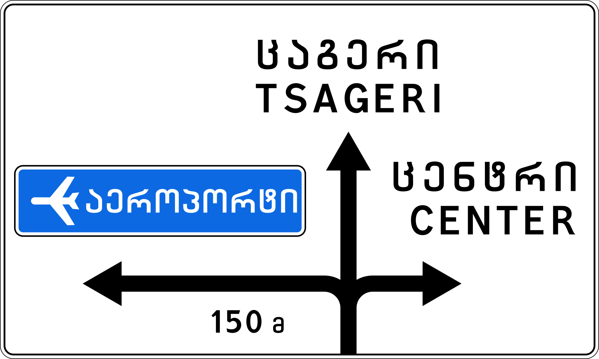

    <h2 class="section-title">{}</h2>
    <ul class="rule-list">
        <li>Tidak memiliki Street View resmi sehingga belum muncul di GeoGuessr.</li>
        <li>Domain negara adalah .ge.</li>
        <li>Bahasa resmi yang digunakan ialah Georgia (ქართული ენა).</li>
    </ul>

{}
{}
{}
Papan nama dan toko memakai aksara Georgia (ქართული ენა).
{}

{}
Bolard chevron putih-merah merupakan penanda yang sering terlihat{}.
{}

Oleh <a href="//commons.wikimedia.org/w/index.php?title=User:Yuri_Samoylov&amp;action=edit&amp;redlink=1" class="new" title="User:Yuri Samoylov (halaman tidak ada)">Yuri Samoylov</a> - karya sendiri, <a href="https://creativecommons.org/licenses/by-sa/4.0" title="Creative Commons Attribution-Share Alike 4.0">CC BY-SA 4.0</a>, <a href="https://commons.wikimedia.org/w/index.php?curid=148358453">tautan</a>

{}
{}
