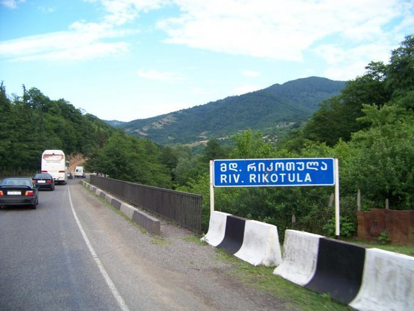
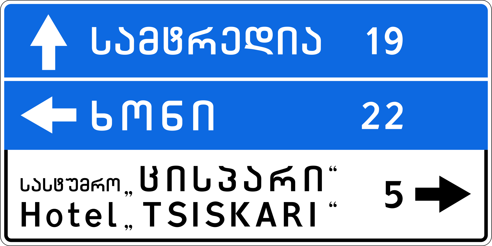
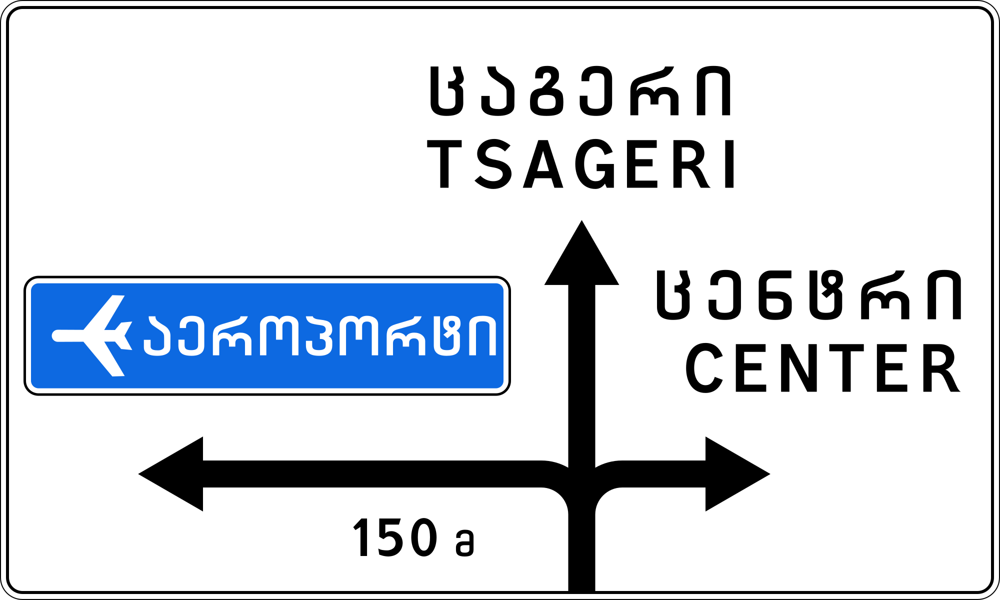

    <h2 class="section-title">{}</h2>
    <ul class="rule-list">
        <li>現在公式のストリートビューが無くGeoguessrでは出題されない</li>
        <li>ドメインは.ge</li>
        <li>ジョージア語（ქართული ენა）が公用語として使われている</li>
    </ul>

{}
{}
{}
ジョージア語（ქართული ენა）が使用されている。
{}

{}
白に赤い反射板のボラード{}。
{}

By <a href="//commons.wikimedia.org/w/index.php?title=User:Yuri_Samoylov&amp;action=edit&amp;redlink=1" class="new" title="User:Yuri Samoylov (page does not exist)">Yuri Samoylov</a> - Own work, <a href="https://creativecommons.org/licenses/by-sa/4.0" title="Creative Commons Attribution-Share Alike 4.0">CC BY-SA 4.0</a>, <a href="https://commons.wikimedia.org/w/index.php?curid=148358453">Link</a>

{}
{}