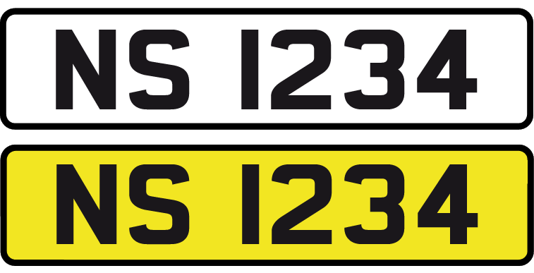
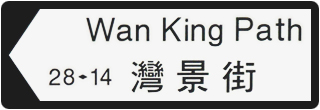
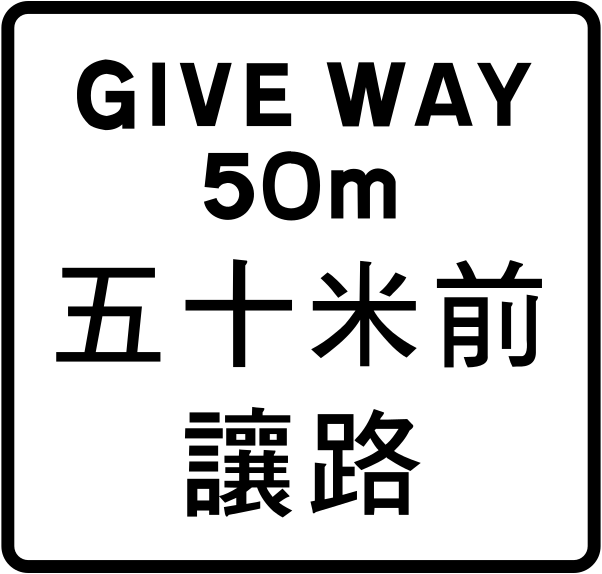
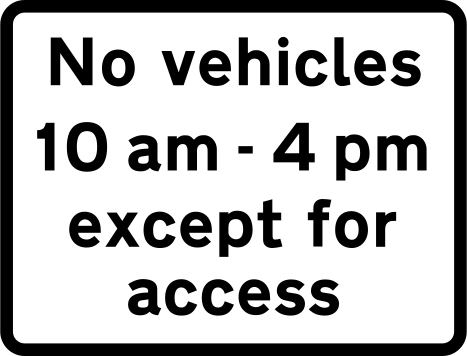

    <h2 class="section-title">{}</h2>
    <ul class="rule-list">
        <li>The domain is .hk</li>
        <li>Language is Cantonese (Hong Kong Chinese)</li>
        <li>License plates: white front, yellow rear</li>
        <li>Black-and-white bilingual street signs and road signs</li>
        <li>Street View often shows concrete rural or mountain roads</li>
    </ul>
    {}

{}
{}
{}
Like {}, plates are white in front and yellow at the rear{}. If the plate background is black, consider {}.
{}

{}
Hong Kong was governed by the British colonial administration from 1841 to 1997{}.
{}

{}

By Woodennature - Own work, <a href="https://creativecommons.org/licenses/by-sa/3.0/deed.ja">CC BY-SA 3.0</a>, <a href="https://commons.wikimedia.org/w/index.php?curid=5951198">Wikimedia Commons</a>, modified
{}

{}
Bilingual black-and-white street signs{}. Some signs look similar to those in {} or {}{}.
{}

{}
Examples of signs in {}
{}

{}
Street View also covers underdeveloped areas{}, outlying islands{}, and hiking trails{}. If you see an Asian road that doesn’t feel like {} or {}, it might be Hong Kong.
{}

By <a href="//commons.wikimedia.org/wiki/User:Underwaterbuffalo" title="User:Underwaterbuffalo">Underwaterbuffalo</a> - Own work, <a href="https://creativecommons.org/licenses/by-sa/4.0" title="Creative Commons Attribution-Share Alike 4.0">CC BY-SA 4.0</a>, <a href="https://commons.wikimedia.org/w/index.php?curid=71727971">Link</a>

{}
{}

{}
{}

<iframe src="https://www.google.com/maps/embed?pb=!4v1682669610532!6m8!1m7!1s5oqhRHC8PlyLOjZAasDWyQ!2m2!1d22.32955739540962!2d114.2121367147559!3f176.92766532166686!4f-6.902529887966125!5f3.325193203789971" width="295" height="295" style="border:0;" allowfullscreen="" loading="lazy" referrerpolicy="no-referrer-when-downgrade"></iframe>
<iframe src="https://www.google.com/maps/embed?pb=!4v1682669583236!6m8!1m7!1sw3bJmh7vsrqKJpFT6ambrA!2m2!1d22.32928717323537!2d114.2129819835939!3f114.62460791386806!4f-4.472388091843669!5f1.524171891417538" width="295" height="295" style="border:0;" allowfullscreen="" loading="lazy" referrerpolicy="no-referrer-when-downgrade"></iframe>

{}
{}

<iframe src="https://www.google.com/maps/embed?pb=!4v1682669799035!6m8!1m7!1se1x9EVS7eVLJ5UcBG5X8rw!2m2!1d22.26113498983628!2d113.9734028519192!3f5.273580678133385!4f3.7749098476787424!5f0.4000000000000002" width="295" height="295" style="border:0;" allowfullscreen="" loading="lazy" referrerpolicy="no-referrer-when-downgrade"></iframe>
<iframe src="https://www.google.com/maps/embed?pb=!4v1682669843275!6m8!1m7!1s20H8bDVEoPtJCQ5efzeJCA!2m2!1d22.43644456672756!2d114.3190285861153!3f297.44092317040526!4f-16.329460959381706!5f1.5757440953818254" width="295" height="295" style="border:0;" allowfullscreen="" loading="lazy" referrerpolicy="no-referrer-when-downgrade"></iframe>

{}
{}
