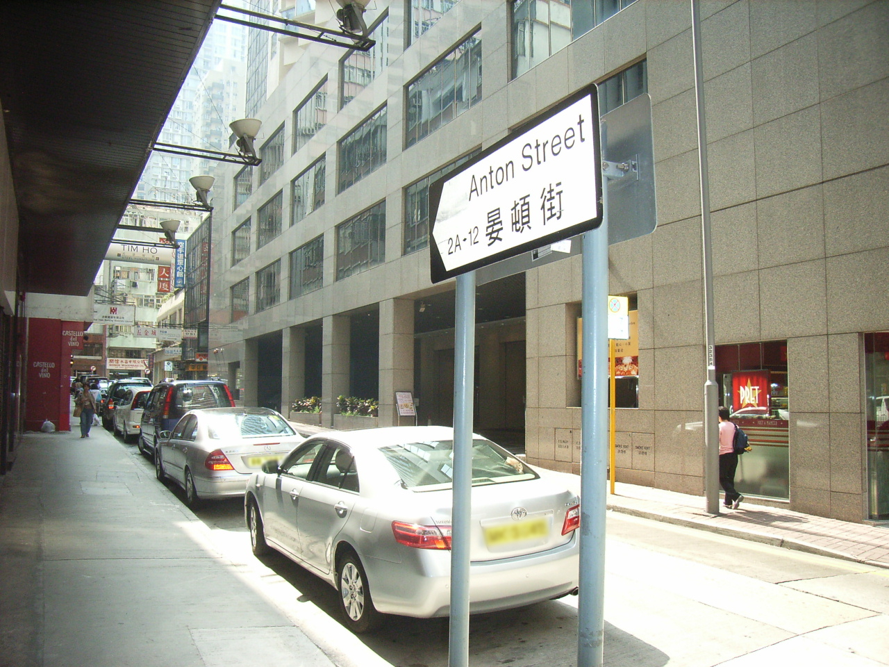
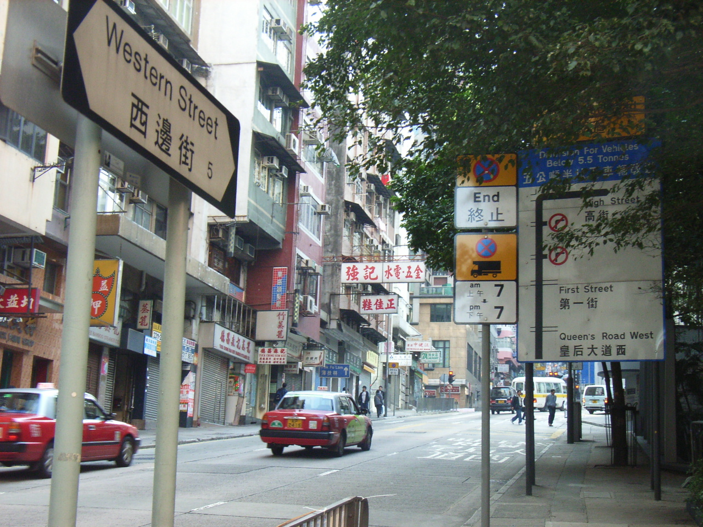
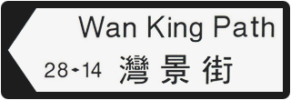
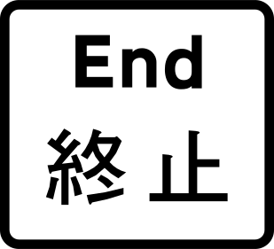
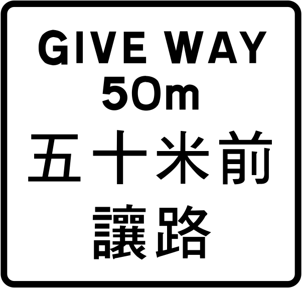
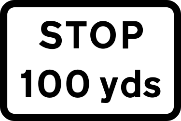
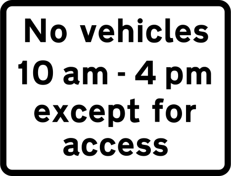
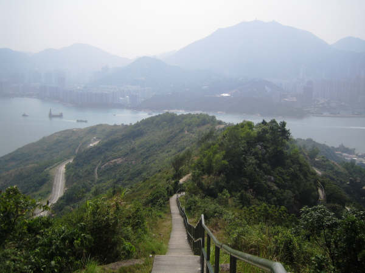
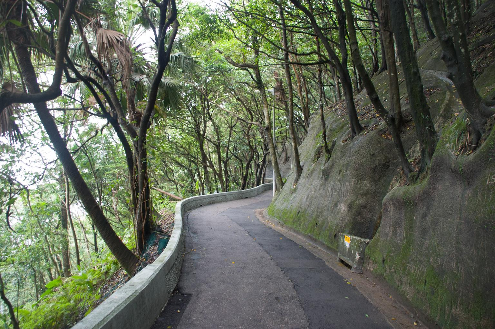

    <h2 class="section-title">{}</h2>
    <ul class="rule-list">
        <li>El dominio es .hk</li>
        <li>El idioma es el cantonés local de Hong Kong.</li>
        <li>Las matrículas son blancas delante y amarillas detrás.</li>
        <li>Hay señales y carteles de calles en blanco y negro escritos en dos idiomas.</li>
        <li>Street View incluye senderos rurales y caminos de montaña pavimentados con hormigón.</li>
    </ul>
    {}

{}
{}
{}
Al igual que en el {}, las placas son blancas delante y amarillas detrás{}. Si la placa tiene fondo negro, considera {}.
{}

{}
Entre 1841 y 1997, durante y después de las Guerras del Opio, Hong Kong fue administrado por el gobierno colonial británico{}.
{}

{}

Por Woodennature - Obra propia, <a href="https://creativecommons.org/licenses/by-sa/3.0/deed.ja">CC BY-SA 3.0</a>, <a href="https://commons.wikimedia.org/w/index.php?curid=5951198">Wikimedia Commons</a>, con ligeras modificaciones
{}

{}
Los carteles de calles en blanco y negro aparecen en dos idiomas{}. También verás señales parecidas a las del {} o {}{}.
{}

{}
Ejemplos de señales presentes en el {}.
{}

{}
Street View cubre zonas menos urbanizadas{}, islas exteriores{} y rutas de senderismo{}. Si ves caminos asiáticos que no encajan con {} o {}, puede que estés en Hong Kong.
{}

Por <a href="//commons.wikimedia.org/wiki/User:Underwaterbuffalo" title="User:Underwaterbuffalo">Underwaterbuffalo</a> - Obra propia, <a href="https://creativecommons.org/licenses/by-sa/4.0" title="Creative Commons Attribution-Share Alike 4.0">CC BY-SA 4.0</a>, <a href="https://commons.wikimedia.org/w/index.php?curid=71727971">Link</a>

{}
{}

{}
{}

<iframe src="https://www.google.com/maps/embed?pb=!4v1682669610532!6m8!1m7!1s5oqhRHC8PlyLOjZAasDWyQ!2m2!1d22.32955739540962!2d114.2121367147559!3f176.92766532166686!4f-6.902529887966125!5f3.325193203789971" width="295" height="295" style="border:0;" allowfullscreen="" loading="lazy" referrerpolicy="no-referrer-when-downgrade"></iframe>
<iframe src="https://www.google.com/maps/embed?pb=!4v1682669583236!6m8!1m7!1sw3bJmh7vsrqKJpFT6ambrA!2m2!1d22.32928717323537!2d114.2129819835939!3f114.62460791386806!4f-4.472388091843669!5f1.524171891417538" width="295" height="295" style="border:0;" allowfullscreen="" loading="lazy" referrerpolicy="no-referrer-when-downgrade"></iframe>

{}
{}

<iframe src="https://www.google.com/maps/embed?pb=!4v1682669799035!6m8!1m7!1se1x9EVS7eVLJ5UcBG5X8rw!2m2!1d22.26113498983628!2d113.9734028519192!3f5.273580678133385!4f3.7749098476787424!5f0.4000000000000002" width="295" height="295" style="border:0;" allowfullscreen="" loading="lazy" referrerpolicy="no-referrer-when-downgrade"></iframe>
<iframe src="https://www.google.com/maps/embed?pb=!4v1682669843275!6m8!1m7!1s20H8bDVEoPtJCQ5efzeJCA!2m2!1d22.43644456672756!2d114.3190285861153!3f297.44092317040526!4f-16.329460959381706!5f1.5757440953818254" width="295" height="295" style="border:0;" allowfullscreen="" loading="lazy" referrerpolicy="no-referrer-when-downgrade"></iframe>

{}
{}
