---
title: "India"
title_suffix: "(Bharat)"
date: 2023-02-26
lastmod: 2023-12-13
weight: 2
draft: false
keywords: [""]
sections: [""]
bg: "bgf/ID.png"
bgf-temp: "bgf/ID.jpg"
flag: "IN.svg"
jetro_detail: true
jogmec_detail: true
plonkit: true
map_title: "Practice Maps"
maps: [
    ["https://www.geoguessr.com/maps/62e10035c97fc44e29bd8e0e", "A Balanced AI Generated India"],
    ]
sc_title: "Commonly Confused Regions"
sc: [
    ["../bangladesh/", "Bangladesh"],
    ["../pakistan/", "Pakistan"],
    ["../srilanka/", "Sri Lanka"],
    ["../aani/", "Andaman Islands"],
    ["../lakshadweep/", "Lakshadweep"],
    ]
---

    <h2 class="section-title">{}</h2>
    <ul class="rule-list">
        <li>The domain is .in(fixed 2023/7/31, thanks for the comment)</li>
        <li>There are many languages such as Hindi, and they vary by region</li>
        <li>Distinctive utility poles are common (see {})</li>
    </ul>
    {}
    {}

{}
{}
{}
The language is distinctive{} and sometimes only English is used{}. In city centers, addresses are often written in English below signs, so identifying the city can be quick{}. However, India’s address system is not fully standardized, and packages sometimes fail to arrive{}, so even with an address, narrowing down the exact road can still be hard.
{}

{}
Distinctive pole shapes that are rare elsewhere{} (see {}). The most common type has three branches at the top, resembling a mountain or an anchor{}. The video below is an interview during recent floods, and you can see poles in the background.
{}

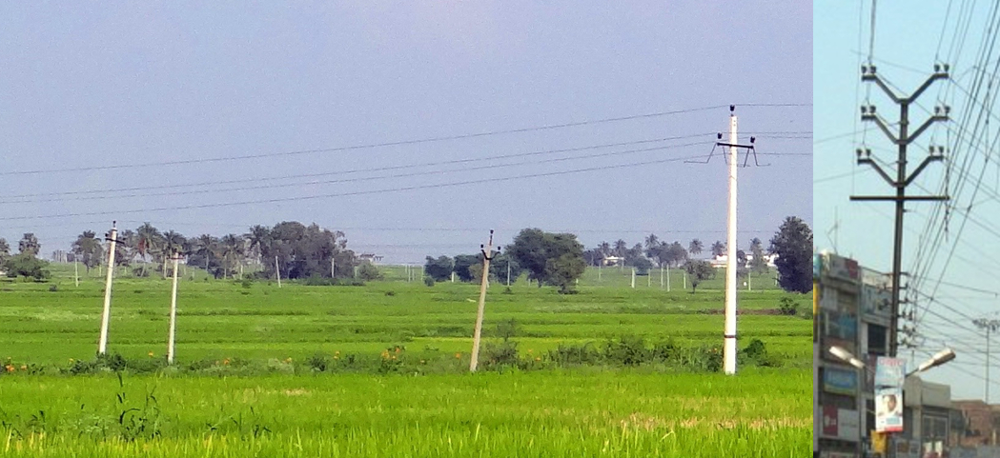

<iframe width="560" height="315" src="https://www.youtube.com/embed/XaiWl2H-3ik?si=iv7tjX3WRcUMGn5N&amp;start=31" title="YouTube video player" frameborder="0" allow="accelerometer; autoplay; clipboard-write; encrypted-media; gyroscope; picture-in-picture; web-share" referrerpolicy="strict-origin-when-cross-origin" allowfullscreen></iframe>

{}
Wiring on poles is often messy.
{}

{}
Image quality is often poor with heavy blur. Other countries can also be blurry, so don’t rely on image quality alone.
{}

<table style="text-align:center; width:90%;">
<tr style="background-color:#ccc">
<td>
{}
</td>
<td>
{}
</td>
<td>
{}
</td>
</tr>
<tr>
<td>
{}
</td>
<td>
{}
</td>
<td>
{}
</td>
</tr>
<tr style="background-color:#ccc">
<td>
{}
</td>
<td>
{}
</td>
<td>
{}
</td>
</tr>
<tr>
<td>
{}
</td>
<td>
{}</li>
</td>
<td>
{}
</td>
</tr>
<tr style="background-color:#ccc">
<td>
{}
</td>
<td>
</td>
<td>
</td>
</tr>
<tr>
<td>
{}
</td>
<td>
</td>
<td>
</td>
</tr>
</table>

{}
There are bollards similar to {}{}. There are also black-and-white bollard-like posts{}.
{}

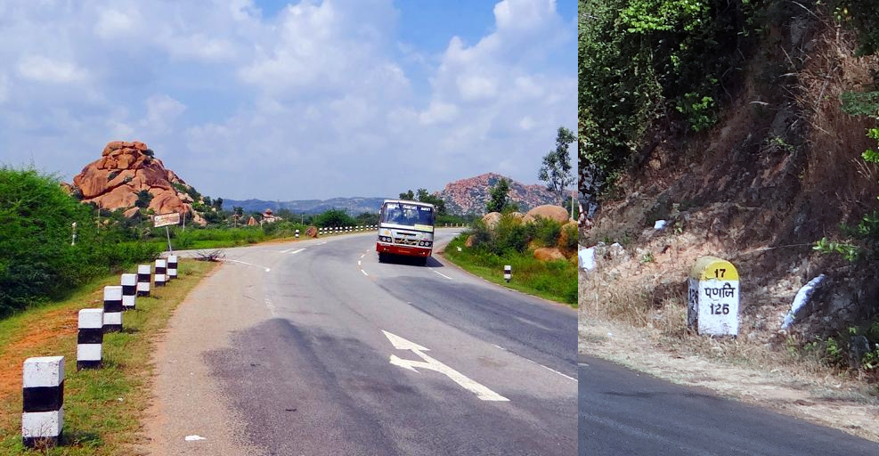

{}
{}

{}
Plates come in several colors: white, yellow, black, etc. Some look like EU plates, so be careful{}.
{}

<iframe src="https://www.google.com/maps/embed?pb=!4v1689072559136!6m8!1m7!1safd2f2VgriHB1IqAeeiMVw!2m2!1d23.23867177230191!2d77.38986018900181!3f57.85938112510194!4f-6.020780724911873!5f3.293292491545769" width="500" height="300" style="border:0;" allowfullscreen="" loading="lazy" referrerpolicy="no-referrer-when-downgrade"></iframe>

{}

Self-made; approximate shape, not exact.
{}

{}
{}

<iframe width="590" height="315" src="https://www.youtube.com/embed/rDZ4oudc9y0" title="YouTube video player" frameborder="0" allow="accelerometer; autoplay; clipboard-write; encrypted-media; gyroscope; picture-in-picture; web-share" allowfullscreen></iframe>
<iframe width="590" height="315" src="https://www.youtube.com/embed/W57wmjn4Zac" title="YouTube video player" frameborder="0" allow="accelerometer; autoplay; clipboard-write; encrypted-media; gyroscope; picture-in-picture; web-share" allowfullscreen></iframe>

{}
{}

<iframe width="560" height="315" src="https://www.youtube.com/embed/NfbT1Rgos4I" title="YouTube video player" frameborder="0" allow="accelerometer; autoplay; clipboard-write; encrypted-media; gyroscope; picture-in-picture; web-share" allowfullscreen></iframe>

{}
{}
 

    <h2 class="section-title">{}</h2>
    <h4 class="section-title" id="言語">Languages</h4>
    <ul class="rule-list">
        <li>Each state has a different flag</li>
        <li>Languages differ by region{}</li>
    </ul>

{}
{}

<blockquote class="twitter-tweet">
<a href="https://twitter.com/hashtag/India?src=hash&amp;ref_src=twsrc%5Etfw">#India</a>&#39;s 22 scheduled <a href="https://twitter.com/hashtag/languages?src=hash&amp;ref_src=twsrc%5Etfw">#languages</a> by the name of the script they use <a href="https://t.co/PBDqehiogD">pic.twitter.com/PBDqehiogD</a>
&mdash; India in Pixels by Ashris (@indiainpixels) <a href="https://twitter.com/indiainpixels/status/1350804912100179970?ref_src=twsrc%5Etfw">January 17, 2021</a></blockquote> 

<blockquote class="twitter-tweet">
インドの主要な言語の分布と、その見分け方について解説しました！<a href="https://twitter.com/hashtag/GeoGuessr?src=hash&amp;ref_src=twsrc%5Etfw">#GeoGuessr</a> <a href="https://t.co/NL4wmCBzcz">pic.twitter.com/NL4wmCBzcz</a>
&mdash; LAKE TOUYA / とうや (@geotouya) <a href="https://twitter.com/geotouya/status/1721112634144285157?ref_src=twsrc%5Etfw">November 5, 2023</a></blockquote> 

{}
{}
{}
Around Ahmedabad. Stepwells are also common around Ahmedabad.
{}

By <a href="//commons.wikimedia.org/wiki/User:Aksi_great" title="User:Aksi great">Aksi great</a>, Dipan Shukla - Own work, <a href="http://creativecommons.org/licenses/by-sa/3.0/" title="Creative Commons Attribution-Share Alike 3.0">CC BY-SA 3.0</a>, <a href="https://commons.wikimedia.org/w/index.php?curid=3323700">Link</a>

{}
{}
{}
You can often spot a triangular ▷ shape in the script.
{}

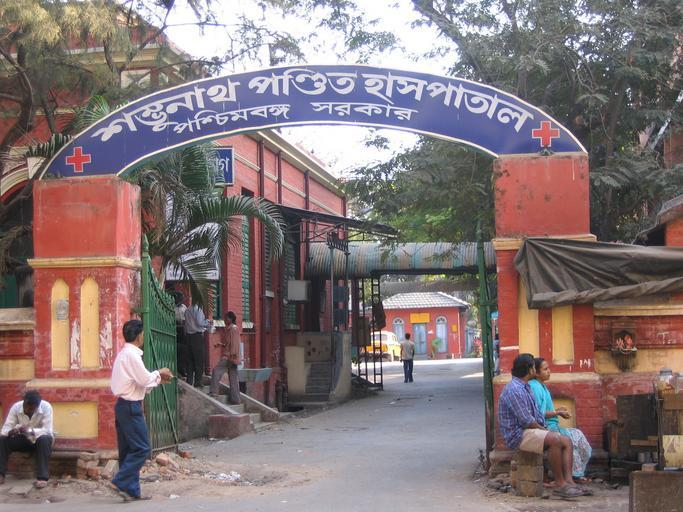

{}
{}
{}
Many speakers in Karnataka and around Bengaluru{{% ref "https://ja.wikipedia.org/wiki/%E3%82%AB%E3%83%B3%E3%83%8A%E3%83%80%E8%AA%9E#/media/%E3%83%95%E3%82%A1%E3%82%A4%E3%83%AB:Kannadaspeakers.png" "Kannada" %}}.
{}

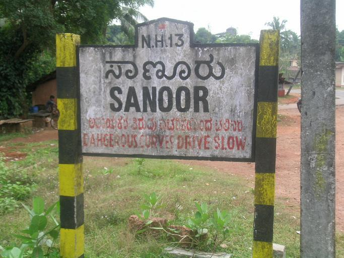

{}
{}
{}
Hindi/Hindustani is a natural language spoken in regions that include Delhi.
{}

{}
{}
{}
Common along the Sri Lanka coastline{}.
{}

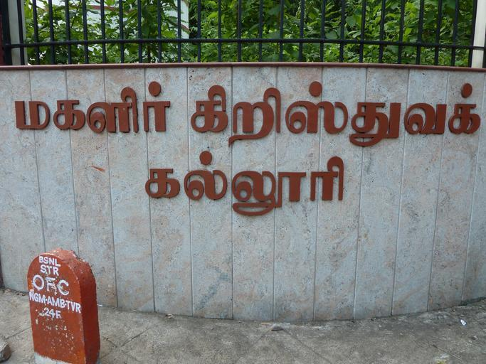

{}
{}
{}
Telugu (తెలుగు) is the official language of Andhra Pradesh and Telangana. The letters often contain shapes like "tsu", "✓", or "m" around the characters{{% ref "https://ja.wikipedia.org/wiki/%E3%83%86%E3%83%AB%E3%82%B0%E8%AA%9E" "Telugu" %}}.
{}

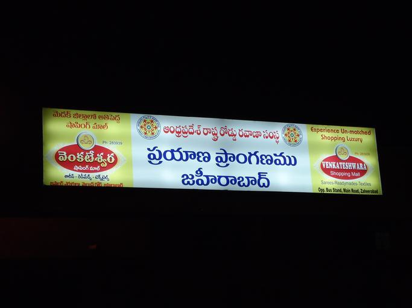

{}
{}
{}
Used in Kerala and {}{{% ref "https://ja.wikipedia.org/wiki/%E3%83%9E%E3%83%A9%E3%83%A4%E3%83%BC%E3%83%A9%E3%83%A0%E8%AA%9E" "Malayalam" %}}.
{}

{}
{}
{}
Found in limited Tibetan cultural areas such as Leh in Ladakh{}.
{}

<a href="http://creativecommons.org/publicdomain/zero/1.0/deed.en" title="Creative Commons Zero, Public Domain Dedication">CC0</a>, <a href="https://commons.wikimedia.org/w/index.php?curid=42014485">Link</a>

{}
{}

    <h4 class="section-title" id="建物">Vehicles</h4>
    <ul class="rule-list">
        <li>State abbreviations appear on license plates</li>
        <li class="no-evidence">Rickshaw colors may vary by region
            <ul>
                <li>Yellow around the windows, green below: seen nationwide but more common in the north{}</li>
                <li>Yellow around the windows, yellow below: try the south?</li>
            </ul>
        </li>
    </ul>

{}
{}
{}
State abbreviations are written on plates. They can often be seen on the sides of buses or trucks, but image quality is sometimes too poor to read. See {{% goto "https://ja.wikipedia.org/wiki/%E3%82%A4%E3%83%B3%E3%83%89%E3%81%AE%E7%9C%8C%E3%81%AE%E4%B8%80%E8%A6%A7" "List of Indian states" %}} for details.
{}

<table style="width:30em">
  <thead>
    <tr>
      <th scope="col">State</th>
      <th scope="col">Abbrev.</th>
      <th scope="col">Example</th>
    </tr>
  </thead>
  <tbody>
    <tr>
        <td>Mizoram</td>
        <td>MZ</td>
        <td>{}</td>
    </tr>
    <tr>
        <td>Himachal Pradesh</td>
        <td>HP</td>
        <td>{}</td>
    </tr>
    <tr>
        <td>West Bengal</td>
        <td>WB</td>
        <td>{}</td>
    </tr>
    <tr>
        <td>Kerala</td>
        <td>KL</td>
        <td>{}</td>
    </tr>
    <tr>
        <td>Tamil Nadu</td>
        <td>TN</td>
        <td>{}</td>
    </tr>
  </tbody>
</table>

By <a href="https://de.wikipedia.org/wiki/User:Chumwa" class="extiw" title="de:User:Chumwa">Maximilian Dörrbecker</a> (<a href="https://de.wikipedia.org/wiki/User:Chumwa" class="extiw" title="de:User:Chumwa">Chumwa</a>) - Own work, <a href="https://creativecommons.org/licenses/by-sa/2.5" title="Creative Commons Attribution-Share Alike 2.5">CC BY-SA 2.5</a>, <a href="https://commons.wikimedia.org/w/index.php?curid=675325">Link</a>

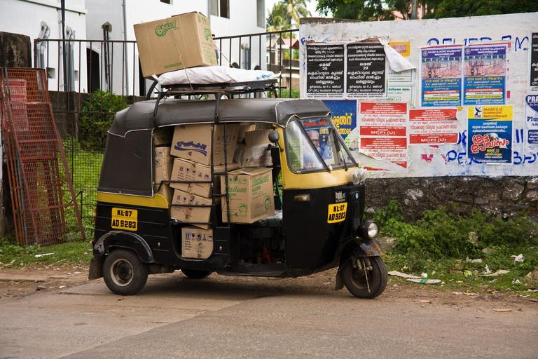

{}
{}
{}
Seen nationwide, but more common in the north{}
{}

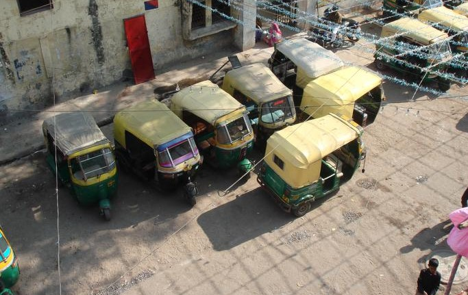

{}
{}
{}
If it is yellow, try the south?
{}

{}
{}

    <h4 class="section-title" id="建物">Architecture</h4>
    <ul class="rule-list">
        <li>There are many houses with brick-like walls or concrete walls and flat tiles, but this is not certain{}</li>
    </ul>

{}
{}
{}
There are many houses with red-painted walls or concrete walls with flat tiles, but this is uncertain{}.
{}

{}
{}
{}
The old city of Jodhpur has many blue-painted walls, and blue buildings can be spotted{}{{% ref "https://ja.wikipedia.org/wiki/%E3%82%B8%E3%83%A7%E3%83%BC%E3%83%89%E3%83%97%E3%83%AB" "Jodhpur" %}}. But they also appear in the south{}, so it is hard to localize.
{}

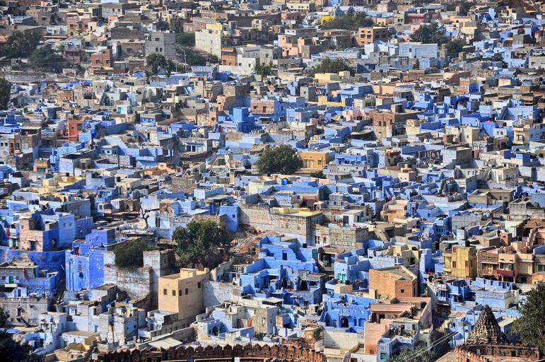

{}
{}

    <h4>Architecture 2</h4>
    <ul class="rule-list">
        <li>Goa: highest rainfall; tall palm trees</li>
        <li>Kerala: tall palms like Goa, but more two-story buildings{}</li>
        <li>Assam: earthquake and flood region; stilt houses and light-material walls appear</li>
    </ul>

{}
{}
{}
The west coast has the highest rainfall, so steep roofs are used. Some houses appear to have a second roof on top{}. As a former part of Portuguese India, Western-style buildings can appear.
{}

{}
{} can feel similar to Goa or Assam, so be careful not to rule them out
{}

By <a href="//commons.wikimedia.org/w/index.php?title=User:Bharath_maraboina123&amp;amp;action=edit&amp;amp;redlink=1" class="new" title="User:Bharath maraboina123 (page does not exist)">Bharath maraboina123</a> - Own work, <a href="https://creativecommons.org/licenses/by-sa/4.0" title="Creative Commons Attribution-Share Alike 4.0">CC BY-SA 4.0</a>, <a href="https://commons.wikimedia.org/w/index.php?curid=49516918">Link</a>

{}
{}
{}
Like Goa, it is rainy and has tall palm trees{}. Traditional Kerala architecture often uses two-story buildings{}{}.
{}

{}
{}
{}
In high-rainfall regions like Kerala or Assam, tall trees like these are common{}{}.
{}

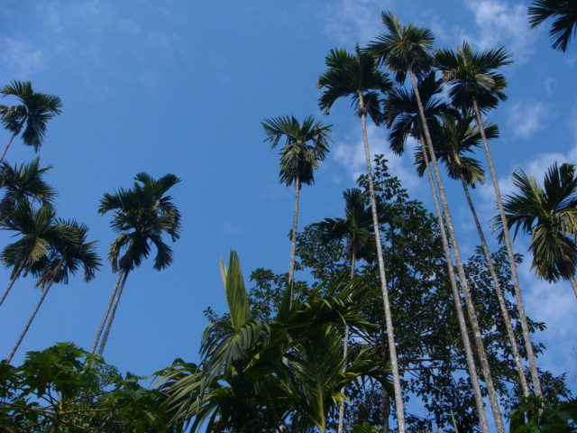

{}
Assam is prone to earthquakes and floods, so light materials like bamboo and stilt houses may appear{}{}. Heavy materials like brick can fail in earthquakes.
{}

By <a href="//commons.wikimedia.org/wiki/User:Nalbarian" title="User:Nalbarian">Nalbarian</a> - Own work, <a href="https://creativecommons.org/licenses/by-sa/4.0" title="Creative Commons Attribution-Share Alike 4.0">CC BY-SA 4.0</a>, <a href="https://commons.wikimedia.org/w/index.php?curid=95668448">Link</a>

{}
{}

    <h4 class="section-title">Pole shapes</h4>
    <ul class="rule-list">
        <li>Pole shapes differ by state or city
            <ul>
                <li>If there is a square hole near the top, it may be a Panjab city{}</li>
                <li class="no-evidence">A yellow rectangular sticker might indicate Uttar Pradesh{}</li>
                <li class="no-evidence">Poles with holes may indicate Gujarat{}{}</li>
                <li class="no-evidence">Sectioned poles may indicate Telangana/Andhra Pradesh?</li>
                <li class="no-evidence">A downward right triangle may indicate Madhya Pradesh?</li>
                <li>Poles shaped like "キ" or "干" appear in Goa</li>
            </ul>
        </li>
    </ul>

{}
{}
{}
A square hole near the top suggests a Panjab city{}
{}

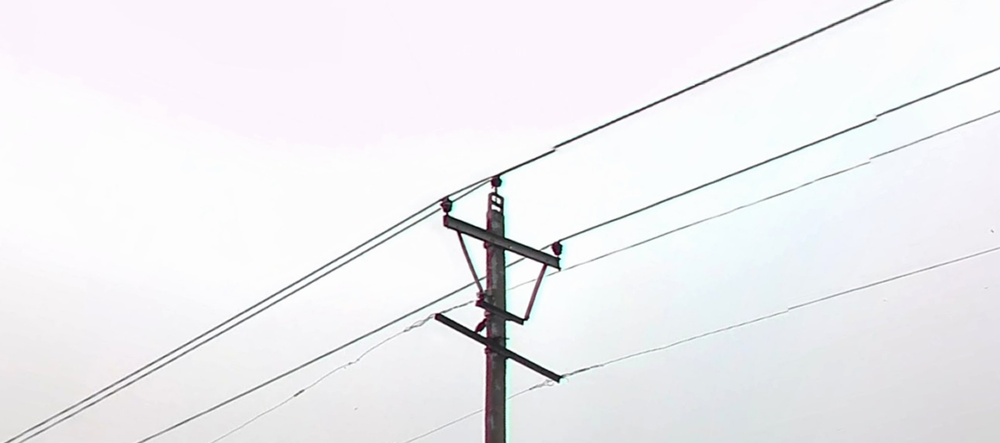

{}
{}
{}
Yellow rectangular stickers can appear{}{}? They may be torn or covered.
{}

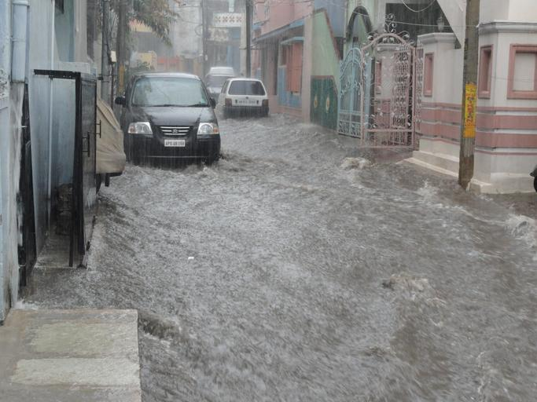

{}
{}

{}
Poles with holes (holy poles) appear{}{}.
{}

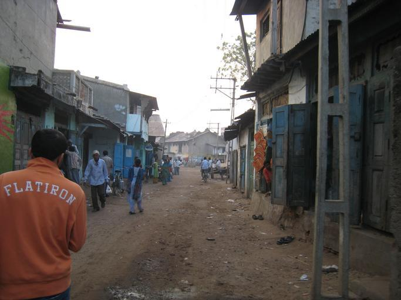

{}
{}

{}
Sectioned poles appear around Hyderabad?
{}

<iframe src="https://www.google.com/maps/embed?pb=!4v1685131807317!6m8!1m7!1sEsD63pL45V0NThU-AZh4pA!2m2!1d17.47859170633478!2d78.56369474671776!3f345.7309758033879!4f-0.6858934272780033!5f3.325193203789971" width="295" height="295" style="border:0;" allowfullscreen="" loading="lazy" referrerpolicy="no-referrer-when-downgrade"></iframe>
<iframe src="https://www.google.com/maps/embed?pb=!4v1685131881912!6m8!1m7!1sUo5VrDL-DpjCXt8hfKOZGg!2m2!1d17.36418399104977!2d78.39518238708081!3f89.58715191863472!4f-4.965387103125224!5f1.6747942011608603" width="295" height="295" style="border:0;" allowfullscreen="" loading="lazy" referrerpolicy="no-referrer-when-downgrade"></iframe>

{}
{}

{}
This mountain-shaped pole seems common everywhere, but a downward triangle at the bottom might be a clue.
{}

<iframe src="https://www.google.com/maps/embed?pb=!4v1685018079861!6m8!1m7!1snAg_kJHTKmx2pcQ__xrJrA!2m2!1d23.89388214738087!2d76.89253305767144!3f248.11187586331368!4f40.08550799520157!5f3.325193203789971" width="295" height="295" style="border:0;" allowfullscreen="" loading="lazy" referrerpolicy="no-referrer-when-downgrade"></iframe>
<iframe src="https://www.google.com/maps/embed?pb=!4v1685018153925!6m8!1m7!1s4IZRg8Z_Jz-HoII4iunIoQ!2m2!1d23.07019340926012!2d77.62068318788117!3f286.91972497971676!4f24.919263281942648!5f3.325193203789971" width="295" height="295" style="border:0;" allowfullscreen="" loading="lazy" referrerpolicy="no-referrer-when-downgrade"></iframe>

{}
{}

{}
Poles shaped like "キ" or "干" feel very reliable.
{}

<iframe src="https://www.google.com/maps/embed?pb=!4v1685018435595!6m8!1m7!1sItWlaAlStjLL4HsKHIxrTQ!2m2!1d15.57571962522207!2d73.8064451970202!3f336.98921646158215!4f11.233819098714903!5f3.325193203789971" width="295" height="295" style="border:0;" allowfullscreen="" loading="lazy" referrerpolicy="no-referrer-when-downgrade"></iframe>
<iframe src="https://www.google.com/maps/embed?pb=!4v1695368856803!6m8!1m7!1sI14s7i-mvSB-ekHbtHp53Q!2m2!1d15.57625692905384!2d73.80637384158902!3f186.04!4f6.780000000000001!5f3.1422555315175162" width="295" height="295" style="border:0;" allowfullscreen="" loading="lazy" referrerpolicy="no-referrer-when-downgrade"></iframe>

{}
{}

    <h4 class="section-title" id="建物">Soil color</h4>
    <ul class="rule-list">
        <li>Soil color varies by region, but image quality is poor and there are many exceptions, so combine with other hints
            <ul>
                <li>Red: reddish soil suggests southeast or south, but the range is broad{}</li>
                <li>Black soil: also called regur soil; common around the Deccan Plateau, though not always black</li>
                <li>Alluvial: light, sandy alluvium deposited by the Indus and Ganges in the north</li>
                <li>Forest: Nepal’s east and west are forested{}</li>
            </ul>
        </li>
    </ul>

{}
{}
{}
Reddish soil: southeast; dark soil: inland south of Delhi; light sandy soil: northern image?
{}

By <a href="http://nroer.in/gstudio/resources/images/show/35270/">National Council of Educational Research and Training(NCERT)</a>, <a href="https://creativecommons.org/licenses/by-sa/3.0/deed.ja">CC BY-SA 3.0</a>, <a href="https://commons.wikimedia.org/w/index.php?curid=27703297">Wikimedia Commons</a>

{}
{}
{}
Reddish soil suggests southeast or south, but the range is broad.
{}

<iframe src="https://www.google.com/maps/embed?pb=!4v1682467696860!6m8!1m7!1sOluJZwXC7iXwDtFZiGAuGw!2m2!1d8.84349947702833!2d77.5365639325106!3f225.12623673033116!4f-6.411466212566282!5f3.169518039872058" width="295" height="295" style="border:0;" allowfullscreen="" loading="lazy" referrerpolicy="no-referrer-when-downgrade"></iframe>
<iframe src="https://www.google.com/maps/embed?pb=!4v1682468578442!6m8!1m7!1s9DnaN2OwV_AHzLcAQ85f0w!2m2!1d21.06955355279361!2d84.30525247708368!3f179.4264476922859!4f-19.858869347516674!5f2.9592035569667035" width="295" height="295" style="border:0;" allowfullscreen="" loading="lazy" referrerpolicy="no-referrer-when-downgrade"></iframe>

{}
{}
{}
Black soil is also called regur soil and is suitable for cotton{}.
{}

<iframe src="https://www.google.com/maps/embed?pb=!4v1682467835049!6m8!1m7!1sAQE1pjOxkCxQGyEeiREzkA!2m2!1d21.83794795470153!2d75.77963971665952!3f156.32961566257794!4f-16.490430386537867!5f1.7890743634877406" width="295" height="295" style="border:0;" allowfullscreen="" loading="lazy" referrerpolicy="no-referrer-when-downgrade"></iframe>
<iframe src="https://www.google.com/maps/embed?pb=!4v1682467876025!6m8!1m7!1s3tPGFcFOFS3VxW4LY3-RmQ!2m2!1d22.92992908739189!2d75.85402923206209!3f222.87806813015754!4f-11.71605331265799!5f3.2114390371456225" width="295" height="295" style="border:0;" allowfullscreen="" loading="lazy" referrerpolicy="no-referrer-when-downgrade"></iframe>

{}
{}
{}
Alluvial deposits from the Indus and Ganges are found in the north. They are generally flat with wetlands and consist of unconsolidated mud, sand, and stone{}.
{}

<iframe src="https://www.google.com/maps/embed?pb=!4v1682468273619!6m8!1m7!1se4CgKszKZKi6alw7JPji7A!2m2!1d29.18795659001541!2d78.19210339952144!3f143.96313802334797!4f-15.105692246985953!5f2.976055030161179" width="295" height="295" style="border:0;" allowfullscreen="" loading="lazy" referrerpolicy="no-referrer-when-downgrade"></iframe>
<iframe src="https://www.google.com/maps/embed?pb=!4v1682468327217!6m8!1m7!1s_xQYI8MT1t4rL3D17_QrNA!2m2!1d26.687065447171!2d83.56086764998268!3f158.54175639985195!4f-11.929120204871097!5f3.2111110012516426" width="295" height="295" style="border:0;" allowfullscreen="" loading="lazy" referrerpolicy="no-referrer-when-downgrade"></iframe>

{}
{}
{}
Even with red soil, if the area is mountainous and heavily forested, consider Nepal’s east/west as well.
{}

<iframe src="https://www.google.com/maps/embed?pb=!4v1682469074724!6m8!1m7!1sDoei_ddObvVfnnyYAktCMQ!2m2!1d29.87155990235058!2d79.70757318913535!3f93.56896264013253!4f12.893076847190144!5f1.6592677506386897" width="295" height="295" style="border:0;" allowfullscreen="" loading="lazy" referrerpolicy="no-referrer-when-downgrade"></iframe>
<iframe src="https://www.google.com/maps/embed?pb=!4v1682469213683!6m8!1m7!1sjTU0xex_3iWaHCFMP0H9Kg!2m2!1d26.9355147072377!2d88.44909055797791!3f343.5479801851562!4f6.649843690657178!5f0.7820865974627469" width="295" height="295" style="border:0;" allowfullscreen="" loading="lazy" referrerpolicy="no-referrer-when-downgrade"></iframe>

{}
{}

    <h2 class="section-title">{}</h2>
    <ul class="rule-list">
        <li>There is a city called Leh at over 3,600m where Tibetans form the majority</li>
        <li>If you see yellow labels with numbers on street poles, it may be Chandigarh{}{}</li>
    </ul>

{}
{}
{}
Tibetan script appears in town{}, and mountains are visible in all directions{}. Outside summer, access is only by air, and the town has an airport.
{}

{}
{}

    <h4 class="mb-4">Representative companies</h4>
    <table class="table table-striped table-bordered">
        <thead class="table-light">
            <tr>
                <th scope="col" class="col-width-2">Company</th>
                <th scope="col" class="col-width-1">Code</th>
                <th scope="col" class="col-width-7">Description</th>
                <th scope="col" class="col-width-05">Earnings</th>
                <th scope="col" class="col-width-05">Dividend history</th>
            </tr>
        </thead>
        <tbody class="corp-desc">
            <tr>
                <td>HDFC Bank</td>
                <td>{}</td>
                <td>India’s largest private bank by assets and market cap.</td>
                <td>{}</td>
                <td>{}</td>
            </tr>
            <tr>
                <td>ICICI Bank</td>
                <td>{}</td>
                <td>One of India’s largest banks; designated as a systemically important financial institution by the Reserve Bank of India{}.</td>
                <td>{}</td>
                <td>{}</td>
            </tr>
            <tr>
                <td>Reliance Industries</td>
                <td>-</td>
                <td>India’s largest private company. A conglomerate spanning resources, petrochemicals, entertainment, and telecom. Member of the NIFTY 50{}.</td>
                <td>-</td>
                <td>-</td>
            </tr>
        </tbody>
    </table>

