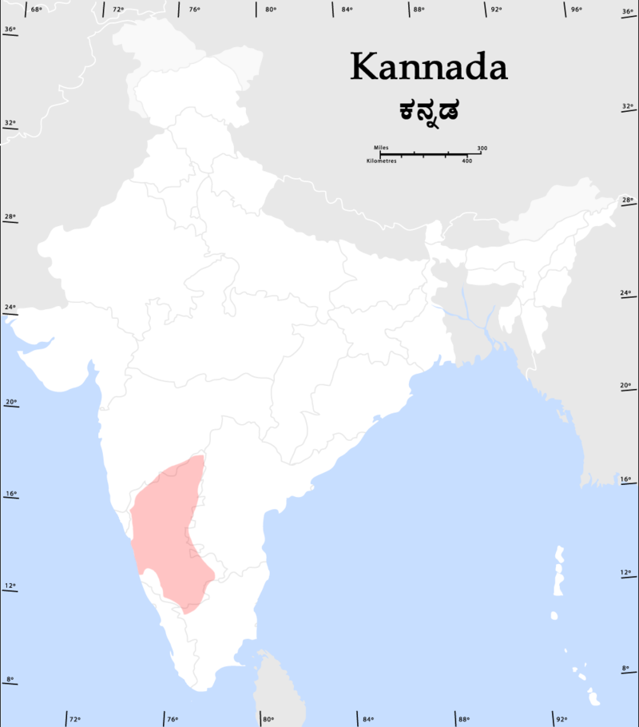

    <h2 class="section-title">国の見分け方</h2>
    <ul class="rule-list">
        <li>言語はヒンディー語など（地域によって違う）</li>
        <li>ドメインは.id</li>
        <li>インドは都市圏でも住所システムが完全には整備されておらず、商品が届かないことがある（{}）。そのため確実に郵便が届くように住所を看板などに明記している店が多い？日本と逆で、末尾ほど大きな地域名。</li>
    </ul>

{}
{}
{}
{}

<iframe src="https://www.google.com/maps/embed?pb=!4v1680576614545!6m8!1m7!1sCqX7Zdaaiyw21z6aQ3HtCg!2m2!1d29.87147887963868!2d79.62983076241443!3f139.35104298712295!4f-1.9042464036854057!5f3.325193203789971" width="295" height="295" style="border:0;" allowfullscreen="" loading="lazy" referrerpolicy="no-referrer-when-downgrade"></iframe>
<iframe src="https://www.google.com/maps/embed?pb=!4v1680006391122!6m8!1m7!1sbg2cWdtnCh6ZxAm9tEWftw!2m2!1d28.73735204454535!2d77.21867054352147!3f261.684470921806!4f-0.4273194847891375!5f3.325193203789971" width="295" height="295" style="border:0;" allowfullscreen="" loading="lazy" referrerpolicy="no-referrer-when-downgrade"></iframe>

{}
{}

<iframe src="https://www.google.com/maps/embed?pb=!4v1680576816311!6m8!1m7!1sqGG73951gMN6Ai7KuDktng!2m2!1d21.81631263462618!2d69.52585548531856!3f298.1681275967205!4f15.406022583345504!5f3.324875573278878" width="295" height="295" style="border:0;" allowfullscreen="" loading="lazy" referrerpolicy="no-referrer-when-downgrade"></iframe>
<iframe src="https://www.google.com/maps/embed?pb=!4v1680577309648!6m8!1m7!1sxphJ4suzq6IyEdQjMvHENA!2m2!1d26.46593307498799!2d80.3005460242372!3f162.2622085832344!4f13.82284962866919!5f3.325193203789971" width="295" height="295" style="border:0;" allowfullscreen="" loading="lazy" referrerpolicy="no-referrer-when-downgrade"></iframe>

{}
{}

{}
{}

{}
{}

{}
{}

{}
{}

{}
{}

<iframe src="https://www.google.com/maps/embed?pb=!4v1680576768727!6m8!1m7!1sCsSa5qjKdB5LG7H7frTarQ!2m2!1d21.59733304072305!2d71.90063518036595!3f173.3701617639863!4f-11.334221154583702!5f2.8168867633906376" width="295" height="295" style="border:0;" allowfullscreen="" loading="lazy" referrerpolicy="no-referrer-when-downgrade"></iframe>

{}
{}

<iframe width="590" height="315" src="https://www.youtube.com/embed/W57wmjn4Zac" title="YouTube video player" frameborder="0" allow="accelerometer; autoplay; clipboard-write; encrypted-media; gyroscope; picture-in-picture; web-share" allowfullscreen></iframe>

{}
{}

    <h2 class="section-title">州・地域の見分け方</h2>
    <ul class="rule-list">
        <li>地域ごとに言語が違うので文字の形で見分けられる{}</li>
        <li>デリーなどの都心はセクターやブロックの名前でさらに地域を絞り込める</li>
    </ul>

{}
{}
{}
アフマダーバード周辺。ちなみに階段井戸もアフマダーバード周辺に多い。
{}

<iframe src="https://www.google.com/maps/embed?pb=!4v1680006839051!6m8!1m7!1s1zGb5v2fx6aykeBSp6BzIw!2m2!1d23.01818260084139!2d72.56476740058423!3f300.0008783178411!4f4.627254944041155!5f3.325193203789971" width="295" height="295" style="border:0;" allowfullscreen="" loading="lazy" referrerpolicy="no-referrer-when-downgrade"></iframe>
<iframe src="https://www.google.com/maps/embed?pb=!4v1680006860530!6m8!1m7!1s4y3L_APhq6AMve_jzUfZeA!2m2!1d23.01829694337689!2d72.564890322699!3f7.804072054804488!4f6.50782459650172!5f1.8717339161405784" width="295" height="295" style="border:0;" allowfullscreen="" loading="lazy" referrerpolicy="no-referrer-when-downgrade"></iframe>

{}
{}
{}
画像出典：{{% by "https://ja.wikipedia.org/wiki/%E3%82%AB%E3%83%B3%E3%83%8A%E3%83%80%E8%AA%9E#/media/%E3%83%95%E3%82%A1%E3%82%A4%E3%83%AB:Kannadaspeakers.png" "wiki" "カンナダ語" %}}
{}

<iframe src="https://www.google.com/maps/embed?pb=!4v1680006555635!6m8!1m7!1s4SEAcMmP8hx87rWxqP9c0A!2m2!1d13.04361154116076!2d77.5474873331359!3f117.50972523192821!4f15.68591794847461!5f2.7914502814668984" width="295" height="295" style="border:0;" allowfullscreen="" loading="lazy" referrerpolicy="no-referrer-when-downgrade"></iframe>

{}
{}
{}
デリーを含む地域で話される自然言語。
{}

<iframe src="https://www.google.com/maps/embed?pb=!4v1680006391122!6m8!1m7!1sbg2cWdtnCh6ZxAm9tEWftw!2m2!1d28.73735204454535!2d77.21867054352147!3f261.684470921806!4f-0.4273194847891375!5f3.325193203789971" width="295" height="295" style="border:0;" allowfullscreen="" loading="lazy" referrerpolicy="no-referrer-when-downgrade"></iframe>

{}
{}

