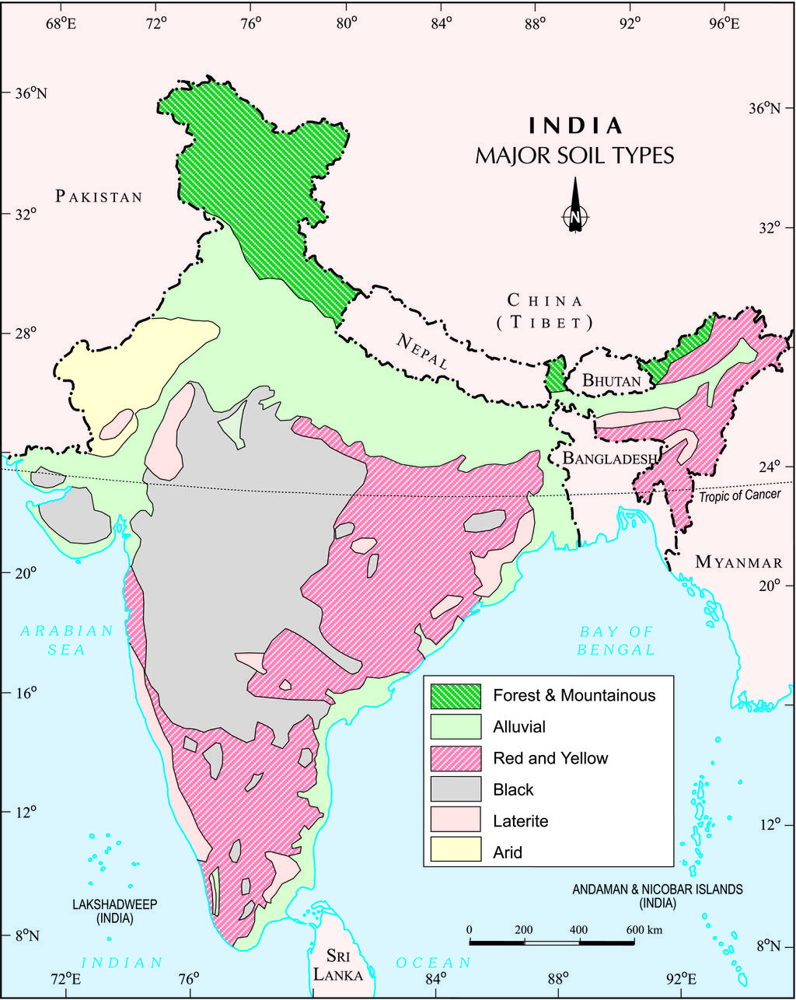
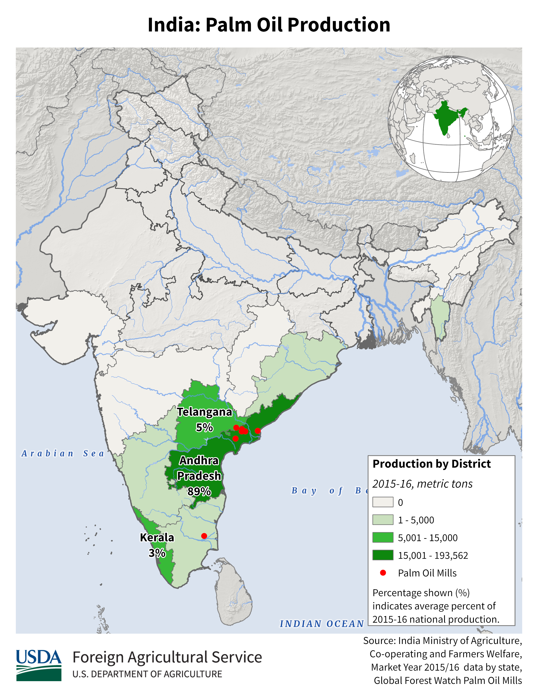
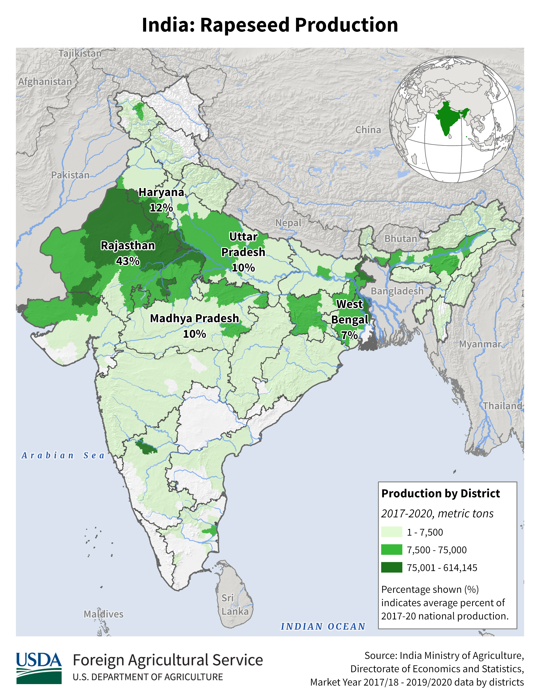
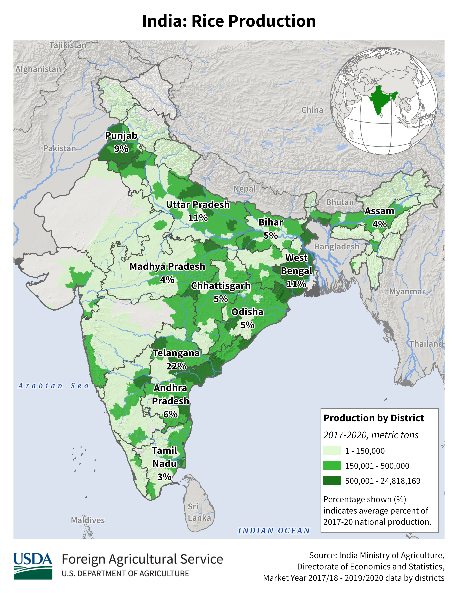

    <h2 class="section-title">{}</h2>
    <ul class="rule-list">
        <li>ドメインは.id</li>
        <li>言語はヒンディー語など（地域によって違う）</li>
    </ul>
    {}

{}
{}
{}
言語が特徴的なので慣れれば判別できる。デリーのような都心では看板の下に英語で住所が書いてあることも多いが都市部でさらに絞り込むのは結構難しい。インドは都市圏でも住所システムが完全には整備されておらずときどき商品が届かないこともある{}とか。
{}

<iframe src="https://www.google.com/maps/embed?pb=!4v1680576614545!6m8!1m7!1sCqX7Zdaaiyw21z6aQ3HtCg!2m2!1d29.87147887963868!2d79.62983076241443!3f139.35104298712295!4f-1.9042464036854057!5f3.325193203789971" width="295" height="295" style="border:0;" allowfullscreen="" loading="lazy" referrerpolicy="no-referrer-when-downgrade"></iframe>
<iframe src="https://www.google.com/maps/embed?pb=!4v1682469802588!6m8!1m7!1sdud8_9E_fzA4BL2i3j9CRA!2m2!1d28.65780207700633!2d77.23522014625584!3f52.38936005181625!4f11.563453983215112!5f1.6008206138207792" width="295" height="295" style="border:0;" allowfullscreen="" loading="lazy" referrerpolicy="no-referrer-when-downgrade"></iframe>

{}
電柱の形が特徴的で、また配線が綺麗に整備されていない場合も多い。
{}

<iframe src="https://www.google.com/maps/embed?pb=!4v1680576816311!6m8!1m7!1sqGG73951gMN6Ai7KuDktng!2m2!1d21.81631263462618!2d69.52585548531856!3f298.1681275967205!4f15.406022583345504!5f3.324875573278878" width="295" height="295" style="border:0;" allowfullscreen="" loading="lazy" referrerpolicy="no-referrer-when-downgrade"></iframe>
<iframe src="https://www.google.com/maps/embed?pb=!4v1680577309648!6m8!1m7!1sxphJ4suzq6IyEdQjMvHENA!2m2!1d26.46593307498799!2d80.3005460242372!3f162.2622085832344!4f13.82284962866919!5f3.325193203789971" width="295" height="295" style="border:0;" allowfullscreen="" loading="lazy" referrerpolicy="no-referrer-when-downgrade"></iframe>

{}
{}

<iframe width="590" height="315" src="https://www.youtube.com/embed/rDZ4oudc9y0" title="YouTube video player" frameborder="0" allow="accelerometer; autoplay; clipboard-write; encrypted-media; gyroscope; picture-in-picture; web-share" allowfullscreen></iframe>
<iframe width="590" height="315" src="https://www.youtube.com/embed/W57wmjn4Zac" title="YouTube video player" frameborder="0" allow="accelerometer; autoplay; clipboard-write; encrypted-media; gyroscope; picture-in-picture; web-share" allowfullscreen></iframe>

{}
{}

{}
バーンスリー
{}

<iframe width="560" height="315" src="https://www.youtube.com/embed/NfbT1Rgos4I" title="YouTube video player" frameborder="0" allow="accelerometer; autoplay; clipboard-write; encrypted-media; gyroscope; picture-in-picture; web-share" allowfullscreen></iframe>

{}
{}

    <h2 class="section-title">{}</h2>
    <ul class="rule-list">
        <li>土の色が地域ごとに異なる</li>
    </ul>

{}
{}
{}
真っ赤な土は南西か南、黒っぽい色はデリーから南の内陸、サラサラの白っぽい土は北の方のイメージ？（画像出典：By <a href="http://nroer.in/gstudio/resources/images/show/35270/">National Council of Educational Research and Training(NCERT)</a>, <a href="https://creativecommons.org/licenses/by-sa/3.0/deed.ja">CC BY-SA 3.0</a>, <a href="https://commons.wikimedia.org/w/index.php?curid=27703297">Wikimedia Commons</a>）
{}

{}
{}
{}
真っ赤な土は南西か南の可能性があるが範囲は結構広い
{}

<iframe src="https://www.google.com/maps/embed?pb=!4v1682467696860!6m8!1m7!1sOluJZwXC7iXwDtFZiGAuGw!2m2!1d8.84349947702833!2d77.5365639325106!3f225.12623673033116!4f-6.411466212566282!5f3.169518039872058" width="295" height="295" style="border:0;" allowfullscreen="" loading="lazy" referrerpolicy="no-referrer-when-downgrade"></iframe>
<iframe src="https://www.google.com/maps/embed?pb=!4v1682468578442!6m8!1m7!1s9DnaN2OwV_AHzLcAQ85f0w!2m2!1d21.06955355279361!2d84.30525247708368!3f179.4264476922859!4f-19.858869347516674!5f2.9592035569667035" width="295" height="295" style="border:0;" allowfullscreen="" loading="lazy" referrerpolicy="no-referrer-when-downgrade"></iframe>

{}
{}
{}
黒土はレグール土とも呼ばれ、綿花の栽培にも向いている。{}。
{}

<iframe src="https://www.google.com/maps/embed?pb=!4v1682467835049!6m8!1m7!1sAQE1pjOxkCxQGyEeiREzkA!2m2!1d21.83794795470153!2d75.77963971665952!3f156.32961566257794!4f-16.490430386537867!5f1.7890743634877406" width="295" height="295" style="border:0;" allowfullscreen="" loading="lazy" referrerpolicy="no-referrer-when-downgrade"></iframe>
<iframe src="https://www.google.com/maps/embed?pb=!4v1682467876025!6m8!1m7!1s3tPGFcFOFS3VxW4LY3-RmQ!2m2!1d22.92992908739189!2d75.85402923206209!3f222.87806813015754!4f-11.71605331265799!5f3.2114390371456225" width="295" height="295" style="border:0;" allowfullscreen="" loading="lazy" referrerpolicy="no-referrer-when-downgrade"></iframe>

{}
{}
{}
インダス川、ガンジス川によって堆積した沖積層（alluvial）が北部にある。一般的には平坦で湿地が散見され、
主に固まっていない泥、砂、石から構成される{}。
{}

<iframe src="https://www.google.com/maps/embed?pb=!4v1682468273619!6m8!1m7!1se4CgKszKZKi6alw7JPji7A!2m2!1d29.18795659001541!2d78.19210339952144!3f143.96313802334797!4f-15.105692246985953!5f2.976055030161179" width="295" height="295" style="border:0;" allowfullscreen="" loading="lazy" referrerpolicy="no-referrer-when-downgrade"></iframe>
<iframe src="https://www.google.com/maps/embed?pb=!4v1682468327217!6m8!1m7!1s_xQYI8MT1t4rL3D17_QrNA!2m2!1d26.687065447171!2d83.56086764998268!3f158.54175639985195!4f-11.929120204871097!5f3.2111110012516426" width="295" height="295" style="border:0;" allowfullscreen="" loading="lazy" referrerpolicy="no-referrer-when-downgrade"></iframe>

{}
{}
{}
土が赤くても周りが険しい山で森が多いならばネパールの東西なども検討する。
{}

<iframe src="https://www.google.com/maps/embed?pb=!4v1682469074724!6m8!1m7!1sDoei_ddObvVfnnyYAktCMQ!2m2!1d29.87155990235058!2d79.70757318913535!3f93.56896264013253!4f12.893076847190144!5f1.6592677506386897" width="295" height="295" style="border:0;" allowfullscreen="" loading="lazy" referrerpolicy="no-referrer-when-downgrade"></iframe>
<iframe src="https://www.google.com/maps/embed?pb=!4v1682469213683!6m8!1m7!1sjTU0xex_3iWaHCFMP0H9Kg!2m2!1d26.9355147072377!2d88.44909055797791!3f343.5479801851562!4f6.649843690657178!5f0.7820865974627469" width="295" height="295" style="border:0;" allowfullscreen="" loading="lazy" referrerpolicy="no-referrer-when-downgrade"></iframe>

{}
{}

    <ul class="rule-list">
        <li>地域ごとに言語が違う{}</li>
    </ul>

{}
{}

<table class="word-list">
<tr>
    <th>言語名</th> <th>表記</th>
</tr>
<tr><td>日本</td><td>日本料理レストラン</td></tr>
<tr><td>シンハラ</td><td>ජපන් අවන්හල</td></tr>
<tr><td>アッサム</td><td>জাপানীজ ৰেষ্টুৰেণ্ট</td></tr>
<tr><td>カンナダ</td><td>ಜಪಾನೀಸ್ ರೆಸ್ಟೋರೆಂಟ್</td></tr>
<tr><td>グジャラート</td><td>જાપાનીઝ રેસ્ટોરન્ટ</td></tr>
<tr><td>タミル</td><td>ஜப்பானிய உணவகம்</td></tr>
<tr><td>テルグ</td><td>జపనీస్ రెస్టారెంట్</td></tr>
<tr><td>ベンガル</td><td>জাপানি রেস্তোরা</td></tr>
<tr><td>ヒンディー</td><td>जापानी रेस्टोरेंट</td></tr>
<tr><td>クメール</td><td>ភោជនីយដ្ឋានជប៉ុន</td></tr>
<tr><td>ラオ</td><td>ຮ້ານອາຫານຍີ່ປຸ່ນ</td></tr>
<tr><td>タイ</td><td>ร้านอาหารญี่ปุ่น</td></tr>
</table>

{}
{}
{}
アフマダーバード周辺。ちなみに階段井戸もアフマダーバード周辺に多い。
{}

<iframe src="https://www.google.com/maps/embed?pb=!4v1680006839051!6m8!1m7!1s1zGb5v2fx6aykeBSp6BzIw!2m2!1d23.01818260084139!2d72.56476740058423!3f300.0008783178411!4f4.627254944041155!5f3.325193203789971" width="295" height="295" style="border:0;" allowfullscreen="" loading="lazy" referrerpolicy="no-referrer-when-downgrade"></iframe>
<iframe src="https://www.google.com/maps/embed?pb=!4v1680006860530!6m8!1m7!1s4y3L_APhq6AMve_jzUfZeA!2m2!1d23.01829694337689!2d72.564890322699!3f7.804072054804488!4f6.50782459650172!5f1.8717339161405784" width="295" height="295" style="border:0;" allowfullscreen="" loading="lazy" referrerpolicy="no-referrer-when-downgrade"></iframe>

{}
{}
{}
カルナータカ地方とベンガルール周辺に話者が多い{{% ref "https://ja.wikipedia.org/wiki/%E3%82%AB%E3%83%B3%E3%83%8A%E3%83%80%E8%AA%9E#/media/%E3%83%95%E3%82%A1%E3%82%A4%E3%83%AB:Kannadaspeakers.png" "カンナダ語" %}}。
{}

<iframe src="https://www.google.com/maps/embed?pb=!4v1680006555635!6m8!1m7!1s4SEAcMmP8hx87rWxqP9c0A!2m2!1d13.04361154116076!2d77.5474873331359!3f117.50972523192821!4f15.68591794847461!5f2.7914502814668984" width="295" height="295" style="border:0;" allowfullscreen="" loading="lazy" referrerpolicy="no-referrer-when-downgrade"></iframe>

{}
{}
{}
ヒンディー語・ヒンドゥスターニー語はデリーを含む地域で話される自然言語。
{}

<iframe src="https://www.google.com/maps/embed?pb=!4v1680006391122!6m8!1m7!1sbg2cWdtnCh6ZxAm9tEWftw!2m2!1d28.73735204454535!2d77.21867054352147!3f261.684470921806!4f-0.4273194847891375!5f3.325193203789971" width="295" height="295" style="border:0;" allowfullscreen="" loading="lazy" referrerpolicy="no-referrer-when-downgrade"></iframe>

{}
{}
{}
スリランカの海岸沿いに多い。
{}

<iframe src="https://www.google.com/maps/embed?pb=!4v1682101003545!6m8!1m7!1sFb461y1SYMMG6X4Bss19Yg!2m2!1d10.85434123330329!2d78.70991798618508!3f255.947668151077!4f3.4817149585278173!5f1.7113530487541073" width="295" height="295" style="border:0;" allowfullscreen="" loading="lazy" referrerpolicy="no-referrer-when-downgrade"></iframe>

{}
{}
{}
テルグ語（తెలుగు）はアーンドラ・プラデーシュ州およびテランガーナ州の公用語。文字の周りにある「つ」「✓」「ｍ」のような形が特徴的{{% ref "https://ja.wikipedia.org/wiki/%E3%83%86%E3%83%AB%E3%82%B0%E8%AA%9E" "テルグ語" %}}。
{}

<iframe src="https://www.google.com/maps/embed?pb=!4v1683536379262!6m8!1m7!1siPrv0pkeitRMVQ8ce8UkRg!2m2!1d14.90588514508056!2d79.86349239934395!3f246.87675993779882!4f9.734625500123414!5f3.139402080150767" width="295" height="295" style="border:0;" allowfullscreen="" loading="lazy" referrerpolicy="no-referrer-when-downgrade"></iframe>
<iframe src="https://www.google.com/maps/embed?pb=!4v1683536507928!6m8!1m7!1sRxKQRYgkNPC6m9Rv2URtsg!2m2!1d17.24747772616979!2d80.14134607062307!3f4.732751074080325!4f12.886439959891234!5f2.832146649303087" width="295" height="295" style="border:0;" allowfullscreen="" loading="lazy" referrerpolicy="no-referrer-when-downgrade"></iframe>

{}
{}

    <ul class="rule-list">
        <li>農業が場所によって異なる
            <ul>
                <li>農作物の分布データ出典：<a href="https://ipad.fas.usda.gov/countrysummary/default.aspx?id=IN">U.S. DEPARTMENT OF AGRICULTUREUSDA(USDA)</a></li>
            </ul>
        </li>
    </ul>

{}
{}

{}
南全域に存在しており、とりわけ南東側に多い。
{}
{}
{}

{}
北の方の特に乾燥した地域周辺に多い。
{}

<iframe src="https://www.google.com/maps/embed?pb=!4v1684386132338!6m8!1m7!1s6H7XGG6zf5BRQZTgWOIOBg!2m2!1d27.09125165384609!2d72.24390807022428!3f210.5965039749511!4f-8.053181292628878!5f0.7820865974627469" width="500" height="250" style="border:0;" allowfullscreen="" loading="lazy" referrerpolicy="no-referrer-when-downgrade"></iframe>

{}
{}

{}
{}