

    <h2 class="section-title">{}</h2>
    <ul class="rule-list">
        <li>ドメインは.in(2023/7/31修正、コメントご指摘ありがとうございます)</li>
        <li>言語はヒンディー語など多数の言語が存在し地域によって異なる</li>
        <li>特徴的な形の電柱が多い（{}）</li>
    </ul>
    {}

{}
{}
{}
言語が特徴的{}で英語のみの時もある{}。また都心では看板の下に英語で住所が書いてあることも多いので都市の判別はすぐにできることが多い{}。しかし、インドは都市圏でも住所システムが完全には整備されておらずときどき商品が届かないこともある{}くらいなので、住所が分かっていても地域や道路を絞り込むのは結構難しいかも。
{}

{}
電柱の配線が綺麗に整備されていない場合も多い。
{}

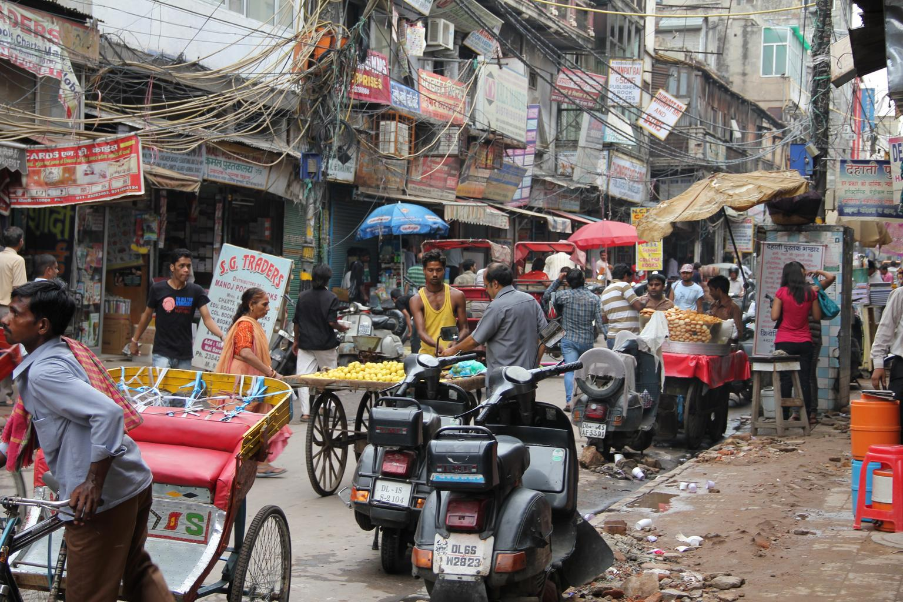

{}
他の国ではあまり見かけない形の電柱が多い{}（{}）。一番多いのは「山」や「⚓」の形のような上部が３つに分かれた電柱{}。
{}

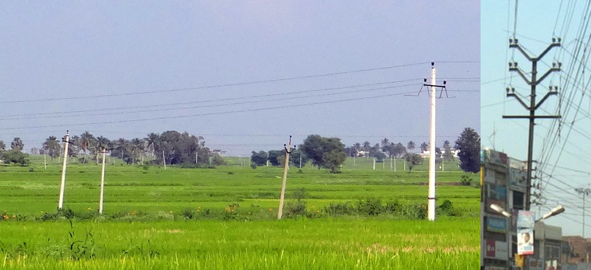

{}
インドでたまに見かける白黒のボラードのようなもの{}。右のように{}にありそうな形のボラードもある{}。
{}

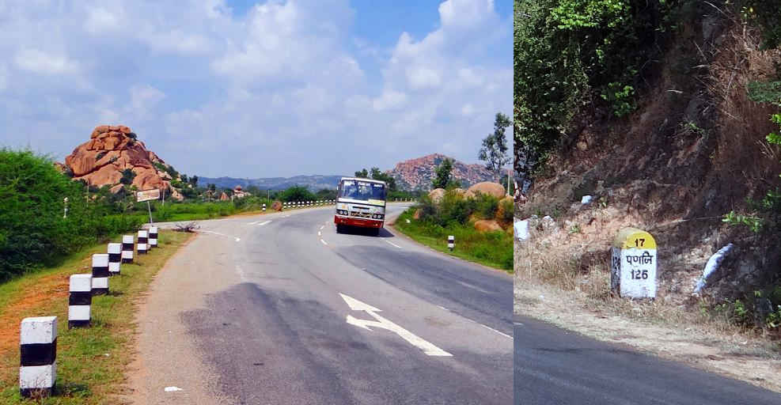

{}
{}

{}
ナンバーは白・黄・黒色など複数存在する。EUのナンバーに見えるタイプは見間違えないように注意{}。
{}

<iframe src="https://www.google.com/maps/embed?pb=!4v1689072559136!6m8!1m7!1safd2f2VgriHB1IqAeeiMVw!2m2!1d23.23867177230191!2d77.38986018900181!3f57.85938112510194!4f-6.020780724911873!5f3.293292491545769" width="500" height="300" style="border:0;" allowfullscreen="" loading="lazy" referrerpolicy="no-referrer-when-downgrade"></iframe>

{}

自作、大まかな形で正確な形状ではないです
{}

{}
{}

<iframe width="590" height="315" src="https://www.youtube.com/embed/rDZ4oudc9y0" title="YouTube video player" frameborder="0" allow="accelerometer; autoplay; clipboard-write; encrypted-media; gyroscope; picture-in-picture; web-share" allowfullscreen></iframe>
<iframe width="590" height="315" src="https://www.youtube.com/embed/W57wmjn4Zac" title="YouTube video player" frameborder="0" allow="accelerometer; autoplay; clipboard-write; encrypted-media; gyroscope; picture-in-picture; web-share" allowfullscreen></iframe>

{}
{}

<iframe width="560" height="315" src="https://www.youtube.com/embed/NfbT1Rgos4I" title="YouTube video player" frameborder="0" allow="accelerometer; autoplay; clipboard-write; encrypted-media; gyroscope; picture-in-picture; web-share" allowfullscreen></iframe>

{}
{}

    <h2 class="section-title">{}</h2>
    <h4 class="section-title" id="言語">言語</h4>
    <ul class="rule-list">
        <li>州ごとに異なる旗がある</li>
        <li>地域ごとに言語が違う{}</li>
    </ul>

{}
{}

<blockquote class="twitter-tweet">
<a href="https://twitter.com/hashtag/India?src=hash&amp;ref_src=twsrc%5Etfw">#India</a>&#39;s 22 scheduled <a href="https://twitter.com/hashtag/languages?src=hash&amp;ref_src=twsrc%5Etfw">#languages</a> by the name of the script they use <a href="https://t.co/PBDqehiogD">pic.twitter.com/PBDqehiogD</a>
&mdash; India in Pixels by Ashris (@indiainpixels) <a href="https://twitter.com/indiainpixels/status/1350804912100179970?ref_src=twsrc%5Etfw">January 17, 2021</a></blockquote> 

<blockquote class="twitter-tweet">
インドの主要な言語の分布と、その見分け方について解説しました！<a href="https://twitter.com/hashtag/GeoGuessr?src=hash&amp;ref_src=twsrc%5Etfw">#GeoGuessr</a> <a href="https://t.co/NL4wmCBzcz">pic.twitter.com/NL4wmCBzcz</a>
&mdash; LAKE TOUYA / とうや (@geotouya) <a href="https://twitter.com/geotouya/status/1721112634144285157?ref_src=twsrc%5Etfw">November 5, 2023</a></blockquote> 

{}
{}
{}
アフマダーバード周辺。ちなみに階段井戸もアフマダーバード周辺に多い。
{}

By <a href="//commons.wikimedia.org/wiki/User:Aksi_great" title="User:Aksi great">Aksi great</a>, Dipan Shukla - Own work, <a href="http://creativecommons.org/licenses/by-sa/3.0/" title="Creative Commons Attribution-Share Alike 3.0">CC BY-SA 3.0</a>, <a href="https://commons.wikimedia.org/w/index.php?curid=3323700">Link</a>

{}
{}
{}
◁の形が文字中に散見される。
{}

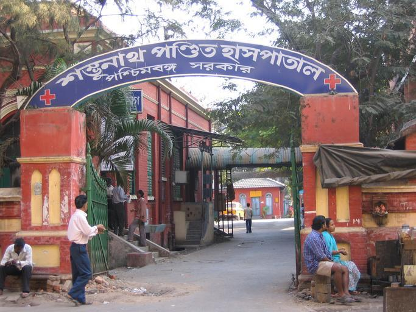

{}
{}
{}
カルナータカ地方とベンガルール周辺に話者が多い{{% ref "https://ja.wikipedia.org/wiki/%E3%82%AB%E3%83%B3%E3%83%8A%E3%83%80%E8%AA%9E#/media/%E3%83%95%E3%82%A1%E3%82%A4%E3%83%AB:Kannadaspeakers.png" "カンナダ語" %}}。
{}

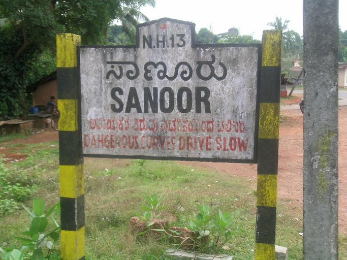

{}
{}
{}
ヒンディー語・ヒンドゥスターニー語はデリーを含む地域で話される自然言語。
{}

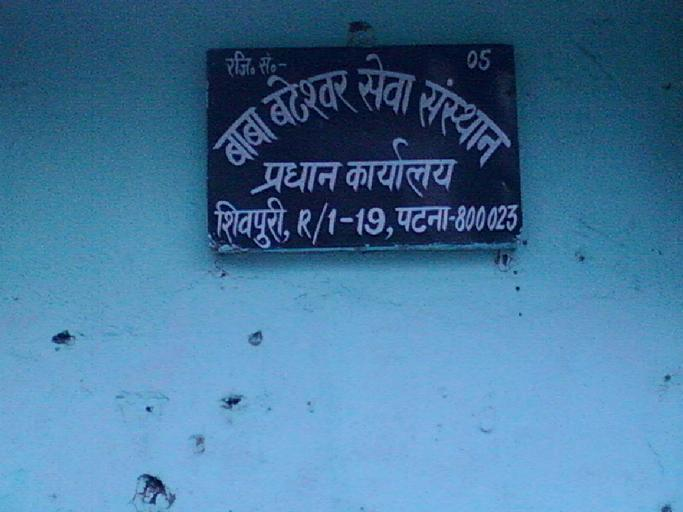

{}
{}
{}
スリランカの海岸沿いに多い{}。
{}

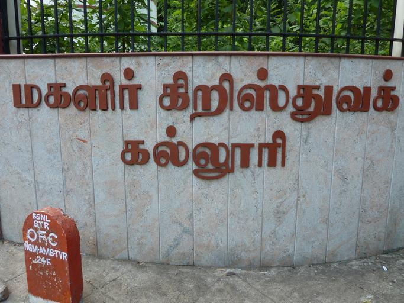

{}
{}
{}
テルグ語（తెలుగు）はアーンドラ・プラデーシュ州およびテランガーナ州の公用語。文字の周りにある「つ」「✓」「ｍ」のような形が特徴的{{% ref "https://ja.wikipedia.org/wiki/%E3%83%86%E3%83%AB%E3%82%B0%E8%AA%9E" "テルグ語" %}}。
{}

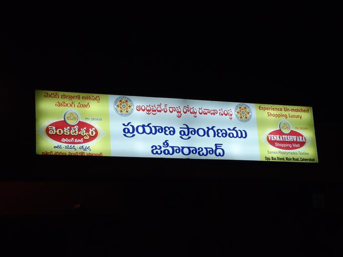

{}
{}
{}
ケーララ州で使用されている言語{{% ref "https://ja.wikipedia.org/wiki/%E3%83%9E%E3%83%A9%E3%83%A4%E3%83%BC%E3%83%A9%E3%83%A0%E8%AA%9E" "マラヤーラム語" %}}。
{}

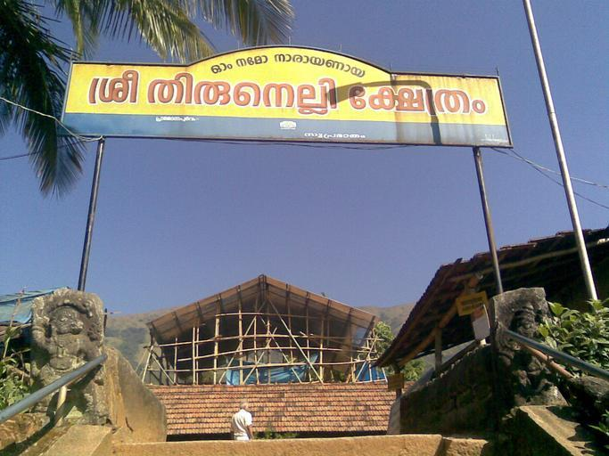

{}
{}

    <h4 class="section-title" id="建物">乗り物</h4>
    <ul class="rule-list">
        <li>ナンバープレートなどに州名の省略形が見つかる</li>
        <li class="no-evidence">リクシャー（rickshaw）の色が地域によって違うらしい
            <ul>
                <li>窓の周りが黄色・下が緑色：全域で見られるが北部に多い{}</li>
                <li>窓の周りが黄色・下が黄色：南に行ってみる？</li>
            </ul>
        </li>
    </ul>

{}
{}
{}
ナンバープレートに州名が書かれている。バスやトラックの側面に書いてあるものは視認できることが多いが画質は悪く読めないことも多い。州名は{{% goto "https://ja.wikipedia.org/wiki/%E3%82%A4%E3%83%B3%E3%83%89%E3%81%AE%E7%9C%8C%E3%81%AE%E4%B8%80%E8%A6%A7" "インドの県の一覧" %}}を見てください。
{}

<table style="width:30em">
  <thead>
    <tr>
      <th scope="col">州名</th>
      <th scope="col">省略形</th>
      <th scope="col">具体例</th>
    </tr>
  </thead>
  <tbody>
    <tr>
        <td>ミゾラム</td>
        <td>MZ</td>
        <td>{}</td>
    </tr>
    <tr>
        <td>ヒマチャル・プラデシュ</td>
        <td>HP</td>
        <td>{}</td>
    </tr>
    <tr>
        <td>西ベンガル</td>
        <td>WB</td>
        <td>{}</td>
    </tr>
    <tr>
        <td>ケーララ</td>
        <td>KL</td>
        <td>{}</td>
    </tr>
    <tr>
        <td>タミル·ナードゥ</td>
        <td>TN</td>
        <td>{}</td>
    </tr>
  </tbody>
</table>

By <a href="https://de.wikipedia.org/wiki/User:Chumwa" class="extiw" title="de:User:Chumwa">Maximilian Dörrbecker</a> (<a href="https://de.wikipedia.org/wiki/User:Chumwa" class="extiw" title="de:User:Chumwa">Chumwa</a>) - Own work, <a href="https://creativecommons.org/licenses/by-sa/2.5" title="Creative Commons Attribution-Share Alike 2.5">CC BY-SA 2.5</a>, <a href="https://commons.wikimedia.org/w/index.php?curid=675325">Link</a>

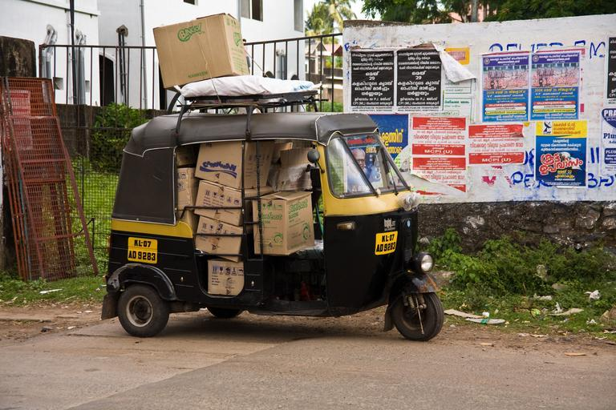

{}
{}
{}
全域で見られるが北部に多い{}
{}

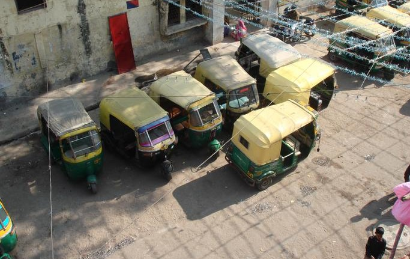

{}
{}
{}
黄色の時は南に行ってみる？
{}

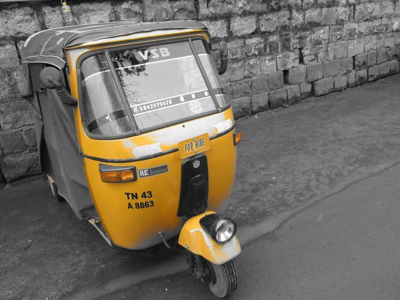

{}
{}

    <h4 class="section-title" id="電柱の形">農業</h4>
    <ul class="rule-list">
        <li>農業が場所によって異なる
            <ul>
                <li>アブラヤシはテランガーナ州がほとんど</li>
                <li>菜種の畑は北西部の乾燥地域が多い</li>
                <li>綿花はデカン高原、とくにマハーラーシュトラ周辺の土が黒い地域が多い</li>
                <li>農作物の分布データ出典：<a href="https://ipad.fas.usda.gov/countrysummary/default.aspx?id=IN">U.S. DEPARTMENT OF AGRICULTUREUSDA(USDA)</a></li>
            </ul>
        </li>
    </ul>

{}
{}

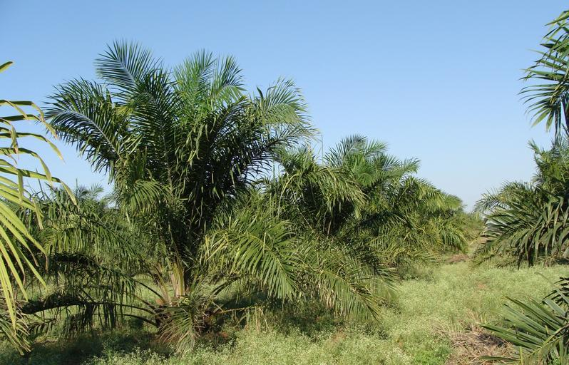

{}
南全域に存在しており、とりわけ南東側のアーンドラ・プラデーシュ（Andhra Pradesh）州に多い。
{}
{}
{}

{}
北の方の特に乾燥した地域周辺に多い。
{}

<iframe src="https://www.google.com/maps/embed?pb=!4v1684386132338!6m8!1m7!1s6H7XGG6zf5BRQZTgWOIOBg!2m2!1d27.09125165384609!2d72.24390807022428!3f210.5965039749511!4f-8.053181292628878!5f0.7820865974627469" width="500" height="250" style="border:0;" allowfullscreen="" loading="lazy" referrerpolicy="no-referrer-when-downgrade"></iframe>

{}
{}

{}
とりあえず東側に。
{}

{}
{}

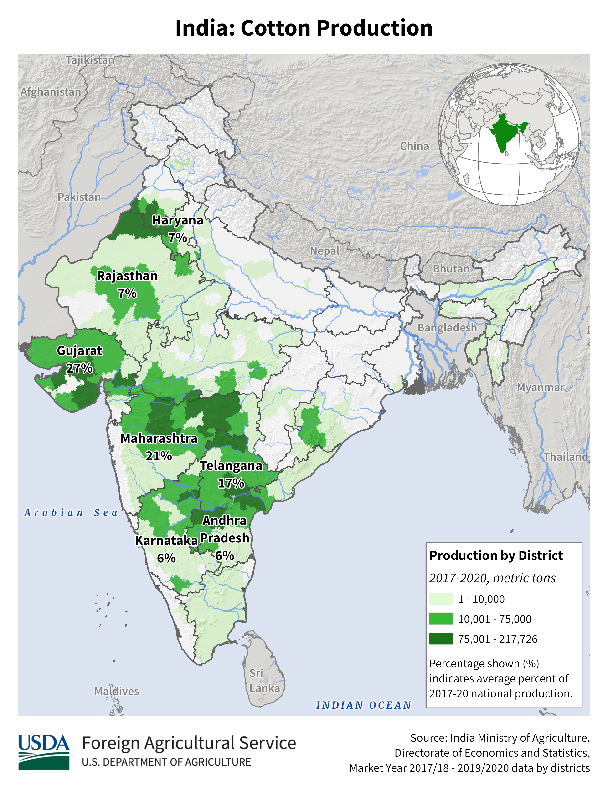

{}
土が黒いデカン高原と重複している。
{}

{}
{}

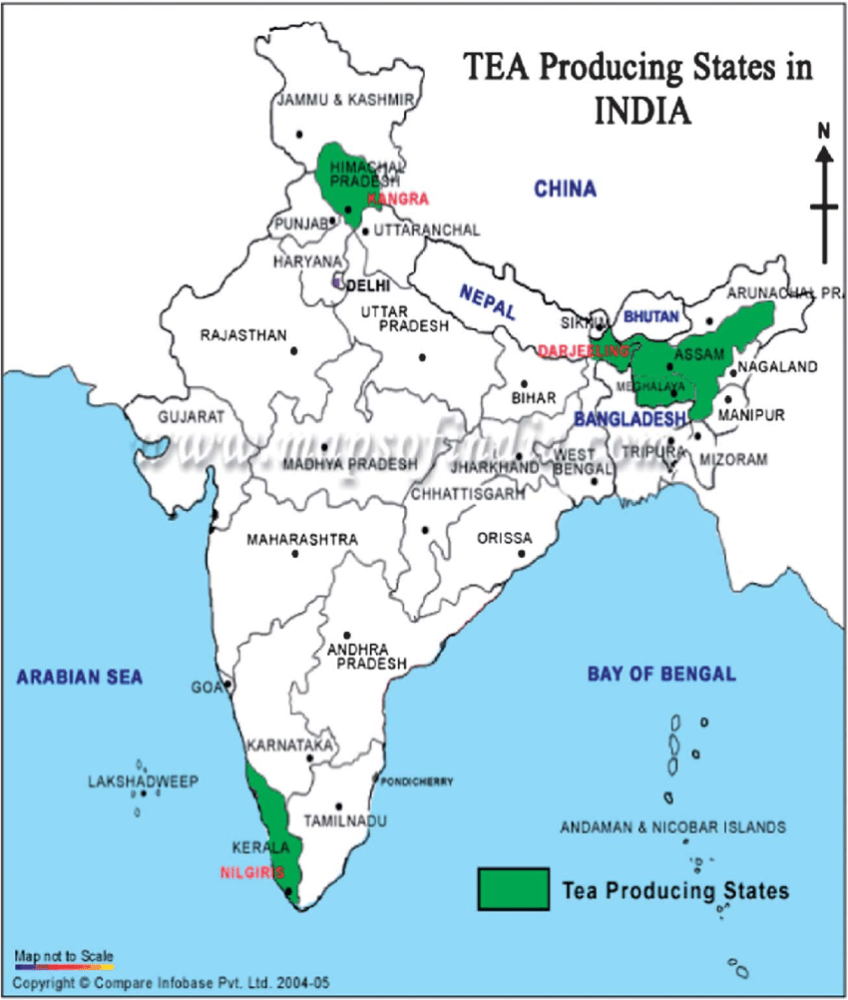

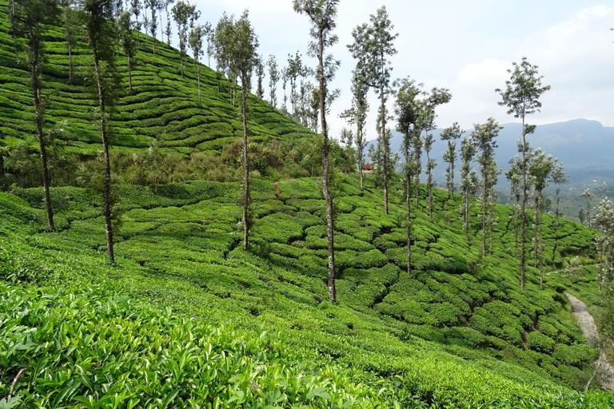

{}
図の緑の地域に多いが、ヒマチャル・プラデシュにはストリートビューが無いため東部・南部の２地域のどちらかとなる(図の出典：Lagad, Rupali A., et al. "Elemental Profiling of Indian Tea by Inductively Coupled Plasma Optical Emission Spectrometry (ICP-OES)." Atomic Spectroscopy 32.4 (2011): 168.)。
{}

{}
{}

    <h4 class="section-title" id="建物">建物</h4>
    <ul class="rule-list">
        <li class="no-evidence">黄色いタンクがある場合おそらくベンガル―ルのような南の街{}</li>
        <li>北部は赤レンガ造りの建物が多い</li>
        <li>南部はラテライトを塗った壁やコンクリートの壁に平な瓦が付いた家</li>
        <li>Jodhpurを中心とした北西の家屋の壁が青く塗られていることがある{{% ref "https://ja.wikipedia.org/wiki/%E3%82%B8%E3%83%A7%E3%83%BC%E3%83%89%E3%83%97%E3%83%AB" "ジョードプル" %}}</li>
    </ul>

{}
{}
{}
黄色いタンクがある場合おそらくベンガル―ルやチェンナイのような南の街{}。ただし北の方でもたまに見かけるので100%ではない。
{}

{}
{}
{}
赤レンガ造りの建物はどちらかというと北部に多い{}。写真はヴァーラーナシーと思われる{}。
{}

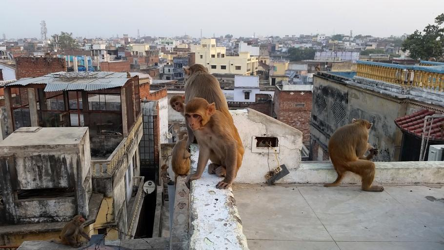

{}
{}
{}
南部はラテライトを塗った壁やコンクリートの壁に平な瓦が付いた家が多いかも。確証なし{}。
{}

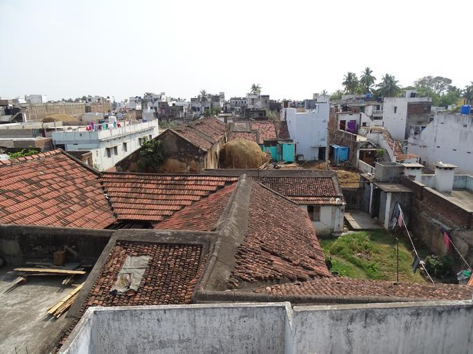

{}
{}
{}
Jodhpur旧市街の家屋の壁などは青く塗られていて、青くペイントされた建物が散見される{}{{% ref "https://ja.wikipedia.org/wiki/%E3%82%B8%E3%83%A7%E3%83%BC%E3%83%89%E3%83%97%E3%83%AB" "ジョードプル" %}}。ただし南の方にも普通にあるみたい{}なので地域を限定するのは難しいかも。
{}

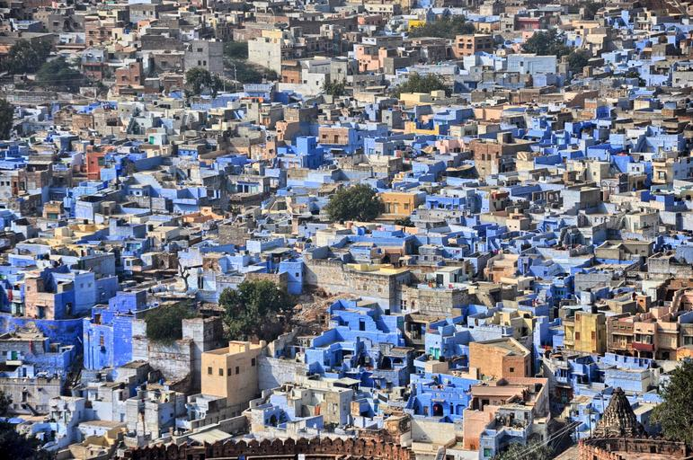

{}
{}

    <h4>ちゃんと調べていないもの</h4>
    <ul class="rule-list" style="opacity:0.5">
        <li>Kerala州</li>
        <li>Assam州</li>
    </ul>

{}
{}
{}
Kerala州やAssam州のような降水量が多い地域はこんな感じの背の高い木が多い{}。Assam州は地震と洪水がある地域なので、竹のような軽い素材を使った壁や高床式の家もたまに見つかるらしい{}{}（レンガのような重い素材で壁を作れないため）。
{}

{}
{}
{}
西沿岸部は最も雨量が多い地域であり、雨に耐えられるように急な屋根が設置される。屋根の上にさらに屋根がある（？）造りも見かける{}。
{}

By <a href="//commons.wikimedia.org/w/index.php?title=User:Bharath_maraboina123&amp;amp;action=edit&amp;amp;redlink=1" class="new" title="User:Bharath maraboina123 (page does not exist)">Bharath maraboina123</a> - Own work, <a href="https://creativecommons.org/licenses/by-sa/4.0" title="Creative Commons Attribution-Share Alike 4.0">CC BY-SA 4.0</a>, <a href="https://commons.wikimedia.org/w/index.php?curid=49516918">Link</a>

{}
{}

    <h4 class="section-title" id="電柱の形">電柱の形</h4>
    <ul class="rule-list">
        <li>電柱の形が州や街によって異なる
            <ul>
                <li>電柱の上に何か四角い穴があるならPanjabの地域の街{}</li>
                <li class="no-evidence">黄色い長方形のステッカーがあるとUttar Pradeshの地域かも{}</li>
                <li class="no-evidence">穴のあるポールはGujaratの地域{}{}</li>
                <li class="no-evidence">区切りのあるポール（セクションポール）があるのはTelangana・Andhra Pradesh？</li>
                <li class="no-evidence">下向きの直角三角形があるならMadhya Pradeshの地域かも？</li>
                <li>『キ』や『干』の電柱がGoaにある</li>
            </ul>
        </li>
    </ul>

{}
{}
{}
電柱の上に何か四角い穴があるならPanjabの街{}
{}

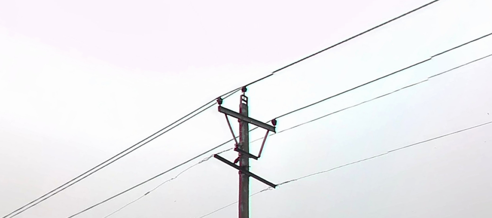

{}
{}
{}
黄色い長方形のステッカーがある{}{}？破れたり上から紙を張られたりして視認しにくい。
{}

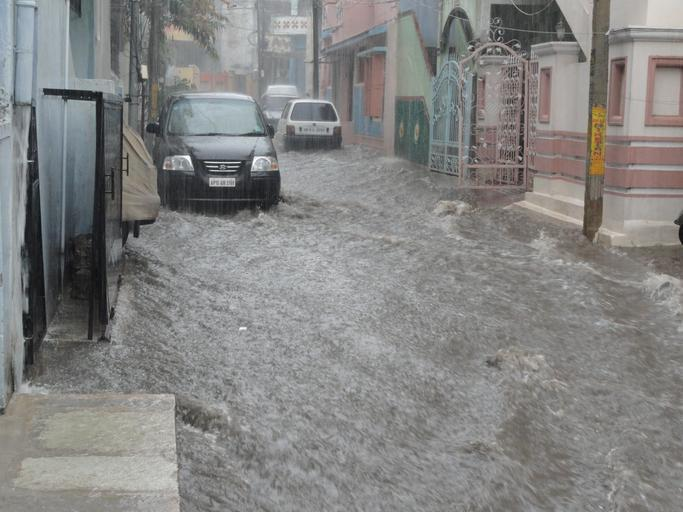

{}
{}

{}
穴のあるポール（ホーリーポール）がある{}{}。
{}

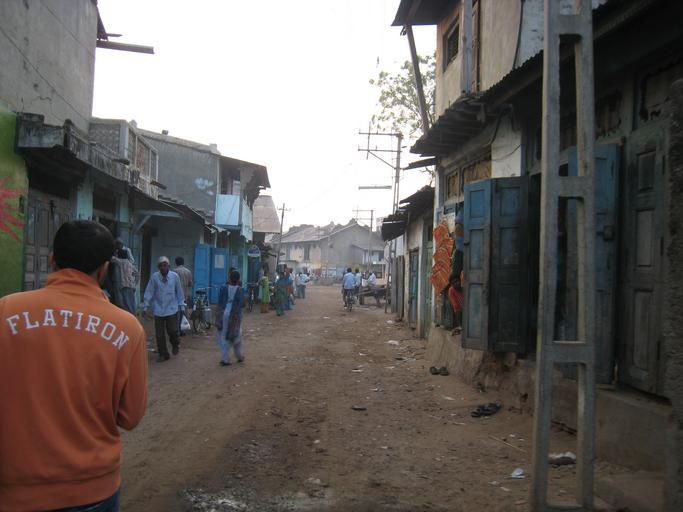

{}
{}

{}
Hyderabadなどに区切りのあるポール（セクションポール）がある？
{}

<iframe src="https://www.google.com/maps/embed?pb=!4v1685131807317!6m8!1m7!1sEsD63pL45V0NThU-AZh4pA!2m2!1d17.47859170633478!2d78.56369474671776!3f345.7309758033879!4f-0.6858934272780033!5f3.325193203789971" width="295" height="295" style="border:0;" allowfullscreen="" loading="lazy" referrerpolicy="no-referrer-when-downgrade"></iframe>
<iframe src="https://www.google.com/maps/embed?pb=!4v1685131881912!6m8!1m7!1sUo5VrDL-DpjCXt8hfKOZGg!2m2!1d17.36418399104977!2d78.39518238708081!3f89.58715191863472!4f-4.965387103125224!5f1.6747942011608603" width="295" height="295" style="border:0;" allowfullscreen="" loading="lazy" referrerpolicy="no-referrer-when-downgrade"></iframe>

{}
{}

{}
この山のような形の電柱はどこにでもあるように思うが、下の部分に▽があるのが特徴的かもしれない。
{}

<iframe src="https://www.google.com/maps/embed?pb=!4v1685018079861!6m8!1m7!1snAg_kJHTKmx2pcQ__xrJrA!2m2!1d23.89388214738087!2d76.89253305767144!3f248.11187586331368!4f40.08550799520157!5f3.325193203789971" width="295" height="295" style="border:0;" allowfullscreen="" loading="lazy" referrerpolicy="no-referrer-when-downgrade"></iframe>
<iframe src="https://www.google.com/maps/embed?pb=!4v1685018153925!6m8!1m7!1s4IZRg8Z_Jz-HoII4iunIoQ!2m2!1d23.07019340926012!2d77.62068318788117!3f286.91972497971676!4f24.919263281942648!5f3.325193203789971" width="295" height="295" style="border:0;" allowfullscreen="" loading="lazy" referrerpolicy="no-referrer-when-downgrade"></iframe>

{}
{}

{}
『キ』や『干』の電柱、かなり当たる印象。
{}

<iframe src="https://www.google.com/maps/embed?pb=!4v1685018435595!6m8!1m7!1sItWlaAlStjLL4HsKHIxrTQ!2m2!1d15.57571962522207!2d73.8064451970202!3f336.98921646158215!4f11.233819098714903!5f3.325193203789971" width="295" height="295" style="border:0;" allowfullscreen="" loading="lazy" referrerpolicy="no-referrer-when-downgrade"></iframe>
<iframe src="https://www.google.com/maps/embed?pb=!4v1695368856803!6m8!1m7!1sI14s7i-mvSB-ekHbtHp53Q!2m2!1d15.57625692905384!2d73.80637384158902!3f186.04!4f6.780000000000001!5f3.1422555315175162" width="295" height="295" style="border:0;" allowfullscreen="" loading="lazy" referrerpolicy="no-referrer-when-downgrade"></iframe>

{}
{}

    <h4 class="section-title" id="建物">土の色</h4>
    <ul class="rule-list">
        <li>土の色が地域ごとに異なるが画質が悪く例外も多いので参考にならないかも
            <ul>
                <li>赤色：赤っぽい土は南東か南の可能性があるが範囲は結構広い{}</li>
                <li>黒土：レグール土とも呼ばれデカン高原付近に広がっているが黒くない時も多い</li>
                <li>沖積層：インダス川やガンジス川によって堆積した白い砂のような沖積層が北部にある</li>
                <li>森林：ネパールの東西は森が多い{}</li>
            </ul>
        </li>
    </ul>

{}
{}
{}
赤っぽい土は南東、黒っぽい色はデリーから南の内陸、サラサラの白っぽい土は北の方のイメージ？
{}

By <a href="http://nroer.in/gstudio/resources/images/show/35270/">National Council of Educational Research and Training(NCERT)</a>, <a href="https://creativecommons.org/licenses/by-sa/3.0/deed.ja">CC BY-SA 3.0</a>, <a href="https://commons.wikimedia.org/w/index.php?curid=27703297">Wikimedia Commons</a>

{}
{}
{}
赤っぽい土は南東か南の可能性があるが範囲は結構広い
{}

<iframe src="https://www.google.com/maps/embed?pb=!4v1682467696860!6m8!1m7!1sOluJZwXC7iXwDtFZiGAuGw!2m2!1d8.84349947702833!2d77.5365639325106!3f225.12623673033116!4f-6.411466212566282!5f3.169518039872058" width="295" height="295" style="border:0;" allowfullscreen="" loading="lazy" referrerpolicy="no-referrer-when-downgrade"></iframe>
<iframe src="https://www.google.com/maps/embed?pb=!4v1682468578442!6m8!1m7!1s9DnaN2OwV_AHzLcAQ85f0w!2m2!1d21.06955355279361!2d84.30525247708368!3f179.4264476922859!4f-19.858869347516674!5f2.9592035569667035" width="295" height="295" style="border:0;" allowfullscreen="" loading="lazy" referrerpolicy="no-referrer-when-downgrade"></iframe>

{}
{}
{}
黒土はレグール土とも呼ばれ、綿花の栽培にも向いている{}。
{}

<iframe src="https://www.google.com/maps/embed?pb=!4v1682467835049!6m8!1m7!1sAQE1pjOxkCxQGyEeiREzkA!2m2!1d21.83794795470153!2d75.77963971665952!3f156.32961566257794!4f-16.490430386537867!5f1.7890743634877406" width="295" height="295" style="border:0;" allowfullscreen="" loading="lazy" referrerpolicy="no-referrer-when-downgrade"></iframe>
<iframe src="https://www.google.com/maps/embed?pb=!4v1682467876025!6m8!1m7!1s3tPGFcFOFS3VxW4LY3-RmQ!2m2!1d22.92992908739189!2d75.85402923206209!3f222.87806813015754!4f-11.71605331265799!5f3.2114390371456225" width="295" height="295" style="border:0;" allowfullscreen="" loading="lazy" referrerpolicy="no-referrer-when-downgrade"></iframe>

{}
{}
{}
インダス川、ガンジス川によって堆積した沖積層（alluvial）が北部にある。一般的には平坦で湿地が散見され、
主に固まっていない泥、砂、石から構成される{}。
{}

<iframe src="https://www.google.com/maps/embed?pb=!4v1682468273619!6m8!1m7!1se4CgKszKZKi6alw7JPji7A!2m2!1d29.18795659001541!2d78.19210339952144!3f143.96313802334797!4f-15.105692246985953!5f2.976055030161179" width="295" height="295" style="border:0;" allowfullscreen="" loading="lazy" referrerpolicy="no-referrer-when-downgrade"></iframe>
<iframe src="https://www.google.com/maps/embed?pb=!4v1682468327217!6m8!1m7!1s_xQYI8MT1t4rL3D17_QrNA!2m2!1d26.687065447171!2d83.56086764998268!3f158.54175639985195!4f-11.929120204871097!5f3.2111110012516426" width="295" height="295" style="border:0;" allowfullscreen="" loading="lazy" referrerpolicy="no-referrer-when-downgrade"></iframe>

{}
{}
{}
土が赤くても周りが険しい山で森が多いならばネパールの東西なども検討する。
{}

<iframe src="https://www.google.com/maps/embed?pb=!4v1682469074724!6m8!1m7!1sDoei_ddObvVfnnyYAktCMQ!2m2!1d29.87155990235058!2d79.70757318913535!3f93.56896264013253!4f12.893076847190144!5f1.6592677506386897" width="295" height="295" style="border:0;" allowfullscreen="" loading="lazy" referrerpolicy="no-referrer-when-downgrade"></iframe>
<iframe src="https://www.google.com/maps/embed?pb=!4v1682469213683!6m8!1m7!1sjTU0xex_3iWaHCFMP0H9Kg!2m2!1d26.9355147072377!2d88.44909055797791!3f343.5479801851562!4f6.649843690657178!5f0.7820865974627469" width="295" height="295" style="border:0;" allowfullscreen="" loading="lazy" referrerpolicy="no-referrer-when-downgrade"></iframe>

{}
{}

    <h2 class="section-title">{}</h2>
    <ul class="rule-list">
        <li>街頭のポールなどに数字が書かれた黄色のラベルが貼ってあるならばChandigarh{}{}</li>
    </ul>

