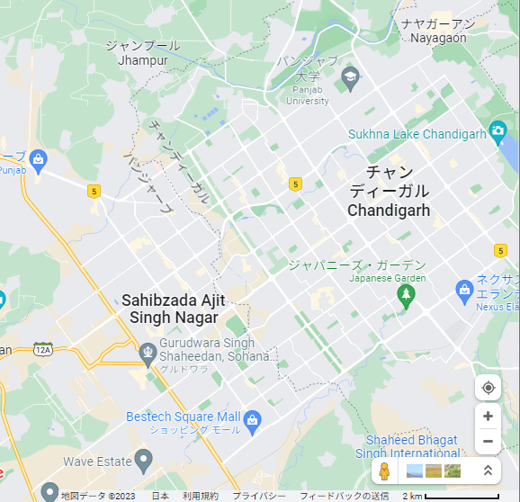

    <h2 class="section-title">{}</h2>
    <ul class="rule-list">
        <li>ドメインは.id</li>
        <li>言語はヒンディー語など地域によって異なる</li>
        <li>特徴的な形の電柱が多い（{}）</li>
    </ul>
    {}

{}
{}
{}
言語が特徴的なので慣れれば判別できる。デリーのような都心では看板の下に英語で住所が書いてあることも多いので都市の判別はすぐにできることが多い。しかし、インドは都市圏でも住所システムが完全には整備されておらずときどき商品が届かないこともある{}くらいなので、住所が分かっていても地域や道路を絞り込むのは結構難しいかも。
{}

{}
電柱の配線が綺麗に整備されていない場合も多い。そして特徴的な形の電柱も多い（{}）。
{}

{}
ナンバーは白・黄・黒色など複数存在する。EUのナンバーに見えるタイプのみ間違えないように注意{}。
{}

<iframe src="https://www.google.com/maps/embed?pb=!4v1689072559136!6m8!1m7!1safd2f2VgriHB1IqAeeiMVw!2m2!1d23.23867177230191!2d77.38986018900181!3f57.85938112510194!4f-6.020780724911873!5f3.293292491545769" width="500" height="300" style="border:0;" allowfullscreen="" loading="lazy" referrerpolicy="no-referrer-when-downgrade"></iframe>

{}

自作、大まかな形で正確な形状ではないです
{}

{}
{}

<iframe width="590" height="315" src="https://www.youtube.com/embed/rDZ4oudc9y0" title="YouTube video player" frameborder="0" allow="accelerometer; autoplay; clipboard-write; encrypted-media; gyroscope; picture-in-picture; web-share" allowfullscreen></iframe>
<iframe width="590" height="315" src="https://www.youtube.com/embed/W57wmjn4Zac" title="YouTube video player" frameborder="0" allow="accelerometer; autoplay; clipboard-write; encrypted-media; gyroscope; picture-in-picture; web-share" allowfullscreen></iframe>

{}
{}

{}
バーンスリー
{}

<iframe width="560" height="315" src="https://www.youtube.com/embed/NfbT1Rgos4I" title="YouTube video player" frameborder="0" allow="accelerometer; autoplay; clipboard-write; encrypted-media; gyroscope; picture-in-picture; web-share" allowfullscreen></iframe>

{}
{}

    <h2 class="section-title">{}</h2>
    <ul class="rule-list">
        <li>州ごとに異なる旗がある</li>
        <li>地域ごとに言語が違う{}</li>
    </ul>

{}
{}

<table class="word-list">
<tr>
    <th>言語名</th> <th>表記</th>
</tr>
<tr><td>アッサム</td><td>জাপানীজ ৰেষ্টুৰেণ্ট</td></tr>
<tr><td>カンナダ</td><td>ಜಪಾನೀಸ್ ರೆಸ್ಟೋರೆಂಟ್</td></tr>
<tr><td>グジャラート</td><td>જાપાનીઝ રેસ્ટોરન્ટ</td></tr>
<tr><td>タミル</td><td>ஜப்பானிய உணவகம்</td></tr>
<tr><td>テルグ</td><td>జపనీస్ రెస్టారెంట్</td></tr>
<tr><td>ベンガル</td><td>জাপানি রেস্তোরা</td></tr>
<tr><td>ヒンディー</td><td>जापानी रेस्टोरेंट</td></tr>
<tr><td>---</td><td>---</td></tr>
<tr><td>日本</td><td>日本料理レストラン</td></tr>
<tr><td>シンハラ</td><td>ජපන් අවන්හල</td></tr>
<tr><td>クメール</td><td>ភោជនីយដ្ឋានជប៉ុន</td></tr>
<tr><td>ラオ</td><td>ຮ້ານອາຫານຍີ່ປຸ່ນ</td></tr>
<tr><td>タイ</td><td>ร้านอาหารญี่ปุ่น</td></tr>
</table>

{}
{}

<blockquote class="twitter-tweet">
<a href="https://twitter.com/hashtag/India?src=hash&amp;ref_src=twsrc%5Etfw">#India</a>&#39;s 22 scheduled <a href="https://twitter.com/hashtag/languages?src=hash&amp;ref_src=twsrc%5Etfw">#languages</a> by the name of the script they use <a href="https://t.co/PBDqehiogD">pic.twitter.com/PBDqehiogD</a>
&mdash; India in Pixels by Ashris (@indiainpixels) <a href="https://twitter.com/indiainpixels/status/1350804912100179970?ref_src=twsrc%5Etfw">January 17, 2021</a></blockquote> 

{}
{}
{}
アフマダーバード周辺。ちなみに階段井戸もアフマダーバード周辺に多い。
{}

<iframe src="https://www.google.com/maps/embed?pb=!4v1680006839051!6m8!1m7!1s1zGb5v2fx6aykeBSp6BzIw!2m2!1d23.01818260084139!2d72.56476740058423!3f300.0008783178411!4f4.627254944041155!5f3.325193203789971" width="295" height="295" style="border:0;" allowfullscreen="" loading="lazy" referrerpolicy="no-referrer-when-downgrade"></iframe>
<iframe src="https://www.google.com/maps/embed?pb=!4v1680006860530!6m8!1m7!1s4y3L_APhq6AMve_jzUfZeA!2m2!1d23.01829694337689!2d72.564890322699!3f7.804072054804488!4f6.50782459650172!5f1.8717339161405784" width="295" height="295" style="border:0;" allowfullscreen="" loading="lazy" referrerpolicy="no-referrer-when-downgrade"></iframe>

{}
{}
{}
カルナータカ地方とベンガルール周辺に話者が多い{{% ref "https://ja.wikipedia.org/wiki/%E3%82%AB%E3%83%B3%E3%83%8A%E3%83%80%E8%AA%9E#/media/%E3%83%95%E3%82%A1%E3%82%A4%E3%83%AB:Kannadaspeakers.png" "カンナダ語" %}}。
{}

<iframe src="https://www.google.com/maps/embed?pb=!4v1680006555635!6m8!1m7!1s4SEAcMmP8hx87rWxqP9c0A!2m2!1d13.04361154116076!2d77.5474873331359!3f117.50972523192821!4f15.68591794847461!5f2.7914502814668984" width="295" height="295" style="border:0;" allowfullscreen="" loading="lazy" referrerpolicy="no-referrer-when-downgrade"></iframe>

{}
{}
{}
ヒンディー語・ヒンドゥスターニー語はデリーを含む地域で話される自然言語。
{}

<iframe src="https://www.google.com/maps/embed?pb=!4v1680006391122!6m8!1m7!1sbg2cWdtnCh6ZxAm9tEWftw!2m2!1d28.73735204454535!2d77.21867054352147!3f261.684470921806!4f-0.4273194847891375!5f3.325193203789971" width="295" height="295" style="border:0;" allowfullscreen="" loading="lazy" referrerpolicy="no-referrer-when-downgrade"></iframe>

{}
{}
{}
スリランカの海岸沿いに多い。
{}

<iframe src="https://www.google.com/maps/embed?pb=!4v1682101003545!6m8!1m7!1sFb461y1SYMMG6X4Bss19Yg!2m2!1d10.85434123330329!2d78.70991798618508!3f255.947668151077!4f3.4817149585278173!5f1.7113530487541073" width="295" height="295" style="border:0;" allowfullscreen="" loading="lazy" referrerpolicy="no-referrer-when-downgrade"></iframe>

{}
{}
{}
テルグ語（తెలుగు）はアーンドラ・プラデーシュ州およびテランガーナ州の公用語。文字の周りにある「つ」「✓」「ｍ」のような形が特徴的{{% ref "https://ja.wikipedia.org/wiki/%E3%83%86%E3%83%AB%E3%82%B0%E8%AA%9E" "テルグ語" %}}。
{}

<iframe src="https://www.google.com/maps/embed?pb=!4v1683536379262!6m8!1m7!1siPrv0pkeitRMVQ8ce8UkRg!2m2!1d14.90588514508056!2d79.86349239934395!3f246.87675993779882!4f9.734625500123414!5f3.139402080150767" width="295" height="295" style="border:0;" allowfullscreen="" loading="lazy" referrerpolicy="no-referrer-when-downgrade"></iframe>
<iframe src="https://www.google.com/maps/embed?pb=!4v1683536507928!6m8!1m7!1sRxKQRYgkNPC6m9Rv2URtsg!2m2!1d17.24747772616979!2d80.14134607062307!3f4.732751074080325!4f12.886439959891234!5f2.832146649303087" width="295" height="295" style="border:0;" allowfullscreen="" loading="lazy" referrerpolicy="no-referrer-when-downgrade"></iframe>

{}
{}

    <ul class="rule-list">
        <li>土の色が地域ごとに異なる</li>
    </ul>

{}
{}
{}
真っ赤な土は南西か南、黒っぽい色はデリーから南の内陸、サラサラの白っぽい土は北の方のイメージ？
{}

By <a href="http://nroer.in/gstudio/resources/images/show/35270/">National Council of Educational Research and Training(NCERT)</a>, <a href="https://creativecommons.org/licenses/by-sa/3.0/deed.ja">CC BY-SA 3.0</a>, <a href="https://commons.wikimedia.org/w/index.php?curid=27703297">Wikimedia Commons</a>

{}
{}
{}
真っ赤な土は南西か南の可能性があるが範囲は結構広い
{}

<iframe src="https://www.google.com/maps/embed?pb=!4v1682467696860!6m8!1m7!1sOluJZwXC7iXwDtFZiGAuGw!2m2!1d8.84349947702833!2d77.5365639325106!3f225.12623673033116!4f-6.411466212566282!5f3.169518039872058" width="295" height="295" style="border:0;" allowfullscreen="" loading="lazy" referrerpolicy="no-referrer-when-downgrade"></iframe>
<iframe src="https://www.google.com/maps/embed?pb=!4v1682468578442!6m8!1m7!1s9DnaN2OwV_AHzLcAQ85f0w!2m2!1d21.06955355279361!2d84.30525247708368!3f179.4264476922859!4f-19.858869347516674!5f2.9592035569667035" width="295" height="295" style="border:0;" allowfullscreen="" loading="lazy" referrerpolicy="no-referrer-when-downgrade"></iframe>

{}
{}
{}
黒土はレグール土とも呼ばれ、綿花の栽培にも向いている。{}。
{}

<iframe src="https://www.google.com/maps/embed?pb=!4v1682467835049!6m8!1m7!1sAQE1pjOxkCxQGyEeiREzkA!2m2!1d21.83794795470153!2d75.77963971665952!3f156.32961566257794!4f-16.490430386537867!5f1.7890743634877406" width="295" height="295" style="border:0;" allowfullscreen="" loading="lazy" referrerpolicy="no-referrer-when-downgrade"></iframe>
<iframe src="https://www.google.com/maps/embed?pb=!4v1682467876025!6m8!1m7!1s3tPGFcFOFS3VxW4LY3-RmQ!2m2!1d22.92992908739189!2d75.85402923206209!3f222.87806813015754!4f-11.71605331265799!5f3.2114390371456225" width="295" height="295" style="border:0;" allowfullscreen="" loading="lazy" referrerpolicy="no-referrer-when-downgrade"></iframe>

{}
{}
{}
インダス川、ガンジス川によって堆積した沖積層（alluvial）が北部にある。一般的には平坦で湿地が散見され、
主に固まっていない泥、砂、石から構成される{}。
{}

<iframe src="https://www.google.com/maps/embed?pb=!4v1682468273619!6m8!1m7!1se4CgKszKZKi6alw7JPji7A!2m2!1d29.18795659001541!2d78.19210339952144!3f143.96313802334797!4f-15.105692246985953!5f2.976055030161179" width="295" height="295" style="border:0;" allowfullscreen="" loading="lazy" referrerpolicy="no-referrer-when-downgrade"></iframe>
<iframe src="https://www.google.com/maps/embed?pb=!4v1682468327217!6m8!1m7!1s_xQYI8MT1t4rL3D17_QrNA!2m2!1d26.687065447171!2d83.56086764998268!3f158.54175639985195!4f-11.929120204871097!5f3.2111110012516426" width="295" height="295" style="border:0;" allowfullscreen="" loading="lazy" referrerpolicy="no-referrer-when-downgrade"></iframe>

{}
{}
{}
土が赤くても周りが険しい山で森が多いならばネパールの東西なども検討する。
{}

<iframe src="https://www.google.com/maps/embed?pb=!4v1682469074724!6m8!1m7!1sDoei_ddObvVfnnyYAktCMQ!2m2!1d29.87155990235058!2d79.70757318913535!3f93.56896264013253!4f12.893076847190144!5f1.6592677506386897" width="295" height="295" style="border:0;" allowfullscreen="" loading="lazy" referrerpolicy="no-referrer-when-downgrade"></iframe>
<iframe src="https://www.google.com/maps/embed?pb=!4v1682469213683!6m8!1m7!1sjTU0xex_3iWaHCFMP0H9Kg!2m2!1d26.9355147072377!2d88.44909055797791!3f343.5479801851562!4f6.649843690657178!5f0.7820865974627469" width="295" height="295" style="border:0;" allowfullscreen="" loading="lazy" referrerpolicy="no-referrer-when-downgrade"></iframe>

{}
{}

    <ul class="rule-list">
        <li>農業が場所によって異なる
            <ul>
                <li>農作物の分布データ出典：<a href="https://ipad.fas.usda.gov/countrysummary/default.aspx?id=IN">U.S. DEPARTMENT OF AGRICULTUREUSDA(USDA)</a></li>
            </ul>
        </li>
    </ul>

{}
{}

{}
南全域に存在しており、とりわけ南東側に多い。
{}
{}
{}

{}
北の方の特に乾燥した地域周辺に多い。
{}

<iframe src="https://www.google.com/maps/embed?pb=!4v1684386132338!6m8!1m7!1s6H7XGG6zf5BRQZTgWOIOBg!2m2!1d27.09125165384609!2d72.24390807022428!3f210.5965039749511!4f-8.053181292628878!5f0.7820865974627469" width="500" height="250" style="border:0;" allowfullscreen="" loading="lazy" referrerpolicy="no-referrer-when-downgrade"></iframe>

{}
{}

{}
{}

    <ul class="rule-list">
        <li class="no-evidence">リクシャー（rickshaw）の色が地域によって違う
            <ul>
                <li>窓の周りが黄色・下が緑色：全域で見られるが北部に多い{}</li>
                <li>窓の周りが黄色・下が黄色：南に行ってみる？</li>
                <li>窓の周りが黄色・下が黒色：ムンバイなどのマハーラーシュトラの都市に多め？{}</li>
            </ul>
        </li>
    </ul>

{}
{}
{}
全域で見られるが北部に多い{}
{}

{}
{}
{}
黄色の時は南に行ってみる？
{}

<iframe src="https://www.google.com/maps/embed?pb=!4v1684852247634!6m8!1m7!1s8D07DUXd-aJ-IPNNtC0a2g!2m2!1d17.35619275969182!2d78.45450118244464!3f239.04023894286564!4f-5.286728959196893!5f3.0944092122296905" width="590" height="250" style="border:0;" allowfullscreen="" loading="lazy" referrerpolicy="no-referrer-when-downgrade"></iframe>
<iframe src="https://www.google.com/maps/embed?pb=!4v1685423440831!6m8!1m7!1sR9f3YlIxYbfb7PmyuLdViA!2m2!1d9.916791413045814!2d78.11770567763391!3f299.8459638803495!4f-7.552750161315913!5f3.2000641429283365" width="295" height="295" style="border:0;" allowfullscreen="" loading="lazy" referrerpolicy="no-referrer-when-downgrade"></iframe>
<iframe src="https://www.google.com/maps/embed?pb=!4v1685423663844!6m8!1m7!1sX7oLEp8Z_YYY29EctqxHbw!2m2!1d14.44073365883778!2d79.99211186913298!3f10.504973534499292!4f-10.28303530448666!5f2.807657372073357" width="295" height="295" style="border:0;" allowfullscreen="" loading="lazy" referrerpolicy="no-referrer-when-downgrade"></iframe>

{}
{}
{}
ムンバイなどのマハーラーシュトラに多め{}？
{}

<iframe src="https://www.google.com/maps/embed?pb=!4v1685128103000!6m8!1m7!1sV2mAVbnto9vw5UeIgQIR7g!2m2!1d19.09521757724435!2d72.88762212756531!3f332.48927903939085!4f-10.15448843502621!5f1.5526628961370816" width="520" height="250" style="border:0;" allowfullscreen="" loading="lazy" referrerpolicy="no-referrer-when-downgrade"></iframe>

{}
ただし似た雰囲気のものは東海岸の街にもあったので100%ではなさそう。
{}

<iframe src="https://www.google.com/maps/embed?pb=!4v1685128260587!6m8!1m7!1sMynsRgxqocRxrdZUemCdZQ!2m2!1d19.80653467636733!2d85.83721433799168!3f26.824904239981084!4f-8.188162902118862!5f2.7673678437924703" width="520" height="250" style="border:0;" allowfullscreen="" loading="lazy" referrerpolicy="no-referrer-when-downgrade"></iframe>

{}
{}

    <ul class="rule-list">
        <li class="no-evidence">黄色いタンクがある場合おそらくベンガル―ルやチェンナイのような南の街</li>
    </ul>

{}
{}
{}
黄色いタンクがある場合おそらくベンガル―ルやチェンナイのような南の街
{}

<iframe src="https://www.google.com/maps/embed?pb=!4v1684973330166!6m8!1m7!1spMA27OJFQ6ZRt1ub9nkTIw!2m2!1d12.84251651601305!2d77.61203290485112!3f97.71301123418844!4f7.309838716057598!5f3.3051630211484837" width="295" height="295" style="border:0;" allowfullscreen="" loading="lazy" referrerpolicy="no-referrer-when-downgrade"></iframe>
<iframe src="https://www.google.com/maps/embed?pb=!4v1685057238683!6m8!1m7!1sVq2_OxPrxv5kAwxKy9lpKQ!2m2!1d12.82124623460106!2d80.20650617072832!3f118.47452465387406!4f4.776067349847821!5f3.278551436969423" width="295" height="295" style="border:0;" allowfullscreen="" loading="lazy" referrerpolicy="no-referrer-when-downgrade"></iframe>

{}
{}

    <h4 class="section-title" id="電柱の形">電柱の形</h4>
    <ul class="rule-list">
        <li>電柱の形が州や街によって異なる
            <ul>
                <li>電柱の上に何か四角い穴があるならPanjabの地域の街</li>
                <li>Panjabの電柱がありなおかつ街頭のポールなどに黄色のラベルが貼ってある（数字が書いてある）ならばChandigarh{}</li>
                <li class="no-evidence">黄色い長方形のステッカーがあるとUttar Pradeshの地域かも{}</li>
                <li class="no-evidence">穴のあるポール（ホーリーポール）があるのはGujaratの地域{}</li>
                <li class="no-evidence">区切りのあるポール（セクションポール）があるのはTelangana・Andhra Pradesh？</li>
                <li class="no-evidence">下向きの直角三角形があるならMadhya Pradeshの地域かも？</li>
            </ul>
        </li>
    </ul>

{}
{}
{}
電柱の上に何か四角い穴があるならPanjabの街
{}

<iframe src="https://www.google.com/maps/embed?pb=!4v1685016269943!6m8!1m7!1sjSOyYVSvLqichVCDATUsYQ!2m2!1d30.86611341091101!2d76.00847477658051!3f329.72196298953145!4f29.199951858946775!5f3.325193203789971" width="295" height="295" style="border:0;" allowfullscreen="" loading="lazy" referrerpolicy="no-referrer-when-downgrade"></iframe>
<iframe src="https://www.google.com/maps/embed?pb=!4v1685016518227!6m8!1m7!1s6r5ccDbTkhAirxe710Nc6w!2m2!1d30.75416268602017!2d76.75385228486779!3f277.1610299346416!4f24.561473566273776!5f3.325193203789971" width="295" height="295" style="border:0;" allowfullscreen="" loading="lazy" referrerpolicy="no-referrer-when-downgrade"></iframe>

{}
{}
{}
Panjabの電柱がありなおかつ街頭のポールなどに黄色の丸いラベルが貼ってある（数字が書いてある）ならばChandigarh{}。道の向きも全体的に斜め。ただし歩いてみた感じ貼ってないポールも結構あるように見える。
{}

<iframe src="https://www.google.com/maps/embed?pb=!4v1685017635429!6m8!1m7!1sLSusVuCf5i6InxvkLJQdrA!2m2!1d30.73506894391728!2d76.71726833211416!3f218.9772218253303!4f-16.149046405219508!5f3.325193203789971" width="295" height="295" style="border:0;" allowfullscreen="" loading="lazy" referrerpolicy="no-referrer-when-downgrade"></iframe>
<iframe src="https://www.google.com/maps/embed?pb=!4v1685127033966!6m8!1m7!1sknl-t0wkwFgojFD1Li_EIA!2m2!1d30.74445892352363!2d76.75443150868492!3f56.55242380054385!4f-8.401383113064256!5f3.325193203789971" width="295" height="295" style="border:0;" allowfullscreen="" loading="lazy" referrerpolicy="no-referrer-when-downgrade"></iframe>

{}
{}
{}
黄色い長方形のステッカーがある{}？破れたり上から紙を張られたりして視認しにくい上、他の地域にも似たようなものがある気もする。確実に正解できるわけではなさそう。
{}

<iframe src="https://www.google.com/maps/embed?pb=!4v1685017265153!6m8!1m7!1sCtlTLbuLlXjZ0nABa7u9sw!2m2!1d26.85363595356742!2d80.89094687365599!3f163.78688405149154!4f-10.371778711174414!5f3.325193203789971" width="295" height="295" style="border:0;" allowfullscreen="" loading="lazy" referrerpolicy="no-referrer-when-downgrade"></iframe>
<iframe src="https://www.google.com/maps/embed?pb=!4v1685127193780!6m8!1m7!1sMSJUA6WJHctwAWyPPUTiLw!2m2!1d26.85172705528472!2d80.88918174857687!3f141.65999264133143!4f-2.186885653060486!5f2.808609590138996" width="295" height="295" style="border:0;" allowfullscreen="" loading="lazy" referrerpolicy="no-referrer-when-downgrade"></iframe>

{}
{}

{}
穴のあるポール（ホーリーポール）がある{}。
{}

<iframe src="https://www.google.com/maps/embed?pb=!4v1685017943221!6m8!1m7!1s0lohNstRjUjPP3fq1troew!2m2!1d22.71400338506187!2d70.77935616191202!3f43.196157962068376!4f1.7352542985658914!5f3.1080304053464243" width="295" height="295" style="border:0;" allowfullscreen="" loading="lazy" referrerpolicy="no-referrer-when-downgrade"></iframe>
<iframe src="https://www.google.com/maps/embed?pb=!4v1680576816311!6m8!1m7!1sqGG73951gMN6Ai7KuDktng!2m2!1d21.81631263462618!2d69.52585548531856!3f298.1681275967205!4f15.406022583345504!5f3.324875573278878" width="295" height="295" style="border:0;" allowfullscreen="" loading="lazy" referrerpolicy="no-referrer-when-downgrade"></iframe>

{}
{}

{}
Hyderabadなどに区切りのあるポール（セクションポール）がある？
{}

<iframe src="https://www.google.com/maps/embed?pb=!4v1685131807317!6m8!1m7!1sEsD63pL45V0NThU-AZh4pA!2m2!1d17.47859170633478!2d78.56369474671776!3f345.7309758033879!4f-0.6858934272780033!5f3.325193203789971" width="295" height="295" style="border:0;" allowfullscreen="" loading="lazy" referrerpolicy="no-referrer-when-downgrade"></iframe>
<iframe src="https://www.google.com/maps/embed?pb=!4v1685131881912!6m8!1m7!1sUo5VrDL-DpjCXt8hfKOZGg!2m2!1d17.36418399104977!2d78.39518238708081!3f89.58715191863472!4f-4.965387103125224!5f1.6747942011608603" width="295" height="295" style="border:0;" allowfullscreen="" loading="lazy" referrerpolicy="no-referrer-when-downgrade"></iframe>

{}
{}

<iframe src="https://www.google.com/maps/embed?pb=!4v1685018079861!6m8!1m7!1snAg_kJHTKmx2pcQ__xrJrA!2m2!1d23.89388214738087!2d76.89253305767144!3f248.11187586331368!4f40.08550799520157!5f3.325193203789971" width="295" height="295" style="border:0;" allowfullscreen="" loading="lazy" referrerpolicy="no-referrer-when-downgrade"></iframe>
<iframe src="https://www.google.com/maps/embed?pb=!4v1685018153925!6m8!1m7!1s4IZRg8Z_Jz-HoII4iunIoQ!2m2!1d23.07019340926012!2d77.62068318788117!3f286.91972497971676!4f24.919263281942648!5f3.325193203789971" width="295" height="295" style="border:0;" allowfullscreen="" loading="lazy" referrerpolicy="no-referrer-when-downgrade"></iframe>

{}
{}

<iframe src="https://www.google.com/maps/embed?pb=!4v1685018435595!6m8!1m7!1sItWlaAlStjLL4HsKHIxrTQ!2m2!1d15.57571962522207!2d73.8064451970202!3f336.98921646158215!4f11.233819098714903!5f3.325193203789971" width="295" height="295" style="border:0;" allowfullscreen="" loading="lazy" referrerpolicy="no-referrer-when-downgrade"></iframe>
<iframe src="https://www.google.com/maps/embed?pb=!4v1685018471524!6m8!1m7!1seog0QbfNFOP_MLnDvzaSew!2m2!1d15.57629639932401!2d73.80632555324496!3f329.6543764276662!4f36.130238701409496!5f3.325193203789971" width="295" height="295" style="border:0;" allowfullscreen="" loading="lazy" referrerpolicy="no-referrer-when-downgrade"></iframe>

{}
{}

