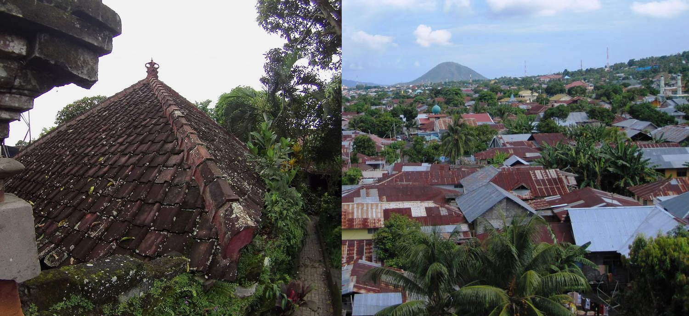
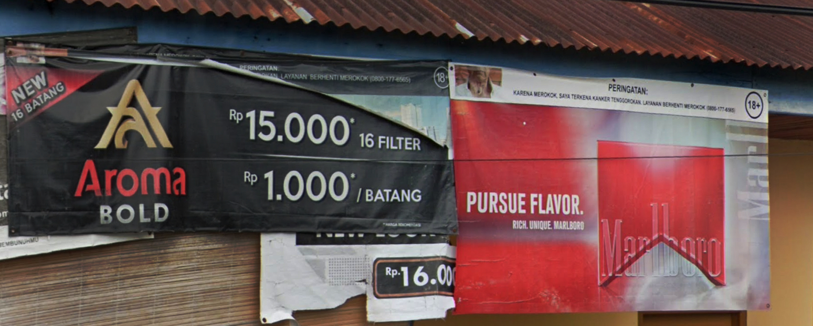
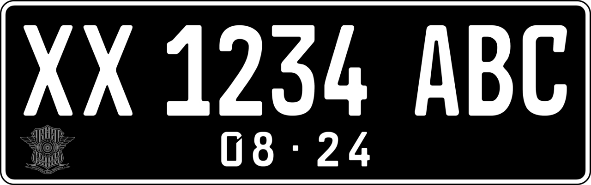
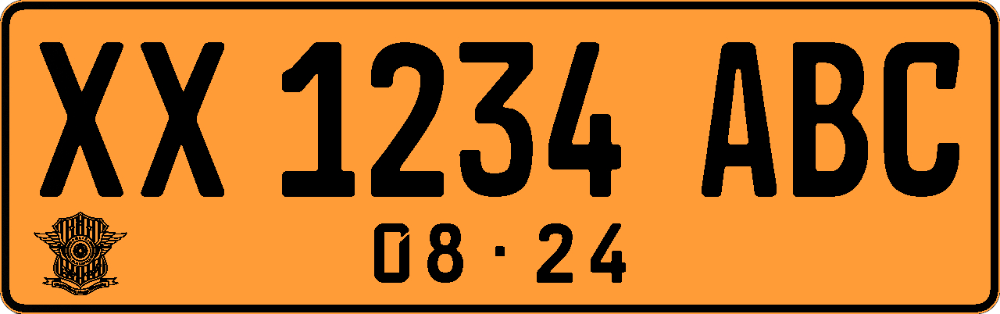
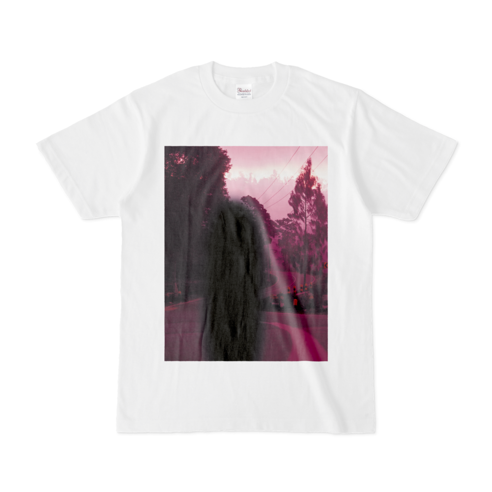
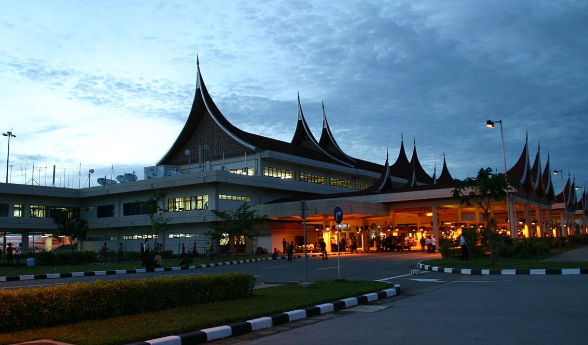
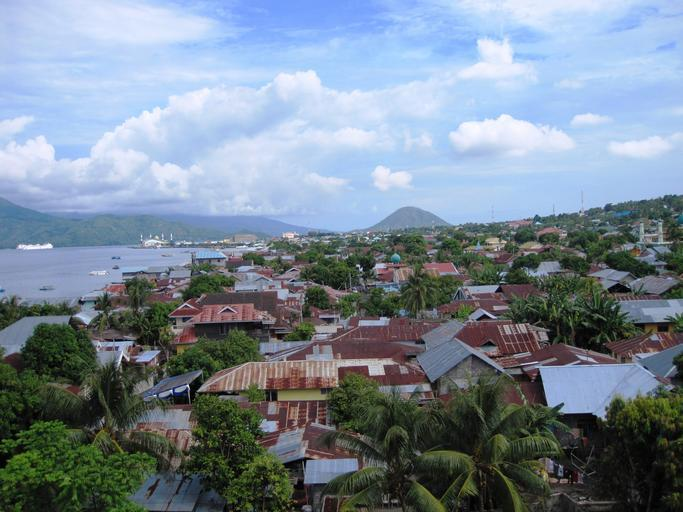
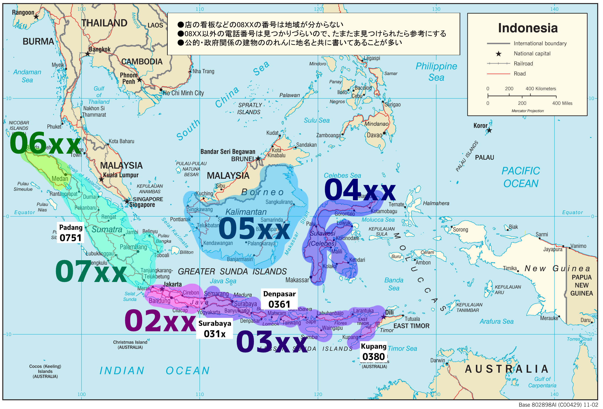


---
title: "Indonesia"
date: 2023-02-26
lastmod: 2023-04-17
weight: 2
draft: false
keywords: [""]
sections: [""]
bg: "bg/city.jpg"
flag: "ID.svg"
jetro_detail: true
plonkit: true
map_title: "Practice Maps"
maps: [
    ["https://www.geoguessr.com/maps/619086606e5572000185a1db", "AI gen - Indonesia"],
    ]
sc_title: "Commonly Confused Regions"
sc: [
    ["../philippines/", "Philippines"],
    ["../../cs_america/brazil/", "Brazil"],
    ["../../cs_america/peru/", "Peru"],
    ["../malaysia/", "Malaysia"],
    ]
---

    <h2 class="section-title">{}</h2>
    <ul class="rule-list">
        <li>The domain is .id</li>
        <li>Cars drive on the left</li>
        <li>Cigarettes are commonly sold roadside, and red and white flags are often seen in front of houses{}</li>
        <li>Many plates are black, and with blur they may look split into three blocks</li>
        <li>There are many Alfamart convenience stores{}</li>
        <li class="no-evidence">If the median is yellow, Indonesia is more likely than Malaysia</li>
    </ul>
    {}

{}
{}
{}
You often see red-and-white triangular flags or colorful flags lined up along streets{}.
{}

By <a rel="nofollow" class="external text" href="https://www.flickr.com/people/8360434@N06">Yan Arief Purwanto</a> from Yogyakarta, Indonesia - <a rel="nofollow" class="external text" href="https://www.flickr.com/photos/8360434@N06/1180032144/">IMG_9328</a>, <a href="https://creativecommons.org/licenses/by-sa/2.0" title="Creative Commons Attribution-Share Alike 2.0">CC BY-SA 2.0</a>, <a href="https://commons.wikimedia.org/w/index.php?curid=8456692">Link</a>

{}
Tiled roofs{} and corrugated metal roofs{} are common. The farther north you go, the more metal roofs.
{}

{}
Signs for Alfamart, Bank Mandiri, and BRI can appear even in small towns. Alfamart has over 17,000 stores nationwide{}.
{}

{}
Cigarettes are commonly sold roadside{}. Even without a cigarette image, "18+" indicates a tobacco ad.
{}

{}
Most plates are black and, with blur, can look split into three segments{}. In {} they usually look split into two. Other colors like yellow and red also exist{}. If you are torn between Malaysia and Indonesia, three-way blur or front plates on motorcycles point to Indonesia{}.
{}

{}

CC0

CC0
{}

{}
Poles often have red-and-white paint, or are black metal poles painted at the base or entirely black{}.
{}

By <a href="//commons.wikimedia.org/wiki/User:Fandy_Aprianto_Rohman" class="mw-redirect" title="User:Fandy Aprianto Rohman">Fandy Aprianto Rohman</a> - Own work, <a href="https://creativecommons.org/licenses/by-sa/4.0" title="Creative Commons Attribution-Share Alike 4.0">CC BY-SA 4.0</a>, <a href="https://commons.wikimedia.org/w/index.php?curid=93198564">Link</a>

{}
You may see PT Pertamina, Indonesia’s largest oil and gas company; the number on the sign can indicate the region{}.
{}

By Yoshi Canopus - Self-photographed, <a href="https://creativecommons.org/licenses/by-sa/3.0" title="Creative Commons Attribution-Share Alike 3.0">CC BY-SA 3.0</a>, <a href="https://commons.wikimedia.org/w/index.php?curid=9435271">Link</a>

{}
Narrow two-lane roads{}. If the centerline is orange, consider {}.
{}

By kasman70, <a href="https://creativecommons.org/licenses/by/3.0" title="Creative Commons Attribution 3.0">CC BY 3.0</a>, <a href="https://commons.wikimedia.org/w/index.php?curid=59989024">Link</a>

{}
{}
{}
There are many types, so see {}
{}

{}
{}
{}
Nippon Indosari Corpindo Tbk is an Indonesian bread maker{}.
{}

<iframe src="https://www.google.com/maps/embed?pb=!4v1681123756392!6m8!1m7!1s7AEFymYv9-0CFDFOHiegYg!2m2!1d-2.919696522806549!2d104.6328255317319!3f327.70222816854846!4f-4.876997037796414!5f3.0855249455824687" width="295" height="295" style="border:0;" allowfullscreen="" loading="lazy" referrerpolicy="no-referrer-when-downgrade"></iframe>

{}
{}

<iframe style="border-radius:12px" src="https://open.spotify.com/embed/track/4eO4TCo8cI4ABfzTTtsaye?utm_source=generator&theme=0" width="100%" height="152" frameBorder="0" allowfullscreen="" allow="autoplay; clipboard-write; encrypted-media; fullscreen; picture-in-picture" loading="lazy"></iframe>

{}
{}

{}

{}
{}

    <h2>Indonesia goods</h2>
    

        
        <!-- 
Product title 1
-->
    

    <h2 class="section-title">{}</h2>
    <ul class="rule-list">
        <li>Learn where kabupaten are (see {} and the reference){}
            <ul>
                <li>Aceh{}</li>
                <li>Ternate in North Maluku{}</li>
                <li>Kupang in East Nusa Tenggara{}</li>
                <li>Bawean{}</li>
            </ul>
        </li>
        <li>There are 38 provinces</li>
    </ul>

{}
{}

{}
Sometimes abbreviated as "KAB". This sign is from the Cepu area{}.
{}

By <a href="https://id.wikipedia.org/wiki/User:Mujionomaruf" class="extiw" title="id:User:Mujionomaruf">id:User:Mujionomaruf</a> - Own work, <a href="https://creativecommons.org/licenses/by-sa/4.0" title="Creative Commons Attribution-Share Alike 4.0">CC BY-SA 4.0</a>, <a href="https://commons.wikimedia.org/w/index.php?curid=105505116">Link</a>

{}
{}
{}There are 38 provinces. Kabupaten are a smaller unit.
{}

By <a href="//commons.wikimedia.org/wiki/User:Bennylin" title="User:Bennylin">Bennylin</a> - Own work, derived from <a href="//commons.wikimedia.org/wiki/File:Indonesia_blank_map_colored.svg" title="File:Indonesia blank map colored.svg">File:Indonesia blank map colored.svg</a>, <a href="https://creativecommons.org/licenses/by-sa/4.0" title="Creative Commons Attribution-Share Alike 4.0">CC BY-SA 4.0</a>, <a href="https://commons.wikimedia.org/w/index.php?curid=135700287">Link</a>

{}
{}

    <h4 class="section-title">Architecture</h4>
    <ul class="rule-list">
        <li>Indonesia has many ethnic groups, so building styles vary{}{}</li>
        <li>{} is detailed; use it
            <ul>
                <li><b>West Sumatra</b>: Minangkabau traditional houses with curved roofs</li>
                <li><b>North Sumatra</b>: Batak roof styles{}</li>
                <li><b>Riau</b>: Lontiok houses with curved roofs, stilted floors, and odd-numbered stairs{}</li>
                <li><b>Banten</b>: Sulah nyanda houses of the Baduy{}{}</li>
                <li><b>Sumba</b>: Uma Marapu houses with tall pointed roofs{}{}</li>
            </ul>
        </li>
    </ul>

{}
{}
{}Tongkonan houses appear{}{}. They are very similar to Batak houses around Lake Toba in North Sumatra.
{}

{}
{}
{}

{}

<iframe src="https://www.google.com/maps/embed?pb=!4v1683548263543!6m8!1m7!1sxFmhhcGFOCSgqWTF7jUwjg!2m2!1d-5.067845559846503!2d119.5146085088659!3f232.43175755263172!4f9.15217011915395!5f3.325193203789971" width="295" height="295" style="border:0;" allowfullscreen="" loading="lazy" referrerpolicy="no-referrer-when-downgrade"></iframe>
<iframe src="https://www.google.com/maps/embed?pb=!4v1683548328370!6m8!1m7!1st81tpun3GGHYbd9D_HOimw!2m2!1d-5.116586927731915!2d120.2633975944878!3f0.471829259376808!4f32.39688387127845!5f3.325193203789971" width="295" height="295" style="border:0;" allowfullscreen="" loading="lazy" referrerpolicy="no-referrer-when-downgrade"></iframe>

{}
{}
{}Minangkabau traditional houses in West Sumatra{}. In the matrilineal Minangkabau, houses are inherited from mother to daughter.
{}

{}
{}

{}
Batak houses in the northern highlands of Sumatra can have a roof shaped like a shallow arc{}.
{}

By <a rel="nofollow" class="external text" href="https://www.flickr.com/people/9508280@N07">Dan Lundberg</a> - <a rel="nofollow" class="external text" href="https://www.flickr.com/photos/9508280@N07/5069459588/">2000 #310-19 Sumatra Samosir Island old Batak village</a>, <a href="https://creativecommons.org/licenses/by-sa/2.0" title="Creative Commons Attribution-Share Alike 2.0">CC BY-SA 2.0</a>, <a href="https://commons.wikimedia.org/w/index.php?curid=11857562">Link</a>

{}
{}
{}
These are rare in cities, so they may be hard to use as GeoGuessr hints.
{}

By <a href="//commons.wikimedia.org/wiki/User:Fitri_Penyalai" title="User:Fitri Penyalai">Fitri Penyalai</a> - Own work, <a href="https://creativecommons.org/licenses/by-sa/4.0" title="Creative Commons Attribution-Share Alike 4.0">CC BY-SA 4.0</a>, <a href="https://commons.wikimedia.org/w/index.php?curid=74817920">Link</a>

{}
{}
{}
Lontiok houses are stilted and have curved roofs. The roof tips may have a cross{}.
{}

By <a href="//commons.wikimedia.org/w/index.php?title=User:Hermadiyansyah_Putra_St_Bagindo&amp;amp;action=edit&amp;amp;redlink=1" class="new" title="User:Hermadiyansyah Putra St Bagindo (page does not exist)">Hermadiyansyah Putra St Bagindo</a> - Own work, <a href="https://creativecommons.org/licenses/by-sa/4.0" title="Creative Commons Attribution-Share Alike 4.0">CC BY-SA 4.0</a>, <a href="https://commons.wikimedia.org/w/index.php?curid=112008242">Link</a>

{}
{}

{}
On Java, reddish tile roofs are common.
{}

<iframe src="https://www.google.com/maps/embed?pb=!4v1682939247795!6m8!1m7!1s7DpyPTNh5Dro9QxQG6qcoA!2m2!1d-8.605628700896254!2d115.2385447357305!3f325.0256058635984!4f22.07131117405868!5f3.325193203789971" width="295" height="295" style="border:0;" allowfullscreen="" loading="lazy" referrerpolicy="no-referrer-when-downgrade"></iframe>
<iframe src="https://www.google.com/maps/embed?pb=!4v1682939288898!6m8!1m7!1sc4sZuH8lESb2j9S-5bc0bQ!2m2!1d-8.436997295884588!2d115.60079460991!3f168.5694954711181!4f22.319543357215508!5f3.325193203789971" width="295" height="295" style="border:0;" allowfullscreen="" loading="lazy" referrerpolicy="no-referrer-when-downgrade"></iframe>

{}
{}
{}
{}

By <a rel="nofollow" class="external text" href="https://www.flickr.com/people/9942231@N07">monica renata</a> from jakarta - <a rel="nofollow" class="external text" href="https://www.flickr.com/photos/9942231@N07/2851068736/">Tarung-Waitabar</a>, <a href="https://creativecommons.org/licenses/by/2.0" title="Creative Commons Attribution 2.0">CC BY 2.0</a>, <a href="https://commons.wikimedia.org/w/index.php?curid=10201081">Link</a>

{}
{}

    <ul class="rule-list">
        <li>Agriculture varies by region
            <ul>
                <li>Rice: more likely Java (over 50%) but appears nationwide</li>
                <li>Corn: if you see both rice paddies and corn fields, Java is likely</li>
                <li>Oil palm: common in North Sumatra{} and Kalimantan{}</li>
                <li>Data source: <a href="https://ipad.fas.usda.gov/countrysummary/default.aspx?id=ID">U.S. Indonesia Production Country Summary (USDA)</a></li>
            </ul>
        </li>
    </ul>

{}
{}

{}
Java is most likely (over 50%), but rice appears nationwide. If you see large paddies, consider flat central/eastern Java{} or southern Sulawesi{}.
{}

{}
{}

{}
If you see rice paddies and corn together, go to Java.
{}

<iframe src="https://www.google.com/maps/embed?pb=!4v1687967345178!6m8!1m7!1sslYJglqC9bYjTlFKjuqV0A!2m2!1d-7.573964609193962!2d112.3082058903186!3f86.78796272542473!4f-8.161422261641235!5f1.7448217700337718" width="500" height="350" style="border:0;" allowfullscreen="" loading="lazy" referrerpolicy="no-referrer-when-downgrade"></iframe>

{}
{}

{}
There are no plantations in southern Sulawesi. If you see plantations together with Jawi script, consider Riau.
{}

{}
{}

    <ul class="rule-list">
        <li>Ternate Island has Gamalama in the center; roads and houses line the slopes{}</li>
        <li class="no-evidence">Area codes often appear together with place names
            <ul>
                <li>08XX numbers are too generic; avoid hunting every sign. Place names are more useful.</li>
                <li>Ignore 08 and memorize that codes increase counterclockwise starting from Jakarta.</li>
                <li><b>03x: East Java</b></li>
                <li style="margin-left:1em;">031x: {}</li>
                <li><b>036x: Bali</b></li>
                <li style="margin-left:1em;">0361: {}</li>
                <li style="margin-left:1em;">0380: {}</li>
                <li><b>07x: South Sumatra</b></li>
                <li style="margin-left:1em;">0751: {}</li>
                <li>{}</li>
            </ul>
        </li>
        <li>Pertamina gas station numbers can indicate region
            <ul>
                <li>1x~5x: smaller numbers are farther north</li>
                <li>6x: Kalimantan</li>
                <li>7x: Sulawesi</li>
            </ul>
        </li>
    </ul>

{}
{}

{}
You often see the mountain in the background{}, and houses are built on slopes{}. Tidore Island next to it feels similar.
{}

{}
{}

{}
{}
