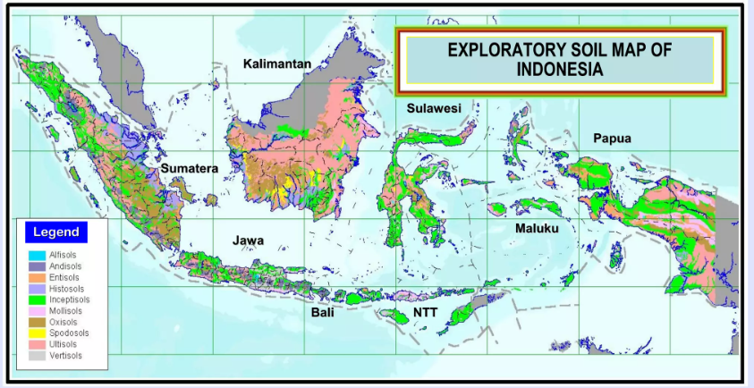

    <h2 class="section-title">{}</h2>
    <ul class="rule-list">
        <li>Domain is .id</li>
        <li>Cars drive on the left side of the road.</li>
        <li>Cigarettes often sold on the street and the red and white flags in front of houses{}</li>
        <li>In Indonesia, there are black license plates, some of which may appear to have three separate white areas</li>
        <li>Major banking companies with many ATMs include Bank Mandiri (mandiri) and Bank Rakyat Indonesia (BRI) Bank etc.</li>
        <li class="no-evidence">If the center line of the road is yellow, it is more likely to be Indonesia, not Malaysia</li>
    </ul>
    {}

{}
{}
{}
Triangular flags, colored in red and white, line the front of houses and streets.
{}

<iframe src="https://www.google.com/maps/embed?pb=!4v1679418842058!6m8!1m7!1sDkOms0nwM3VLcLulen7Q9A!2m2!1d-7.138642207851226!2d112.0839182746857!3f73.27854046841789!4f0.17932380137330028!5f3.3209763096529796" width="295" height="295" style="border:0;" allowfullscreen="" loading="lazy" referrerpolicy="no-referrer-when-downgrade"></iframe>
<iframe src="https://www.google.com/maps/embed?pb=!4v1681123169184!6m8!1m7!1s6inKIZzEa3NfnGLkKd3SHA!2m2!1d-7.437631598558037!2d111.2137910224957!3f175.5818389161207!4f13.847072777968094!5f2.748336797787689" width="295" height="295" style="border:0;" allowfullscreen="" loading="lazy" referrerpolicy="no-referrer-when-downgrade"></iframe>

{}
Signs for Alfa Mart (convenience store), Mandiri Bank, and Bank Rakyat Indonesia (BRI) can be found even in smaller towns.
{}

<iframe src="https://www.google.com/maps/embed?pb=!4v1679418739199!6m8!1m7!1s8LPLnNIXlbAhWGe6igV6LA!2m2!1d0.499575846590895!2d101.4575006937433!3f73.38401826115813!4f7.14178486471836!5f3.325193203789971" width="295" height="295" style="border:0;" allowfullscreen="" loading="lazy" referrerpolicy="no-referrer-when-downgrade"></iframe>
<iframe src="https://www.google.com/maps/embed?pb=!4v1681122823859!6m8!1m7!1s7byCkW0xEA5uzEdbFRHuPg!2m2!1d-7.277122663255537!2d112.8048891220813!3f14.541064942612202!4f5.241205322196677!5f3.1190796277333193" width="295" height="295" style="border:0;" allowfullscreen="" loading="lazy" referrerpolicy="no-referrer-when-downgrade"></iframe>

{}
Cigarettes are often sold on the street. If it says "18+" without a picture of cigarettes, it is an advertisement for cigarettes; if it says "GGSP", it is a goodwill about the cigarette manufacturer Gudang Garam Tbk PT.
{}

<iframe src="https://www.google.com/maps/embed?pb=!4v1681123521434!6m8!1m7!1swbWijWsNKQOs7wVYQszpxw!2m2!1d-6.580673973100997!2d106.0645476758596!3f175.45875597700655!4f-0.27278946161943907!5f3.325193203789971" width="295" height="295" style="border:0;" allowfullscreen="" loading="lazy" referrerpolicy="no-referrer-when-downgrade"></iframe>
<iframe src="https://www.google.com/maps/embed?pb=!4v1681123649144!6m8!1m7!1sIfcsuEIlVqEMwkPPYJg9Pw!2m2!1d0.585178825786272!2d101.3853830961266!3f172.409679315489!4f4.21978728436487!5f3.325193203789971" width="295" height="295" style="border:0;" allowfullscreen="" loading="lazy" referrerpolicy="no-referrer-when-downgrade"></iframe>

{}
{}

<iframe src="https://www.google.com/maps/embed?pb=!4v1682778342808!6m8!1m7!1sQM84rM9Z5bNVCy3Trd364g!2m2!1d-8.27965791336707!2d118.4407403780819!3f209.7921306950951!4f16.736777405904192!5f2.504720619618973" width="295" height="295" style="border:0;" allowfullscreen="" loading="lazy" referrerpolicy="no-referrer-when-downgrade"></iframe>

{}
{}
{}
Depending on the mosaic, the license plate may appear to be divided into three parts...? In addition to white, yellow and red license plates also exist.
{}

<iframe src="https://www.google.com/maps/embed?pb=!4v1679381467003!6m8!1m7!1s30lzEjzyMKzNlBbXFtGUPA!2m2!1d-5.278066734699592!2d119.4322266927783!3f87.53465278696294!4f-8.242611371803562!5f3.325193203789971" width="295" height="295" style="border:0;" allowfullscreen="" loading="lazy" referrerpolicy="no-referrer-when-downgrade"></iframe>

{}

By RasyaAbhirama13 - Own work, CC BY-SA 3.0, <a href="https://commons.wikimedia.org/w/index.php?curid=123241255">Wikimedia Commons</a>
{}

{}
{}
{}
Nippon Indosari Corpindo Tbk is an Indonesian bread manufacturer.
{}

<iframe src="https://www.google.com/maps/embed?pb=!4v1681123756392!6m8!1m7!1s7AEFymYv9-0CFDFOHiegYg!2m2!1d-2.919696522806549!2d104.6328255317319!3f327.70222816854846!4f-4.876997037796414!5f3.0855249455824687" width="295" height="295" style="border:0;" allowfullscreen="" loading="lazy" referrerpolicy="no-referrer-when-downgrade"></iframe>

{}
Convenience store?
{}

<iframe src="https://www.google.com/maps/embed?pb=!4v1679418739199!6m8!1m7!1s8LPLnNIXlbAhWGe6igV6LA!2m2!1d0.499575846590895!2d101.4575006937433!3f73.38401826115813!4f7.14178486471836!5f3.325193203789971" width="295" height="295" style="border:0;" allowfullscreen="" loading="lazy" referrerpolicy="no-referrer-when-downgrade"></iframe>

{}
{}

<iframe style="border-radius:12px" src="https://open.spotify.com/embed/track/4eO4TCo8cI4ABfzTTtsaye?utm_source=generator&theme=0" width="100%" height="152" frameBorder="0" allowfullscreen="" allow="autoplay; clipboard-write; encrypted-media; fullscreen; picture-in-picture" loading="lazy"></iframe>

{}
{}

    <h2 class="section-title">{}</h2>
    <ul class="rule-list">
        <li class="no-evidence">Different areas have different roofs on their buildings.{}</li>
    </ul>

{}
{}
{}
{}

{}
{}

{}
The roof is like a "︶".
{}

<iframe src="https://www.google.com/maps/embed?pb=!4v1682938301102!6m8!1m7!1sdYEeE8gVCRptDkjFd5fe9Q!2m2!1d2.662348501697962!2d98.93671843359715!3f133.78090796184347!4f9.592033970520475!5f1.6742346439568223" width="295" height="295" style="border:0;" allowfullscreen="" loading="lazy" referrerpolicy="no-referrer-when-downgrade"></iframe>
<iframe src="https://www.google.com/maps/embed?pb=!4v1682938730523!6m8!1m7!1sQd2wepuKWn-I4-eMX7-cyg!2m2!1d2.33148254006605!2d99.09119100972214!3f101.99213106690989!4f9.086701111479059!5f1.5669698120421591" width="295" height="295" style="border:0;" allowfullscreen="" loading="lazy" referrerpolicy="no-referrer-when-downgrade"></iframe>

{}
{}
{}
{}

<iframe src="https://www.google.com/maps/embed?pb=!4v1682939247795!6m8!1m7!1s7DpyPTNh5Dro9QxQG6qcoA!2m2!1d-8.605628700896254!2d115.2385447357305!3f325.0256058635984!4f22.07131117405868!5f3.325193203789971" width="295" height="295" style="border:0;" allowfullscreen="" loading="lazy" referrerpolicy="no-referrer-when-downgrade"></iframe>
<iframe src="https://www.google.com/maps/embed?pb=!4v1682939288898!6m8!1m7!1sc4sZuH8lESb2j9S-5bc0bQ!2m2!1d-8.436997295884588!2d115.60079460991!3f168.5694954711181!4f22.319543357215508!5f3.325193203789971" width="295" height="295" style="border:0;" allowfullscreen="" loading="lazy" referrerpolicy="no-referrer-when-downgrade"></iframe>

{}
{}
{}
{}

？

{}
{}

    <ul class="rule-list">
        <li class="no-evidence">It could be used to identify the region, as the soil color varies slightly from region to region. However, it is unclear if it can actually be useful.</li>
    </ul>

{}
{}

{}
Although soils vary from region to region, it is not known if the colors are different.{}.
{}

{}
{}

{}
{}
{}

<iframe src="https://www.google.com/maps/embed?pb=!4v1682549708426!6m8!1m7!1sZIo7aDvMQkbFPcDYqbSGqw!2m2!1d2.963545305522395!2d112.3021970707313!3f330.58911588674107!4f-13.463186094634153!5f2.625769095251337" width="295" height="295" style="border:0;" allowfullscreen="" loading="lazy" referrerpolicy="no-referrer-when-downgrade"></iframe>
<iframe src="https://www.google.com/maps/embed?pb=!4v1682549757831!6m8!1m7!1snhEq4BhbsjPPuZJ6ONIuMQ!2m2!1d6.743509096518713!2d117.0716160845031!3f99.79404337582251!4f-5.734719200019811!5f3.163675566816853" width="295" height="295" style="border:0;" allowfullscreen="" loading="lazy" referrerpolicy="no-referrer-when-downgrade"></iframe>

{}
{}

{}
{}
{}

<iframe src="https://www.google.com/maps/embed?pb=!4v1682550035120!6m8!1m7!1stPEG8Dl0-9riWc1GUkstjw!2m2!1d0.6901218271766605!2d112.9078385287307!3f74.41900033617682!4f-30.29921283121989!5f3.2606839237319343" width="295" height="295" style="border:0;" allowfullscreen="" loading="lazy" referrerpolicy="no-referrer-when-downgrade"></iframe>
<iframe src="https://www.google.com/maps/embed?pb=!4v1682550218436!6m8!1m7!1spEj5g1gAzsO0i0FpqPInZw!2m2!1d3.518168836598841!2d116.9739021223292!3f108.98632185076933!4f-25.726641715706066!5f1.532944057661422" width="295" height="295" style="border:0;" allowfullscreen="" loading="lazy" referrerpolicy="no-referrer-when-downgrade"></iframe>

{}
{}

{}
{}
{}

<iframe src="https://www.google.com/maps/embed?pb=!4v1682550387094!6m8!1m7!1sG5K2oAHYNBojc7AW3QJUSQ!2m2!1d0.4945569569149501!2d122.1693947634811!3f321.0704499180431!4f-2.124469104645101!5f3.176121100300359" width="295" height="295" style="border:0;" allowfullscreen="" loading="lazy" referrerpolicy="no-referrer-when-downgrade"></iframe>
<iframe src="https://www.google.com/maps/embed?pb=!4v1682550423199!6m8!1m7!1sbkpye94L54fBMf6GEZ4f8A!2m2!1d-10.0290154871398!2d123.9669759240814!3f342.968642101018!4f-10.9258781197927!5f2.912563245917548" width="295" height="295" style="border:0;" allowfullscreen="" loading="lazy" referrerpolicy="no-referrer-when-downgrade"></iframe>

{}
{}

