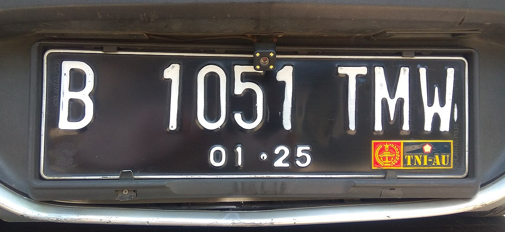
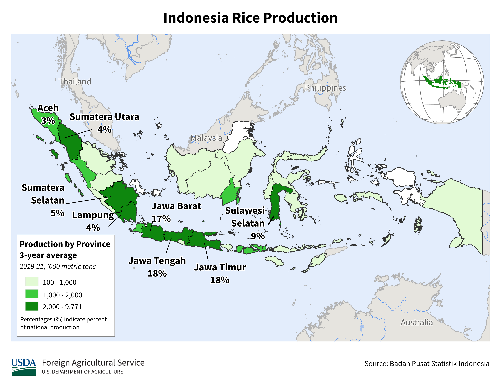
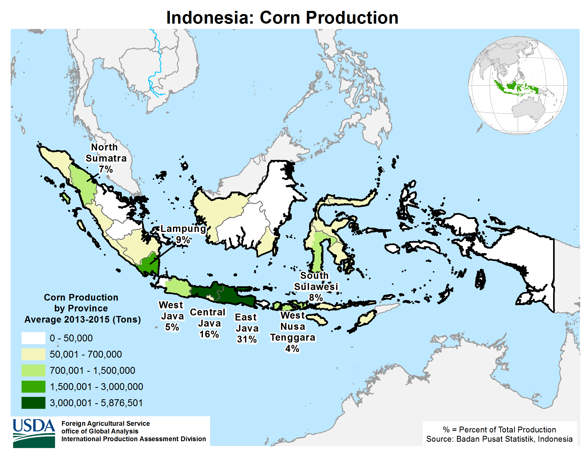
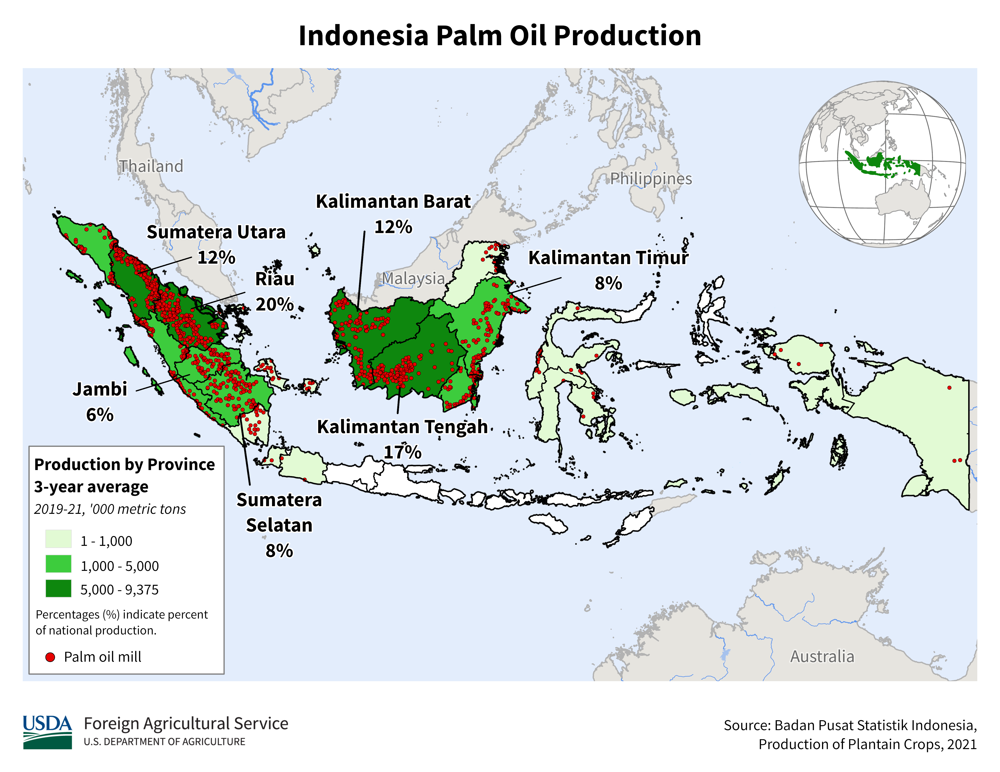

    <h2 class="section-title">{}</h2>
    <ul class="rule-list">
        <li>ドメインは.id</li>
        <li>車は左側通行</li>
        <li>道端でタバコがよく売られていて家の前に赤と白の旗があることも{}</li>
        <li>ナンバープレートに黒いものがあり一部は白い文字が３つに分かれて見えるかもしれない</li>
        <li>銀行大手でATMが多いのはバンク・マンディリ（Mandiri）、バンク・ラクヤット・インドネシア銀行（BRI）など</li>
        <li class="no-evidence">道路の中央分離帯が黄色の場合はマレーシアではなくインドネシアの可能性が高くなる</li>
    </ul>
    {}

{}
{}
{}
家の前や通りに赤と白でカラーリングされた三角の旗が並んでいる。
{}

<iframe src="https://www.google.com/maps/embed?pb=!4v1679418842058!6m8!1m7!1sDkOms0nwM3VLcLulen7Q9A!2m2!1d-7.138642207851226!2d112.0839182746857!3f73.27854046841789!4f0.17932380137330028!5f3.3209763096529796" width="525" height="295" style="border:0;" allowfullscreen="" loading="lazy" referrerpolicy="no-referrer-when-downgrade"></iframe>

{}
アルファマート、マンディリ銀行、BRI銀行などの看板は小さめの町でも見つかることがある。アルファマートはインドネシア国内になんと17000店以上展開しているという。
{}

{}
道端でタバコがよく売られている。たばこの絵柄が無くても『18+』と書かれていればたばこの広告。
{}

<iframe src="https://www.google.com/maps/embed?pb=!4v1681123521434!6m8!1m7!1swbWijWsNKQOs7wVYQszpxw!2m2!1d-6.580673973100997!2d106.0645476758596!3f175.45875597700655!4f-0.27278946161943907!5f3.325193203789971" width="295" height="295" style="border:0;" allowfullscreen="" loading="lazy" referrerpolicy="no-referrer-when-downgrade"></iframe>
<iframe src="https://www.google.com/maps/embed?pb=!4v1681123649144!6m8!1m7!1sIfcsuEIlVqEMwkPPYJg9Pw!2m2!1d0.585178825786272!2d101.3853830961266!3f172.409679315489!4f4.21978728436487!5f3.325193203789971" width="295" height="295" style="border:0;" allowfullscreen="" loading="lazy" referrerpolicy="no-referrer-when-downgrade"></iframe>

{}
ナンバープレートは黒色のものが多くモザイクのかかり方によっては３つに分かれて見えるかも、{}なら２つに分かれて見える。また黄色や赤色といった他の色のナンバープレートも存在する。
{}

{}

By RasyaAbhirama13 - Own work, <a href="https://creativecommons.org/licenses/by-sa/3.0/deed.ja">CC BY-SA 3.0</a>, <a href="https://commons.wikimedia.org/w/index.php?curid=123241255">Wikimedia Commons</a>
{}

{}
{}
{}
種類が多いので『{}』に移動しました
{}

{}
{}
{}
ニッポン・インドサリ・コーピンド（Nippon Indosari Corpindo Tbk）はインドネシアのパンメーカー{}。
{}

<iframe src="https://www.google.com/maps/embed?pb=!4v1681123756392!6m8!1m7!1s7AEFymYv9-0CFDFOHiegYg!2m2!1d-2.919696522806549!2d104.6328255317319!3f327.70222816854846!4f-4.876997037796414!5f3.0855249455824687" width="295" height="295" style="border:0;" allowfullscreen="" loading="lazy" referrerpolicy="no-referrer-when-downgrade"></iframe>

{}
{}

<iframe style="border-radius:12px" src="https://open.spotify.com/embed/track/4eO4TCo8cI4ABfzTTtsaye?utm_source=generator&theme=0" width="100%" height="152" frameBorder="0" allowfullscreen="" allow="autoplay; clipboard-write; encrypted-media; fullscreen; picture-in-picture" loading="lazy"></iframe>

{}
{}

    <h2 class="section-title">{}</h2>
    <ul class="rule-list">
        <li class="no-evidence">地域ごとに建物が違う{}</li>
        <li>{}が詳しいのでこれを見る</li>
    </ul>

{}
{}
{}パダン周辺の伝統的なデザインの家
{}

{}
{}

{}
屋根の上が︶のようになっている
{}

<iframe src="https://www.google.com/maps/embed?pb=!4v1682938730523!6m8!1m7!1sQd2wepuKWn-I4-eMX7-cyg!2m2!1d2.33148254006605!2d99.09119100972214!3f101.99213106690989!4f9.086701111479059!5f1.5669698120421591" width="295" height="295" style="border:0;" allowfullscreen="" loading="lazy" referrerpolicy="no-referrer-when-downgrade"></iframe>

{}
{}
{}
{}

<iframe src="https://www.google.com/maps/embed?pb=!4v1682939247795!6m8!1m7!1s7DpyPTNh5Dro9QxQG6qcoA!2m2!1d-8.605628700896254!2d115.2385447357305!3f325.0256058635984!4f22.07131117405868!5f3.325193203789971" width="295" height="295" style="border:0;" allowfullscreen="" loading="lazy" referrerpolicy="no-referrer-when-downgrade"></iframe>
<iframe src="https://www.google.com/maps/embed?pb=!4v1682939288898!6m8!1m7!1sc4sZuH8lESb2j9S-5bc0bQ!2m2!1d-8.436997295884588!2d115.60079460991!3f168.5694954711181!4f22.319543357215508!5f3.325193203789971" width="295" height="295" style="border:0;" allowfullscreen="" loading="lazy" referrerpolicy="no-referrer-when-downgrade"></iframe>

{}
{}
{}
{}

<iframe src="https://www.google.com/maps/embed?pb=!4v1683548263543!6m8!1m7!1sxFmhhcGFOCSgqWTF7jUwjg!2m2!1d-5.067845559846503!2d119.5146085088659!3f232.43175755263172!4f9.15217011915395!5f3.325193203789971" width="295" height="295" style="border:0;" allowfullscreen="" loading="lazy" referrerpolicy="no-referrer-when-downgrade"></iframe>
<iframe src="https://www.google.com/maps/embed?pb=!4v1683548328370!6m8!1m7!1st81tpun3GGHYbd9D_HOimw!2m2!1d-5.116586927731915!2d120.2633975944878!3f0.471829259376808!4f32.39688387127845!5f3.325193203789971" width="295" height="295" style="border:0;" allowfullscreen="" loading="lazy" referrerpolicy="no-referrer-when-downgrade"></iframe>

{}
{}

    <ul class="rule-list">
        <li>農作物の分布が地域ごとに異なる
            <ul>
                <li>コメ：確率的にはジャワ島（50％超）だが全域に見られる</li>
                <li>コーン：田んぼとコーン畑が同時にあるならジャワ島に行っていいと思う</li>
                <li>アブラヤシ：南側・スラウェシ島にはプランテーションが無い</li>
                <li>データ提供元：<a href="https://ipad.fas.usda.gov/countrysummary/default.aspx?id=ID">U.S. Indonesia Production Country Summary(U.S. Department of Agriculture)</a></li>
            </ul>
        </li>
    </ul>

{}
{}

{}
確率的にはジャワ島（50％超）だが全域に見られる。
{}

{}
{}

{}
田んぼとコーン畑が同時にあるならジャワ島に行っていいと思う。
{}

<iframe src="https://www.google.com/maps/embed?pb=!4v1687967345178!6m8!1m7!1sslYJglqC9bYjTlFKjuqV0A!2m2!1d-7.573964609193962!2d112.3082058903186!3f86.78796272542473!4f-8.161422261641235!5f1.7448217700337718" width="500" height="350" style="border:0;" allowfullscreen="" loading="lazy" referrerpolicy="no-referrer-when-downgrade"></iframe>

{}
{}

{}
南側・スラウェシ島にはプランテーションが無い。プランテーションと合わせてジャウィ文字があったならばリアウ州に行ってみる？
{}

{}
{}
