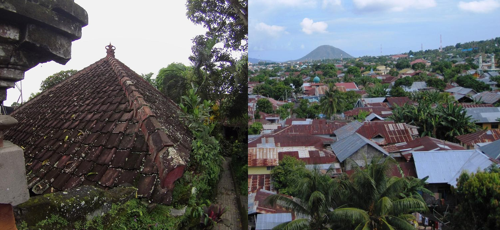
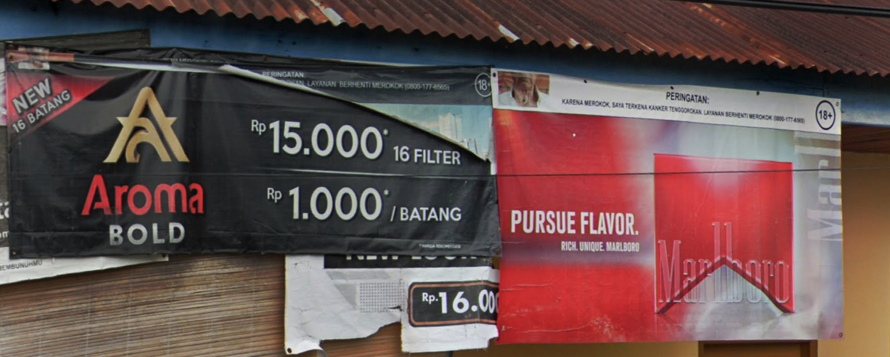
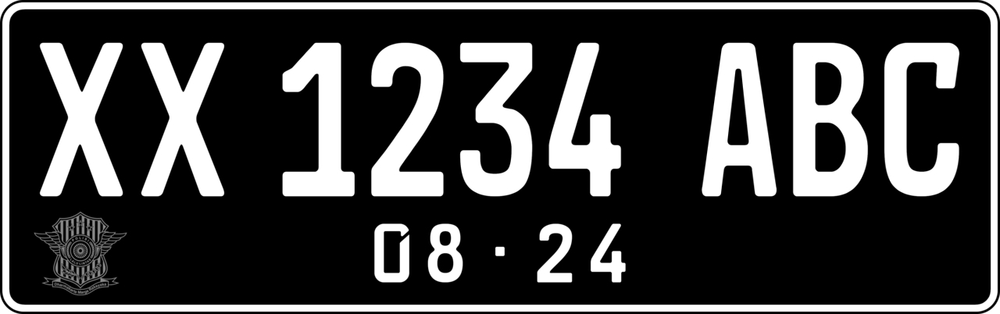
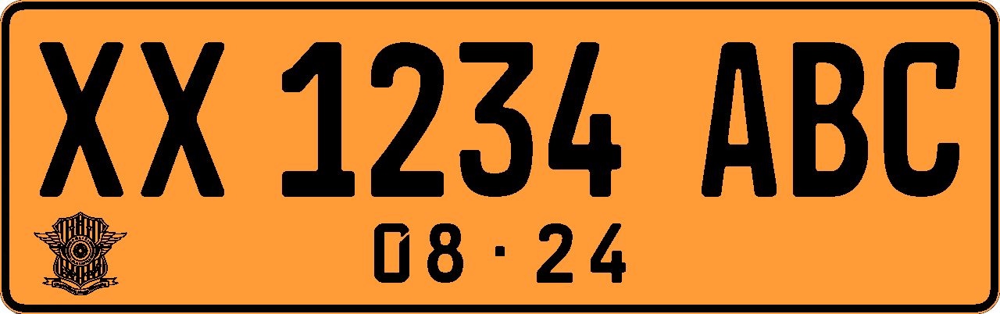
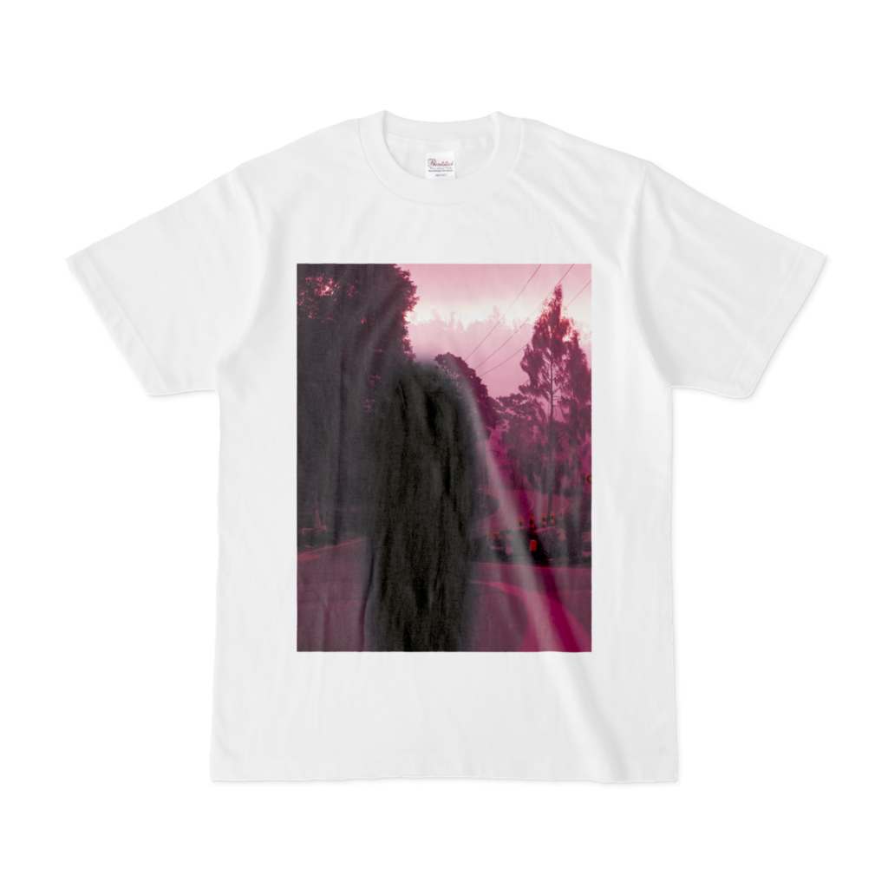
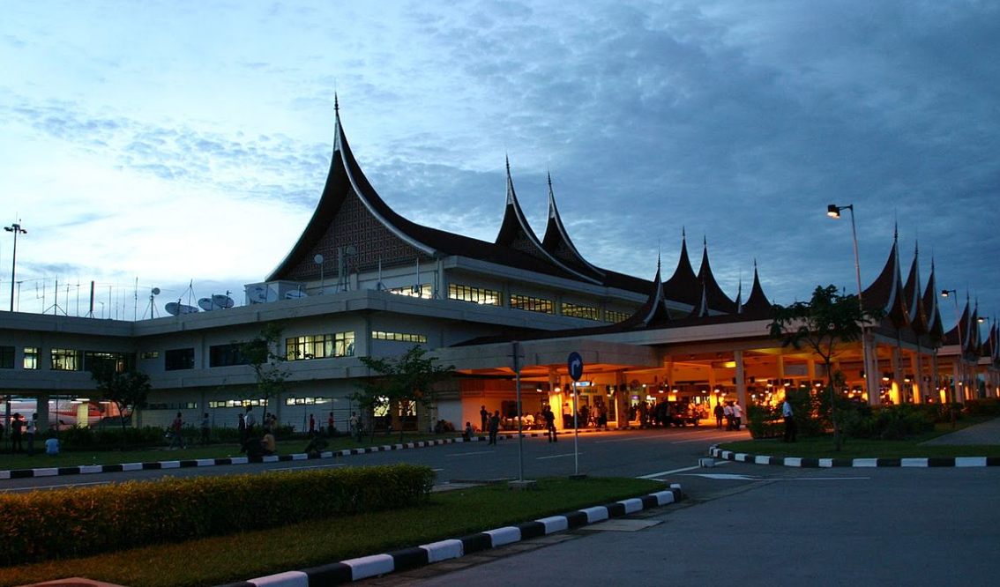
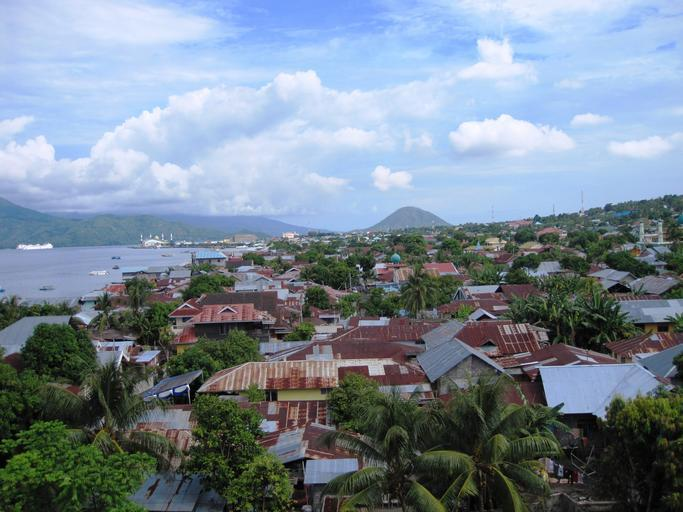
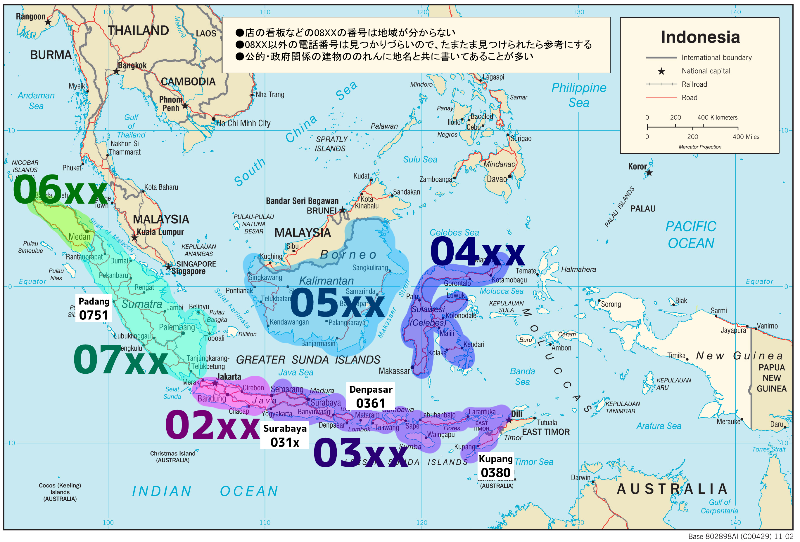

    <h2 class="section-title">{}</h2>
    <ul class="rule-list">
        <li>ドメインは.id</li>
        <li>車は左側通行</li>
        <li>道端でタバコがよく売られていて家の前に赤と白の旗があることも{}</li>
        <li>ナンバープレートに黒いものがあり一部は白い文字が３つに分かれて見えるかもしれない</li>
        <li>Alfamartというコンビニがたくさんある{}</li>
        <li class="no-evidence">道路の中央分離帯が黄色の場合はマレーシアではなくインドネシアの可能性が高くなる</li>
    </ul>
    {}

{}
{}
{}
家の前や通りに赤と白でカラーリングされた三角の旗{}やカラフルな旗{}が並んでいる。
{}

By <a rel="nofollow" class="external text" href="https://www.flickr.com/people/8360434@N06">Yan Arief Purwanto</a> from Yogyakarta, Indonesia - <a rel="nofollow" class="external text" href="https://www.flickr.com/photos/8360434@N06/1180032144/">IMG_9328</a>, <a href="https://creativecommons.org/licenses/by-sa/2.0" title="Creative Commons Attribution-Share Alike 2.0">CC BY-SA 2.0</a>, <a href="https://commons.wikimedia.org/w/index.php?curid=8456692">Link</a>

{}
瓦{}やトタンの屋根{}が多い。北ほどトタンの割合が高い。
{}

{}
アルファマート、マンディリ銀行、BRI銀行などの看板は小さめの町でも見つかることがある。アルファマートはインドネシア国内になんと17000店以上展開しているという{}。
{}

{}
道端でタバコがよく売られている{}。たばこの絵柄が無くても『18+』と書かれていればたばこの広告。
{}

{}
ナンバープレートは黒色のものが多くモザイクのかかり方によっては３つに分かれて見えるかも{}。{}なら２つに分かれて見える。また黄色や赤色といった他の色のナンバープレートも存在する{}。マレーシアと迷っている時、モザイクが３つに分かれていたりバイクのフロントにもナンバープレートがあれば{}インドネシアになる。
{}

{}

CC0

CC0
{}

{}
写真中央やや左側にあるようにポールに赤白のペイントがある{}か、根本や全体が黒に塗られた鉄のポールであることも多い{}。
{}

By <a href="//commons.wikimedia.org/wiki/User:Fandy_Aprianto_Rohman" class="mw-redirect" title="User:Fandy Aprianto Rohman">Fandy Aprianto Rohman</a> - Own work, <a href="https://creativecommons.org/licenses/by-sa/4.0" title="Creative Commons Attribution-Share Alike 4.0">CC BY-SA 4.0</a>, <a href="https://commons.wikimedia.org/w/index.php?curid=93198564">Link</a>

{}
インドネシア最大手の石油・天然ガス会社であるPT Pertaminaがあり看板に書いてある番号から地域もわかる{}。
{}

By Yoshi Canopus - Self-photographed, <a href="https://creativecommons.org/licenses/by-sa/3.0" title="Creative Commons Attribution-Share Alike 3.0">CC BY-SA 3.0</a>, <a href="https://commons.wikimedia.org/w/index.php?curid=9435271">Link</a>

{}
細い2車線道路{}。オレンジ線なら{}も考えてみる。
{}

By kasman70, <a href="https://creativecommons.org/licenses/by/3.0" title="Creative Commons Attribution 3.0">CC BY 3.0</a>, <a href="https://commons.wikimedia.org/w/index.php?curid=59989024">Link</a>

{}
{}
{}
種類が多いので『{}』に移動しました
{}

{}
{}
{}
ニッポン・インドサリ・コーピンド（Nippon Indosari Corpindo Tbk）はインドネシアのパンメーカー{}。
{}

<iframe src="https://www.google.com/maps/embed?pb=!4v1681123756392!6m8!1m7!1s7AEFymYv9-0CFDFOHiegYg!2m2!1d-2.919696522806549!2d104.6328255317319!3f327.70222816854846!4f-4.876997037796414!5f3.0855249455824687" width="295" height="295" style="border:0;" allowfullscreen="" loading="lazy" referrerpolicy="no-referrer-when-downgrade"></iframe>

{}
{}

<iframe style="border-radius:12px" src="https://open.spotify.com/embed/track/4eO4TCo8cI4ABfzTTtsaye?utm_source=generator&theme=0" width="100%" height="152" frameBorder="0" allowfullscreen="" allow="autoplay; clipboard-write; encrypted-media; fullscreen; picture-in-picture" loading="lazy"></iframe>

{}
{}

    <h2>インドネシア関連グッズ</h2>
    

        
        <!-- 
商品タイトル1
-->
    

    <h2 class="section-title">{}</h2>
    <ul class="rule-list">
        <li>Kabupatenの位置を覚える（{}、参考文献先で確認してください）{}
            <ul>
                <li>Aceh{}</li>
                <li>Maluku UtaraのTernate市{}</li>
                <li>Nusa Tenggara TimurのKupang市{}</li>
                <li>Bawean{}</li>
            </ul>
        </li>
        <li>州は38個ある</li>
    </ul>

{}
{}

{}
「KAB」と略されることもある。この看板はCepuの地域{}。
{}

By <a href="https://id.wikipedia.org/wiki/User:Mujionomaruf" class="extiw" title="id:User:Mujionomaruf">id:User:Mujionomaruf</a> - Own work, <a href="https://creativecommons.org/licenses/by-sa/4.0" title="Creative Commons Attribution-Share Alike 4.0">CC BY-SA 4.0</a>, <a href="https://commons.wikimedia.org/w/index.php?curid=105505116">Link</a>

{}
{}
{}州は38個ある。より細かい単位としてkabupatenがある。
{}

By <a href="//commons.wikimedia.org/wiki/User:Bennylin" title="User:Bennylin">Bennylin</a> - Own work, derived from <a href="//commons.wikimedia.org/wiki/File:Indonesia_blank_map_colored.svg" title="File:Indonesia blank map colored.svg">File:Indonesia blank map colored.svg</a>, <a href="https://creativecommons.org/licenses/by-sa/4.0" title="Creative Commons Attribution-Share Alike 4.0">CC BY-SA 4.0</a>, <a href="https://commons.wikimedia.org/w/index.php?curid=135700287">Link</a>

{}
{}

    <h4 class="section-title">建築</h4>
    <ul class="rule-list">
        <li>インドネシアには多数の民族があり文化や民族によって建物の見た目が異なる{}{}</li>
        <li>{}が詳しいのでこれを見る
            <ul>
                <li><b>西スマトラ</b>：屋根がそり曲がった感じのミナンカバウ族の伝統的なデザインの家</li>
                <li><b>北スマトラ</b>：バタック人文化の特徴的なデザインの屋根がある{}</li>
                <li><b>リアウ州</b>：Lontiokと呼ばれる湾曲した屋根・高床式・入口までの奇数ステップの階段が特徴的な家がある{}</li>
                <li><b>バンテン州</b>：Sulah nyandaと呼ばれるSuku Baduiの伝統的ない家がある{}{}</li>
                <li><b>スンバ島</b>：ウマ・マラプと呼ばれる高く突き出た屋根の家がある{}{}</li>
            </ul>
        </li>
    </ul>

{}
{}
{}いわゆるTongkonan-houseが見つかる{}{}。スマトラ島の北部で見つかるトバ湖周辺のトバ･バタック族の民家にとても良く似ている。
{}

{}
{}
{}

{}

<iframe src="https://www.google.com/maps/embed?pb=!4v1683548263543!6m8!1m7!1sxFmhhcGFOCSgqWTF7jUwjg!2m2!1d-5.067845559846503!2d119.5146085088659!3f232.43175755263172!4f9.15217011915395!5f3.325193203789971" width="295" height="295" style="border:0;" allowfullscreen="" loading="lazy" referrerpolicy="no-referrer-when-downgrade"></iframe>
<iframe src="https://www.google.com/maps/embed?pb=!4v1683548328370!6m8!1m7!1st81tpun3GGHYbd9D_HOimw!2m2!1d-5.116586927731915!2d120.2633975944878!3f0.471829259376808!4f32.39688387127845!5f3.325193203789971" width="295" height="295" style="border:0;" allowfullscreen="" loading="lazy" referrerpolicy="no-referrer-when-downgrade"></iframe>

{}
{}
{}西スマトラ州にあるミナンカバウ族の伝統的なデザインの家{}。母系社会であるミナンカバウでは母から娘へこの家が受け継がれるらしい。
{}

{}
{}

{}
スマトラ島北部の高地に居住しているバタック族の家は屋根の上が︶のようになっていることがある{}。
{}

By <a rel="nofollow" class="external text" href="https://www.flickr.com/photos/9508280@N07">Dan Lundberg</a> - <a rel="nofollow" class="external text" href="https://www.flickr.com/photos/9508280@N07/5069459588/">2000 #310-19 Sumatra Samosir Island old Batak village</a>, <a href="https://creativecommons.org/licenses/by-sa/2.0" title="Creative Commons Attribution-Share Alike 2.0">CC BY-SA 2.0</a>, <a href="https://commons.wikimedia.org/w/index.php?curid=11857562">Link</a>

{}
{}
{}
街中ではほぼ見ないように思うのでジオゲッサーのヒントとしては活用しづらいかも。
{}

By <a href="//commons.wikimedia.org/wiki/User:Fitri_Penyalai" title="User:Fitri Penyalai">Fitri Penyalai</a> - Own work, <a href="https://creativecommons.org/licenses/by-sa/4.0" title="Creative Commons Attribution-Share Alike 4.0">CC BY-SA 4.0</a>, <a href="https://commons.wikimedia.org/w/index.php?curid=74817920">Link</a>

{}
{}
{}
Lontiokと呼ばれる伝統的な形の高床式の家がある。屋根の先端にはクロスが付いていることもある{}。
{}

By <a href="//commons.wikimedia.org/w/index.php?title=User:Hermadiyansyah_Putra_St_Bagindo&amp;amp;action=edit&amp;amp;redlink=1" class="new" title="User:Hermadiyansyah Putra St Bagindo (page does not exist)">Hermadiyansyah Putra St Bagindo</a> - Own work, <a href="https://creativecommons.org/licenses/by-sa/4.0" title="Creative Commons Attribution-Share Alike 4.0">CC BY-SA 4.0</a>, <a href="https://commons.wikimedia.org/w/index.php?curid=112008242">Link</a>

{}
{}

{}
ジャワ島では赤茶色の瓦屋根の家が多い。
{}

<iframe src="https://www.google.com/maps/embed?pb=!4v1682939247795!6m8!1m7!1s7DpyPTNh5Dro9QxQG6qcoA!2m2!1d-8.605628700896254!2d115.2385447357305!3f325.0256058635984!4f22.07131117405868!5f3.325193203789971" width="295" height="295" style="border:0;" allowfullscreen="" loading="lazy" referrerpolicy="no-referrer-when-downgrade"></iframe>
<iframe src="https://www.google.com/maps/embed?pb=!4v1682939288898!6m8!1m7!1sc4sZuH8lESb2j9S-5bc0bQ!2m2!1d-8.436997295884588!2d115.60079460991!3f168.5694954711181!4f22.319543357215508!5f3.325193203789971" width="295" height="295" style="border:0;" allowfullscreen="" loading="lazy" referrerpolicy="no-referrer-when-downgrade"></iframe>

{}
{}
{}
{}

By <a rel="nofollow" class="external text" href="https://www.flickr.com/people/9942231@N07">monica renata</a> from jakarta - <a rel="nofollow" class="external text" href="https://www.flickr.com/photos/9942231@N07/2851068736/">Tarung-Waitabar</a>, <a href="https://creativecommons.org/licenses/by/2.0" title="Creative Commons Attribution 2.0">CC BY 2.0</a>, <a href="https://commons.wikimedia.org/w/index.php?curid=10201081">Link</a>

{}
{}

    <ul class="rule-list">
        <li>農作物の分布が地域ごとに異なる
            <ul>
                <li>コメ：確率的にはジャワ島（50％超）だが全域に見られる</li>
                <li>コーン：田んぼとコーン畑が同時にあるならジャワ島に行っていいと思う</li>
                <li>アブラヤシ：北スマトラ{}やカリマンタン島{}に多い</li>
                <li>データ提供元：<a href="https://ipad.fas.usda.gov/countrysummary/default.aspx?id=ID">U.S. Indonesia Production Country Summary(U.S. Department of Agriculture)</a></li>
            </ul>
        </li>
    </ul>

{}
{}

{}
確率的にはジャワ島（50％超）だが全域に見られる。田んぼが広がっているならばジャワ島の中央から東よりの平坦な部分{}かスラウェシ島の南{}を考えてみる？
{}

{}
{}

{}
田んぼとコーン畑が同時にあるならジャワ島に行っていいと思う。
{}

<iframe src="https://www.google.com/maps/embed?pb=!4v1687967345178!6m8!1m7!1sslYJglqC9bYjTlFKjuqV0A!2m2!1d-7.573964609193962!2d112.3082058903186!3f86.78796272542473!4f-8.161422261641235!5f1.7448217700337718" width="500" height="350" style="border:0;" allowfullscreen="" loading="lazy" referrerpolicy="no-referrer-when-downgrade"></iframe>

{}
{}

{}
南側・スラウェシ島にはプランテーションが無い。プランテーションと合わせてジャウィ文字があったならばリアウ州に行ってみる？
{}

{}
{}

    <ul class="rule-list">
        <li>テルナテ島は島中央部にガマラマ山が見え、斜面に道路と家が並んでいる{}</li>
        <li class="no-evidence">市外局番が見つかり一緒に地名も見つかることが多い
            <ul>
                <li>街中で見かける08XXは場所がわからない。番号を探すために全ての看板を見るのは止めた方が良いように思う。電話番号・地名がセットで見つかることが多いので地名を覚えた方がいいように思う。</li>
                <li>08は無視してジャカルタをスタートとして反時計回りに増える感じで覚えている</li>
                <li><b>03x：東ジャワ</b></li>
                <li style="margin-left:1em;">031x：{}</li>
                <li><b>036x：バリ島</b></li>
                <li style="margin-left:1em;">0361：{}</li>
                <li style="margin-left:1em;">0380：{}</li>
                <li><b>07x：南スマトラ</b></li>
                <li style="margin-left:1em;">0751：{}</li>
                <li>{}</li>
            </ul>
        </li>
        <li>Pertaminaのガソリンスタンドの看板に書いてある番号から地域もわかる
            <ul>
                <li>1x~5x：番号が小さいほど北</li>
                <li>6x：カリマンタン島</li>
                <li>7x：スラウェシ島</li>
            </ul>
        </li>
    </ul>

{}
{}

{}
↓の写真の奥に見える山が見えることが多く{}家も斜面に建っていることが多い{}。となりのティドレ島も似た雰囲気。
{}

{}
{}

{}
{}
